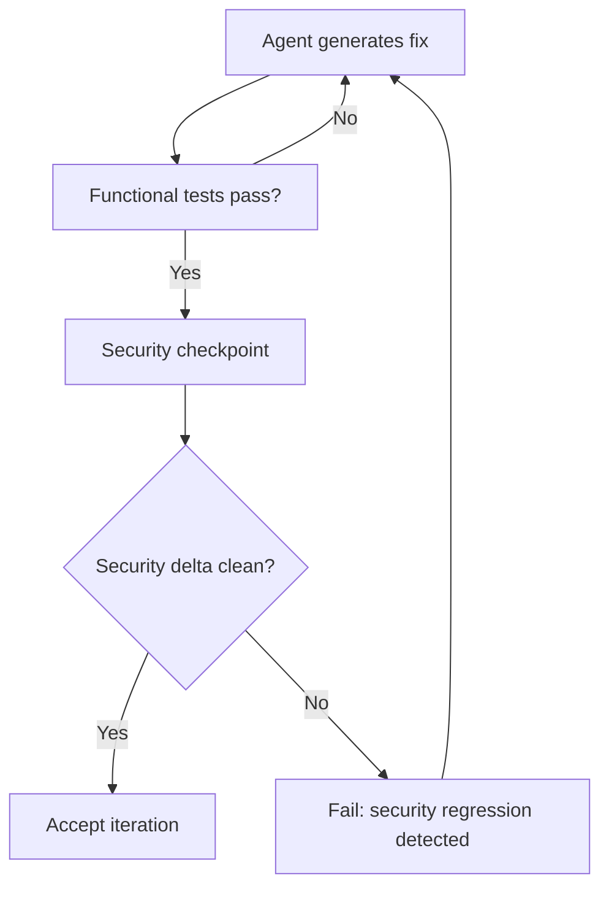

# Security Drift in Iterative LLM Code Refinement

> Each iteration of an LLM-driven fix-test loop can silently introduce new vulnerabilities even as functional tests keep passing.

## The Divergence Problem

Iterative refinement loops — where an agent fixes a bug, runs tests, and repeats — optimize for functional correctness. Security correctness is a separate dimension that functional tests do not measure. Over multiple iterations, the two can diverge: working code accumulates attack surfaces that no test ever exercises.

[SCAFFOLD-CEGIS](https://arxiv.org/abs/2603.08520) demonstrates this empirically. LLM-driven iterative refinement passes functional benchmarks while introducing latent security regressions. The pattern is systematic, not incidental: each generation step that maximizes test passage has no gradient signal from security properties.

## Why Agents Miss It

Agents in standard fix-test loops receive feedback only from test runners. If the test suite lacks security cases, the agent's feedback signal is entirely functional. Security properties — input sanitization, bounds checking, resource limits, authentication invariants — are either absent from tests or pass trivially on the happy path used during iteration.

The result is incremental security debt that is invisible until a targeted security review or exploit.

## Security Checkpointing

Insert explicit security verification at iteration boundaries rather than only at the end of a refinement session:



**What to checkpoint:**

- **Static analysis / SAST**: diff the finding count before and after each iteration; block if new high/critical findings appear
- **Security-specific test cases**: maintain a dedicated suite covering injection, boundary conditions, and authentication paths — run it in parallel with functional tests
- **Invariant checks**: encode security contracts as assertions the agent cannot bypass (e.g., all user input is sanitized before database access)

## Exit Criteria

"All tests green" is a necessary but insufficient stopping condition. Add explicit security exit criteria to agent loops:

- Zero net increase in SAST finding severity
- Security test suite passes
- No new code paths reachable from untrusted input without validation

Tools like [Semgrep](https://semgrep.dev/), [Bandit](https://bandit.readthedocs.io/) (Python), and [CodeQL](https://codeql.github.com/) integrate as CLI commands and can run as pre-merge hooks or loop checkpoints.

## Implementation Notes

- Run security checks on the diff, not the full codebase, to keep loop latency manageable
- Store the baseline SAST report at loop start; compare each iteration against the baseline, not global zero
- Treat security regressions as loop-breaking failures that surface to the human, not as feedback for the agent to self-correct — agents optimizing for "fix the security finding" introduce new vulnerabilities as frequently as they remove them [unverified]

## Example

The following GitHub Actions step integrates a Semgrep security checkpoint into an agent's fix-test loop. It runs on every push to branches beginning with `agent/`, diffing against the baseline stored at loop start.

```yaml
# .github/workflows/agent-security-checkpoint.yml
name: Agent Security Checkpoint

on:
  push:
    branches:
      - "agent/**"

jobs:
  security-delta:
    runs-on: ubuntu-latest
    steps:
      - uses: actions/checkout@v4
        with:
          fetch-depth: 0

      - name: Run Semgrep on changed files only
        uses: returntocorp/semgrep-action@v1
        with:
          config: "p/default p/owasp-top-ten"
          generateSarif: true

      - name: Compare finding count against baseline
        run: |
          baseline=$(git show origin/main:semgrep-baseline.json | jq '[.results[] | select(.extra.severity == "ERROR" or .extra.severity == "WARNING")] | length')
          current=$(jq '[.results[] | select(.extra.severity == "ERROR" or .extra.severity == "WARNING")] | length' semgrep.sarif)
          echo "Baseline findings: $baseline  Current findings: $current"
          if [ "$current" -gt "$baseline" ]; then
            echo "::error::Security regression detected — $((current - baseline)) new high/critical findings introduced"
            exit 1
          fi
```

Each time the agent pushes a fix iteration, this checkpoint counts high and critical Semgrep findings against the baseline stored on `main`. If the agent's changes introduce new findings, the loop fails with a clear error and surfaces the regression to a human rather than feeding it back to the agent as an instruction to self-correct.

## Key Takeaways

- Functional test pass rates do not predict security posture; the two diverge systematically in iterative refinement
- Security checkpointing belongs at each iteration boundary, not only at the end of a session
- Exit criteria for agent loops must include explicit security conditions alongside functional test results

## Unverified Claims

- Agents optimizing to fix security findings introduce new vulnerabilities as frequently as they remove them [unverified]

## Related

- [Pre-Completion Checklists](../verification/pre-completion-checklists.md)
- [Incremental Verification](../verification/incremental-verification.md)
- [Trust Without Verify](../anti-patterns/trust-without-verify.md)
- [Red-Green-Refactor with Agents](../verification/red-green-refactor-agents.md)
- [Close the Attack-to-Fix Loop](close-attack-to-fix-loop.md)
- [Code Injection Defence in Multi-Agent Pipelines](code-injection-multi-agent-defence.md)
- [Enterprise Agent Hardening](enterprise-agent-hardening.md)
- [Human-in-the-Loop Confirmation Gates](human-in-the-loop-confirmation-gates.md)
- [RL-Trained Automated Red Teamers](rl-automated-red-teamers.md)
- [Evaluator-Optimizer Pattern](../agent-design/evaluator-optimizer.md)
