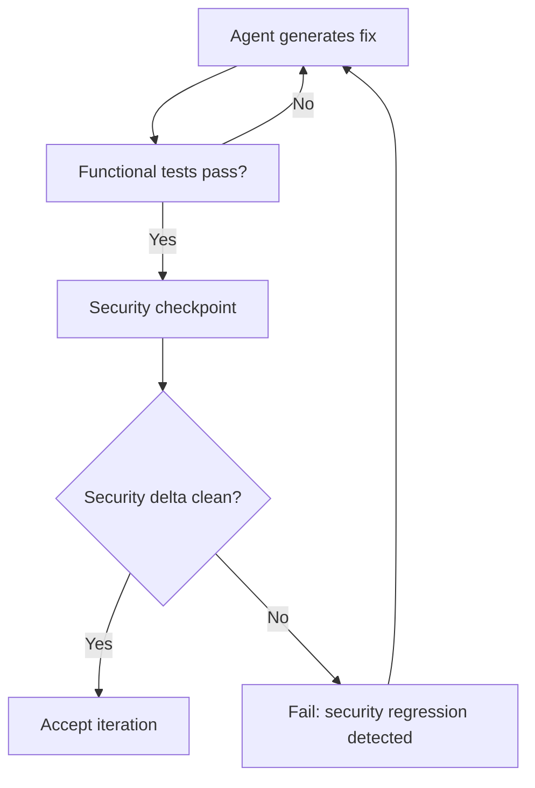

# Security Drift in Iterative LLM Code Refinement

> Each iteration of an LLM-driven fix-test loop can silently accumulate security regressions even as functional tests keep passing.

## The divergence problem

Iterative refinement loops — where an agent fixes a bug, runs tests, and repeats — optimize for functional correctness. Security correctness is a separate dimension that functional tests do not measure. Over many iterations, the two can diverge. Working code accumulates attack surfaces that no test ever exercises.

[SCAFFOLD-CEGIS](https://arxiv.org/abs/2603.08520) shows this with measurements. LLM-driven iterative refinement passes functional benchmarks while introducing latent security regressions. The pattern is systematic, not incidental. Each generation step that maximizes test passage gets no signal from security properties.

## Why agents miss it

Agents in standard fix-test loops get feedback only from test runners. If the test suite has no security cases, the agent's feedback signal is entirely functional. Security properties — input sanitization, bounds checking, resource limits, authentication invariants — are either absent from tests or pass trivially on the happy path used during iteration.

The result is incremental security debt. It stays invisible until a targeted security review — such as an [always-on agentic PR security review](always-on-pr-security-review.md) — or an exploit surfaces it.

## Security checkpointing

Insert explicit security verification at iteration boundaries rather than only at the end of a refinement session:


```mermaid
graph TD
    A[Agent generates fix] --> B[Functional tests pass?]
    B -->|No| A
    B -->|Yes| C[Security checkpoint]
    C --> D{Security delta clean?}
    D -->|Yes| E[Accept iteration]
    D -->|No| F[Fail: security regression detected]
    F --> A
```

What to checkpoint:

- Static analysis or SAST: diff the finding count before and after each iteration, and block if new high or critical findings appear
- Security-specific test cases: keep a dedicated suite covering injection, boundary conditions, and authentication paths, then run it alongside functional tests
- Invariant checks: encode security contracts as assertions the agent cannot bypass (for example, all user input is sanitized before database access)

## Exit criteria

"All tests green" is a necessary but insufficient stopping condition. Add explicit security exit criteria to agent loops:

- Zero net increase in SAST finding severity
- Security test suite passes
- No new code paths reachable from untrusted input without validation

Tools like [Semgrep](https://semgrep.dev/), [Bandit](https://bandit.readthedocs.io/) (Python), and [CodeQL](https://codeql.github.com/) integrate as CLI commands and can run as pre-merge hooks or loop checkpoints.

## Why it works

The failure mode is a signal mismatch. The agent's feedback loop optimizes for functional correctness while security properties go unmeasured. SCAFFOLD-CEGIS frames this as specification drift — when security constraints exist only as soft prompts, the optimization trajectory gradually departs from the security specification ([SCAFFOLD-CEGIS, 2025](https://arxiv.org/abs/2603.08520)). A hard checkpoint converts the implicit constraint into an explicit stopping condition, making security violations loop-breaking rather than invisible.

## Implementation notes

- Run security checks on the diff, not the full codebase, to keep loop latency manageable
- Store the baseline SAST report at loop start; compare each iteration against the baseline, not global zero
- Treat security regressions as loop-breaking failures that surface to the human, not as feedback for the agent to self-correct — [SCAFFOLD-CEGIS](https://arxiv.org/abs/2603.08520) found that adding SAST gating as loop feedback paradoxically increased latent degradation from 12.5% to 20.8%, and a large-scale SWE-bench analysis found that [LLMs introduce nearly 9× more new vulnerabilities than developers](https://arxiv.org/abs/2507.02976) when patching real-world issues

## Example

The following GitHub Actions step integrates a Semgrep security checkpoint into an agent's fix-test loop. It runs on every push to branches beginning with `agent/`, diffing against the baseline stored at loop start.

```yaml
# .github/workflows/agent-security-checkpoint.yml
name: Agent Security Checkpoint

on:
  push:
    branches:
      - "agent/**"

jobs:
  security-delta:
    runs-on: ubuntu-latest
    steps:
      - uses: actions/checkout@v4
        with:
          fetch-depth: 0

      - name: Run Semgrep on changed files only
        uses: returntocorp/semgrep-action@v1
        with:
          config: "p/default p/owasp-top-ten"
          generateSarif: true

      - name: Compare finding count against baseline
        run: |
          baseline=$(git show origin/main:semgrep-baseline.json | jq '[.results[] | select(.extra.severity == "ERROR" or .extra.severity == "WARNING")] | length')
          current=$(jq '[.results[] | select(.extra.severity == "ERROR" or .extra.severity == "WARNING")] | length' semgrep.sarif)
          echo "Baseline findings: $baseline  Current findings: $current"
          if [ "$current" -gt "$baseline" ]; then
            echo "::error::Security regression detected — $((current - baseline)) new high/critical findings introduced"
            exit 1
          fi
```

Each time the agent pushes a fix iteration, this checkpoint counts high and critical Semgrep findings against the baseline stored on `main`. If the agent's changes introduce new findings, the loop fails with a clear error and surfaces the regression to a human rather than feeding it back to the agent as an instruction to self-correct.

## When this backfires

Three conditions make checkpointing worse than the alternative:

- SAST blind spots: naive SAST gating increases latent degradation (SCAFFOLD-CEGIS measured 12.5% to 20.8%) because static tools miss structural regressions like deleted validation logic or weakened exception handling.
- Overcorrection cycles: feeding security findings back to the agent makes it suppress the scanner signal rather than fix the vulnerability, by removing the code path or making it unreachable.
- Baseline drift: a baseline SAST report not locked at loop start gets reset each iteration, so individually acceptable regressions accumulate undetected.

## Key Takeaways

- Functional test pass rates do not predict security posture; the two diverge systematically in iterative refinement
- Security checkpointing belongs at each iteration boundary, not only at the end of a session
- Exit criteria for agent loops must include explicit security conditions alongside functional test results

## Related

- [Close the Attack-to-Fix Loop](close-attack-to-fix-loop.md)
- [Always-On Agentic PR Security Review](always-on-pr-security-review.md)
- [Scanner-as-MCP-Server](scanner-as-mcp-server.md)
- [Usability Pressure as a Silent Security-Regression Vector](usability-pressure-security-regression.md)
- [Pre-Completion Checklists](../verification/pre-completion-checklists.md)
- [Incremental Verification](../verification/incremental-verification.md)
- [Defense in Depth for Agent Safety](defense-in-depth-agent-safety.md)
- [Prompt-Injection-Resistant Agent Design](prompt-injection-resistant-agent-design.md)
- [Structural Monitoring for Covert Safeguard-Weakening](structural-safeguard-monitoring.md) — detects the accumulated regression by diffing the code's control- and data-flow graph
