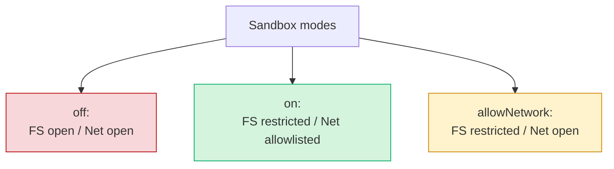

# Selective Network Access in Agent Sandboxes: The `allowNetwork` Pattern

> A sandbox mode that keeps filesystem isolation but lifts network restrictions trades away the egress half of [dual-boundary sandboxing](dual-boundary-sandboxing.md) — useful only when egress is enforced at a layer below the harness.

## The Two-Axis Model

Agent sandboxes enforce two independent boundaries. Most discussions collapse them into one toggle — "sandboxed" or "unsandboxed" — but the underlying OS primitives keep them separate. bubblewrap's `--unshare-net` controls only network namespaces; `--bind` and `--ro-bind` control filesystem visibility. Apple Seatbelt's `(allow file-read*)` and `(deny network*)` are independent rule classes. The collapse happens at the harness.

VS Code 1.119 productionised the split with a third value for `chat.agent.sandbox.enabled`:

| Mode | Filesystem | Network |
|------|-----------|---------|
| `off` | Unrestricted | Unrestricted |
| `on` | Restricted to workspace + allowlisted paths | Restricted to `chat.agent.allowedNetworkDomains` |
| `allowNetwork` | Restricted to workspace + allowlisted paths | Unrestricted; allow/deny domain settings ignored |

The VS Code release notes describe the design goal directly: `allowNetwork` "keeps file system restrictions in place while removing network domain blocking, so you get sandbox protection without constant interruptions for network access" ([VS Code 1.119 release notes](https://code.visualstudio.com/updates/v1_119)). When the mode is active, both `chat.agent.allowedNetworkDomains` and `chat.agent.deniedNetworkDomains` stop being evaluated ([VS Code agent-tools docs](https://code.visualstudio.com/docs/copilot/agents/agent-tools)).



## Why It Exists

Maintaining an outbound allowlist for a coding agent is expensive. Legitimate destinations — package registries, vendor APIs, documentation hosts, schema fetches, MCP services — are numerous and shift between branches. A static allowlist either lags real use (the inner loop stalls on approval prompts) or sprawls until it loses meaning.

`allowNetwork` resolves that pressure by **keeping the boundary that costs least to enforce against agent error** — write confinement to the workspace — and shifting network risk to a layer below the harness: the host firewall, the container's egress policy, or an org-level outbound proxy. Filesystem write-confinement still prevents the agent from modifying `~/.bashrc`, dropping startup scripts, or writing to `/etc`.

## What This Is Not

Claude Code takes the opposite default position: "Effective sandboxing requires **both** filesystem and network isolation. Without network isolation, a compromised agent could exfiltrate sensitive files like SSH keys" ([Claude Code Sandboxing](https://code.claude.com/docs/en/sandboxing)). The open-source `sandbox-runtime` echoes this — its weaker modes degrade overall guarantees rather than splitting axes cleanly ([anthropic-experimental/sandbox-runtime](https://github.com/anthropic-experimental/sandbox-runtime)).

`allowNetwork` is a capability-scoping convenience, not a security improvement over `on`. Treating it otherwise is a category error.

## Where It Is Safe

`allowNetwork` is defensible only when **the network boundary lives at a layer below the harness**. Three deployment shapes qualify:

- **Container egress policy.** The agent runs in a container whose network namespace routes through a forward proxy or iptables allowlist.
- **Host firewall or VPN tunnel.** macOS PF rules, Linux nftables, or a VPN that drops non-tunnelled traffic restricts outbound traffic regardless of what the sandboxed process attempts.
- **Org-level outbound proxy.** Cloud agent runners route all traffic through an org proxy with logging and policy — for example, the [admin-controlled domain allow/deny model](agent-network-egress-policy.md) that GitHub's Copilot cloud agent applies at the organization firewall layer ([GitHub changelog](https://github.blog/changelog/2026-04-03-organization-firewall-settings-for-copilot-cloud-agent)).

Network policy lives somewhere — it has just moved out of the harness.

## Where It Is Not Safe

The mode closes the egress leg of the [lethal trifecta](lethal-trifecta-threat-model.md). Four conditions make it dangerous:

- **Broad filesystem reads.** Most implementations restrict only **writes**. Read access to `~/.aws/credentials`, `~/.ssh/`, or process environment variables is preserved. With unrestricted egress, any of these is a one-step exfiltration target.
- **Untrusted input in the same agent.** When the agent fetches GitHub issues, third-party PR diffs, or web documentation, indirect prompt injection in any source can drive an outbound POST to an attacker host. `allowNetwork` plus `WebFetch` plus repository read is the canonical trifecta closure ([Willison, 2025](https://simonwillison.net/2025/Jun/16/the-lethal-trifecta/)).
- **Regulated workloads.** FedRAMP, EU data-residency, and similar regimes require outbound audit trails. The audit must come from the layer below, and that layer must exist.
- **Multi-tenant or shared-runner deployments.** `allowNetwork` defeats the org-firewall layer if no lower one exists.

The [NVIDIA sandboxing guidance](https://developer.nvidia.com/blog/practical-security-guidance-for-sandboxing-agentic-workflows-and-managing-execution-risk/) treats network egress and filesystem boundaries as **mandatory complementary** layers.

## OS-Level Generalisation

The two-axis model is fully expressible below the harness. On Linux, bubblewrap permits filesystem isolation without network isolation by simply omitting `--unshare-net`:

```bash
bwrap \
  --ro-bind /usr /usr \
  --ro-bind /lib /lib \
  --ro-bind /lib64 /lib64 \
  --ro-bind /etc/resolv.conf /etc/resolv.conf \
  --bind "$PROJECT_DIR" "$PROJECT_DIR" \
  --dev /dev \
  --proc /proc \
  --tmpfs /tmp \
  --die-with-parent \
  -- agent-binary
```

The absence of `--unshare-net` shares the host's network namespace; filesystem writes remain confined to `$PROJECT_DIR`. On macOS, the equivalent Seatbelt profile keeps file-write restrictions while omitting `(deny network*)`:

```
(version 1)
(deny default)
(allow file-read*)
(allow file-write* (subpath (param "PROJECT_DIR")))
(allow process-exec)
(allow network*)
```

Both are the OS-primitive expression of `allowNetwork`. The harness-level setting is shorthand for one of these underlying shapes.

## Example

A regulated team runs an agent inside a container whose network namespace routes through an org egress proxy. The proxy holds the allowlist; the harness should not duplicate it. VS Code's setting collapses to:

```json
{
  "chat.agent.sandbox.enabled": "allowNetwork"
}
```

With this configuration, `chat.agent.allowedNetworkDomains` and `chat.agent.deniedNetworkDomains` are ignored ([VS Code 1.119 release notes](https://code.visualstudio.com/updates/v1_119)) — outbound requests reach whatever the container's proxy allows, while filesystem writes stay confined to the workspace. The audit trail comes from the proxy, not the harness.

The same team running on a developer laptop with no container and no proxy must use `on` and accept the maintenance cost of an allowlist — there is no lower layer to delegate to.

## Key Takeaways

- Sandboxes enforce two independent boundaries — filesystem and network — and OS primitives have always supported splitting them; `allowNetwork` productionises the split at the harness layer
- The mode keeps filesystem isolation and drops network isolation; in VS Code it also disables the allow/deny domain settings
- It is a capability-scoping convenience, not a security improvement — Claude Code's documentation explicitly recommends dual-boundary enforcement
- Safe only when egress is enforced at a layer below the harness: container network policy, host firewall, or org-level outbound proxy
- Dangerous when combined with broad filesystem reads (secrets), untrusted-input tools (injection-driven exfiltration), regulated workloads (audit gaps), or shared runners (multi-tenant risk)
- Treat `allowNetwork` as a deployment-shape statement — "the network boundary lives elsewhere" — not as a sandbox mode that removes the need for one

## Related

- [Dual-Boundary Sandboxing](dual-boundary-sandboxing.md)
- [Agent Network Egress Policy: Admin-Controlled Domain Allow/Deny](agent-network-egress-policy.md)
- [Lethal Trifecta Threat Model](lethal-trifecta-threat-model.md)
- [Sandboxed Coding Environments: Containers vs MicroVMs vs OS-Level Isolators](sandbox-runtime-comparison.md)
- [Scope Sandbox Rules to Harness-Owned Tools, Not Third-Party MCP Tools](sandbox-rules-harness-tools.md)
- [Guarding Against URL-Based Data Exfiltration in Agentic Workflows](url-exfiltration-guard.md)
- [Scoped Credentials via Proxy Outside the Agent Sandbox](scoped-credentials-proxy.md)
- [Audit Lethal Trifecta](../agent-readiness/audit-lethal-trifecta.md)
