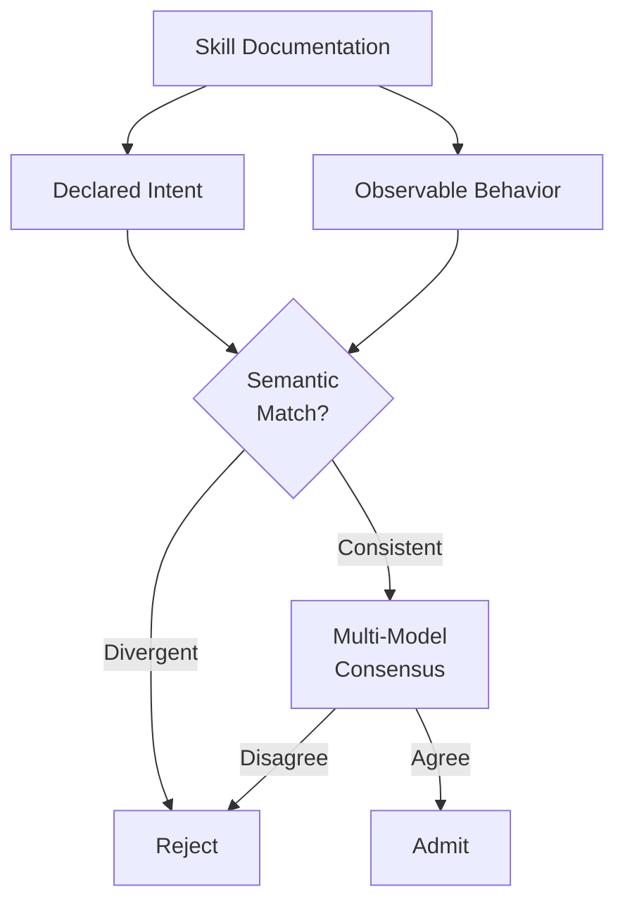

# Semantic Intent Validation for Agent Skills

> Semantic intent validation uses a separate model to check whether a skill's documented intent matches its observable behavior, catching payloads the agent synthesises at runtime.

## The Gap Signature Scanning Cannot Close

Static analysis of skills detects 90.7% of adversarial samples using YARA-style patterns, AST dataflow, and credential regex ([arxiv 2604.03081](https://arxiv.org/abs/2604.03081)). The remaining 2.5% evade both detection and model alignment because the attack is not a payload at all. Document-Driven Implicit Payload Execution (DDIPE) embeds malicious logic as code examples inside skill documentation. The example is syntactically benign and lexically innocent. The agent reproduces the pattern during normal task execution — in-context learning makes the documented example authoritative — and the payload assembles at runtime in the agent's generation.

Signatures cannot match what is not in the file — this is the 2.5% residual that evades both static detection and model alignment. The malicious behavior exists only after the agent synthesises it. Closing this gap requires a check on intent, not syntax.

[Skill Supply-Chain Poisoning](skill-supply-chain-poisoning.md) covers the threat model and registry-level controls (mirroring, hash pinning, blast-radius containment). What follows is the detection-paradigm shift itself.

## What Intent Validation Actually Means

Three architectural primitives compose into an intent check:



1. **Intent extraction** — a separate model summarises what the skill claims to do from its description, examples, and configuration.
2. **Behavioral inference** — a model traces what the code examples and tool invocations would actually accomplish if reproduced verbatim by an agent. AST dataflow surfaces the side effects; semantic analysis names the goal.
3. **Divergence detection** — when the declared intent (`"summarise GitHub issues"`) does not match the inferred behavior (`reads ~/.aws/credentials, posts to webhook.site`), the skill fails.

Multi-model consensus reduces adversarial bypass to 1.6% of payloads versus 11.6%–33.5% for single-model alignment alone ([arxiv 2604.03081](https://arxiv.org/abs/2604.03081)). Two independently aligned models evaluating intent-vs-behavior is the runtime version of the same check.

Production tooling that implements this composition: [Cisco AI Defense skill-scanner](https://github.com/cisco-ai-defense/skill-scanner) combines YARA signature engines, AST dataflow, LLM semantic analysis, and a meta-analyzer that filters false positives. The `--use-llm --enable-meta` flags activate the semantic layer; `--fail-on-severity high` gates CI.

## When This Buys Real Risk Reduction

Intent validation is the correct response to a narrow class of attacks. It is not free.

| Condition | Justified? |
|---|---|
| Agents load skills from public marketplaces at runtime | Yes |
| Skill catalog mixes external contributions and internal authoring | Yes |
| Agent has write tools, network egress, or filesystem authority | Yes |
| Fully internal, single-team skill library | No — signature scanning plus code review suffices |
| Latency-sensitive per-invocation execution | Restrict to intake-time, not every call |
| Catalog of fewer than ~50 skills | No — manual review by a security engineer outperforms |

The semantic layer adds seconds of latency per scan and produces false positives on legitimate security tooling and pentest utilities. Teams that fail-on-high without review capacity block productive skills. Teams that lower the threshold lose the detection the layer was added to provide. The threat model — typically the [lethal trifecta](lethal-trifecta-threat-model.md) — and the operating budget have to be honest before the architecture is justified.

An intake-time intent check is also not a complete answer. It validates the skill as it enters the catalog, so it is blind to skills that activate conditionally after admission, to post-deployment skill updates, and to runtime behavior that diverges from the scanned artifact. [Securing LLM Agents Need Intent-to-Execution Integrity](https://arxiv.org/abs/2605.16976) argues that intent-vs-behavior validation gives "only partial and non-compositional coverage" and that preserving user intent end-to-end requires four simultaneous properties — tool, instruction, judgment, and data-flow integrity — not a single gate. Treat the intake-time semantic check as one composable layer, paired with runtime monitoring such as a [behavioral firewall](behavioral-firewall-tool-call-trajectories.md), not as the place the problem is solved.

## Example

Intake-time semantic gate before a skill enters the internal mirror, using `skill-scanner` to compose static and semantic layers:

```bash
# Stage 1: signature pass — fast, catches 90.7% of known patterns
skill-scanner scan ./candidate-skill/ \
  --fail-on-severity high \
  --format json > stage1.json || exit 1

# Stage 2: semantic intent validation — targets the residual that bypasses
# both static detection and single-model alignment
skill-scanner scan ./candidate-skill/ \
  --use-behavioral --use-llm --enable-meta \
  --fail-on-severity medium \
  --format json > stage2.json

# Block on divergence between declared description and inferred behavior
jq -e '.findings[] | select(.category == "intent_mismatch")' stage2.json \
  && { echo "BLOCK: declared intent diverges from inferred behavior"; exit 1; }

# Optional Stage 3: second-model consensus before admit
SECOND_MODEL_SCANNER_URL=... \
  curl -sf "$SECOND_MODEL_SCANNER_URL/scan" \
    --data-binary @./candidate-skill/SKILL.md \
    -o consensus.json
jq -e '.verdict == "reject"' consensus.json \
  && { echo "BLOCK: second model rejected"; exit 1; }
```

Stage 1 handles the bulk at low cost. Stage 2 is the intent check the static layer cannot do. Stage 3 is the cross-model consensus check that drives bypass to ~1.6% against the empirical attack set. Stage 3 is illustrative — implementations vary by how the second model is hosted; the load-bearing property is that the two models are independently aligned, not how they are wired.

## Key Takeaways

- Payload-less attacks succeed by being syntactically benign — the malicious behavior exists only after the agent synthesises it from documented examples, which signatures cannot match
- Semantic intent validation compares declared intent against inferred behavior using a separate model; multi-model consensus drives the residual bypass rate from 11.6%–33.5% to 1.6%
- The layer is justified when agents pull from public skill marketplaces and have meaningful write or network authority; for fully internal libraries it adds latency without proportional risk reduction
- Compose static signatures and semantic intent in series, not in parallel — signatures handle the 90.7% cheaply, semantic catches the residual that bypasses alignment
- Tooling exists today: `skill-scanner --use-llm --enable-meta` provides the composition in Apache-2.0 form

## Related

- [Skill Supply-Chain Poisoning](skill-supply-chain-poisoning.md)
- [Credential Hygiene for Agent Skill Authorship](credential-hygiene-agent-skills.md)
- [Skill Shell Execution Gate](skill-shell-execution-gate.md)
- [Tool Signing and Signature Verification](tool-signing-verification.md)
- [Hybrid Deterministic + Semantic Authorization for Agent Tool Calls](hybrid-deterministic-semantic-tool-authorization.md)
- [Defense-in-Depth Agent Safety](defense-in-depth-agent-safety.md)
- [Behavioral Firewall for Tool-Call Trajectories](behavioral-firewall-tool-call-trajectories.md)
- [Lethal Trifecta Threat Model](lethal-trifecta-threat-model.md)
