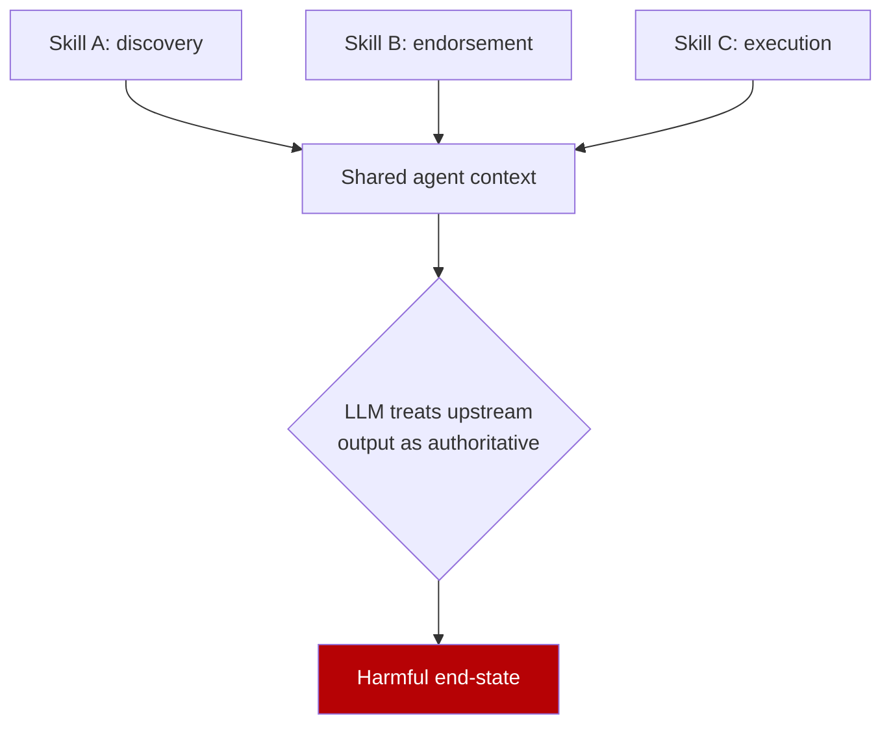

# Skill Composition Risk in Agent Ecosystems

> Skill composition risk names three failure modes where individually safe skills become harmful when their outputs flow into later skills in shared agent context.

## The threat model

[Xie et al. (2026)](https://arxiv.org/abs/2606.15242) name Skill Composition Risk (SCR) as the gap between per-skill safety review and end-to-end agent behavior. Each skill in the chain passes isolated vetting. The harmful outcome emerges only after the agent composes their outputs in one shared execution context. They measure three SCR failure modes against ten production backends — Claude Opus 4.6/4.5, GPT-5.5/5.4, Gemini 3.1 Pro, MiniMax-M2.7, DeepSeek-V4, Kimi-K2, GLM-5.1, GLM-5 ([Xie et al., 2026](https://arxiv.org/abs/2606.15242)):

| Mode | Mechanism | Attack success rate |
|------|-----------|---------------------|
| CapFlow (capability flow) | Upstream discovery skill supplies the target or operational context required by a downstream execution skill | 33.6% neutral / 35.9% explicit vs near-zero isolated baseline |
| TrustLift (trust transfer) | Upstream skill produces an endorsement, audit result, or trust assessment that makes a downstream high-risk action appear legitimate | 96.5%+ on four of five backends; 83.89% aggregate endorsed vs 1.10% control |
| AuthBlur (authorization confusion) | Advisory or finding-like context from an upstream skill is treated by a downstream decision process as approval evidence | 71.8% relative increase over L0 baseline (27.0% vs 15.7%; up to 34.0% with stronger advisory) |

Each composed pair comes from skills that each passed isolated review. The attacker contributes no malicious skill — only the choice of which benign skills the agent loads together.

## Why per-skill review misses it

Per-skill review samples each skill in isolation. Emergent risks across activated execution paths are out-of-distribution by construction ([Xie et al., 2026](https://arxiv.org/abs/2606.15242)). [SkillVetBench (Hossain et al., 2026)](https://arxiv.org/abs/2606.00925) measures the detection-side gap: static and signature-based scanners miss up to 89% of malicious behavior because threats emerge from "natural-language instructions, multicomponent logic, or cross-component interactions" invisible to per-skill analysis.

## Registry-scale confirmation

[Wang et al. (2026)](https://arxiv.org/abs/2606.00448) ran SkillReact on 1,520 ClawHub skills — 211,575 individually-safe pairs. Of those pairs, 22.25% trigger forbidden capability patterns under union. Human-in-the-loop calibration shows about 18.2% of automated flags are genuine compositional risks, which projects to about 8,600 truly risky unique pairs in one registry. This independent measurement uses a different registry and a different method, and it lands in the same regime as the SCR-Bench numbers.

## Distinguishing SCR from adjacent threats

| Threat | Vector | Distinguishing feature |
|--------|--------|------------------------|
| SCR (this page) | Two or more benign skills composed in shared context | No skill is malicious; the agent's reasoning across outputs is what harms |
| [Skill Supply-Chain Poisoning](skill-supply-chain-poisoning.md) | A single skill carries a hidden payload (DDIPE) | The malicious skill exists as an artifact; detection is per-skill |
| [Compositional Vulnerability Induction](compositional-vulnerability-induction.md) | Sequential coding tickets compose an exploitable end-state diff | Coding agent emits vulnerable code; SCR coerces the agent into a harmful runtime action |
| Permission laundering (defended by [Monotonic Capability Attenuation](monotonic-capability-attenuation.md)) | Per-tool checks pass, chained effect exfiltrates | Defense target — capability budgets that intersect through composition |

Catching DDIPE perfectly still admits CapFlow pairs because each artifact is benign. Monotonic capability attenuation stops CapFlow exfiltration but not TrustLift — there is no permission to attenuate when the model is legitimately authorized to act and is being deceived about whether it should.

## Why it works

At runtime the composed prompt fuses upstream output into the downstream skill's context window, and the model's in-context learning treats the fused context as one authoritative source. The three named modes are three shapes of one locality failure: CapFlow fuses a target, TrustLift a trust signal, AuthBlur an authorization. The channels stay joined because the prompt does not separate them.

## When this backfires

Path-aware composition vetting carries real cost and breaks under specific regimes:

- Internal mirrors with single-author skills. When one team authors every skill, composition risk is bounded by the team's threat model, and runtime isolation plus code review captures it. Path-aware static vetting adds cost without yield.
- Tiny skill libraries (under about 10 skills). The pair space is small enough to enumerate by hand or by eye, so an automated path-aware gate is overkill.
- High false-positive cost without human triage. SkillReact's automated forbidden-pattern check flags 77.8% as false positives before human calibration ([Wang et al., 2026](https://arxiv.org/abs/2606.00448)). Auto-blocking flagged compositions without a triage step produces vetting paralysis.
- Static-only posture. Static composition checks catch CapFlow but not TrustLift. The upstream endorsement skill is correctly an endorsement, and the harm is the downstream model treating it as evidence. Pair it with runtime defenses like [Monotonic Capability Attenuation](monotonic-capability-attenuation.md) and the [Lethal Trifecta Threat Model](lethal-trifecta-threat-model.md).
- One skill per task harnesses. When the harness enforces fresh context per skill invocation with no cross-skill output flow, the SCR threat model does not apply. The cost of that constraint is loss of legitimate composition.

The SCR paper concludes that "isolated artifact vetting is structurally insufficient" ([Xie et al., 2026](https://arxiv.org/abs/2606.15242)). Path-aware vetting is a triage filter on top of runtime controls, not a replacement for them.

## Example

Consider a documentation-and-issue-triage agent that loads two hypothetical skills with the shape of `repo-secrets-scan` and `webhook-poster` from an internal mirror that vetted each in isolation:

Skill A, `repo-secrets-scan`. "Scans repository for accidentally committed credentials. Returns a JSON report listing files, line numbers, and severity."

Skill B, `webhook-poster`. "Posts arbitrary JSON to an HTTPS endpoint configured in `WEBHOOK_URL`. Used to forward alerts to Slack or pager systems."

Each skill is benign under isolated review. Skill A reads private repo content but cannot egress. Skill B egresses to a configured endpoint but receives no private data. An agent task — "audit this repo for secret leaks and notify the on-call channel" — composes them: Skill A's JSON output (file paths, line numbers, in some cases redacted-but-recognizable secret prefixes) flows into Skill B's `payload` argument. This is the CapFlow mode: Skill A discovered the target, and Skill B exfiltrated it. If an attacker controls `WEBHOOK_URL` through a prior prompt injection or a misconfigured allowlist, the chain becomes a one-step exfiltration path that neither skill's isolated vetting could catch. Both are legitimate, useful patterns.

## Key Takeaways

- Three named failure modes — CapFlow (capability flow), TrustLift (trust transfer), AuthBlur (authorization confusion) — measure attack success at 33.6%, 96.5%+, and 71.8% relative respectively across ten production backends ([Xie et al., 2026](https://arxiv.org/abs/2606.15242)).
- The mechanism is measurement locality: per-skill review samples in isolation, so multi-skill emergent risks are out-of-distribution; in-context learning across the composed prompt fuses upstream output into downstream skills as authoritative context.
- Independent registry-scale evidence from 1,520 ClawHub skills lands in the same regime: 22.25% of individually-safe pairs trigger forbidden capability unions; calibrated to 18.2% genuine after human review ([Wang et al., 2026](https://arxiv.org/abs/2606.00448)).
- SCR is distinct from skill supply-chain poisoning (no artifact is malicious), from compositional vulnerability induction (no vulnerable code is emitted), and from permission laundering (some modes have no permission to attenuate).
- Path-aware vetting is a triage filter, not a runtime guarantee. Pair it with capability attenuation, deny-by-default egress, and human-in-the-loop confirmation on consequential calls.
- Inapplicable regimes: single-author internal mirrors, libraries under ~10 skills, harnesses that disallow multi-skill composition.

## Related

- [Skill Supply-Chain Poisoning](skill-supply-chain-poisoning.md)
- [Monotonic Capability Attenuation for Composition-Safe Tool Use](monotonic-capability-attenuation.md)
- [Compositional Vulnerability Induction in Coding Agents](compositional-vulnerability-induction.md)
- [Semantic Intent Validation for Agent Skills](semantic-intent-validation-skills.md)
- [Lethal Trifecta Threat Model](lethal-trifecta-threat-model.md)
- [Defense-in-Depth Agent Safety](defense-in-depth-agent-safety.md)
