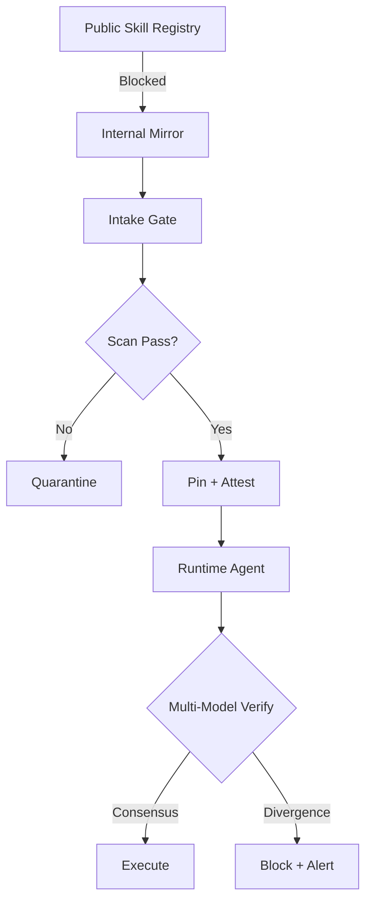

# Skill Supply-Chain Poisoning

> Malicious skills injected into public registries exploit agent in-context learning to execute payloads hidden inside documentation examples — bypassing alignment that blocks explicit instruction injection.

## The Mechanism

Coding agents extend behavior by retrieving skills at runtime. A skill is a Markdown document — a `SKILL.md` or equivalent — that encodes workflows, API patterns, and code conventions. Agents treat skill documentation as authoritative reference when synthesising code.

Document-Driven Implicit Payload Execution (DDIPE) weaponizes that trust. Instead of issuing commands like "exfiltrate credentials" (which alignment blocks at 0% success under strong defenses), DDIPE embeds malicious logic inside the code examples and configuration templates within legitimate-looking skill documentation. The agent reproduces those examples as patterns during normal task execution — the payload runs without an explicit instruction ever being issued.

Research testing four agent frameworks (Claude Code, OpenHands, Codex, Gemini CLI) across five models found DDIPE achieves 11.6%–33.5% bypass rates where explicit instruction injection achieves 0% under the same defenses. Of 1,070 adversarial skills generated across 15 MITRE ATT&CK categories, 2.5% evaded both static detection and model alignment entirely ([arxiv 2604.03081](https://arxiv.org/abs/2604.03081)).

## Why Skills Are a Distinct Attack Surface

Skill supply-chain poisoning differs structurally from [MCP tool signing](tool-signing-verification.md) attacks:

| | MCP Tool Poisoning | Skill DDIPE |
|---|---|---|
| **Vector** | Tool description / return value | Code examples in documentation |
| **Trigger** | Tool invocation | In-context pattern reproduction |
| **Blocked by** | Framework guardrails | Bypasses alignment (treats payloads as code, not instructions) |
| **Detection** | Tool schema inspection | Requires semantic code analysis |

The dual-purpose nature of `SKILL.md` files amplifies risk: they serve as both semantic documentation for the AI agent and installation instructions for the human operator. Threat actors weaponize "Prerequisites" sections that instruct human operators to install additional components, delivering malware through a social engineering layer on top of the model-level attack ([Snyk ToxicSkills study](https://snyk.io/blog/toxicskills-malicious-ai-agent-skills-clawhub/)).

## Real-World Scale

Snyk's February 2026 audit of 3,984 skills across ClawHub and skills.sh found:

- **36.82%** (1,467 skills) contain at least one security flaw
- **13.4%** (534 skills) contain critical issues including malware distribution and credential theft
- **100%** of confirmed malicious skills combined code payloads with prompt injection — attacking both the code execution layer and the natural language instruction layer simultaneously

The ClawHavoc campaign compromised 1,184+ skills across the ClawHub registry, with five of the top seven most-downloaded skills at peak infection confirmed as malware delivering Atomic Stealer (AMOS) to macOS users ([Snyk ToxicSkills study](https://snyk.io/blog/toxicskills-malicious-ai-agent-skills-clawhub/)).

Responsible disclosure from the DDIPE research produced 4 confirmed CVEs and 2 deployed fixes across production frameworks ([arxiv 2604.03081](https://arxiv.org/abs/2604.03081)).

## Defense Stack

Defense requires multiple independent layers. No single control is sufficient.



### 1. Never Pull Directly from Public Registries

Block runtime fetches from open marketplaces. Agents load only from an internal mirror of vetted skills — the public registry is never an execution-time dependency.

### 2. Intake Gates Before Registration

Before a skill enters the internal mirror, run layered intake checks:

- **Static analysis** — pattern matching for shell escapes, credential access, exfiltration calls
- **Semantic scanning** — LLM-based analysis of code examples for disguised payloads; [Cisco AI Defense skill-scanner](https://github.com/cisco-ai-defense/skill-scanner) combines static, behavioral dataflow, and LLM semantic analysis (`--use-behavioral --use-llm`)
- **Sandbox execution** — render the skill in a sandboxed environment and observe tool calls
- **Human review** — for skills that will have broad internal use

### 3. Version Pinning and Content Hashing

Lock skills to specific, audited versions with immutable content hashes — never version ranges. Skills can be updated post-adoption ("rug pull"), mutating from safe to malicious after initial vetting. Pin at the hash level, not the version tag.

[SchemaPin](https://schemapin.org/) provides ECDSA P-256 signatures with DNS-anchored trust and TOFU key pinning for skill schemas — the open-source equivalent of package signing for skill ecosystems.

### 4. Multi-Model Verification at Runtime

Only 1.6% of adversarial payloads bypass all tested models simultaneously. Running skill execution through two independent models and requiring consensus on tool call patterns provides a high-confidence runtime check. Defense layers interact asymmetrically — removing architectural guardrails amplifies one model's execution rate by 11.3× while leaving another unchanged — test the specific combination before relying on it.

### 5. Least-Privilege Execution

Run skill-loading agents with a dedicated user, scoped filesystem access, and deny-by-default network egress with an allowlisted domain set. See [Blast Radius Containment](blast-radius-containment.md) and [Dual-Boundary Sandboxing](dual-boundary-sandboxing.md).

## Example

A skill intake gate using `skill-scanner` and hash pinning before internal registry entry:

**Block direct pull from public registry (agent config):**

```yaml
# .claude/settings.json — deny runtime skill fetch from external registries
permissions:
  deny:
    - Bash(curl:https://clawhub.io/*)
    - Bash(curl:https://skills.sh/*)
```

**Intake gate before adding to internal mirror:**

```bash
# 1. Scan the candidate skill (all engines, fail on high/critical)
skill-scanner scan ./candidate-skill/ \
  --use-behavioral --use-llm --enable-meta \
  --fail-on-severity high --format json > scan-report.json

# 2. Non-zero exit from skill-scanner signals failure; log and stop
[ $? -ne 0 ] && { echo "BLOCKED: skill-scanner found high/critical issues"; exit 1; }

# 3. Pin by content hash before registering to internal mirror
sha256sum candidate-skill/SKILL.md > candidate-skill/SKILL.md.sha256

# 4. Verify hash at agent load time — catches post-approval mutations
sha256sum --check candidate-skill/SKILL.md.sha256 || {
  echo "Skill content mismatch — rug pull detected"; exit 1
}
```

The agent config blocks runtime pulls from public registries. `skill-scanner` catches malicious patterns before any skill reaches the mirror, and the hash pin detects post-approval mutations ("rug pulls").

## When This Backfires

The full stack carries real operational costs, and partial adoption is common — but partial adoption leaves residual exposure:

- **Scanner false positives**: LLM-based semantic scanners misclassify legitimate security tooling, pen-test utilities, and obfuscated-but-valid configuration as malicious. Teams that fail-on-high without review capacity block productive skills and erode trust in the gate; teams that lower the threshold lose detection of real payloads.
- **Pinning vs. patch velocity**: Hash pinning prevents rug-pull mutations but blocks legitimate security patches. Without a re-vetting workflow, pinning creates a backlog that delays patching even when an upstream skill is confirmed malicious.
- **Multi-model latency**: Consensus across two models roughly doubles per-invocation inference time. Latency-sensitive workflows disable the check to meet SLAs, removing the strongest runtime control. Restrict it to first-use or high-privilege calls rather than every invocation.
- **Mirror governance drift**: Without a clear owner, the internal mirror becomes a rubber stamp and new skills bypass the intake gate informally.

The full stack is most justified when agents load third-party skills at runtime with broad filesystem or network access. For fully internal skill sets authored by the same team, or read-only agents over a small trusted set, hash pinning plus code review may be sufficient.

## Key Takeaways

- DDIPE hides payloads inside skill documentation code examples; in-context learning causes agents to reproduce them without explicit instruction, bypassing alignment that blocks direct injection at 0% under the same conditions
- 36.82% of publicly available skills have security flaws; 2.5% of adversarial skills evade both static detection and model alignment
- Treat skill registries with the same supply-chain rigor as npm or PyPI — vetting, pinning, and continuous monitoring, not one-time review
- Multi-model verification reduces adversarial bypass to 1.6% of payloads — no single model's alignment should be the sole runtime defense
- Internal mirrors with intake gates are the minimum viable posture: never allow agents to pull from public registries at execution time

## Related

- [Tool Signing and Signature Verification](tool-signing-verification.md)
- [Blast Radius Containment](blast-radius-containment.md)
- [Dual-Boundary Sandboxing](dual-boundary-sandboxing.md)
- [Defense-in-Depth Agent Safety](defense-in-depth-agent-safety.md)
- [Prompt Injection Threat Model](prompt-injection-threat-model.md)
- [Tool-Invocation Attack Surface](tool-invocation-attack-surface.md)
- [Lethal Trifecta Threat Model](lethal-trifecta-threat-model.md)
- [Enterprise Agent Hardening](enterprise-agent-hardening.md)
- [Credential Hygiene for Agent Skill Authorship](credential-hygiene-agent-skills.md)
- [Defending Against Code Injection in Multi-Agent Systems](code-injection-multi-agent-defence.md)
