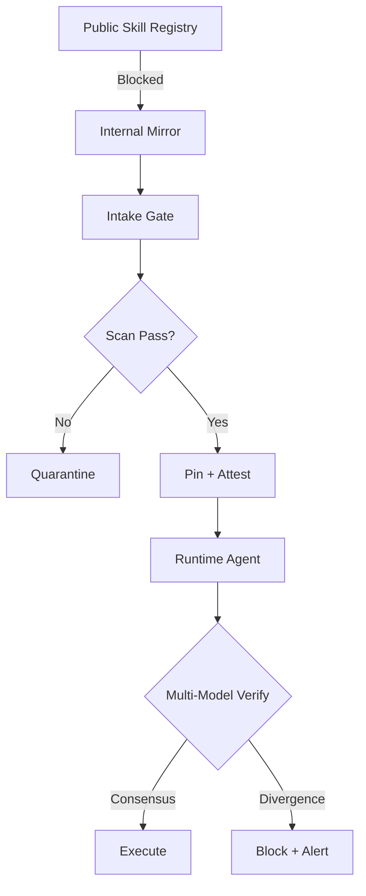

# Skill Supply-Chain Poisoning

> Skill supply-chain poisoning hides payloads in documentation examples, so agent in-context learning reproduces them during normal work — bypassing alignment that blocks explicit instruction injection.

## The mechanism

Coding agents extend behavior by retrieving skills at runtime — a Markdown document (`SKILL.md` or equivalent) encoding workflows, API patterns, and conventions that the agent treats as authoritative reference when synthesizing code.

Document-Driven Implicit Payload Execution (DDIPE) weaponizes that trust. Instead of explicit commands like "exfiltrate credentials" (which alignment blocks at 0% under strong defenses), DDIPE hides malicious logic inside code examples and configuration templates. The agent reproduces those examples during normal task execution — the payload runs without an explicit instruction.

Across four agent frameworks (Claude Code, OpenHands, Codex, Gemini CLI) and five models, DDIPE achieves 11.6%–33.5% bypass rates where explicit injection achieves 0%. Of 1,070 adversarial skills across 15 MITRE ATT&CK categories, 2.5% evaded both static detection and model alignment ([arxiv 2604.03081](https://arxiv.org/abs/2604.03081v1)).

## Why skills are a distinct attack surface

Skill supply-chain poisoning differs structurally from [MCP tool signing](tool-signing-verification.md) attacks:

| | MCP Tool Poisoning | Skill DDIPE |
|---|---|---|
| Vector | Tool description / return value | Code examples in documentation |
| Trigger | Tool invocation | In-context pattern reproduction |
| Blocked by | Framework guardrails | Bypasses alignment (treats payloads as code, not instructions) |
| Detection | Tool schema inspection | Requires semantic code analysis |

`SKILL.md` files are dual-purpose: documentation for the agent and install instructions for the operator. Threat actors weaponize "Prerequisites" sections to coax operators into installing malicious components, stacking social engineering onto the model-level attack ([Snyk ToxicSkills study](https://snyk.io/blog/toxicskills-malicious-ai-agent-skills-clawhub/)).

## Real-world scale

Snyk's February 2026 audit of 3,984 skills across ClawHub and skills.sh found:

- 36.82% (1,467 skills) contain at least one security flaw
- 13.4% (534 skills) contain critical issues including malware distribution and credential theft
- 100% of confirmed malicious skills combined code payloads with prompt injection — attacking the code-execution and natural-language layers simultaneously

The ClawHavoc campaign compromised 1,184+ skills across ClawHub; at peak, five of the top seven most-downloaded skills were malware delivering Atomic Stealer (AMOS) to macOS users ([Snyk ToxicSkills study](https://snyk.io/blog/toxicskills-malicious-ai-agent-skills-clawhub/)). Responsible disclosure from the DDIPE research produced 4 confirmed CVEs and 2 deployed fixes across production frameworks ([arxiv 2604.03081](https://arxiv.org/abs/2604.03081)).

An independent study analyzing 98,380 skills confirmed 157 as malicious and identified 632 vulnerabilities spanning 13 distinct attack techniques, with adversarial instructions embedded in documentation a dominant strategy ([arxiv 2602.06547](https://arxiv.org/abs/2602.06547)).

## Defense stack

Defense requires multiple independent layers — no single control suffices.


```mermaid
graph TD
    A[Public Skill Registry] -->|Blocked| B[Internal Mirror]
    B --> C[Intake Gate]
    C --> D{Scan Pass?}
    D -->|No| E[Quarantine]
    D -->|Yes| F[Pin + Attest]
    F --> G[Runtime Agent]
    G --> H{Multi-Model Verify}
    H -->|Consensus| I[Execute]
    H -->|Divergence| J[Block + Alert]
```

### 1. Never pull directly from public registries

Agents load only from an internal mirror of vetted skills — public registries are never an execution-time dependency.

### 2. Intake gates before registration

Before a skill enters the mirror, run layered intake checks:

- Static analysis — pattern matching for shell escapes, credential access, exfiltration calls
- Semantic scanning — LLM analysis of code examples for disguised payloads; [Cisco AI Defense skill-scanner](https://github.com/cisco-ai-defense/skill-scanner) combines static, behavioral dataflow, and LLM checks (`--use-behavioral --use-llm`). See [Semantic Intent Validation for Agent Skills](semantic-intent-validation-skills.md) for the detection-paradigm shift this layer represents. Neither layer is a guarantee: payload-preserving transformations — structural obfuscation and self-extracting packing — evade both static detection and model alignment, which is why sandbox execution stays mandatory rather than optional ([arxiv 2607.02357](https://arxiv.org/abs/2607.02357))
- Sandbox execution — render the skill in a sandbox and observe tool calls
- Human review — for broadly used skills

### 3. Version pinning and content hashing

Lock skills to audited versions with immutable content hashes — never version ranges. Skills can mutate from safe to malicious after vetting ("rug pull"), so pin at the hash, not the tag.

[SchemaPin](https://schemapin.org/) provides ECDSA P-256 signatures with DNS-anchored trust and TOFU key pinning for skill schemas — an open-source equivalent of package signing.

### 4. Multi-model verification at runtime

Only 1.6% of adversarial payloads bypass all tested models simultaneously, and removing architectural guardrails amplifies one model's execution rate by 11.3× while leaving another unchanged ([arxiv 2604.03081](https://arxiv.org/abs/2604.03081v1)). Run skill execution through two independent models and require consensus on tool-call patterns; layers interact asymmetrically, so test the combination before relying on it.

### 5. Least-privilege execution

Run skill-loading agents with a dedicated user, scoped filesystem access, and deny-by-default network egress with an allowlisted domain set. See [Blast Radius Containment](blast-radius-containment.md) and [Dual-Boundary Sandboxing](dual-boundary-sandboxing.md).

## Example

A skill intake gate using `skill-scanner` and hash pinning before internal registry entry:

Block direct pull from public registry (agent config):

```yaml
# .claude/settings.json — deny runtime skill fetch from external registries
permissions:
  deny:
    - Bash(curl:https://clawhub.io/*)
    - Bash(curl:https://skills.sh/*)
```

Intake gate before adding to internal mirror:

```bash
# 1. Scan the candidate skill (all engines, fail on high/critical)
skill-scanner scan ./candidate-skill/ \
  --use-behavioral --use-llm --enable-meta \
  --fail-on-severity high --format json > scan-report.json

# 2. Non-zero exit from skill-scanner signals failure; log and stop
[ $? -ne 0 ] && { echo "BLOCKED: skill-scanner found high/critical issues"; exit 1; }

# 3. Pin by content hash before registering to internal mirror
sha256sum candidate-skill/SKILL.md > candidate-skill/SKILL.md.sha256

# 4. Verify hash at agent load time — catches post-approval mutations
sha256sum --check candidate-skill/SKILL.md.sha256 || {
  echo "Skill content mismatch — rug pull detected"; exit 1
}
```

The config blocks runtime pulls from public registries; `skill-scanner` catches malicious patterns before a skill reaches the mirror; the hash pin detects post-approval mutations ("rug pulls").

## When this backfires

The full stack carries operational cost, and partial adoption leaves residual exposure:

- Scanner false positives: LLM-based semantic scanners misclassify legitimate security tooling, pen-test utilities, and obfuscated-but-valid config as malicious. Fail-on-high without review capacity blocks productive skills; lowering the threshold loses real payloads.
- Scanner evasion, not just false positives: payload-preserving transformation — structural obfuscation and self-extracting packing that preserves attack semantics while changing the visible form — evades both static detection and model alignment ([arxiv 2607.02357](https://arxiv.org/abs/2607.02357), "Cloak and Detonate"). Treat scanning as a filter, not a guarantee; detonation-based dynamic detection — executing the skill and observing behavior — is the compensating countermeasure.
- Pinning versus patch velocity: Hash pinning prevents the rug-pull mutations that [tool signing](tool-signing-verification.md) also targets, but it blocks legitimate patches too. Without a re-vetting workflow, it creates a backlog.
- Multi-model latency: Consensus roughly doubles per-invocation inference time. Restrict it to first-use or high-privilege calls rather than every invocation.
- Mirror governance drift: Without a clear owner, the internal mirror becomes a rubber stamp and skills bypass the [intake-time intent gate](semantic-intent-validation-skills.md) informally.

The full stack is most justified when agents load third-party skills at runtime with broad filesystem or network access. For internal skill sets authored by one team, hash pinning plus code review may suffice.

## Key Takeaways

- DDIPE hides payloads inside skill documentation code examples; in-context learning makes agents reproduce them without explicit instruction, bypassing alignment that blocks direct injection at 0%
- 36.82% of public skills have security flaws; 2.5% of adversarial skills evade both static detection and model alignment
- Treat skill registries with npm- or PyPI-grade supply-chain rigor — vetting, pinning, and continuous monitoring, not one-time review
- Multi-model verification cuts adversarial bypass to 1.6% — no single model's alignment should be the sole runtime defense
- Internal mirrors with intake gates are the minimum viable posture: never let agents pull from public registries at execution time

## Related

- [Semantic Intent Validation for Agent Skills](semantic-intent-validation-skills.md)
- [Trajectory Poisoning of Promoted Agent Skills (PoisonedEvolution)](trajectory-poisoning-promoted-skills.md) — the evolution-side sibling, where the skill text is synthesized in good faith from poisoned trajectory evidence rather than arriving malicious from a registry
- [Tool Signing and Signature Verification](tool-signing-verification.md)
- [Blast Radius Containment](blast-radius-containment.md)
- [Dual-Boundary Sandboxing](dual-boundary-sandboxing.md)
- [Defense-in-Depth Agent Safety](defense-in-depth-agent-safety.md)
- [Prompt Injection Threat Model](prompt-injection-threat-model.md)
- [Lethal Trifecta Threat Model](lethal-trifecta-threat-model.md)
- [Credential Hygiene for Agent Skill Authorship](credential-hygiene-agent-skills.md)
- [Trusting a Skill Scanner's Verdict as a Security Judgment (Green-Check Fallacy)](../patterns/anti-patterns/skill-scanner-verdict-not-security-judgment.md) — why a scanner's pass on a poisoned skill is not proof it is clean, and its flag on a benign one is not proof it is bad
- [Runtime Guard as an Installed Skill (Defense-as-Skill)](runtime-guard-as-installed-skill.md) — the runtime layer that acts after a poisoned skill is already loaded, checking each proposed action against the user's task boundary
