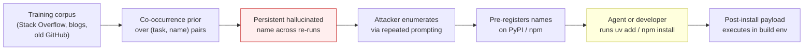

# Slopsquatting: Hallucinated Package Names as a Supply-Chain Vector

> Coding LLMs invent nonexistent package names; 43% reappear across re-runs, so attackers enumerate, pre-register them, and the agent's install pulls malware.

Slopsquatting is a supply-chain attack class in which an LLM recommends a package name that does not exist in any public registry, an attacker pre-registers that name on PyPI, npm, or another index, and an agent (or a developer copying the model's output) installs the attacker-controlled package. The term was coined by Seth Larson, a Python Software Foundation developer-in-residence, as a portmanteau of "AI slop" and "typosquatting" ([Wikipedia](https://en.wikipedia.org/wiki/Slopsquatting)). It is the package-name analogue of [LLM-Pinned Library Versions Carry Systemic CVE Exposure](llm-pinned-vulnerable-versions.md): both are training-distribution bugs, but in slopsquatting the package does not exist until an attacker creates it.

## The Measurement

Spracklen et al. ran 576,000 code generations across 16 LLMs in Python and JavaScript, then checked every recommended package against the official PyPI and npm registries (USENIX Security 2025; [arXiv:2406.10279](https://arxiv.org/abs/2406.10279)):

| Property | Result |
|---|:---:|
| Total unique hallucinated package names | **205,474** |
| Average hallucination rate — commercial models (GPT family) | **5.2%** |
| Average hallucination rate — open-source models (DeepSeek, CodeLlama, WizardCoder) | **21.7%** |
| Names that reappeared in every one of 10 re-runs of the same prompt | **43%** |
| Names that reappeared at least once across re-runs | **58%** |
| Names within Levenshtein distance 1-2 of a real package (typosquat-like) | **13.4%** |
| Names at Levenshtein distance ≥6 from any real package | **48.6%** |
| Python hallucinations that match a valid JavaScript package | **8.7%** |

The 43% persistence number is the load-bearing finding — it is what makes the attack economic. Random per-call hallucinations would be unexploitable; a stable hallucination prior turns "predict what the model will recommend next" into a tractable enumeration problem.

## Why It Works

The mechanism is **persistent hallucination + low semantic similarity to real names**. The model's training distribution contains co-occurrence statistics over `(task, package-name)` pairs; for popular libraries the prior points at a real name, but in the long tail it points at a plausible-looking synthesis. That synthesis is deterministic-ish across re-runs because it reflects a stable point in the prior, not random noise — which is why the persistence rate is high enough to enumerate ([arXiv:2406.10279](https://arxiv.org/html/2406.10279v3)).

The semantic-distance finding closes the second half: hallucinated names are mostly far from any real package, not minor typos. Traditional registry-side typosquat heuristics — which key off small edit distance from popular names — miss the bulk of the surface. PyPI and npm typosquat detectors are looking for the wrong shape.

An attacker needs neither model weights nor an exploit chain. The workflow is: prompt a public model with common code-generation tasks at scale, collect the recurring nonexistent names, register the top-N on PyPI / npm before anyone else, attach a post-install payload, and wait.



## The Real-World Proof of Concept

In December 2023, Bar Lanyado at Lasso Security registered the package `huggingface-cli` on PyPI as an empty, benign artifact after observing that LLMs repeatedly recommended that exact name in place of the real `huggingface-hub` tool. Within three months it received **>30,000 authentic downloads** and was incorporated into the README of Alibaba's `GraphTranslator` project as an install dependency in place of the real Hugging Face CLI ([The Register, March 2024](https://www.theregister.com/2024/03/28/ai_bots_hallucinate_software_packages/)). The experiment was deliberately benign — Lanyado published no malicious payload — but it confirmed that a hallucinated name registered on a public registry will be installed at scale by both humans and (transitively) by automated build pipelines reading agent output.

As of late 2025 no confirmed in-the-wild slopsquatting *malware* campaign has been documented, though researchers have identified packages whose names match slopsquatting patterns where intent cannot be proven ([Wikipedia](https://en.wikipedia.org/wiki/Slopsquatting)). The threat status is documented PoC plus measurement, not incident loss.

## Closing the Vector

Each defense routes around the hallucination prior. The hallucination cannot be prompted away; the install authority is what must be gated.

- **Existence + provenance check before install.** Block agent `uv add` / `npm install` / `pip install` on a hook that resolves the name against the registry's metadata first — package exists, has a non-zero history of downloads, has a maintainer not registered in the last N days. Snyk and similar scanners ship this surface ([Snyk — Package Hallucinations](https://snyk.io/articles/package-hallucinations/)).
- **Lockfile-enforced install path.** `uv lock` / `pip-compile --generate-hashes` / `npm ci` against a committed lockfile fails closed on any name the lockfile doesn't endorse. The agent can propose, but a human or a CI gate accepts the lockfile change before install. This is the same workflow that catches [LLM-pinned vulnerable versions](llm-pinned-vulnerable-versions.md).
- **Internal mirror with allowlist.** Artifactory, Nexus, or an OS package mirror configured to refuse unknown upstream packages blocks the slopsquatted name at network egress, regardless of what the agent typed.
- **Gate agent install authority.** The lethal-trifecta posture for any agent that can install packages is to remove the install leg from the agent and require a human-reviewed PR for manifest changes — see [Blast Radius Containment](blast-radius-containment.md) and the project's own `block-malicious-deps` hook gating `uv add` (`AGENTS.md` §Runtime and tooling).
- **Pin against an external registry, not the model's prior.** The companion fix to LLM-pinned-vulnerable-versions: treat the agent's manifest as a hint, validate against an authoritative source ([LLM-Pinned Library Versions Carry Systemic CVE Exposure](llm-pinned-vulnerable-versions.md)).

The defense to *not* invest in is registry-side typosquat detection — the Levenshtein-distance distribution above shows why it does not match this surface ([arXiv:2406.10279](https://arxiv.org/html/2406.10279v3)).

## Example

An agent generates a Python data-loading script and writes:

```python
# data_loader.py
import pandas as pd
from huggingface_data_utils import load_dataset_cached  # hallucinated
from arrow_to_pandas import to_dataframe              # hallucinated

df = to_dataframe(load_dataset_cached("squad"))
```

```toml
# pyproject.toml fragment
[project]
dependencies = [
    "pandas>=2.0",
    "huggingface-data-utils",   # does not exist on PyPI as of writing
    "arrow-to-pandas",          # does not exist on PyPI as of writing
]
```

The static code review passes — the imports are syntactically valid. CI is green. The failure surfaces at install time only if the registry refuses the names. Two things happen depending on the install path:

```bash
# Unmediated agent install — the failure mode this page is about
$ uv add huggingface-data-utils arrow-to-pandas
   Resolved 2 packages in 213ms
   Installed 2 packages in 89ms
    + huggingface-data-utils==0.1.0   # attacker-registered yesterday
    + arrow-to-pandas==1.0.2          # attacker-registered yesterday
# post-install hook of either package executes in the build environment
```

```bash
# Lockfile-enforced install — closes the vector
$ npm ci
   npm error code E404
   npm error 404 Not Found - GET https://registry.npmjs.org/arrow-to-pandas
# install fails closed; the lockfile never resolved the name
```

The first install completes silently. The second fails closed. Both used the same model output as input — the lockfile path refused to resolve a name the human hadn't audited.

## When This Backfires

Not every project needs a slopsquatting-specific gate. The defense duplicates work in some shapes:

- **Lockfile-enforced workflows already in place.** When `npm ci` / `uv pip sync` / `pip-sync` runs against a human-reviewed lockfile, the slopsquatted name is rejected before resolution — a second per-install existence check duplicates work the lockfile already does.
- **Curated internal mirrors.** When Artifactory or Nexus already filters unknown upstream packages, an agent-side check is redundant.
- **Mature canonical libraries only.** Hallucination concentrates in the long tail; an app whose manifest imports only well-known top-1000 packages (`requests`, `pandas`, `numpy`, `axios`) has minimal exposure. The 5.2% commercial-model hallucination rate is *average across all tasks*, not per-call on canonical libraries ([arXiv:2406.10279](https://arxiv.org/abs/2406.10279)).
- **Throwaway prototypes and ephemeral sandboxes.** A verification step adds latency for code that never leaves a developer laptop or a torn-down container; the verification cost dominates the per-install risk for short-lived workloads.
- **Awareness has grown and registry-side defenses are improving.** PyPI and npm have invested in supply-chain hardening since the Lanyado experiment ([Wikipedia](https://en.wikipedia.org/wiki/Slopsquatting)); the residual threat is concentrated where agents install packages outside any of the gates above.

This is the same shape as the LLM-pinned-CVE finding: a real measurement-grounded threat that gets neutralized by ordinary supply-chain hygiene, but is genuinely dangerous wherever an agent's install authority bypasses that hygiene.

## Key Takeaways

- 5.2%-21.7% of LLM-recommended package names do not exist in any public registry; 205,474 unique fabricated names found across 16 models and 576,000 generations ([arXiv:2406.10279](https://arxiv.org/abs/2406.10279))
- 43% of hallucinated names reappear identically across 10 re-runs of the same prompt — that persistence is what makes the attack economic; an attacker enumerates them by re-prompting at scale
- 48.6% of hallucinated names are Levenshtein distance ≥6 from any real package, so PyPI/npm typosquat detectors miss the bulk of the surface — defenses must verify existence, not edit distance
- Lanyado's `huggingface-cli` PoC was downloaded >30,000 times in three months and referenced by Alibaba's GraphTranslator README — a hallucinated name registered on a public registry is installed at scale even when the payload is benign ([The Register](https://www.theregister.com/2024/03/28/ai_bots_hallucinate_software_packages/))
- The defense surface is install authority, not model behavior: lockfile-enforced installs, internal mirrors, and registry existence checks at the agent's install hook each close the vector
- Distinct from [LLM-Pinned Library Versions Carry Systemic CVE Exposure](llm-pinned-vulnerable-versions.md): in that case the package exists but the version is vulnerable; here the package does not exist until an attacker creates it

## Related

- [LLM-Pinned Library Versions Carry Systemic CVE Exposure](llm-pinned-vulnerable-versions.md) — the version analogue: real package, vulnerable release; same training-distribution mechanism, different exploit shape
- [Agent-Emitted Dependency Version Ranges Widen the Supply-Chain Attack Surface](agent-emitted-dependency-ranges.md) — the third leg of the agent-authored-manifest threat surface; caret ranges admit future-compromised releases of names that already exist
- [Skill Supply-Chain Poisoning](skill-supply-chain-poisoning.md) — adjacent supply-chain attack via the skill registry rather than the package registry
- [Blast Radius Containment: Least Privilege for AI Agents](blast-radius-containment.md) — the principle that gates agent install authority in the first place
- [Always-On Agentic PR Security Review](always-on-pr-security-review.md) — the CI surface where manifest changes get reviewed before install

## Sources

- [arXiv:2406.10279](https://arxiv.org/abs/2406.10279) — Spracklen et al., USENIX Security 2025: "We Have a Package for You! A Comprehensive Analysis of Package Hallucinations by Code Generating LLMs"
- [arXiv:2501.19012](https://arxiv.org/abs/2501.19012) — Krishna et al., "Importing Phantoms: Measuring LLM Package Hallucination Vulnerabilities" — HumanEval inversely correlates with hallucination rate
- [Wikipedia — Slopsquatting](https://en.wikipedia.org/wiki/Slopsquatting) — term origin (Seth Larson, Python Software Foundation), current exploitation status
- [The Register — AI bots hallucinate software packages and devs download them (March 2024)](https://www.theregister.com/2024/03/28/ai_bots_hallucinate_software_packages/) — Bar Lanyado `huggingface-cli` PoC
- [OWASP GenAI LLM Top 10 — LLM09:2025 Misinformation](https://genai.owasp.org/llm-top-10/) — the taxonomic anchor; package hallucination is the canonical example
- [Snyk — Package Hallucinations](https://snyk.io/articles/package-hallucinations/) — defense practice
