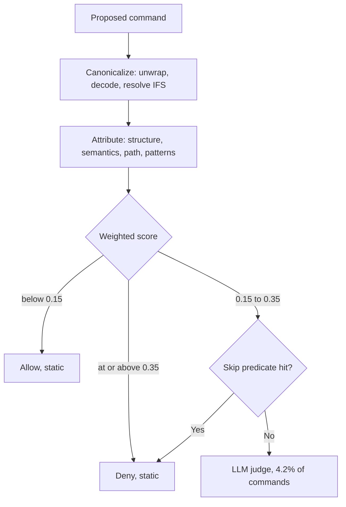

# Static-First Shell Command Gating with Selective Escalation

> Canonicalize the command first, score it statically, and let an LLM judge see only the narrow band the static evidence leaves undetermined.

Static-first shell command gating mediates every command an agent proposes in three stages: canonicalization rewrites the raw string into a stable verification target without executing it, attribution scores that target against structural, semantic, path, and pattern evidence, and resolution escalates only the underdetermined middle to an LLM judge. In the CARE reference implementation, 23 of 549 evaluated commands reach the judge, so 95.8% of decisions cost no model call ([Liu et al., 2026](https://arxiv.org/abs/2607.21642v2)).

## When this pattern applies

The gate earns its place under three conditions, and the third is the one teams skip ([Liu et al., 2026](https://arxiv.org/abs/2607.21642v2)):

- Command volume makes an always-on judge's cost visible. The LLM judge baseline runs at 45.90 ms with an 11.25% false-positive rate, against 2.32 ms and 0.91% for the tiered pipeline. Below a few hundred commands a session, neither number is felt.
- Containment already exists underneath. The authors position CARE as "a complementary pre-execution defense rather than a replacement for sandboxing, host hardening, or TOCTOU-safe enforcement", and its strictest profile still lets 37.33% of RedCode-gen commands pass the check and succeed in a sandbox. This layers on top of [blast radius containment](blast-radius-containment.md), never replaces it.
- The judge runs on a different model family from the agent. CARE's resolution judge and its command generator share a Qwen3-Coder-30B backbone, which the paper names as a threat to validity. A single-model deployment is what a team drifts into by default.

## The three stages

Canonicalization unwraps shell wrappers, normalizes quoting and escapes, applies bounded base64 and hex decoding, resolves `$IFS` splitting, and unwraps command substitution, keeping the original tokens beside the normalized form. The paper is careful to call this "bounded normalization, not full semantic recovery" ([Liu et al., 2026](https://arxiv.org/abs/2607.21642v2)).

Attribution derives four independent evidence streams over the canonical form ([Liu et al., 2026](https://arxiv.org/abs/2607.21642v2)):

| Layer | Evidence | Signals it produces |
|---|---|---|
| Structure | `bashlex` AST parse | Execution handoffs, obfuscation nesting, parse failure alongside high-risk tokens |
| Semantics | Risk-class lexicon over command heads | Base class plus context boosts for permissive modes and chaining |
| Path | Operand extraction, `~` expansion, symlink resolution | A write into a protected path outranks a diagnostic read of the same file |
| Patterns | Provenance-weighted rule bank | 139 rules: 92 from MITRE ATT&CK, 31 from GTFOBins, 16 manual cases |

A weighted sum lands the command in one of three bands. The weights and thresholds are tuning, not the pattern; CARE defaults to 0.3 semantic, 0.3 path, 0.3 pattern, 0.1 structural with band edges at 0.15 and 0.35. Resolution finalizes allow and deny without a model, then applies skip predicates to the warn band so attested rule matches and protected-path writes never reach the judge either.

## Why it works

Shell risk is largely a structural property of a normalized command, and structure is decidable while a judge's verdict is a draw from a noisy distribution. Once the string is canonical, the discriminating facts sit in plain view: the command head's risk class, whether a path operand is a write into a protected location, whether an execution handoff or an attested attack pattern is present. A deterministic comparison resolves those in microseconds and returns the same verdict every time, where a model adds only variance. The false-positive column carries the argument. At 11.25% against 0.91%, the always-on judge interrupts the developer twelve times as often as the tiered pipeline, and pays 45.90 ms to do so ([Liu et al., 2026](https://arxiv.org/abs/2607.21642v2)). The neural tier is worth its cost only on the residual band where static evidence underdetermines the call.

The architecture is not one group's idiosyncrasy. AgentTrust independently pairs a shell deobfuscation normalizer with a policy engine and an LLM judge reserved for ambiguous cases, reporting 96.7% verdict accuracy on a 630-scenario external benchmark in its patched-ruleset configuration ([Yang, 2026](https://arxiv.org/abs/2605.04785v1)).

## Choosing an enforcement profile

The judge tier buys false-positive burden and costs harm reduction. Pick the profile against the traffic you expect, not the headline F1 ([Liu et al., 2026](https://arxiv.org/abs/2607.21642v2)):

| Profile | F1 | FPR | Mean latency | Realized harm on RedCode-gen |
|---|---|---|---|---|
| Static enforcement only | 84.99% | 1.82% | 0.34 ms | 37.33% |
| Full pipeline, judge on the warn band | 85.64% | 0.91% | 2.32 ms | 52.50% |
| Always-on LLM judge | 73.09% | 11.25% | 45.90 ms | 51.33% |
| No guard | n/a | n/a | n/a | 74.83% |

Realized harm counts commands that pass the guard and then succeed in a Docker sandbox. Detection rate on the main split is 75.91%, so roughly one harmful command in four passes the guard whatever the profile ([Liu et al., 2026](https://arxiv.org/abs/2607.21642v2)). Turning resolution on halves false positives and raises the realized-harm figure by 15.17 points. The false-positive win is smaller than it sounds: it came from three benign `rsync` commands, and no catalog-attested deny was reversed ([Liu et al., 2026](https://arxiv.org/abs/2607.21642v2)). Run static enforcement wherever the traffic may be adversarial, and reserve the full pipeline for workloads where interruptions are the cost that actually hurts.

## When this backfires

- Adversarial traffic with the judge enabled. The judge over-allows warn-band commands that paraphrase attacks close to its own training distribution, which is how a tier that halves false positives still lets more harm through ([Liu et al., 2026](https://arxiv.org/abs/2607.21642v2)).
- Stereotyped destructive idioms rather than obfuscated ones. On CVE-derived snippets from Exploit-DB, plain regex beats the whole pipeline on F1 (81.52% against 66.33%), so the AST and rule bank are cost without benefit for that distribution ([Liu et al., 2026, §V-C2](https://arxiv.org/abs/2607.21642v2)).
- Staged multi-command chains. Scoring each command in isolation passes a sequence that is individually benign and collectively an exfiltration, and the paper scopes itself out of session-level hazards.
- Encoding- and escape-heavy obfuscation. Bounded decoding is the canonicalizer's weakest axis by its own ablation, and vendors report the same limit from the other side: VS Code documents that terminal auto-approvals "use best-effort command parsing and have known limitations with shell aliases, quote concatenation, and complex shell syntax" ([VS Code security](https://code.visualstudio.com/docs/copilot/security)).
- A tighter false-positive budget than 0.91%. A four-layer static baseline in the same evaluation reaches 0.30% FPR at 0.02 ms for about 13 fewer F1 points ([Liu et al., 2026](https://arxiv.org/abs/2607.21642v2)).

## Key Takeaways

- Canonicalization is the prerequisite step, not a detail: scoring the raw string measures what the command looks like rather than what the shell will run.
- Escalation rate is the tuning knob. At 4.2% of commands the judge is a rounding error on cost, and widening the warn band collapses the pipeline's economics toward the always-on baseline.
- Record which profile you run and why. A team that deploys on headline F1 alone lands on the configuration that scored best against the benchmark furthest from its own threat model.
- Detection rate is 75.91% on the main split, so roughly one harmful command in four passes. Size the layers underneath accordingly.
- Run the judge on a different model family from the agent. CARE's shared Qwen3-Coder-30B backbone is a self-consistency threat to validity the authors name about their own evaluation.
- The rule bank and reference implementation are public under MIT at [prisma-research/CARE](https://github.com/prisma-research/CARE), so the 139 provenance-tagged rules are a starting corpus rather than something to rebuild.

## Related

- [Pre-Execution Risk Classification for Terminal Commands](pre-execution-command-risk-classification.md) — the advisory badge shown to a human; this page is the gate that decides whether a human is asked at all
- [Classifier-Gated Auto-Permission](../patterns/agent-design/classifier-gated-auto-permission.md) — the always-on-classifier posture this pattern inverts by putting the model last
- [Hybrid Deterministic + Semantic Authorization for Agent Tool Calls](hybrid-deterministic-semantic-tool-authorization.md) — the same two-layer split applied at the MCP tool boundary rather than the shell string
- [Safe Command Allowlisting](safe-command-allowlisting.md) — the deterministic allowlist that should absorb the high-volume benign tail before any scorer sees it
- [Parser-Versus-Shell Evasion in Command Permission Checks](parser-versus-shell-permission-evasion.md) — why bounded canonicalization leaves a residue, and what that implies about where enforcement belongs
- [Blast Radius Containment](blast-radius-containment.md) — the layer underneath, which the guard explicitly does not replace
