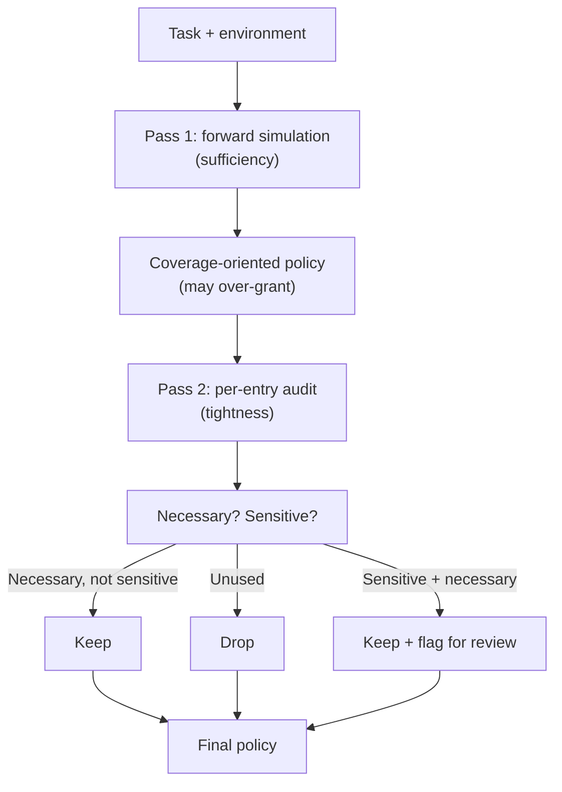

# Sufficiency-Tightness Decomposition for Agent-Authored Permissions

> Sufficiency-tightness decomposition splits agent permission authoring into a coverage pass and a separate tightness audit, escaping the single-pass attractor that more reasoning only entrenches.

## The Permission-Boundary Inference Gap

[AuthBench](https://arxiv.org/abs/2605.14859) frames *permission-boundary inference* as mapping a task instruction and terminal environment to a file-level read/write/execute policy that completes the task without granting unused or sensitive accesses. It scores 120 terminal tasks with executable validators measuring both utility and attack outcome.

Frontier models do not converge on a tight, sufficient policy in one pass. They "often omit permissions required by the execution chain while also granting unused or sensitive accesses" ([arxiv:2605.14859](https://arxiv.org/abs/2605.14859)). The failure is structural, not a calibration miss — each model has its own steady-state bias.

### Reasoning Amplifies the Failure Mode

More reasoning time does not narrow the gap:

> Each model moves toward a model-specific authorization attractor: more reasoning makes it more consistent in its own failure mode, whether broad-but-exposed or tight-but-brittle. ([arxiv:2605.14859](https://arxiv.org/abs/2605.14859))

Extended reasoning entrenches the bias rather than escaping it. A broad-biased model produces broader policies — a larger [blast radius](blast-radius-containment.md) — while a tight-biased model produces tighter and more brittle ones. The single-pass framing confounds two objectives — sufficiency and tightness — and the model drifts toward whichever it weights more heavily.

## The Two-Pass Decomposition

The paper's remedy separates the two objectives into independent passes:

**Pass 1 — Forward simulate the execution chain.** The model walks through what the task does: which files the commands read, write, and execute. The criterion is coverage. Over-granting is acceptable here; under-granting breaks the task and is harder to recover from.

**Pass 2 — Audit each entry for necessity and sensitivity.** The model re-examines the policy entry-by-entry, asking only whether each permission is required by the simulated chain and whether the target is sensitive. Unused entries get dropped; sensitive-but-necessary ones get flagged.

Reported result: "up to 15.8% on tightness-biased models while reducing attack success across all evaluated models" ([arxiv:2605.14859](https://arxiv.org/abs/2605.14859)).

## When to Reach for This Pattern

The decomposition applies when a model is the policy author. It is not needed when policy comes from elsewhere:

| Policy source | Decomposition needed? |
|---|---|
| Model drafts the policy from a task description | Yes — single-pass output lands at the attractor |
| Transcript-driven promotion from observed traces | No — runtime evidence replaces inference ([transcript-driven allowlist](transcript-driven-permission-allowlist.md)) |
| Default-deny sandbox with explicit grants per tool | No — the policy is the harness contract ([sandbox runtime comparison](sandbox-runtime-comparison.md)) |
| Static analysis of the command sequence | No — analyzer enumerates accesses without model inference |

Teams that never ask a model to author a policy sidestep the failure mode. Reach for the decomposition when scaffolding `.claude/settings.json` for a new repository before runtime evidence exists, or generating per-task scoped credentials in a [TBAC](task-based-access-control-hybrid-inspection.md) flow where policy must precede the first tool call.

## Composition With Runtime Authorization

A two-pass policy is still a static artifact. Runtime authorization — [TBAC with hybrid inspection](task-based-access-control-hybrid-inspection.md), an [MCP runtime control plane](mcp-runtime-control-plane.md), or [permission-gated commands](permission-gated-commands.md) — still has to enforce it and catch per-call scope creep. Mechanical deny rules for catastrophic exposures like `.env` or `~/.aws/credentials` ([protecting sensitive files](protecting-sensitive-files.md)) should not depend on the audit pass catching them.

Progent ([arxiv:2504.11703](https://arxiv.org/abs/2504.11703)) takes a complementary approach: it generates an initial symbolic policy from the task description and tightens it via SMT-solver narrowing at runtime, without a separate audit pass. A two-pass static policy can serve as Progent's starting point, with runtime narrowing catching what the audit pass missed.

## Example

A coding agent runs `pytest` against `./src` and `./tests`. A single-pass "minimum file permissions" prompt yields one of the attractor outputs: a broad-biased model emits `read:*, exec:*` (exposed); a tight-biased model emits `read:./tests/*` (brittle — `./src` reads imported by the tests are missing, so the run fails).

Two-pass:

**Pass 1 (sufficiency):** "Walk through what `pytest` against `./src` and `./tests` does. List every file the command reads, writes, or executes. Err on the side of inclusion."

Output (illustrative): `read:./src/**, read:./tests/**, read:./pyproject.toml, read:./conftest.py, write:./.pytest_cache/**, exec:./.venv/bin/python, read:./.venv/lib/**`.

**Pass 2 (tightness):** "For each entry, decide: is it required by the execution chain? Is it sensitive? Drop unused entries; flag sensitive-but-necessary ones."

Output: keep the reads under `./src`, `./tests`, `./pyproject.toml`, `./conftest.py`; keep the cache write and `python` exec; flag `./.venv/lib/**` as a broad read that runtime evidence should narrow later. The result lands closer to least-privilege than either single-pass extreme.

## When This Backfires

- **Audit pass inherits the same attractor bias.** Pass 2 asks the same model to evaluate its own Pass 1 output — not an independent oracle. A broad-biased model may fail to prune; a tight-biased model may over-prune.
- **Two-pass latency and token cost.** For short-lived tasks where the policy executes once, the extra cost may exceed the marginal tightening.
- **Static artifacts still require runtime enforcement.** Skipping [runtime authorization](task-based-access-control-hybrid-inspection.md) because you trust the two-pass output is worse than using a default-deny sandbox.
- **Generalization is unproven.** AuthBench covers terminal file policies; network egress, database credentials, and multi-agent delegation are not established by the paper.

When a transcript-driven allowlist, default-deny sandbox, or static analyzer is available, prefer those. Reserve the two-pass decomposition for cases where a model must author the initial policy and no runtime evidence yet exists.

## Key Takeaways

- Models authoring a file-rwx policy in one pass land at a model-specific attractor — broad-but-exposed or tight-but-brittle — and more reasoning makes that attractor stronger.
- Two passes — forward-simulate for coverage, then audit each entry for necessity and sensitivity — close most of the gap; AuthBench reports up to 15.8% improvement on tightness-biased models with reduced attack success across all models tested.
- The decomposition applies only when a model must author the policy. Transcript-driven promotion, default-deny sandboxes, and static analysis sidestep it.
- A two-pass policy is still a static artifact — pair it with runtime authorization and mechanical deny rules for sensitive paths.

## Related

- [Task-Based Access Control with Hybrid Inspection](task-based-access-control-hybrid-inspection.md) — runtime authorization that enforces a policy at each tool call.
- [Permission-Gated Custom Commands](permission-gated-commands.md) — harness-level allowlisting downstream of the authored policy.
- [Protecting Sensitive Files from Agent Context](protecting-sensitive-files.md) — mechanical deny rules for the cases an audit pass may miss.
- [Transcript-Driven Permission Allowlist](transcript-driven-permission-allowlist.md) — the alternative path: promote permissions from observed runtime traces instead of asking the model to author them.
- [Blast Radius Containment: Least Privilege for AI Agents](blast-radius-containment.md) — why least-privilege matters in the first place.
