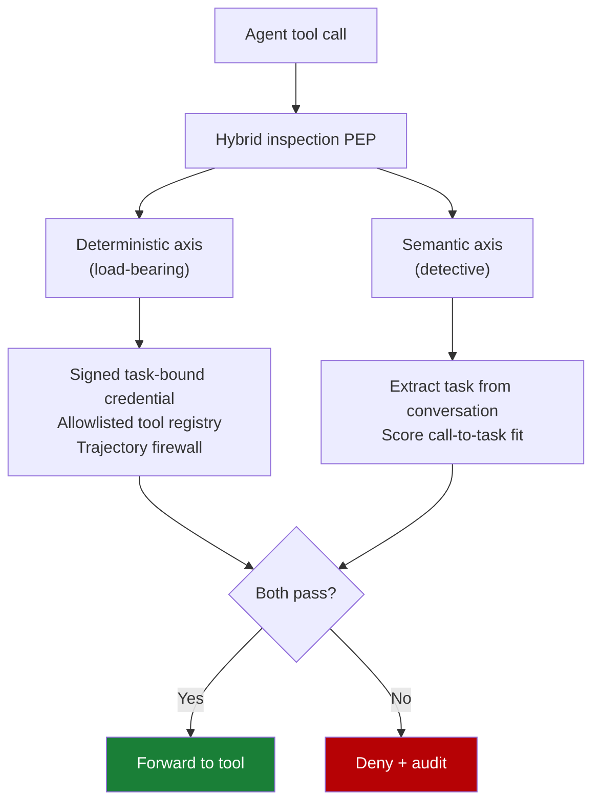

# Task-Based Access Control with Hybrid Inspection

> Authorize each agent tool call against the user's current task — not against a long-lived OAuth scope. Bind credentials to the task on the deterministic axis; extract intent from the conversation on the semantic axis. The deterministic axis carries the security guarantee.

## The Gap OAuth Leaves Open

OAuth 2.0 assumes a single authenticated principal with pre-defined scopes. Agentic AI breaks that: agents adapt capabilities at runtime, spawn sub-agents through multi-hop delegation, act for users and organizations at once, and run as ephemeral instances at high token volume ([2505.19301](https://arxiv.org/abs/2505.19301)). A token granting `delete:repository` tells the server *what* the agent can do but not *which* of the user's tasks justifies the call right now.

A compromised agent — or one redirected by [prompt injection](prompt-injection-threat-model.md) — can therefore tamper with tool calls, falsify results, or escalate beyond the subject's intended task without the authorization server seeing anything wrong ([2509.13597](https://arxiv.org/abs/2509.13597)).

Task-based access control (TBAC) closes this gap by binding each authorization decision to the *current task*, not to a long-lived scope.

## Two Independent Axes

Hybrid inspection decomposes the authorization decision along two axes that fail in different ways. An attacker has to defeat both.

### Deterministic axis (load-bearing)

Every primitive on this axis is enforced outside the model:

- **Just-in-time verifiable credentials**, signed and scoped to a specific task or job ID, with short windows referencing exact resource handles and operations ([2505.19301](https://arxiv.org/abs/2505.19301)).
- **Allowlisted tool registry** — the agent's identity document declares which tools it may invoke; calls outside that set are refused at the policy decision point ([2505.19301](https://arxiv.org/abs/2505.19301)).
- **Tool-call trajectory enforcement** — a [behavioural firewall](behavioral-firewall-tool-call-trajectories.md) compiled from verified-benign telemetry rejects sequences and parameter bounds outside the accepted shape, in O(1) at runtime ([2604.26274](https://arxiv.org/abs/2604.26274)).
- **Intent-bound delegation tokens** — A-JWT binds each call to a verifiable user intent and (optionally) a workflow step, with per-agent proof-of-possession keys blocking replay ([2509.13597](https://arxiv.org/abs/2509.13597)).

Compromise on this axis requires breaking cryptography, the registry, or the PEP — not redirecting a model's natural-language interpretation.

### Semantic axis (detective)

The semantic axis runs alongside the deterministic checks at the same interception point — typically an [MCP runtime control plane](mcp-runtime-control-plane.md) — and is structured in two stages: extract the subject's task from the multi-turn conversation, then score whether the requested tool call advances that task ([issue #3243 abstract](https://arxiv.org/abs/2605.02682)).

Its job is to flag scope creep the deterministic axis cannot see: a tool call that is allowlisted and within trajectory bounds but unrelated to what the user asked for. Without it, an attacker who stays inside the deterministic envelope is invisible.

## Why The Asymmetry Matters

Treating the semantic axis as load-bearing inherits the LLM's failure modes:

- **Cascading misclassification.** Wrong task extraction in multi-domain conversations propagates to every downstream check.
- **Same input channel as the attack.** A prompt injection that rewrites the agent's plan can also rewrite the "extracted task" the inspector reads. Semantic inspection over an attacker-controlled conversation is detective at best — the [lethal trifecta](lethal-trifecta-threat-model.md) is unaffected by adding another LLM evaluator on the same channel.
- **False positives erode trust.** Unusual but legitimate workflows trigger alerts that get dismissed, causing alert fatigue on real attacks.

Place the security guarantee on cryptography and registries. Use the semantic axis for audit and human review, not allow/deny in the hot path.

## When To Add The Semantic Axis

Add it when:

- The deterministic envelope is necessarily broad (a developer agent with a wide tool catalog), and out-of-task-but-in-scope misuse is a real risk.
- You have an audit pipeline that can absorb anomaly flags without blocking legitimate work — semantic flags drive [human-in-the-loop confirmation gates](human-in-the-loop-confirmation-gates.md), not auto-deny.
- Multi-turn conversations carry a single coherent task — the extraction signal is reliable.

Skip it when:

- The deterministic envelope already matches the task tightly (one-shot agents, single-purpose subagents). The added inference cost buys nothing.
- Conversations legitimately span unrelated tasks; extraction either over-restricts or fragments incorrectly.
- Tool catalogs change faster than the semantic model's knowledge of "what each tool legitimately does" — staleness causes rolling false positives.
- Latency budgets are tight: a [pDFA firewall](behavioral-firewall-tool-call-trajectories.md) runs at ~2.2 ms per call ([2604.26274](https://arxiv.org/abs/2604.26274)); a two-stage semantic evaluation does not.

## Example

A coding agent gets OAuth access to a customer's GitHub. The user asks: "List the open issues in `acme/widget` and summarise them." An injected instruction in one issue body then tells the agent to push a commit to `main`.

**OAuth-only:** the token covers `repo`. The push is allowed and logged as legitimate.

**TBAC with hybrid inspection:**

1. *Deterministic axis.* The agent holds a JIT credential scoped to `read:issues` on `acme/widget` for 15 minutes. The push call presents no credential authorising `write:contents`; the PEP refuses it before the call leaves the proxy ([2505.19301](https://arxiv.org/abs/2505.19301)).
2. *Semantic axis.* Even with a broader session token, the extracted task — "list and summarise open issues" — does not cover `git push`. The check flags the call as out-of-task; with [confirmation gating](human-in-the-loop-confirmation-gates.md) the user sees the requested action and the conversation excerpt that justified it.

The deterministic axis stops the attack. The semantic axis makes it visible when the deterministic envelope was sized too generously.

## Trade-offs

- **Implementation cost.** TBAC requires an authorization server that mints task-scoped credentials and a PEP between the agent and every tool — typically an [MCP runtime control plane](mcp-runtime-control-plane.md) plus a [scoped-credentials proxy](scoped-credentials-proxy.md).
- **Token lifecycle.** JIT VCs need an authority that can mint on demand and revoke globally; lingering tokens defeat the model.
- **Semantic-axis tuning.** Threshold drift produces alert fatigue or silent under-flagging. Treat the threshold as an evaluable artefact.
- **Deterministic axis still needed.** A semantic inspector without it is detection, not authorization. Build the deterministic side first.

## Key Takeaways

- OAuth's static scopes do not bind authorization to the user's current task; runtime-adaptive agents escalate inside legitimate scopes without visibility.
- TBAC binds each decision to the current task via short-lived signed credentials and an allowlisted tool registry.
- Hybrid inspection adds a semantic axis that extracts task from the conversation and scores call-to-task fit — useful for detection, not as a primary control.
- The deterministic axis carries the guarantee. The semantic axis cannot, because it shares the input channel with the attacker.
- Add the semantic axis when the envelope is necessarily broad and an audit pipeline can absorb its flags. Skip it when scope is tight or latency is critical.

## Related

- [Scoped Credentials via Proxy Outside the Agent Sandbox](scoped-credentials-proxy.md)
- [Behavioral Firewall for Tool-Call Trajectories](behavioral-firewall-tool-call-trajectories.md)
- [MCP Runtime Control Plane: Policy Evaluation Between Agent and Tool](mcp-runtime-control-plane.md)
- [Treat Task Scope as a Security Boundary](task-scope-security-boundary.md)
- [Blast Radius Containment: Least Privilege for AI Agents](blast-radius-containment.md)
- [Lethal Trifecta Threat Model](lethal-trifecta-threat-model.md)
- [Human-in-the-Loop Confirmation Gates for Consequential Agent Actions](human-in-the-loop-confirmation-gates.md)
- [Action-Selector Pattern: LLM as Intent Decoder with Deterministic Execution](action-selector-pattern.md)
