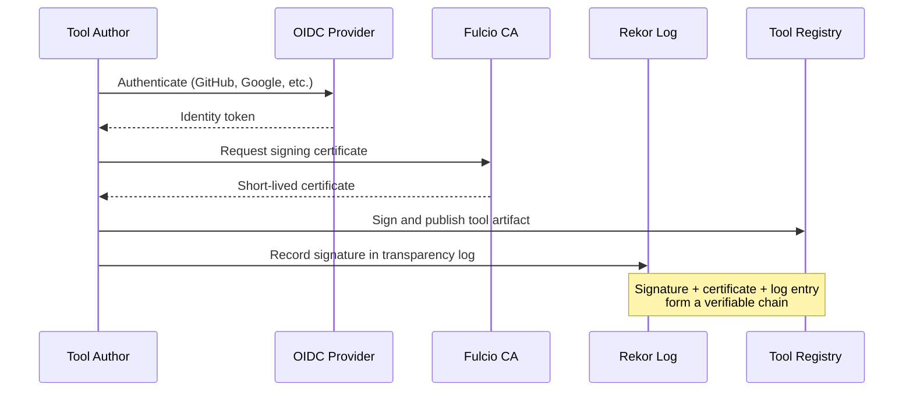
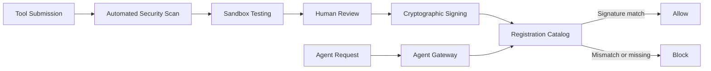

# Tool Signing and Signature Verification

> Require cryptographic signature verification before an agent loads or invokes a tool, preventing untrusted or tampered modules from entering the execution environment.

## The Supply Chain Problem

Agents dynamically load tools at runtime, and each tool inherits the agent's permissions. A single tampered tool compromises the entire workflow.

Key attack vectors:

- **Tool poisoning** — malicious instructions embedded in tool descriptions, invisible to users but visible to the LLM ([OWASP MCP03:2025](https://owasp.org/www-project-mcp-top-10/2025/MCP03-2025%E2%80%93Tool-Poisoning))
- **Rug pulls** — tools that mutate their definitions post-installation, safe on day 1 and exfiltrating credentials by day 7 ([Willison, 2025](https://simonwillison.net/2025/Apr/9/mcp-prompt-injection/))
- **Marketplace malware** — 534 of 3,984 skills on agent marketplaces contained critical vulnerabilities including [prompt injection](prompt-injection-threat-model.md) ([ReversingLabs](https://www.reversinglabs.com/blog/how-ai-agents-upend-sscs))
- **Cross-server shadowing** — a malicious MCP server intercepts calls intended for a trusted server ([Invariant Labs, 2025](https://invariantlabs.ai/blog/mcp-security-notification-tool-poisoning-attacks))

The [OWASP Top 10 for Agentic Applications](https://genai.owasp.org/resource/owasp-top-10-for-agentic-applications-for-2026/) lists supply chain vulnerabilities (ASI04) as a top risk.

## Sigstore: Keyless Signing Infrastructure

[Sigstore](https://docs.sigstore.dev/about/overview/) provides keyless signing for software artifacts, eliminating long-lived keys. Three components:

| Component | Role |
|---|---|
| **Cosign** | Signing and verification client |
| **Fulcio** | Certificate authority issuing short-lived certificates via OIDC identity |
| **Rekor** | Immutable transparency log recording every signing event |

The signing flow ties integrity to identity:



## Extending Sigstore to Agent Tools

### A2A Agent Cards

The [sigstore-a2a](https://github.com/sigstore/sigstore-a2a) project applies Sigstore keyless signing to [A2A Agent Cards](../standards/agent-cards.md), enabling SLSA provenance attestations linking cards to source repos and build workflows. Verification constrains trust at three levels:

- **Repository** — only trust cards built from a specific repo
- **Workflow** — only trust cards built by a specific CI pipeline
- **Actor** — only trust cards signed by a specific identity

Keyless signing requires CI/CD ambient OIDC credentials, preventing ad-hoc signing from compromised developer machines.

### ML Models

[Sigstore model-signing v1.0](https://blog.sigstore.dev/model-transparency-v1.0/) extends the same infrastructure to ML models and datasets, targeting integration with model hubs (HuggingFace, Kaggle) and ML frameworks (TensorFlow, PyTorch).

## Why It Works

Cryptographic signing binds a tool artifact's content to a hash: any modification produces a different digest, invalidating the original signature. The agent gateway rejects mismatches before the tool description ever reaches the LLM — fail-closed by design. Transparency logs (Rekor) make every signing event append-only in a Merkle tree, so retroactive log manipulation is computationally infeasible. Identity-binding via short-lived OIDC certificates means the signature attests *who* built the artifact, not just *what* it contains, defeating impersonation. Post-load monitoring compares live tool schemas against the signed baseline to catch rug pulls where a tool mutates after initial verification ([Cullinan et al., 2025](https://arxiv.org/html/2601.23132v1)).

## Runtime Enforcement Patterns

Signing alone is insufficient — verification must happen at runtime before invocation.

### Registration Catalog + Agent Gateway

A registration workflow pre-verifies tools before catalog entry:



The gateway compares runtime tool descriptions against catalog signatures; discrepancies trigger blocking ([Posta, 2025](https://blog.christianposta.com/prevent-mcp-tool-poisoning-attacks-with-a-registration-workflow/)).

### Certificate-Based Tool Authorization

X.509 certificates can embed allowed tool lists as custom OID extensions. Servers verify per-call signatures and extract permissions directly — no external auth service required ([Culver, 2025](https://dev.to/david_culver_e78f000a10fe/certificate-based-tool-authorization-for-mcp-agents-ddj)).

### Policy-as-Code with OPA

An Open Policy Agent gateway treats agents as untrusted and enforces:

- **Role-based access** — which tools each agent identity can invoke
- **Integrity verification** — plan hashes must match signed artifacts
- **Safety constraints** — destructive operations blocked by policy
- **Change windows** — time-based restrictions on sensitive operations

Every request produces audit traces; ephemeral runners contain blast radius ([InfoQ](https://www.infoq.com/articles/building-ai-agent-gateway-mcp/)).

## Integration Points

| Stage | Action |
|---|---|
| **CI/CD pipeline** | Sign tool artifacts with Cosign using ambient OIDC credentials |
| **Registry publish** | Attach signature and SLSA provenance attestation |
| **Agent startup** | Verify signatures of all configured MCP servers against transparency log |
| **Runtime tool load** | Gateway checks signature before forwarding tool description to agent |
| **Post-load monitoring** | Detect schema mutations by comparing against signed baseline |

## Practical Limitations

- **No major MCP client verifies tool signatures natively** — third-party middleware like [MCPS](https://mcp-secure.dev/) fills this gap; native client support remains absent as of 2025
- **sigstore-a2a is early-stage** — feasibility demonstrated but adoption is limited
- **CI/CD-only signing** limits keyless signing to automated pipelines; ad-hoc workflows need alternatives
- **Performance overhead** of per-call verification needs profiling in latency-sensitive agents

## Key Takeaways

- Agent tools inherit agent permissions — a tampered tool is a full compromise
- Sigstore provides keyless, identity-based signing proven for containers
- Verification must happen at runtime (agent gateway), not just at install time
- Post-load monitoring catches rug pulls where tools mutate after initial verification

## Example

Signing a tool artifact with Cosign in CI (GitHub Actions), then verifying it at agent startup:

**Sign (CI pipeline):**

```bash
# Cosign uses ambient OIDC token — no key management needed
cosign sign-blob \
  --oidc-issuer=github-actions-oidc-issuer \
  --output-signature=tool.sig \
  --output-certificate=tool.pem \
  my-tool.tar.gz
```

**Verify (agent startup):**

```bash
# Verify the artifact before loading it
cosign verify-blob \
  --certificate=tool.pem \
  --signature=tool.sig \
  --certificate-oidc-issuer=github-actions-oidc-issuer \
  --certificate-identity-regexp="^github.com/<org>/<repo>/.github/workflows/" \
  my-tool.tar.gz
```

A `non-zero exit` from `cosign verify-blob` signals a mismatch — the agent gateway blocks the tool and logs the failure. This pattern applies identically to MCP server binaries and plugin archives.

## Related

- [Defense-in-Depth Agent Safety](defense-in-depth-agent-safety.md)
- [Blast Radius Containment](blast-radius-containment.md)
- [Dual-Boundary Sandboxing](dual-boundary-sandboxing.md)
- [Protecting Sensitive Files from Agent Context](protecting-sensitive-files.md)
- [Agent-to-Agent (A2A) Protocol](../standards/a2a-protocol.md)
- [Scoped Credentials via Proxy](scoped-credentials-proxy.md)
- [Secrets Management for Agents](secrets-management-for-agents.md)
- [Permission-Gated Commands](permission-gated-commands.md)
- [Enterprise Agent Hardening](enterprise-agent-hardening.md)
- [Scope Sandbox Rules to Harness-Owned Tools](sandbox-rules-harness-tools.md)
- [Plugin and Extension Packaging](../standards/plugin-packaging.md)
- [Close the Attack-to-Fix Loop](close-attack-to-fix-loop.md)
- [Prompt Injection Resistant Agent Design](prompt-injection-resistant-agent-design.md)
- [Lethal Trifecta Threat Model](lethal-trifecta-threat-model.md)
- [Safe Outputs Pattern](safe-outputs-pattern.md)
- [Treat Task Scope as a Security Boundary](task-scope-security-boundary.md)
- [Human-in-the-Loop Confirmation Gates](human-in-the-loop-confirmation-gates.md)
- [Security Drift in Iterative LLM Code Refinement](security-drift-iterative-refinement.md)
- [Code Injection Defence in Multi-Agent Pipelines](code-injection-multi-agent-defence.md)
- [Discovering Indirect Injection Vulnerabilities in Your Agent](indirect-injection-discovery.md)
