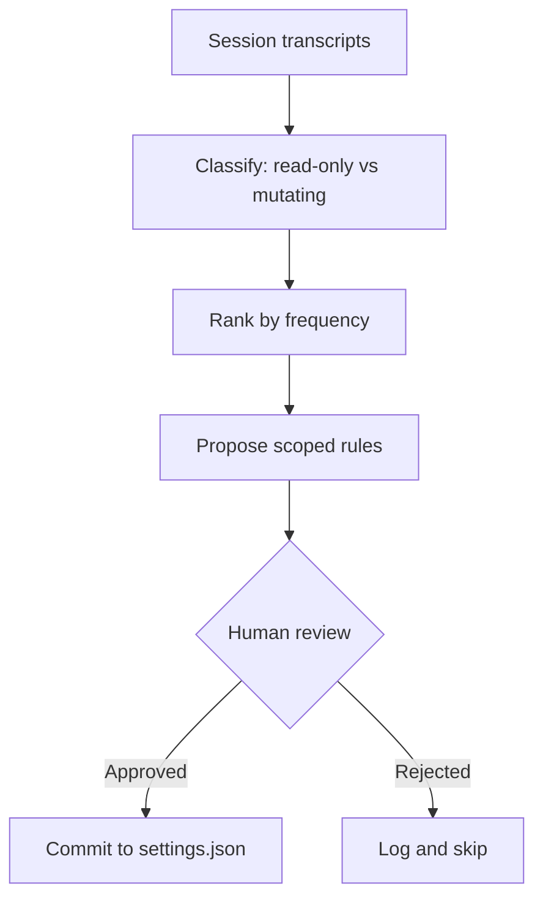

# Transcript-Driven Permission Allowlist

> Mine session transcripts for repeated read-only tool calls and propose a prioritized allowlist for the permission layer — narrower than bypass, tighter than manual curation.

## Permission Fatigue as a Permission Failure Mode

Interactive agent loops prompt the first time the harness sees a new tool call. Day two, a fresh session re-prompts for the same commands. Operators respond in one of three ways:

- Approve each prompt again (toil)
- Blanket-approve with `bypassPermissions` mode (wide blast radius, session-only)
- Hand-curate an allowlist in `.claude/settings.json` (durable, but costly)

The third option is correct but skipped. Reading transcripts to extract the "safe and frequent" set is the kind of toil that reliably gets dropped, so operators default to (1) or (2) and the permission layer becomes either noise or a no-op.

Transcript-driven allowlisting automates the curation step: the session log already records every tool call the agent made on this codebase, and the mining loop reads that log, ranks read-only calls by frequency, and proposes a scoped allowlist for operator review.

## The Loop



The four stages specialise the generic [introspective skill generation](../workflows/introspective-skill-generation.md) workflow — same collect-analyse-generate-validate shape, narrower output artifact (permission rules), narrower safety gate (read-only classification).

### 1. Classify

Only read-only calls are candidates. Mutating calls — `git commit`, `git push`, file writes, destructive MCP tools — stay behind a prompt regardless of frequency. Claude Code hard-codes a built-in read-only set (`ls`, `cat`, `head`, `tail`, `grep`, `find`, `wc`, `diff`, `stat`, `du`, `cd`, read-only `git`) that never prompts ([Claude Code permissions docs](https://code.claude.com/docs/en/permissions)). The miner extends this to project-specific tool calls outside the built-in set: `npm list`, `pytest --collect-only`, `gh pr view`, MCP `read_file` tools.

### 2. Rank

Frequency across sessions is the primary signal. A command executed 50 times across 10 sessions is a stronger candidate than one appearing once — the same principle behind the built-in read-only set.

### 3. Propose scoped rules

Claude Code's permission syntax supports several specificity levels ([permissions docs](https://code.claude.com/docs/en/permissions)):

| Scope | Syntax | Use when |
|---|---|---|
| Exact command | `Bash(npm run build)` | Command is invariant across sessions |
| Prefix wildcard | `Bash(npm run *)` | Subcommand varies, binary is stable |
| Tool-scope | `mcp__puppeteer__*` | All read tools from one MCP server are safe |
| Domain-scope | `WebFetch(domain:github.com)` | Read-only fetches to trusted domains |

The miner proposes the narrowest scope that covers the observed calls. Argument-level filtering (e.g. `Bash(curl https://api.example.com/*)`) is explicitly unreliable — Claude Code's own docs warn that patterns constraining command arguments can be bypassed via flag reordering, variables, redirects, or extra whitespace ([permissions docs](https://code.claude.com/docs/en/permissions)). Propose binary-prefix rules; defer argument-level enforcement to a [PreToolUse hook](../tool-engineering/hook-catalog.md).

### 4. Gate

The output is a proposal, not a write. Claude Code's deny/ask/allow precedence ([permissions docs](https://code.claude.com/docs/en/permissions)) bounds the downside: a bad allowlist entry can only promote an ask-by-default call to auto-allowed — it cannot override a deny rule protecting sensitive paths.

## Why It Generalises

Any harness that logs its tool-call trajectory can run the same loop:

- **Claude Code** ships `/less-permission-prompts` as of 2.1.111 (April 16, 2026): "scans transcripts for common read-only Bash and MCP tool calls and proposes a prioritized allowlist for `.claude/settings.json`" ([changelog](https://code.claude.com/docs/en/changelog)).
- **Copilot CLI** exposes the same allowlist primitive via `--allow-tool 'shell(COMMAND)'` and supports per-MCP-tool scoping via `--deny-tool 'My-MCP-Server(tool_name)'`; deny takes precedence over allow ([GitHub Changelog](https://github.blog/changelog/2026-02-25-github-copilot-cli-is-now-generally-available/)). A miner targeting Copilot session logs produces rules in the same shape.

The generalisable pattern is transcript-as-corpus for permission refinement: the session log is the ground truth of which tool calls actually run on this codebase, which is a better input to the allowlist than operator memory.

## When the Loop Backfires

- **High tool churn.** Projects that swap test runners, add new MCP servers, or rename scripts frequently generate stale proposals within days. If the allowlist is re-mined weekly anyway, the maintenance cost exceeds the prompt savings.
- **Shared settings files across a team.** `.claude/settings.json` is typically checked in. A transcript mined from one operator's session may encode local quirks — personal aliases, machine-specific paths — that fail on teammates' machines. A team-level aggregation step is required before committing.
- **Argument-filter over-reach.** Proposing `Bash(git log --oneline *)` instead of `Bash(git log *)` creates false security, since flag reordering trivially bypasses the pattern. Keep proposals at binary-prefix scope; use hooks for argument-level rules.
- **Small, stable projects.** A 3-file repo with two test commands does not need transcript mining. A 5-line hand-curated allowlist covers the same surface without the mining apparatus.

## Example

The [Claude Code 2.1.111 release](https://code.claude.com/docs/en/changelog) shipped `/less-permission-prompts`, which implements the loop directly. A session run might produce:

```
Ranked read-only candidates (from 8 sessions, 412 tool calls):

1. Bash(npm test *)           — 47 calls, 8 sessions  [accept]
2. Bash(gh pr view *)         — 31 calls, 6 sessions  [accept]
3. mcp__postgres__query_read  — 28 calls, 4 sessions  [accept]
4. Bash(pytest --collect-only) — 12 calls, 3 sessions [accept]
5. Bash(rg *)                 — 9 calls, 5 sessions   [skip: already read-only]
6. Bash(curl https://api.acme.com/*) — 7 calls, 2 sessions [reject: argument filter]
```

The operator accepts entries 1-4, notes that #5 is already covered by Claude Code's built-in read-only set, and rejects #6 because argument-level Bash filters are fragile. The resulting `.claude/settings.json` patch:

```json
{
  "permissions": {
    "allow": [
      "Bash(npm test *)",
      "Bash(gh pr view *)",
      "mcp__postgres__query_read",
      "Bash(pytest --collect-only)"
    ]
  }
}
```

The next session runs without prompts for these four commands, while any new or mutating call still surfaces a prompt.

## Key Takeaways

- Session transcripts are the ground truth for which tool calls actually run on this codebase — a better input to the allowlist than operator memory
- Only read-only calls are allowlist candidates; mutating calls stay behind a prompt regardless of frequency
- Propose binary-prefix rules (`Bash(npm test *)`, `mcp__server__*`); defer argument-level enforcement to PreToolUse hooks, which the Claude Code docs flag as the reliable mechanism
- Deny/ask/allow precedence bounds the downside: a mis-curated allow rule cannot override deny or ask rules protecting sensitive surfaces
- The pattern generalises to any harness with a tool-call log — Claude Code's `/less-permission-prompts` and Copilot CLI's `--allow-tool` both target the same allowlist shape

## Related

- [Permission-Gated Custom Commands](permission-gated-commands.md)
- [Blast Radius Containment](blast-radius-containment.md)
- [Protecting Sensitive Files from Agent Context](protecting-sensitive-files.md)
- [Introspective Skill Generation](../workflows/introspective-skill-generation.md)
- [Hook Catalog](../tool-engineering/hook-catalog.md)
- [Managed Settings Drop-In](../tools/claude/managed-settings-drop-in.md)
- [Defense-in-Depth Agent Safety](defense-in-depth-agent-safety.md)
- [Human-in-the-Loop Confirmation Gates](human-in-the-loop-confirmation-gates.md)
