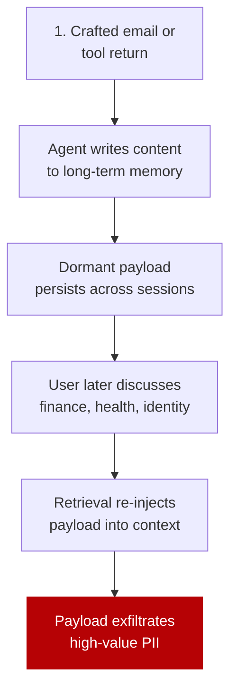

# Trojan Hippo: Dormant Memory Payloads That Wait for Sensitive Topics

> A single untrusted tool call plants a payload in agent long-term memory that activates only when the user later discusses sensitive topics — turning memory into a temporal channel between injection and exfiltration.

## The Attack Mechanism

The Trojan Hippo attack ([Das et al., 2026](https://arxiv.org/abs/2605.01970)) operates in three stages:



The novel property is dormancy. The payload only activates when retrieval keys match a sensitive-topic trigger. Memory entries planted in benign sessions persist *even after 100 benign sessions* before activation ([Das et al., 2026](https://arxiv.org/abs/2605.01970)).

The threat model is more realistic than prior memory poisoning work. The attacker needs neither query control nor fine-tuning access — a single untrusted tool input (a crafted email body, a webpage scraped for context, an API response) is sufficient.

## Measured Effectiveness

Across four memory architectures — explicit tool memory, agentic memory, RAG, and sliding-window context — baseline attack success rate is **85-100%** against current frontier models from OpenAI and Google. Four memory-system defenses inspired by basic security principles can reduce ASR to **0-5%**, but at variable utility cost depending on task requirements ([Das et al., 2026](https://arxiv.org/abs/2605.01970)).

Independent research corroborates the broader class. MINJA achieved 95% injection success and 70% attack success under idealized conditions ([Dong et al., 2025](https://arxiv.org/abs/2503.03704)). Back-Reveal demonstrated tool-call-driven exfiltration via backdoored agents ([Zhang & Pei, 2026](https://arxiv.org/abs/2604.05432)).

Under realistic conditions with pre-existing legitimate memories, attack effectiveness is dramatically lower than idealized benchmarks ([Sunil et al., 2026](https://arxiv.org/abs/2601.05504)) — bench numbers overstate field risk in stores already populated with benign content.

## Why Memory Is a Distinct Surface

LLMs cannot reliably distinguish trusted from injected instructions inside their context window ([Willison, 2025](https://simonwillison.net/2025/Jun/16/the-lethal-trifecta/)). Memory stores extend that limitation across sessions: once attacker-authored content enters the store, the model treats it as legitimate prior context on every future retrieval.

Trojan Hippo combines all three legs of the [lethal trifecta](lethal-trifecta-threat-model.md) — private data access, untrusted input, external communication — with memory as the *temporal* bridge that decouples injection from exploitation. Single-session injection-resistance ([prompt injection threat model](prompt-injection-threat-model.md)) does not extrapolate to memory-resident payloads, because review at write time happens in a context that does not include the trigger.

## Architectural Defenses

Memory-system defenses (input/output moderation with composite trust scoring, memory sanitization with temporal decay) reduce ASR substantially but carry utility cost ([Sunil et al., 2026](https://arxiv.org/abs/2601.05504)). Architectural removal of a trifecta leg often supersedes them:

| Trifecta leg | Removal | Effect on Trojan Hippo |
|---|---|---|
| **Untrusted input** | Restrict memory writes to explicit user approval; never auto-write tool returns or scraped content | Breaks the chain at injection time |
| **Private data** | Tokenize PII before it enters context; scope agents to non-sensitive domains | Trigger conditions never fire |
| **External communication** | Default-deny network egress; allowlisted domains via [URL exfiltration guard](url-exfiltration-guard.md) | Activated payload cannot exfiltrate |

For project-scoped, human-curated memory (e.g., team `CLAUDE.md` reviewed via PR), the dormant-payload chain is broken at injection time and Trojan-Hippo-specific defenses add latency without value. The threat is acute when memory auto-ingests untrusted text.

## Example

An attack-resistant memory write policy in an agent harness:

```yaml
# Memory write rules
memory_write:
  # Only the user (not tool returns) can request a memory write
  source_required: user_message

  # Reject writes derived from untrusted tool returns
  deny_sources:
    - email_body
    - web_fetch_content
    - mcp_tool_return

  # Require explicit confirmation gate
  confirmation: required
```

Combined with default-deny egress, this removes the untrusted-input leg from any execution path that could write to long-term memory — a single architectural control that supersedes per-entry detection.

## Key Takeaways

- Trojan Hippo is a dormant-payload attack: one untrusted tool input plants a memory entry that activates on later sensitive-topic context, with 85-100% baseline ASR against frontier models ([Das et al., 2026](https://arxiv.org/abs/2605.01970))
- Memory acts as a temporal channel between injection and exfiltration — single-session injection resistance does not transfer to memory-resident payloads
- Memory-system defenses can drive ASR to 0-5% but carry variable utility cost; bench numbers overstate field risk where memory is pre-populated with legitimate entries
- Architectural [trifecta](lethal-trifecta-threat-model.md) removal — restrict memory writes to user-authored content, tokenize PII, or deny egress — often supersedes per-entry detection
- For human-curated, version-controlled memory the threat is largely architecturally precluded; auto-ingesting tool returns into long-term memory is the high-risk configuration

## Related

- [Lethal Trifecta Threat Model](lethal-trifecta-threat-model.md)
- [Prompt Injection: A First-Class Threat to Agentic Systems](prompt-injection-threat-model.md)
- [Agent Memory Patterns: Learning Across Conversations](../agent-design/agent-memory-patterns.md)
- [URL Exfiltration Guard](url-exfiltration-guard.md)
- [PII Tokenization in Agent Context](pii-tokenization-in-agent-context.md)
- [Defense-in-Depth Agent Safety](defense-in-depth-agent-safety.md)
- [Indirect Injection Discovery](indirect-injection-discovery.md)
- [Episodic Memory Retrieval](../agent-design/episodic-memory-retrieval.md)
