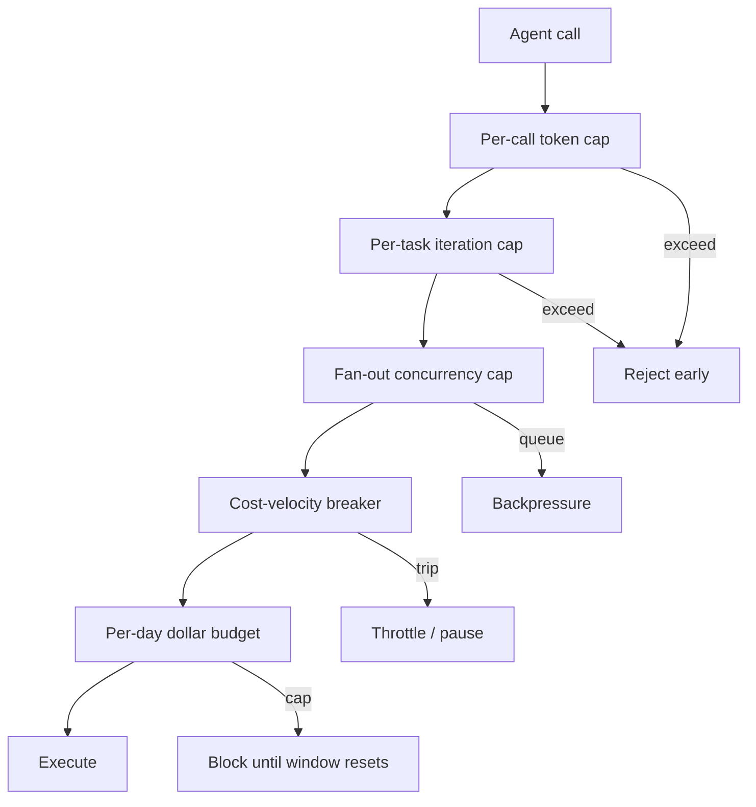

# Unbounded Consumption: Bounding Agent Resource Use Against DoS and Denial-of-Wallet

> Agent harnesses bind DoS and denial-of-wallet to one control surface — per-call, per-task, concurrency, velocity, and budget bounds — that no single layer covers alone.

Learn it hands-on: [The Bill Is the Attack](https://learn.agentpatterns.ai/security/the-bill-is-the-attack/) — guided lesson with quizzes.

## The threat

OWASP LLM10:2025 'Unbounded Consumption' names four sub-classes the same harness can produce ([OWASP LLM10:2025 mirror](https://github.com/microsoft/hve-core/blob/main/.github/skills/security/owasp-llm/references/10-unbounded-consumption.md)):

| Sub-class | Mechanism | Owner |
|-----------|-----------|-------|
| Variable-length input | Oversized input drives CPU/memory load until the service degrades | Availability |
| Denial of wallet | Attacker drives token consumption on a pay-per-use account; service stays up, bill drains | Finance |
| Resource amplification | Crafted input triggers the model's most expensive paths (long output, tool chains) | Both |
| Model replication | API access used to mint synthetic training data for a derivative model | Product/legal |

The first three share a structural feature: an LLM call's cost is variable and attacker-influenceable (input length, output length, tool-chain depth), priced linearly. The same retry loop that drains the wallet can also exhaust a rate-shared backend. Bounding it is a security control, not a finance preference.

Sysdig's LLMjacking research documented up to $46,000/day against AWS Bedrock at peak (Claude 2.x; up to 3x for Opus), with 85,000 Bedrock requests including 61,000 in a single 3-hour window ([Sysdig](https://www.sysdig.com/blog/growing-dangers-of-llmjacking)). A stolen Google Gemini API key produced $82,000 in 48 hours in March 2026 ([Truefoundry, 2026](https://www.truefoundry.com/blog/rate-limiting-ai-agents-preventing-llm-api-exhaustion)). Both applications looked healthy — DoS detection (latency, error rate) registered nothing.

## The five bounds

No single layer covers the full cost dimension. Each bound closes a failure mode the others miss:

| Bound | What it caps | What it misses alone |
|-------|--------------|----------------------|
| Per-call token cap (`max_tokens`) | One model call's output size | Multi-call tool chains; expensive inputs |
| Per-task iteration cap | Agent loop depth (e.g. LangChain `max_iterations=15`) | Cost variance per iteration; cheap-loop-but-expensive-call combinations |
| Fan-out concurrency cap | Parallel sub-agent or batch breadth | Sequential expense; long-running serial chains |
| Cost-velocity breaker | Rolling-average dollars/min per principal | Pre-existing baseline; first-time-expensive workloads |
| Per-day dollar budget | Absolute spend ceiling per (user, repo, model) | Within-day burst windows (3-hour Bedrock attack finishes before daily alarms) |

LangChain's `AgentExecutor` ships `max_iterations=15` and supports `max_execution_time` (seconds) ([LangChain docs](https://python.langchain.com/v0.1/docs/modules/agents/how_to/max_iterations/)), but the iteration cap is blind to per-step cost: a fast agent can burn 10 iterations in 8 seconds, and the iteration cap does not "track token spend, don't distinguish between a cheap and an expensive iteration, and can't enforce a daily dollar budget" ([Truefoundry, 2026](https://www.truefoundry.com/blog/rate-limiting-ai-agents-preventing-llm-api-exhaustion)). The five bounds are complementary by design.

### Bounds routing



## Why it works

LLM calls have variable, attacker-influenceable cost, priced linearly. Requests-per-second does not bind dollars-per-second when one request costs $0.001 and the next $0.50 ([Pignati, 2026](https://medium.com/@alessandro.pignati/ai-agent-rate-limiting-is-broken-7eacc83a4129)). The unit the bound keys on also matters. Vercel reports its docs chat hit ~1,300 requests/minute, a ~10x spike, on Claude Haiku 4.5 driven through residential proxies, an inference-theft attack that per-request BotID gating stopped where session-level limits would have missed the distributed, per-request abuse ([Protecting against token theft](https://vercel.com/blog/protecting-against-token-theft)). The five-bound surface works because each bound expresses a different unit of cost (tokens, iterations, parallelism, velocity, dollars) and the union covers what no single unit captures. OWASP LLM10 makes the routing explicit: the same bounds serve availability and finance owners without duplicating enforcement ([OWASP LLM10:2025](https://github.com/microsoft/hve-core/blob/main/.github/skills/security/owasp-llm/references/10-unbounded-consumption.md); [Truefoundry, 2026](https://www.truefoundry.com/blog/rate-limiting-ai-agents-preventing-llm-api-exhaustion)).

## When this backfires

The bounds add real cost (config surface, false-positive risk, debugging difficulty). Five conditions invert the trade-off:

- Single-shot or batch-of-one agents — a CLI one-shot summarizer has no loop to bound and no fan-out to throttle, so `max_iterations=15` is unused machinery. The bounds pay off only across repeated invocations.
- Trusted internal-only deployments — when callers are first-party services behind authn, the denial-of-wallet vector collapses, and infra-level rate limits already cover availability. Avoid duplicating controls.
- Fixed thresholds without cost-velocity telemetry — "100 calls/min" misses the 'Continual Inconspicuous DoW' pattern (low and slow over hours), which is "difficult to distinguish from legitimate traffic patterns" ([arxiv:2508.19284](https://arxiv.org/html/2508.19284v1)). It also over-triggers on legitimate bursty workflows: a document-summarization task that does file retrieval, chunking, three LLM calls, and storage will trip a tight bucket, so "one rogue script blocks all the user's legitimate work, including the work they need to debug the rogue script" ([Pignati, 2026](https://medium.com/@alessandro.pignati/ai-agent-rate-limiting-is-broken-7eacc83a4129)). Tuple-keyed limits on `(user, repo, model)` plus rolling-average velocity beat fixed absolutes.
- Tool-chain amplification outside the model's token counter — per-call `max_tokens` does not see chains. arxiv:2601.10955 demonstrates 658x cost amplification and trajectories exceeding 60,000 tokens against a model with a 4K per-call cap, by manipulating tool responses to coerce verbose multi-turn chains ([arxiv:2601.10955](https://arxiv.org/abs/2601.10955)). The per-task and cost-velocity bounds are the chain-level controls; per-call caps alone are blind.
- Bounds enforced by brittle classifiers — when an LLM-based safeguard sits in the bounding path, the safeguard itself becomes a DoS vector. A 30-character adversarial suffix universally blocks over 97% of legitimate requests on Llama Guard 3 ([arxiv:2410.02916](https://arxiv.org/html/2410.02916v3)). Deterministic counters (tokens, iterations, dollars) belong in the enforcement path; semantic checks belong in detection only.

## Example

A multi-tenant agent platform that runs Claude-Code-style sub-agents per repository wires the five bounds as follows (illustrative composition drawn from [Truefoundry's three-layer gateway, 2026](https://www.truefoundry.com/blog/rate-limiting-ai-agents-preventing-llm-api-exhaustion)):

```yaml
# Per (user, repo, model) — not per user — so one runaway repo
# does not block the user's other work
limits:
  per_call_max_tokens: 8192
  per_task_max_iterations: 15
  per_task_max_seconds: 300
  fan_out_concurrency: 4
  cost_velocity:
    window_minutes: 5
    multiplier_over_rolling_avg: 8
    action: pause
  per_day_dollar_budget:
    claude_sonnet: 50.00
    claude_opus: 200.00
    on_exhaust: block_until_window
```

Each bound's failure case is named: per-call cap catches a runaway prompt, iteration cap catches a tool-call loop, fan-out cap caps a parallel-spawn injection, velocity breaker catches the unprecedented-cost spike, dollar budget is the daily backstop. Removing any one leaves a documented amplification path open.

## Key Takeaways

- OWASP LLM10:2025 makes DoS and denial-of-wallet a same-surface, two-owner concern — the same bounds serve both threat models.
- No single bound covers the cost dimension; per-call, per-task, fan-out, cost-velocity, and per-day budget are complementary by design.
- Real incidents reach $46K/day and $82K/48hr ranges before any per-application detection fires; the 3-hour attack window finishes before daily billing alarms.
- Tool-chain amplification (658x in arxiv:2601.10955) routes around per-call token caps; chain-level bounds (iteration, velocity) are the structural control.
- Fixed RPS limits with single-bucket keying break legitimate workflows and miss low-and-slow DoW; tuple-keyed on `(user, repo, model)` with rolling-average velocity is the working shape.

## Related

- [Agent Circuit Breaker](../patterns/agent-design/agent-circuit-breaker.md) — tool-level recovery state machine; complements the loop-level and budget-level bounds on this page
- [Security Budget as Token Economics](security-budget-token-economics.md) — pre-release audit sizing under the same cost-economics frame
- [Loop Detection](../observability/loop-detection.md) — observability signal that feeds the per-task iteration cap
- [Blast Radius Containment: Least Privilege for AI Agents](blast-radius-containment.md) — complementary control axis; bounds cap *consumption* while least-privilege caps *reach*
