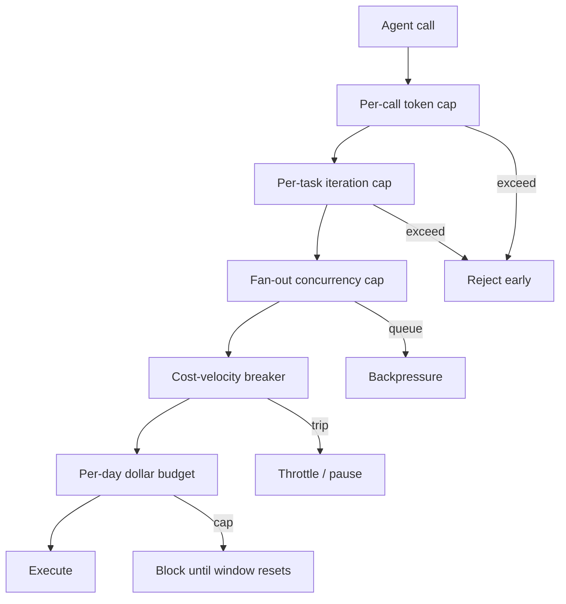

# Unbounded Consumption: Bounding Agent Resource Use Against DoS and Denial-of-Wallet

> Agent harnesses bind DoS and denial-of-wallet to one control surface — per-call, per-task, concurrency, velocity, and budget bounds — that no single layer covers alone.

Learn it hands-on: [The Bill Is the Attack](https://learn.agentpatterns.ai/security/the-bill-is-the-attack/) — guided lesson with quizzes.

## The threat

OWASP LLM10:2025 'Unbounded Consumption' names four sub-classes the same harness can produce ([OWASP LLM10:2025 mirror](https://github.com/microsoft/hve-core/blob/main/.github/skills/security/owasp-llm/references/10-unbounded-consumption.md)):

| Sub-class | Mechanism | Owner |
|-----------|-----------|-------|
| Variable-length input | Oversized input drives CPU/memory load until the service degrades | Availability |
| Denial of wallet | Attacker drives token consumption on a pay-per-use account; service stays up, bill drains | Finance |
| Resource amplification | Crafted input triggers the model's most expensive paths (long output, tool chains) | Both |
| Model replication | API access used to mint synthetic training data for a derivative model | Product/legal |

The first three share a structural feature: an LLM call's cost is variable and attacker-influenceable (input length, output length, tool-chain depth), priced linearly. The same retry loop that drains the wallet can also exhaust a rate-shared backend. Bounding it is a security control, not a finance preference.

Sysdig's LLMjacking research documented up to $46,000/day against AWS Bedrock at peak (Claude 2.x; up to 3x for Opus), with 85,000 Bedrock requests including 61,000 in a single 3-hour window ([Sysdig](https://www.sysdig.com/blog/growing-dangers-of-llmjacking)). A stolen Google Gemini API key produced $82,000 in 48 hours in March 2026 ([Truefoundry, 2026](https://www.truefoundry.com/blog/rate-limiting-ai-agents-preventing-llm-api-exhaustion)). Both applications looked healthy — DoS detection (latency, error rate) registered nothing.

## The six bounds

No single layer covers the full cost dimension. Each bound closes a failure mode the others miss:

| Bound | What it caps | What it misses alone |
|-------|--------------|----------------------|
| Per-call token cap (`max_tokens`) | One model call's output size | Multi-call tool chains; expensive inputs |
| Per-task iteration cap | Agent loop depth (e.g. LangChain `max_iterations=15`) | Cost variance per iteration; cheap-loop-but-expensive-call combinations |
| Fan-out concurrency cap | Parallel sub-agent or batch breadth | Sequential expense; long-running serial chains |
| Cost-velocity breaker | Rolling-average dollars/min per principal | Pre-existing baseline; first-time-expensive workloads |
| Per-day dollar budget | Absolute spend ceiling per (user, repo, model) | Within-day burst windows (3-hour Bedrock attack finishes before daily alarms) |
| Growth-rate check (D2) | Rate of growth in reingested tool-return tokens across turns | Absolute session spend; still needs the per-day dollar bound to cap total cost |

LangChain's `AgentExecutor` ships `max_iterations=15` and supports `max_execution_time` (seconds) ([LangChain docs](https://python.langchain.com/v0.1/docs/modules/agents/how_to/max_iterations/)), but the iteration cap is blind to per-step cost: a fast agent can burn 10 iterations in 8 seconds, and the iteration cap does not "track token spend, don't distinguish between a cheap and an expensive iteration, and can't enforce a daily dollar budget" ([Truefoundry, 2026](https://www.truefoundry.com/blog/rate-limiting-ai-agents-preventing-llm-api-exhaustion)). The six bounds are complementary by design; the last one is new and gets its own section below.

### Bounds routing


```mermaid
graph TD
    A[Agent call] --> B[Per-call token cap]
    B --> C[Per-task iteration cap]
    C --> D[Fan-out concurrency cap]
    D --> E[Cost-velocity breaker]
    E --> F[Per-day dollar budget]
    F --> G[Execute]
    B -->|exceed| X[Reject early]
    C -->|exceed| X
    D -->|queue| Q[Backpressure]
    E -->|trip| Y[Throttle / pause]
    F -->|cap| Z[Block until window resets]
```

## Retained tool returns as a re-billing path

This path applies only when an agent calls a third-party or otherwise untrusted tool and the account pays per token. Drop either condition and the check below adds cost with nothing to catch: a fully trusted toolset never meets the threat model, and a flat-rate plan turns overrun into a rate-limit problem, not a bill ([arxiv:2609.28585v1](https://arxiv.org/abs/2609.28585v1), section 2.2).

A host agent resends the full conversation, tool returns included, on every model call, and the provider bills each of those tokens again each time. "When a runtime carries an external tool return into later model inputs, providers meter it again" ([arxiv:2609.28585v1](https://arxiv.org/abs/2609.28585v1), Abstract). One retained return keeps earning spending authority on every later call, and semantic checks miss the attack because a malicious return still passes as schema-valid and topically plausible ([arxiv:2609.28585v1](https://arxiv.org/abs/2609.28585v1), sections 1, 4.1, 9.2). The attacker needs no victim credentials, filesystem access, or local runtime privilege, only control of one tool endpoint the agent already calls, such as a compromised MCP server ([arxiv:2609.28585v1](https://arxiv.org/abs/2609.28585v1), section 2.2).

The cost shows up before any attack happens. A 2026 preprint measured cache-aware session cost on 12 held-out tasks that needed an earlier tool result later in the run. Full retention cost 35.9% more than dropping history and 30.0% more than compressing it on Mistral, and 22.3% and 21.2% more on Groq ([arxiv:2609.28585v1](https://arxiv.org/abs/2609.28585v1), section 6.3). Those numbers cover only persistent-return tasks on Groq and Mistral: the paper ran no Anthropic or Google model, and Anthropic's own cache pricing rebills a cached tool result at a tenth of the base rate, so a Claude deployment likely pays less than this figure implies ([Anthropic prompt caching](https://platform.claude.com/docs/en/build-with-claude/prompt-caching)).

Under attack, the same mechanism scales further. Across 243 executions on GPT-4o, GPT-4o-mini, Mistral-Large, Llama-3.3-70B, Nemotron-120B, and Qwen-3-235B, one worst-case session reached 14,293 times its own first-call input size, and neither Claude nor Gemini was part of the test ([arxiv:2609.28585v1](https://arxiv.org/abs/2609.28585v1), Abstract). In that cohort, 51 of 69 priced attack sessions crossed a $0.10 circuit-breaker threshold that the largest benign session never approached, staying at $0.025 ([arxiv:2609.28585v1](https://arxiv.org/abs/2609.28585v1), section 6.1). Slow, stealthy payloads outlast loud ones: on Llama-3.3-70B, direct attacks ended within two turns at a 22.6x cost multiplier, while stealth and adaptive variants survived longer and reached 385.7x and 117.0x ([arxiv:2609.28585v1](https://arxiv.org/abs/2609.28585v1), section 6.2).

The paper's fix runs four checks on the host before it sends the next request: a token-mass cap, a growth-rate check, a limit on recursive tool opportunity, and a cumulative-dollar cap ([arxiv:2609.28585v1](https://arxiv.org/abs/2609.28585v1), section 7). The growth-rate check, the sixth bound in the table above, does most of the early catching: removing it delays detection from turn 2 to turns 4 through 6 on most attack variants and lets 4.2 to 14.7 times more data leak out first, while it fires on only 2 of 1,050 benign runs ([arxiv:2609.28585v1](https://arxiv.org/abs/2609.28585v1), sections 8.2, 8.3). A fixed session cap breaks long legitimate work: a frozen version of the recursion limit stopped every one of 60 completed 8-to-12-step workflows at turn 6, so release extra budget only after the host verifies real progress, not on the model's or tool's own say-so ([arxiv:2609.28585v1](https://arxiv.org/abs/2609.28585v1), section 8.4). Under that progress-gated policy, one tested provider pair finished 22 of 24 workflows against 13 of 24 for the fixed cap, though at a higher mean cost per session and with the other three checks turned off ([arxiv:2609.28585v1](https://arxiv.org/abs/2609.28585v1), section 8.4).

Do not drop history to save money: dropping earlier tool returns cut task success to 2 of 12, against at least 10 of 12 for keeping or compressing it ([arxiv:2609.28585v1](https://arxiv.org/abs/2609.28585v1), section 6.3). [Observation masking](../context-engineering/observation-masking.md) and [half-life truncation](../context-engineering/half-life-tool-result-truncation.md) reach the same compress-not-drop conclusion on different benchmarks. One SWE-bench study found that masking roughly halved cost against the raw, unmasked agent while matching or slightly beating the solve rate of LLM-based summarization ([arXiv 2508.21433v3](https://arxiv.org/abs/2508.21433v3)). That task set did not specifically need the dropped history back later, so the two results disagree less than they first appear to. Compressing has its own cost on Anthropic models: clearing or rewriting tool results invalidates the [cached prefix](../context-engineering/prompt-caching-architectural-discipline.md) that follows, so each pass pays for a fresh, uncached write ([Anthropic context editing](https://platform.claude.com/docs/en/build-with-claude/context-editing)).

A per-return output cap is not the same control. [MCP server design](../tool-engineering/mcp-server-design.md) practice already limits one return's size: Claude Code defaults to 25,000 tokens and persists anything larger to disk. A server can still raise its own ceiling to 500,000 characters through the `anthropic/maxResultSizeChars` annotation, and neither number tracks how many returns have piled up across a session ([Claude Code MCP docs](https://code.claude.com/docs/en/mcp#mcp-output-limits-and-warnings)). This is the coding-agent manifestation of the same OWASP LLM10:2025 sub-class named at the top of this page; see the [OWASP LLM10:2025 crosswalk](owasp-llm-top-10-2025-agent-crosswalk.md) for how it maps against the rest of the OWASP list. The fix is also rare. Of 3,830 scanned public MCP server and transport repositories, only 71 expose any code-visible safeguard, and none cover all four checks; the scan reads code, not runtime behavior ([arxiv:2609.28585v1](https://arxiv.org/abs/2609.28585v1), Abstract). Do not copy the paper's own threshold values into a deployment: derive limits from your own policy, and never let a lower-privilege caller enlarge a budget a higher one set ([arxiv:2609.28585v1](https://arxiv.org/abs/2609.28585v1), section 9.4).

## Why it works

LLM calls have variable, attacker-influenceable cost, priced linearly. Requests-per-second does not bind dollars-per-second when one request costs $0.001 and the next $0.50 ([Pignati, 2026](https://medium.com/@alessandro.pignati/ai-agent-rate-limiting-is-broken-7eacc83a4129)). The unit the bound keys on also matters. Vercel reports its docs chat hit ~1,300 requests/minute, a ~10x spike, on Claude Haiku 4.5 driven through residential proxies, an inference-theft attack that per-request BotID gating stopped where session-level limits would have missed the distributed, per-request abuse ([Protecting against token theft](https://vercel.com/blog/protecting-against-token-theft)). The six-bound surface works because each bound expresses a different unit of cost (tokens, iterations, parallelism, velocity, dollars, growth rate) and the union covers what no single unit captures. OWASP LLM10 makes the routing explicit: the same bounds serve availability and finance owners without duplicating enforcement ([OWASP LLM10:2025](https://github.com/microsoft/hve-core/blob/main/.github/skills/security/owasp-llm/references/10-unbounded-consumption.md); [Truefoundry, 2026](https://www.truefoundry.com/blog/rate-limiting-ai-agents-preventing-llm-api-exhaustion)).

## When this backfires

The bounds add real cost (config surface, false-positive risk, debugging difficulty). Five conditions invert the trade-off:

- Single-shot or batch-of-one agents — a CLI one-shot summarizer has no loop to bound and no fan-out to throttle, so `max_iterations=15` is unused machinery. The bounds pay off only across repeated invocations.
- Trusted internal-only deployments — when callers are first-party services behind authn, the denial-of-wallet vector collapses, and infra-level rate limits already cover availability. Avoid duplicating controls.
- Fixed thresholds without cost-velocity telemetry — "100 calls/min" misses the 'Continual Inconspicuous DoW' pattern (low and slow over hours), which is "difficult to distinguish from legitimate traffic patterns" ([arxiv:2508.19284](https://arxiv.org/html/2508.19284v1)). It also over-triggers on legitimate bursty workflows: a document-summarization task that does file retrieval, chunking, three LLM calls, and storage will trip a tight bucket, so "one rogue script blocks all the user's legitimate work, including the work they need to debug the rogue script" ([Pignati, 2026](https://medium.com/@alessandro.pignati/ai-agent-rate-limiting-is-broken-7eacc83a4129)). Tuple-keyed limits on `(user, repo, model)` plus rolling-average velocity beat fixed absolutes.
- Tool-chain amplification outside the model's token counter — per-call `max_tokens` does not see chains. arxiv:2601.10955 demonstrates 658x cost amplification and trajectories exceeding 60,000 tokens against a model with a 4K per-call cap, by manipulating tool responses to coerce verbose multi-turn chains ([arxiv:2601.10955](https://arxiv.org/abs/2601.10955v2)). The per-task and cost-velocity bounds are the chain-level controls; per-call caps alone are blind.
- Bounds enforced by brittle classifiers — when an LLM-based safeguard sits in the bounding path, the safeguard itself becomes a DoS vector. A 30-character adversarial suffix universally blocks over 97% of legitimate requests on Llama Guard 3 ([arxiv:2410.02916](https://arxiv.org/html/2410.02916v3)). Deterministic counters (tokens, iterations, dollars) belong in the enforcement path; semantic checks belong in detection only.

## Example

A multi-tenant agent platform that runs Claude-Code-style sub-agents per repository wires the five bounds as follows (illustrative composition drawn from [Truefoundry's three-layer gateway, 2026](https://www.truefoundry.com/blog/rate-limiting-ai-agents-preventing-llm-api-exhaustion)):

```yaml
# Per (user, repo, model) — not per user — so one runaway repo
# does not block the user's other work
limits:
  per_call_max_tokens: 8192
  per_task_max_iterations: 15
  per_task_max_seconds: 300
  fan_out_concurrency: 4
  cost_velocity:
    window_minutes: 5
    multiplier_over_rolling_avg: 8
    action: pause
  per_day_dollar_budget:
    claude_sonnet: 50.00
    claude_opus: 200.00
    on_exhaust: block_until_window
```

Each bound's failure case is named: per-call cap catches a runaway prompt, iteration cap catches a tool-call loop, fan-out cap caps a parallel-spawn injection, velocity breaker catches the unprecedented-cost spike, dollar budget is the daily backstop. Removing any one leaves a documented amplification path open.

## Key Takeaways

- OWASP LLM10:2025 makes DoS and denial-of-wallet a same-surface, two-owner concern — the same bounds serve both threat models.
- No single bound covers the cost dimension; per-call, per-task, fan-out, cost-velocity, per-day budget, and growth-rate detection are complementary by design.
- Real incidents reach $46K/day and $82K/48hr ranges before any per-application detection fires; the 3-hour attack window finishes before daily billing alarms.
- Tool-chain amplification (658x in arxiv:2601.10955) routes around per-call token caps; chain-level bounds (iteration, velocity) are the structural control.
- Fixed RPS limits with single-bucket keying break legitimate workflows and miss low-and-slow DoW; tuple-keyed on `(user, repo, model)` with rolling-average velocity is the working shape.
- A retained tool return gets re-billed on every later call: on persistent-return tasks this costs 21.2% to 35.9% more than dropping or compressing history (Groq and Mistral only), and one attack session reached 14,293x its own first-call size on six non-Anthropic models.

## Related

- [Agent Circuit Breaker](../patterns/agent-design/agent-circuit-breaker.md) — tool-level recovery state machine; complements the loop-level and budget-level bounds on this page
- [Security Budget as Token Economics](security-budget-token-economics.md) — pre-release audit sizing under the same cost-economics frame
- [Loop Detection](../observability/loop-detection.md) — observability signal that feeds the per-task iteration cap
- [Blast Radius Containment: Least Privilege for AI Agents](blast-radius-containment.md) — complementary control axis; bounds cap *consumption* while least-privilege caps *reach*
- [MCP Server Design: Building Agent-Friendly Servers](../tool-engineering/mcp-server-design.md) — the per-return output cap that the growth-rate bound complements; one bounds a single result, the other bounds the session
- [OWASP LLM Top 10 (2025): Agent Security Crosswalk](owasp-llm-top-10-2025-agent-crosswalk.md) — maps the LLM10:2025 Unbounded Consumption sub-class this page's six bounds address against the rest of the OWASP list
