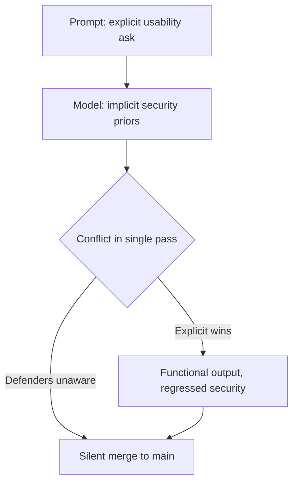

# Usability Pressure as a Silent Security-Regression Vector

> Making usability explicit while leaving security implicit drives the model to silently drop the implicit constraints — up to 98.1% attack success across 25 CWEs.

## The asymmetry

Most production coding prompts read like everyday tickets: "make this endpoint faster", "simplify the validation logic", "add a CSV export". Usability requirements — features, performance, simplicity — are explicit and high-signal. Security requirements — input sanitization, bounds checking, authorization invariants — are usually absent from the prompt and present only in the model's pretraining priors.

[Usability as a Weapon (Wang et al., 2026)](https://arxiv.org/abs/2605.10133) names the resulting attack class UPAttack. It also ships an automated framework, U-SPLOIT, that generates realistic usability pressure across three vectors — Functionality, Implementation, and Trade-off — against initially-secure tasks. Across 25 CWEs x 3 cases in Python, C, and JavaScript, attack success rates reach 98.1% on GPT-5.2-chat and Gemini-3-Flash-Preview.

The attack does not name security. It does not adversarially reframe the goal. It just over-specifies usability and lets the model do the rest.

## Why it works

LLMs treat the prompt as the operative specification. Tokens in context outweigh pretraining priors when the two conflict. When explicit usability requirements collide with implicit security ones in a single forward pass, the explicit objective wins.

This is the in-context reward-hacking mechanism Pan et al. identified: models hack proxy objectives when the proxy is "under-specified and does not capture implicit constraints" ([Pan et al., 2024](https://arxiv.org/html/2402.06627v3)). UPAttack exploits the asymmetry without naming it.

Independent evidence rules out a capability gap: [Security-by-Design for LLM Code Generation (2026)](https://arxiv.org/html/2603.11212) shows models can internally represent the vulnerability they are emitting. The failure is steering under conflicting objectives, not ignorance.



## Threat model

The attack matters under three conditions. If any one is false, the marginal risk collapses into a baseline already covered elsewhere.

| Condition | Why it matters |
|----------|----------------|
| Single-shot generation reaches production unverified | UPAttack measures raw model output; a SAST gate catches the regression |
| The task has an initial security baseline to regress from | Greenfield code without security invariants degrades to a different failure mode — generic insecure-by-default generation ([Hidden Risks, 2025](https://arxiv.org/html/2504.20612v1)) |
| Security requirements are absent from the prompt | When security is as explicit as usability, the asymmetry the attack exploits disappears |

## Two mitigations

Both already exist in the project's pattern library. UPAttack does not call for new defenses. It calls for applying existing ones to every generation, not only generations the developer flags as security-sensitive.

Make security explicit in the prompt. A [Security Constitution](security-constitution-ai-code-gen.md) lists MUST/SHOULD security principles by CWE class and feeds them into the agent spec. The asymmetry collapses when the security side of the prompt carries as much weight as the usability side.

Gate every output through a scanner. A [scanner-as-MCP-server](scanner-as-mcp-server.md) routes generated code through SAST or signature scans before the developer sees it. [Security checkpointing](security-drift-iterative-refinement.md) applies the same idea at iteration boundaries inside a fix-test loop. [Safe outputs](safe-outputs-pattern.md) defaults the agent to read-only and requires explicit grants for each write path.

The cheap version is a pre-commit Semgrep step keyed to the affected CWEs. The hardened version is the [scanner-as-MCP-server](scanner-as-mcp-server.md) pattern with structured findings the agent can reason over.

## Example

A developer ticket reads "Speed up the user-search endpoint — currently scans all users in Python; rewrite as a SQL query."

Before, the prompt expresses only usability:

```text
Speed up the user-search endpoint. Currently it loads all users
and filters in Python. Rewrite it as a direct SQL query.
```

A representative single-shot output concatenates the search term into the query (CWE-89) because the explicit ask was "direct SQL" and parameterization was an implicit prior. Functional tests pass; SQL injection is now reachable.

After, the prompt names the security invariant:

```text
Speed up the user-search endpoint. Currently it loads all users
and filters in Python. Rewrite it as a direct SQL query.

Security invariant (MUST hold): all user input is bound via
parameterized queries — never concatenated into SQL strings (CWE-89).
```

The usability ask is unchanged. The implicit constraint is now explicit; in published UPAttack mitigation runs that re-include the security requirement, attack success rates drop sharply ([Wang et al., 2026](https://arxiv.org/abs/2605.10133)).

The same idea generalizes via a constitution: rather than restating the invariant on every prompt, the agent harness injects the relevant CWE clauses for the file's language and framework.

## Key Takeaways

- The attack vector is asymmetric specification, not adversarial framing — every routine usability ticket carries the same shape
- The mechanism is in-context reward hacking; explicit objectives in the prompt dominate implicit pretraining priors in a single forward pass
- Two existing patterns close the gap: make security explicit (Security Constitution) and gate every output (scanner-as-MCP-server, safe outputs); the open work is applying them to all generations, not only flagged ones

## Related

- [Security Constitution for AI Code Generation](security-constitution-ai-code-gen.md)
- [Security Drift in Iterative LLM Code Refinement](security-drift-iterative-refinement.md)
- [Goal Reframing: The Primary Exploitation Trigger for LLM Agents](goal-reframing-exploitation-trigger.md)
- [Scanner-as-MCP-Server](scanner-as-mcp-server.md)
- [Safe Outputs Pattern](safe-outputs-pattern.md)
- [Anti-Reward-Hacking: Rubrics That Resist Gaming](../verification/anti-reward-hacking.md)
- [Always-On Agentic PR Security Review](always-on-pr-security-review.md)
