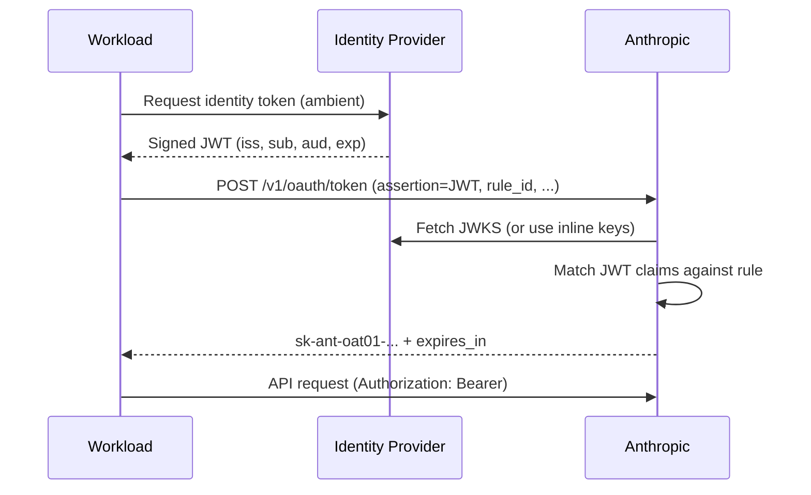

# Workload Identity Federation for Agent Runtimes

> Replace long-lived AI provider API keys with short-lived tokens minted from the runtime's existing workload identity — but the rule that decides which workloads federate is now itself a security boundary.

A static `sk-ant-...` API key is the highest-blast-radius credential on an agent runtime — leakable from logs, hooks, and transcripts, with rotation cadences that never match incident timelines. Workload Identity Federation (WIF) removes the key: the workload presents a signed OIDC JWT from an identity provider it already runs inside, and Anthropic mints a short-lived access token bound to a service account. [[Source]](https://platform.claude.com/docs/en/manage-claude/workload-identity-federation)

## The Federation Contract

Three resources express the trust contract:

| Resource | Anthropic ID | Role |
|----------|-------------|------|
| Federation issuer | `fdis_...` | Registers an OIDC provider URL plus a JWKS source (discovery, explicit URL, or inline keys) |
| Service account | `svac_...` | The non-human identity the minted token acts as; lives at the org and joins workspaces |
| Federation rule | `fdrl_...` | "When a JWT from issuer X has claims that look like Y, mint a token for service account Z with scope S" |

The workload presents its IdP-issued JWT to `POST /v1/oauth/token` using the [RFC 7523 `jwt-bearer` grant](https://www.rfc-editor.org/rfc/rfc7523), citing the rule ID. Anthropic verifies the signature against the registered JWKS, matches claims against the rule, and returns an `sk-ant-oat01-...` token scoped to the matched service account and workspace. [[Source]](https://platform.claude.com/docs/en/manage-claude/wif-reference)

## The Five Environment Variables

The Anthropic SDKs read these and perform the exchange with no constructor arguments — ship one container image, inject federation parameters per environment. [[Source]](https://platform.claude.com/docs/en/manage-claude/wif-reference)

| Variable | Required | Role |
|----------|----------|------|
| `ANTHROPIC_FEDERATION_RULE_ID` | Yes | `fdrl_...` ID of the rule to evaluate |
| `ANTHROPIC_ORGANIZATION_ID` | Yes | UUID of your Anthropic organization |
| `ANTHROPIC_SERVICE_ACCOUNT_ID` | Yes | `svac_...` ID of the target service account |
| `ANTHROPIC_IDENTITY_TOKEN_FILE` | One of `_TOKEN_FILE` or `_TOKEN` | Path to the JWT; re-read on every refresh so rotated projected tokens are picked up |
| `ANTHROPIC_WORKSPACE_ID` | Conditional | `wrkspc_...` ID; **required when the rule covers more than one workspace**. Added in Claude Code v2.1.141 (2026-05-13) as the per-exchange workspace scoping signal |

[[Source: Claude Code changelog]](https://code.claude.com/docs/en/changelog)

## Scoping Pitfalls That Widen Access

WIF replaces secret sprawl with a trust-policy design problem. The rule deciding which JWTs may act as a service account is part of the threat model. Four pitfalls recur:

**Broad `subject_prefix` matches more than intended.** On GitHub Actions, `repo:your-org/*` matches every repo and, without a `ref` constraint, accepts `pull_request` runs from forks — any external contributor opening a PR can obtain a federated token. Pin to a single repository and protected branch; add `repository_owner` under `claims` as defense in depth. [[Source]](https://platform.claude.com/docs/en/manage-claude/wif-providers/github-actions)

**Missing `audience` widens to default tokens.** On Kubernetes, `system:serviceaccount:*` matches every pod; without an `audience` matcher the rule also accepts the default-audience tokens every pod has projected. Set audience on both the rule and the pod's `serviceAccountToken` projection. [[Source]](https://platform.claude.com/docs/en/manage-claude/wif-providers/kubernetes)

**CEL conditions are now a security boundary.** Anthropic supports a [CEL](https://cel.dev/) expression for complex claim logic, but warns: "an expression that evaluates to `true` for more inputs than intended grants broader access than intended. Prefer the static matchers when they express your constraint." [[Source]](https://platform.claude.com/docs/en/manage-claude/wif-reference)

**API keys silently shadow federation during migration.** `ANTHROPIC_API_KEY` outranks the federation env vars — a leftover key in CI secrets, container env, or shell profile means the workload still authenticates statically. Worse, `ANTHROPIC_API_KEY=""` still wins. **Unset, do not blank.** Confirm with `ant auth status`. [[Source]](https://platform.claude.com/docs/en/manage-claude/workload-identity-federation)

## Token Lifetime Bounds Blast Radius

The minted token's lifetime is `min(rule.token_lifetime_seconds, 2 × JWT_remaining)` with a 60-second floor; default 3600s. The second bound prevents the Anthropic token from outliving the upstream identity. The SDK refreshes at `exp − 120s` (advisory) and `exp − 30s` (mandatory). [[Source]](https://platform.claude.com/docs/en/manage-claude/workload-identity-federation)

A leaked `sk-ant-oat01-...` expires in minutes to an hour. A leaked static key works until manual rotation, from any network the attacker controls.

## When Federation Is Not Worth the Complexity

WIF is qualified, not unconditional. A small team on a single fixed host can match the blast-radius reduction with vault-rotated keys via wrapper script ([Scoped Credentials via Proxy](scoped-credentials-proxy.md)). Federation adds three resources, a CEL expression as a security boundary, and a trust policy an unfamiliar team can mis-scope into a worse posture than a well-rotated key. The pattern earns its complexity when the runtime already has an ambient workload identity (Kubernetes service account, AWS IRSA, GitHub Actions OIDC) and multiple workloads share one provider account.

## Key Takeaways

- Static `sk-ant-...` API keys are the highest-blast-radius credential on an agent runtime; federation replaces them with tokens that expire in minutes.
- The trust contract is three resources (issuer, service account, rule); the rule's `match` block is now itself a security boundary.
- `ANTHROPIC_WORKSPACE_ID` is required only when the federation rule covers more than one workspace — added in Claude Code v2.1.141 to make per-exchange workspace scoping explicit.
- Pin `subject_prefix` narrowly, always set `audience`, prefer static matchers over CEL, and unset (do not blank) `ANTHROPIC_API_KEY` before declaring migration complete.
- Token lifetime is capped at `2 × JWT_remaining`, so a leaked federated token cannot outlive the upstream workload identity it was derived from.

## Related

- [Scoped Credentials via Proxy Outside the Agent Sandbox](scoped-credentials-proxy.md) — Complementary pattern for credential isolation when federation is not available
- [Secrets Management for Agent Workflows](secrets-management-for-agents.md) — Broader credential injection patterns for agent runtimes
- [Credential Hygiene for Agent Skill Authorship](credential-hygiene-agent-skills.md) — Keep credentials out of skill files at authoring time
- [Bootstrap Agent Commit Attribution](../agent-readiness/bootstrap-agent-commit-attribution.md) — Cryptographic signing as the attribution counterpart to federated authentication
- [Audit Secrets in Agent Context](../agent-readiness/audit-secrets-in-context.md) — Detect leftover keys that shadow federation during migration
- [Lethal Trifecta Threat Model](lethal-trifecta-threat-model.md) — Removing credentials from agent-readable surfaces closes one leg of the trifecta
