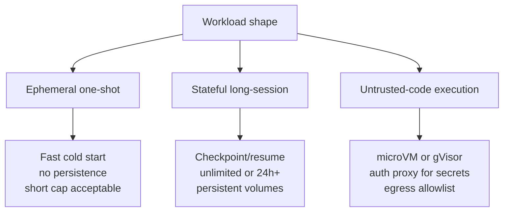

# Workload-Keyed Sandbox Selection for Agent-Generated Code

> Match sandbox features to workload shape — ephemeral, stateful, or untrusted-code — because workload type pins isolation strength and persistence.

The framework applies only when two conditions hold: the agent will run code from sources you do not fully trust, and the platform choice is still open. If the workload is trusted single-host dev code, or procurement has already chosen the vendor, skip to [when this backfires](#when-this-backfires) — workload typing over-engineers both cases.

## The two pinned axes

Sandbox platforms vary on four axes — isolation strength, persistence, per-call latency, network policy — but only two are pinned by workload shape.

| Axis | Workload-pinned? | What pins it |
|------|------------------|--------------|
| Isolation strength | Yes | Trust level of the code being executed |
| Persistence / statefulness | Yes | Session shape (ephemeral vs long-running) |
| Per-call latency | No | Cold-start budget and image-pull strategy |
| Network egress policy | No | Threat model around outbound data |

Untrusted code pins isolation strength to kernel-level. The threat is host-kernel escape via syscall — a shared-kernel container's namespace boundary is one CVE from collapse. LangChain frames the requirement: "The solution here is virtualization, meaning your sandbox runs using its own kernel separate from the one powering the machine running it" ([LangChain — How to Choose the Right Sandbox for Your Agent](https://www.langchain.com/blog/how-to-choose-the-right-sandbox-for-your-agent)). MicroVM platforms (Firecracker via e2b, Fly Sprites, Vercel Sandbox; Kata Containers via Northflank) satisfy the constraint; gVisor (Modal, Northflank) satisfies it at the user-space layer.

Long-running stateful sessions pin persistence to snapshot or checkpoint primitives, because rebuilding state on each invocation becomes the dominant cost as session length grows. Platforms expose this as Volumes (Modal), pause/resume (E2B, Blaxel), checkpoint/restore (Fly Sprites), or unlimited duration (Northflank, Blaxel) ([Modal — Best Stateful Sandboxes for Long-Running Agent Sessions in 2026](https://modal.com/resources/best-stateful-sandboxes-long-running-agent-sessions)). Ephemeral platforms cap sessions explicitly: E2B at 24 hours, Vercel Sandbox at 45 minutes to 5 hours ([Northflank — Best code execution sandbox for AI agents in 2026](https://northflank.com/blog/best-code-execution-sandbox-for-ai-agents)).

## Three workload shapes

Ephemeral one-shot. A tool call runs in seconds: code interpreter execution, a CI unit test, a data transform. Containers fit if the code is trusted; microVMs if not. Vercel Sandbox and Daytona's sub-90 ms cold start target this shape ([Northflank comparison](https://northflank.com/blog/best-code-execution-sandbox-for-ai-agents)).

Stateful long-session. An agent works on a repository for hours against a persistent filesystem. Modal (Volumes + memory snapshots), Northflank (unlimited), Blaxel (resume from standby), and Fly Sprites (checkpoint/restore) target this shape ([Modal — Stateful Sandboxes](https://modal.com/resources/best-stateful-sandboxes-long-running-agent-sessions)). Anthropic's managed-agents primitive makes the property structural by splitting Session from Sandbox ([Session Harness Sandbox Separation](../agent-design/session-harness-sandbox-separation.md)).

Untrusted-code execution. The code originates outside the team's control. The feature set adds an auth proxy that holds credentials outside the sandbox: "We also include an authorization proxy that injects secure credentials into outbound traffic after it leaves the sandbox" ([LangChain post](https://www.langchain.com/blog/how-to-choose-the-right-sandbox-for-your-agent)). The underlying threat is the [lethal trifecta](lethal-trifecta-threat-model.md) at the sandbox layer.

Real workloads often combine shapes. A stateful long-session agent running untrusted code is the common case; the feature sets stack and narrow the platform set to those exposing both (Modal, Northflank, Blaxel).

## Why It Works

Two of the four axes are step functions at workload-decision time, not continuous variables. Trust is binary at the runtime layer: the kernel boundary either holds against the worst case or it does not. LangChain states the implication: "The kernels that power operating systems often contain bugs a compromised agent can exploit to take control of your machine and bypass any controls protecting the data on it" ([LangChain post](https://www.langchain.com/blog/how-to-choose-the-right-sandbox-for-your-agent)). Session shape is similarly step-function: filesystem state persists or it does not.

Latency and network policy do not. All three families configure egress through allowlists or proxies. Cold start varies across families — Daytona ~90 ms, E2B ~150 ms, Modal sub-second — but the latency budget drives the choice, not workload shape ([Northflank comparison](https://northflank.com/blog/best-code-execution-sandbox-for-ai-agents)).

The framework sits one altitude above [runtime-family comparison](sandbox-runtime-comparison.md): workload shape narrows the feature set; runtime family picks the provider.

## When This Backfires

- Single-vendor procurement is fixed. The available primitives are decided; the decision becomes "Volumes vs templates" within that platform.
- Trusted single-host dev workflow. Bubblewrap, `sandbox-exec`, or plain Docker are correct regardless of session shape — Claude Code uses bubblewrap by default on Linux and WSL2 ([Claude Code Sandboxing](https://code.claude.com/docs/en/sandboxing)).
- CI eval harness on trusted internal code. The threat model excludes host-kernel escape; microVM provisioning latency would dominate the run.
- GPU-bound inference. Hardware support, not workload shape, drives the choice — Modal is the only mainstream platform whose sandbox can hold a GPU ([Northflank comparison](https://northflank.com/blog/best-code-execution-sandbox-for-ai-agents)).
- Capable agents work around the runtime. [Ona documented](https://ona.com/stories/how-claude-code-escapes-its-own-denylist-and-sandbox) a Claude Code session bypassing its own denylist and disabling bubblewrap. The framework is necessary, not sufficient.

## Example

A platform team is choosing a sandbox for a Devin-style coding agent that works on customer repositories for hours per task, running LLM-generated test commands and dependency installs.

Workload shape decomposition:

- Long-session (multi-hour, single repo per task) — stateful feature set: persistent volume, pause/resume, session cap measured in hours to unlimited.
- LLM-generated commands operating on customer source — untrusted-code feature set: kernel-level isolation, auth proxy for git tokens, network egress allowlist.

Feature-set intersection narrows the platform set:

| Candidate | Stateful primitive | Kernel-level isolation | Verdict |
|-----------|--------------------|------------------------|---------|
| Modal | Volumes + memory snapshots (alpha) | gVisor (no microVM) | Fits if gVisor isolation is acceptable |
| Northflank | Unlimited duration + BYOC | Kata Containers or gVisor | Fits |
| E2B | Pause/resume (24 hr continuous cap) | Firecracker microVM | Fits if the 24 hr cap is acceptable on resume cycles |
| Blaxel | Resume from standby (microVM) | MicroVM | Fits |
| Vercel Sandbox | None (45 min–5 hr cap) | Firecracker microVM | Drops — no stateful primitive |
| Daytona | Stateful (Docker default) | Docker (Kata optional) | Drops unless Kata explicitly enabled |

Data points from [Northflank — Best code execution sandbox for AI agents in 2026](https://northflank.com/blog/best-code-execution-sandbox-for-ai-agents) and [Modal — Stateful Sandboxes 2026](https://modal.com/resources/best-stateful-sandboxes-long-running-agent-sessions).

Workload typing narrowed six platforms to four. The team's operational constraints (cost model, BYOC requirements, GPU access, language ecosystem) then pick between Modal, Northflank, E2B, and Blaxel — at one altitude below the framework.

## Key Takeaways

- Workload shape pins two of the four sandbox axes — isolation strength (trust → kernel-level) and persistence (session length → snapshot/resume primitives) — and configures the other two
- Three workload shapes each map to a distinct feature set: ephemeral one-shot, stateful long-session, untrusted-code execution; real workloads often stack two
- Untrusted-code execution requires kernel-level isolation because the kernel is the host-compromise surface; microVMs and gVisor satisfy the constraint, plain containers do not
- The framework sits one altitude above runtime-family comparison — workload shape narrows the feature set, runtime family decides which provider satisfies it
- Skip the framework when procurement is fixed, the workload is trusted single-host dev code, or the load-bearing axis is hardware (GPU access)

## Related

- [Sandboxed Coding Environments: Containers vs MicroVMs vs OS-Level Isolators](sandbox-runtime-comparison.md) — the runtime-family selection that follows once workload shape narrows the feature set
- [Dual-Boundary Sandboxing](dual-boundary-sandboxing.md) — the filesystem + network threat model every workload-keyed feature set composes with
- [In-Process WebAssembly Sandboxes for Agent-Generated Code](wasm-sandbox-agent-code-execution.md) — the in-process slot in the trade-space for trusted-host, untrusted-code workloads
- [Capability-Additive Code Interpreters for Untrusted Agent Code](capability-additive-interpreter.md) — the lighter in-process interpreter to reach for when the workload is orchestration code rather than general code execution
- [Session Harness Sandbox Separation](../agent-design/session-harness-sandbox-separation.md) — the architectural pattern that makes the stateful-session feature set structural rather than configurational
- [Lethal Trifecta Threat Model](lethal-trifecta-threat-model.md) — the threat model the untrusted-code workload shape inherits
