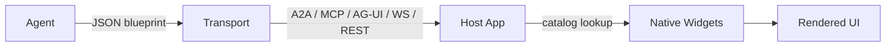

# A2UI: Framework-Agnostic Generative UI Standard

> A2UI is an open standard for agents to emit declarative UI blueprints that a host application renders with its own native components — the wire format for the agent → UI handoff.

## What A2UI Is

[A2UI](https://a2ui.org/) is an Apache 2.0 specification from Google for describing UI as structured data rather than code. An agent emits JSON that references components from a catalog the host application advertises; the host renders those components with its own native widgets. [Google released A2UI publicly in December 2025 at v0.8](https://developers.googleblog.com/introducing-a2ui-an-open-project-for-agent-driven-interfaces/) and [shipped v0.9 on April 17, 2026](https://developers.googleblog.com/a2ui-v0-9-generative-ui/) with first-party renderers for Flutter, Lit, Angular, and React plus a Python Agent SDK.

The primitive sits alongside the other agent-facing open standards this section tracks: [llms.txt](llms-txt.md) for discovery metadata, [AGENTS.md](agents-md.md) for project instructions, [Agent Skills](agent-skills-standard.md) for task knowledge, [MCP](mcp-protocol.md) for tool access, [A2A](a2a-protocol.md) for agent-to-agent calls. A2UI covers the fifth handoff: agent-to-UI.

## The Mechanism

A2UI moves the trust boundary from the UI layer to the data layer. The agent emits a JSON blueprint — "a flat list of components with ID references" — against a client-declared "Trusted Catalog" of pre-approved components ([Google Developers Blog, intro](https://developers.googleblog.com/introducing-a2ui-an-open-project-for-agent-driven-interfaces/)). The agent never generates HTML, JavaScript, or component code.



The host retains full control over styling and security: the message references only pre-approved components, and the blueprint cannot embed executable code. This mirrors how MCP handles tools — structured schema in and out, execution belongs to the host. A2UI applies the same contract to UI.

The alternative approaches have known problems. Generating HTML or JS sandboxed in an iframe "is heavy, can be visually disjointed (it rarely matches your app's native styling), and introduces complexity around security boundaries" ([Google Developers Blog, intro](https://developers.googleblog.com/introducing-a2ui-an-open-project-for-agent-driven-interfaces/)); [MCP Apps](https://blog.modelcontextprotocol.io/posts/2025-11-21-mcp-apps/) (Anthropic and OpenAI, November 2025) uses this iframe model. Direct DOM manipulation by an in-process agent works for single-app deployments but breaks the moment the agent is remote or third-party.

## What v0.9 Shipped

The [v0.9 release](https://developers.googleblog.com/a2ui-v0-9-generative-ui/) consolidates the spec and adds production features:

- **Python Agent SDK** — `pip install a2ui-agent-sdk` — wraps schema management, catalog loading, and incremental JSON healing for streaming responses.
- **Shared `web-core` library** — common rendering primitives used by the official React, Lit, and Angular renderers.
- **Client-defined functions** — host-side validation and callbacks the agent can reference.
- **Client-to-server data syncing** — collaborative editing between user and agent.
- **Multiple transports** — A2UI runs over [A2A](a2a-protocol.md), [AG-UI](https://ag-ui.com/), [MCP](mcp-protocol.md), WebSockets, or REST.
- **Renamed "Standard" components to "Basic"** — explicit concession that frontend teams want to plug in their own design system, not adopt Google's component set.

The repository [google/A2UI](https://github.com/google/A2UI) is the source of truth for the spec, catalogs, renderers, and sample agents.

## Adoption Signals

Early A2UI integrations cluster around Google's own surfaces and the AG-UI / CopilotKit ecosystem:

| Integration | Status | Source |
|-------------|--------|--------|
| Flutter GenUI SDK | Uses A2UI "under the covers" for remote agents | [Google Developers Blog](https://developers.googleblog.com/introducing-a2ui-an-open-project-for-agent-driven-interfaces/) |
| AG-UI / CopilotKit | Day-zero compatibility, `npx copilotkit@latest create my-app --framework a2ui` | [Google Developers Blog](https://developers.googleblog.com/a2ui-v0-9-generative-ui/) |
| Gemini Enterprise, Opal | Internal Google adopters | [Google Developers Blog](https://developers.googleblog.com/introducing-a2ui-an-open-project-for-agent-driven-interfaces/) |
| Oracle Agent Spec | Agent Spec + AG-UI + A2UI stack | [Oracle blog](https://blogs.oracle.com/ai-and-datascience/announcing-agent-spec-for-a2ui-copilotkit-ag-ui) |
| Vercel `json-renderer` | Experimental A2UI renderer | [Google Developers Blog](https://developers.googleblog.com/a2ui-v0-9-generative-ui/) |
| AG2 `A2UIAgent` | Native integration from the AutoGen team | [Google Developers Blog](https://developers.googleblog.com/a2ui-v0-9-generative-ui/) |

Cross-vendor backing is narrower than MCP's (which both Anthropic and OpenAI ship). A2UI's reach is wider on the framework axis (Flutter, Lit, Angular, React, web-core) but narrower on the model-provider axis.

## A2UI vs MCP Apps

The two approaches solve the same problem with opposite trust models ([The New Stack](https://thenewstack.io/agent-ui-standards-multiply-mcp-apps-and-googles-a2ui/); [A2UI docs](https://a2ui.org/introduction/agent-ui-ecosystem/)):

| Dimension | A2UI | MCP Apps |
|-----------|------|----------|
| Payload | Declarative JSON blueprint | HTML resource at a `ui://` URI |
| Rendering | Host's own native components | Sandboxed iframe |
| Design-system fidelity | Inherits host styling | Generic styling unless iframe is themed |
| Expressivity ceiling | Catalog intersection | Anything valid HTML/JS |
| Security model | Data, not code | Sandbox isolation |
| Cross-vendor backing | Google + AG-UI / CopilotKit | Anthropic, OpenAI (via MCP) |

Neither standard has won. [An upcoming bridge lets MCP servers return A2UI blueprints alongside HTML resources](https://www.copilotkit.ai/blog/the-state-of-agentic-ui-comparing-ag-ui-mcp-ui-and-a2ui-protocols), which suggests the two will coexist in the agent stack rather than compete head-to-head.

## When This Backfires

A2UI is the wrong choice in four situations:

- **Catalog-poor hosts**: portability is bounded by the intersection of the host's catalog and what the agent references. The v0.9 rename of "Standard" to "Basic" is an explicit acknowledgement that there is no cross-host common component set ([Google Developers Blog, v0.9](https://developers.googleblog.com/a2ui-v0-9-generative-ui/)).
- **Single-app single-framework deployments**: a framework-agnostic wire format earns its overhead across trust boundaries. For one React app with one design system, direct tool calls into native components are cheaper and lose nothing.
- **Rapidly-iterating UI**: the catalog is a static contract. Products changing UI weekly spend more time rev-ing the catalog and the agent's system prompt in sync than they save.
- **Consolidation risk**: A2UI is pre-1.0, Google-led, and competes with MCP Apps, AG-UI native rendering, and OpenAI ChatKit. Picking it in April 2026 is a bet on spec survival, not a commodity choice.

## Example

A reservation agent emits the following A2UI blueprint in place of a text back-and-forth ([adapted from Google's intro blog](https://developers.googleblog.com/introducing-a2ui-an-open-project-for-agent-driven-interfaces/)):

```json
{
  "version": "0.9",
  "components": [
    {"id": "form", "type": "Card", "children": ["header", "date", "time", "submit"]},
    {"id": "header", "type": "Text", "props": {"text": "Book a table"}},
    {"id": "date", "type": "DatePicker", "props": {"label": "Date"}},
    {"id": "time", "type": "Select", "props": {
      "label": "Time",
      "options": ["5:00", "5:30", "6:00", "8:30", "9:00", "9:30", "10:00"]
    }},
    {"id": "submit", "type": "Button", "props": {"label": "Reserve", "action": "submit"}}
  ]
}
```

The host receives the blueprint over A2A, AG-UI, or MCP transport. It looks each `type` up in its catalog — `Card`, `Text`, `DatePicker`, `Select`, `Button` — and renders the form with its own styled components. The agent did not produce HTML; the host did not trust opaque code. The same blueprint, sent to a Flutter client, renders as native Flutter widgets without the agent knowing or caring.

## Key Takeaways

- A2UI is the wire format for agent-to-UI handoff: structured JSON blueprints referencing a host-declared component catalog.
- The mechanism moves the trust boundary from UI to data — the host renders only components it pre-approved.
- v0.9 ships Python Agent SDK, first-party renderers for Flutter / Lit / Angular / React, and transports over A2A, AG-UI, MCP, REST, and WebSockets.
- The portability ceiling is the catalog intersection, not the spec — hosts with sparse design systems gain little.
- MCP Apps occupies adjacent territory with an iframe-based trust model; neither standard has won as of v0.9.
- The overhead earns out in multi-agent meshes and catalog-rich hosts; it does not earn out in single-framework single-team apps.

## Related

- [Agent-to-Agent (A2A) Protocol](a2a-protocol.md)
- [MCP: The Plumbing Behind Agent Tool Access](mcp-protocol.md)
- [AGENTS.md: A README for AI Coding Agents](agents-md.md)
- [llms.txt: Making Your Project Discoverable to AI Agents](llms-txt.md)
- [Agent Skills: Cross-Tool Task Knowledge Standard](agent-skills-standard.md)
- [Interactive Canvases: Agent-Generated Visual Artifacts as Outputs](../emerging/interactive-canvas-outputs.md)
- [Tool Calling Schema Standards](tool-calling-schema-standards.md)
