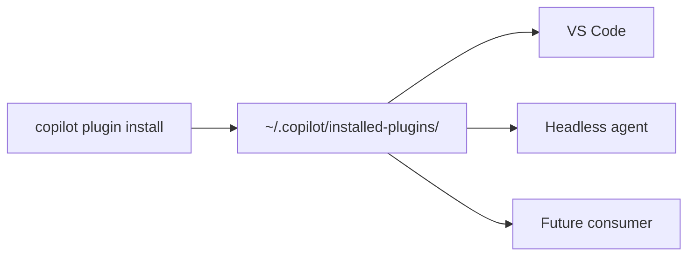

# Cross-IDE Plugin Discovery

> Cross-IDE plugin discovery has one CLI install write to a shared per-user path every IDE reads, collapsing repeated installs but widening supply-chain blast radius.

## The File-System Contract

Cross-IDE plugin discovery is a one-way file-system contract. The install surface (a CLI, a package manager, an MDM channel) writes plugin manifests to a well-known per-user path. Every consumer (IDE, headless agent, second IDE) reads that path on startup and on filesystem-change events. No coordination protocol runs between them — the path is the protocol.



The writer does not need to know what consumers exist, and consumers do not coordinate with each other. The same convention underlies `~/.config/`, `~/.local/share/`, and the GnuPG agent's `~/.gnupg/` — shared state mediated by a stable path rather than a coordination protocol ([XDG Base Directory Specification](https://specifications.freedesktop.org/basedir-spec/latest/)).

## Reference Implementation: VS Code 1.120 + Copilot CLI

VS Code 1.120 (released May 13, 2026) auto-discovers plugins installed via the GitHub Copilot CLI: "Agent plugins installed with the GitHub Copilot CLI are picked up automatically by VS Code, so a single `copilot plugin install` covers both surfaces" ([VS Code 1.120 release notes](https://code.visualstudio.com/updates/v1_120)).

The on-disk layout is documented:

- The CLI writes to `~/.copilot/installed-plugins/<marketplace>/<plugin>/` for marketplace installs.
- Direct-from-Git installs land under a `_direct` bucket, e.g. `~/.copilot/installed-plugins/_direct/github--moda-linter--copilot-plugin/`.
- VS Code surfaces discovered plugins in the **Agent Plugins - Installed** view alongside marketplace-installed plugins ([VS Code agent-plugins docs](https://code.visualstudio.com/docs/copilot/customization/agent-plugins)).

Before 1.120, users had to install the plugin separately in each IDE or set `chat.plugins.paths` by hand. The contract did not change the plugin format — it changed which surface owns the install.

## What the Contract Does Not Override

Auto-discovery is a read of the install state, not a grant of execution. Two gates still apply in the reference implementation:

- **`chat.plugins.enabled`** must be on for agent plugins to run; this setting is administrator-manageable at the organization level. A CLI install does not bypass an org policy that disables agent plugins ([VS Code agent-plugins docs](https://code.visualstudio.com/docs/copilot/customization/agent-plugins)).
- **Workspace Trust** still gates execution: "if the workspace is untrusted in VS Code, it is also untrusted in the Agents window, and agents will not run in either place" ([VS Code Trust and safety](https://code.visualstudio.com/docs/copilot/concepts/trust-and-safety)).

The contract is about install state, not authorisation. Consuming surfaces remain responsible for their own runtime gates.

## Where the Contract Breaks

Cross-IDE discovery is a per-user, per-machine convention. It depends on every consumer agreeing to read the same path. As of late 2025 the contract is partial:

- **JetBrains, Eclipse, and Xcode Copilot plugins** added custom-agent and skill support in November 2025, but they install through the JetBrains Marketplace and equivalents — they do not read `~/.copilot/installed-plugins/` ([GitHub Changelog](https://github.blog/changelog/2025-11-18-custom-agents-available-in-github-copilot-for-jetbrains-eclipse-and-xcode-now-in-public-preview/)). A team with mixed IDEs still needs a parallel install path for the non-participating surfaces.
- **Direct-from-Git installs hit known discovery bugs**: `copilot plugin install owner/repo` sets `cache_path` to the repo root and skips `.github/plugin/plugin.json` ([copilot-cli issue #2390](https://github.com/github/copilot-cli/issues/2390)). The shared install surface inherits CLI bugs into every consuming IDE on the same machine.
- **Trust scope mismatch**: the path is per-user. On a multi-tenant or shared-workstation machine (lab, classroom, kiosk), one user account may represent multiple trust contexts. Cross-surface discovery couples them in a way that is wrong when each IDE session represents a different role.

## Supply-Chain Implication

A single install surface concentrates supply-chain risk. PromptArmor demonstrated [marketplace-plugin injection attacks](https://www.promptarmor.com/resources/hijacking-claude-code-via-injected-marketplace-plugins) that hijack agent sessions; SentinelOne documented [marketplace skills that redirect dependency installs](https://www.sentinelone.com/blog/marketplace-skills-and-dependency-hijack-in-claude-code/). With per-IDE installs, a poisoned plugin only reaches the surface where it was installed. With CLI-as-shared-install-surface, one `copilot plugin install` reaches every consuming agent on the machine.

The mitigation is not to abandon the contract — treat the CLI install as the single audit point. Pin plugin versions, prefer organization-managed marketplaces, review every `installed-plugins/` entry the way you would an extension installed in every IDE on the machine.

## Designing for the Contract

Tools that participate as either writer or reader of a cross-IDE install surface need three things:

1. **A documented per-user path.** Stable across versions, derivable without invoking the install surface, located under an XDG-compliant base directory.
2. **A manifest format the consumer parses without running the writer.** VS Code reads `~/.copilot/installed-plugins/` without executing the Copilot CLI — discovery is filesystem-only.
3. **A clear separation between install state and execution authorisation.** The path says what is installed; whether to run it remains the consumer's policy decision.

## Example

The layout written by `copilot plugin install` is the contract VS Code reads. A marketplace install and a direct-from-Git install land in different sub-trees but use the same parent path:

```
~/.copilot/installed-plugins/
├── github/                                    # marketplace name
│   └── moda-linter-copilot-plugin/
│       ├── plugin.json
│       ├── agents/
│       └── skills/
└── _direct/                                   # direct-from-Git bucket
    └── github--moda-linter--copilot-plugin/
        ├── plugin.json
        ├── agents/
        └── skills/
```

After `copilot plugin install github/moda-linter/copilot-plugin`, the plugin appears in the **Agent Plugins - Installed** view in VS Code without a separate VS Code install step. The same files are read by any other consumer that adopts the contract — that is the whole point.

## Key Takeaways

- A shared-install-surface contract is a one-way file-system convention: writer puts manifests at a stable per-user path, every consumer reads them without coordination.
- VS Code 1.120 + Copilot CLI is the reference implementation — `~/.copilot/installed-plugins/<marketplace>/<plugin>/`, with `_direct` for Git installs.
- Auto-discovery is install-state-only — runtime gates (`chat.plugins.enabled`, Workspace Trust) still apply.
- The contract is partial in late-2025 multi-IDE fleets: JetBrains, Eclipse, and Xcode Copilot plugins do not yet read the path.
- Concentrating installs concentrates supply-chain risk — treat the CLI install as the single audit point, pin versions, prefer org-managed marketplaces.

## Related

- [Plugin and Extension Packaging: Distributing Agent Capabilities](plugin-packaging.md)
- [Agent Skills: Cross-Tool Task Knowledge Standard](agent-skills-standard.md)
- [Agent Definition Formats: How Tools Define Agent Behavior](agent-definition-formats.md)
- [MCP: The Plumbing Behind Agent Tool Access](mcp-protocol.md)
- [Blast Radius Containment: Least Privilege for AI Agents](../security/blast-radius-containment.md)
- [Defense in Depth for Agent Safety](../security/defense-in-depth-agent-safety.md)
