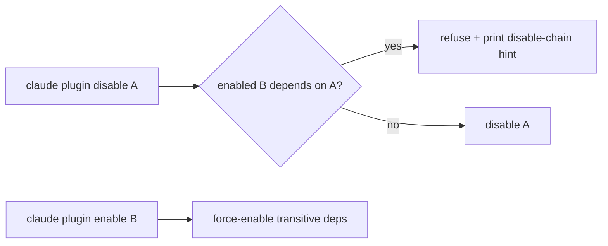

# Plugin Dependency Declaration and Disable-Chain Hints

> Plugins declare dependencies in their manifest; the harness validates them at install, refuses to disable a plugin another enabled one needs, and prunes orphaned auto-installs.

A flat plugin set duplicates shared skills, MCP servers, and hooks. Plugin dependency declaration is the next layer on top of [plugin packaging](plugin-packaging.md) — a `dependencies` array in `plugin.json` plus host semantics for install, enable, disable, and prune. Claude Code v2.1.143 (2026-05-15) is the reference implementation: deps are validated, transitive deps auto-install, `disable` refuses with a hint, and `prune` removes orphans ([Claude Code changelog](https://code.claude.com/docs/en/changelog)).

## When the Dependency Graph Earns Its Complexity

A dependency edge adds error surface — `range-conflict`, `dependency-version-unsatisfied`, `no-matching-tag`, `cross-marketplace` ([Constrain plugin dependency versions](https://code.claude.com/docs/en/plugin-dependencies)). It pays back when the set is large enough that duplication is real cost (roughly five plugins and up), upstream follows semver, and marketplaces are reachable. Otherwise a flat set is cheaper.

## Declaring a Dependency

Dependencies live in the `dependencies` array of `.claude-plugin/plugin.json`. Each entry is a bare plugin name or an object with `name`, `version` (any `semver` range), and optional `marketplace` ([Constrain plugin dependency versions](https://code.claude.com/docs/en/plugin-dependencies)):

```json
{
  "name": "deploy-kit",
  "version": "3.1.0",
  "dependencies": [
    "audit-logger",
    { "name": "secrets-vault", "version": "~2.1.0" }
  ]
}
```

Version constraints resolve against git tags named `{plugin-name}--v{version}`; `claude plugin tag --push` derives and pushes the tag from the manifest ([Constrain plugin dependency versions](https://code.claude.com/docs/en/plugin-dependencies)). Cross-marketplace dependencies are blocked unless the root marketplace lists the target in `allowCrossMarketplaceDependenciesOn` — trust does not chain through intermediate marketplaces.

## The Disable-Chain Hint

The operator-facing primitive is refusal, not warning. When `claude plugin disable A` would orphan an enabled `B` that depends on `A`, Claude Code refuses and prints a copy-pasteable chain hint ([Claude Code changelog v2.1.143](https://code.claude.com/docs/en/changelog)). The symmetric verb is force-enable: `claude plugin enable B` walks the graph and enables `A`.



Refusal forces acknowledgement: the operator disables the dependent plugin first or abandons the action. A dismissed warning would leave the dependent plugin half-broken — its dependency record pointing at a disabled record.

## Pruning Orphaned Auto-Installs

`claude plugin prune` (v2.1.121, aliased `autoremove`) removes auto-installed dependencies that no installed plugin requires; user-installed plugins are never pruned ([Plugins reference — plugin prune](https://code.claude.com/docs/en/plugins-reference)). Pass `--prune` to `plugin uninstall` to cascade.

| Error code | Meaning | Fix |
|-----------|---------|-----|
| `dependency-unsatisfied` | Declared dep not installed or disabled | Run the `claude plugin install` shown in the message |
| `range-conflict` | Two plugins' semver ranges do not intersect | Update one of the conflicting plugins, or widen the upstream range |
| `dependency-version-unsatisfied` | Installed dep is outside the declared range | `claude plugin install <dependency>@<marketplace>` to re-resolve |
| `no-matching-tag` | No `{name}--v*` tag satisfies the range | Tag upstream with `claude plugin tag` or relax the range |

Errors surface in `claude plugin list`, `/plugin`, and `/doctor`; programmatic checks consume `claude plugin list --json` ([Constrain plugin dependency versions](https://code.claude.com/docs/en/plugin-dependencies)).

## Why It Works

The host harness owns the registry of every component a plugin contributes — a skill is a record the harness consults on every prompt, not a file the user sources. Registry ownership lets the same lookup that resolves a skill on invocation walk the dependency graph at disable time, and install-time provenance lets `prune` distinguish safe-to-remove from off-limits ([Constrain plugin dependency versions](https://code.claude.com/docs/en/plugin-dependencies)). This is `apt autoremove` against dpkg's database ([Linux Journal](https://www.linuxjournal.com/content/debian-package-dependency-management-handling-dependencies)), applied to agent capabilities.

## When This Backfires

- **Small flat plugin sets.** Under five plugins, the graph adds error surface without saving real duplication — the chain hint never fires.
- **High-churn upstream without semver.** When an upstream force-moves a tag or treats minor bumps as breaking, downstream plugins thrash between `dependency-version-unsatisfied` and `no-matching-tag` ([plugin dependencies](https://code.claude.com/docs/en/plugin-dependencies)).
- **Federated marketplaces without governance.** `allowCrossMarketplaceDependenciesOn` needs the root maintainer to actively allowlist; without a coordinator every cross-marketplace edge becomes a manual install.
- **Always-on token budget pressure.** Every transitive plugin loads skill and agent descriptions into the always-on context — check [per-plugin token-cost attribution](../observability/plugin-token-cost-attribution.md) before adding an edge.
- **Air-gapped installs.** Resolution assumes marketplace reachability; when unreachable, missing transitive deps disable the dependent plugin the operator never touched.
- **Dependency hell.** Importing the package-manager primitive imports its failure modes — the four error codes above are the agent-layer equivalent of package-manager pain.
- **Expanded supply-chain attack surface.** Force-enabling transitive deps and auto-installing them from a marketplace pulls every upstream maintainer into your trust boundary; a compromised marketplace skill can hijack the install and ship a trojanized dependency that imports cleanly while exfiltrating secrets ([SentinelOne: Marketplace Skills and Dependency Hijack in Claude Code](https://www.sentinelone.com/blog/marketplace-skills-and-dependency-hijack-in-claude-code/)). Vet marketplace provenance and prefer pinned ranges over open auto-update.

## Example

A platform team publishes `secrets-vault` (MCP server wrapping a secrets backend). A deploy team publishes `deploy-kit`, which calls `secrets-vault` during deploys and is tested against `secrets-vault` v2.1.0 ([Constrain plugin dependency versions](https://code.claude.com/docs/en/plugin-dependencies)).

**Before** — flat plugins, no declared dependency:

```bash
# Platform team tags secrets-vault--v2.2.0 with a renamed MCP tool.
# Auto-update moves every engineer's secrets-vault to v2.2.0.
# deploy-kit silently breaks on the next deploy.
```

**After** — declared dependency with a version constraint:

```json
{
  "name": "deploy-kit",
  "version": "3.1.0",
  "dependencies": [
    { "name": "secrets-vault", "version": "~2.1.0" }
  ]
}
```

Engineers with `deploy-kit` installed stay on the highest matching `2.1.x` patch. Auto-update fetches `secrets-vault--v2.1.x`, not `--v2.2.0`. If an engineer runs `claude plugin disable secrets-vault`, Claude Code refuses with a hint pointing at `deploy-kit`:

```text
Error: cannot disable secrets-vault — deploy-kit (enabled) requires it.
To proceed, first disable: deploy-kit
  claude plugin disable deploy-kit
```

When `deploy-kit` is later uninstalled, `claude plugin uninstall deploy-kit --prune` removes the auto-installed `secrets-vault` too — provided no other installed plugin still depends on it.

## Key Takeaways

- Plugin dependency declaration is a `dependencies` array in `plugin.json` with optional semver ranges and cross-marketplace fields
- Host enforcement: `disable` refuses with a copy-pasteable chain hint, `enable` force-enables transitive deps, `prune` removes orphaned auto-installs
- The primitive works because the host harness owns the registry of every component a plugin contributes — refusal and prune use the same lookup that drives invocation
- Earned only when the plugin set is large enough, upstream follows semver, and marketplaces are reachable — small flat sets pay the error-surface cost without the deduplication benefit
- Cross-link with per-plugin token-cost attribution before adding edges — transitive plugins compound always-on cost

## Related

- [Plugin and Extension Packaging: Distributing Agent Capabilities](plugin-packaging.md)
- [Per-Plugin Token-Cost Attribution via `claude plugin details`](../observability/plugin-token-cost-attribution.md)
- [Pre-Install Context-Cost Projection in Plugin Marketplaces](marketplace-cost-projection.md)
- [Pre-Install Plugin Transparency: Capability Inventory and Cost Projection](pre-install-plugin-transparency.md)
- [Cross-IDE Plugin Discovery: One Install Surface, Many Consuming Agents](cross-ide-plugin-discovery.md)
- [Agent Skills: Cross-Tool Task Knowledge Standard](agent-skills-standard.md)
- [MCP: The Plumbing Behind Agent Tool Access](mcp-protocol.md)
