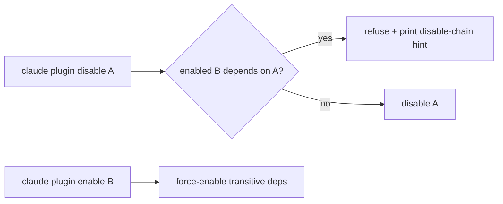

# Plugin Dependency Declaration and Disable-Chain Hints

> Plugins declare dependencies on other plugins in their manifest; the host harness validates them at install, refuses to disable a plugin that another enabled plugin depends on, and prunes orphaned auto-installs — the agent-capability analogue of `apt` over `dpkg`.

A flat plugin set duplicates shared skills, MCP servers, and hooks across plugins. Plugin dependency declaration is the next layer on top of [plugin packaging](plugin-packaging.md) — a `dependencies` array in `plugin.json` plus host-enforced semantics for install, enable, disable, and prune. Claude Code v2.1.143 (2026-05-15) is the reference implementation: declared dependencies are validated, transitive deps auto-install, `disable` refuses with a copy-pasteable chain hint, and `prune` removes orphans ([Claude Code changelog](https://code.claude.com/docs/en/changelog)).

## When the Dependency Graph Earns Its Complexity

A dependency edge adds error surface — `range-conflict`, `dependency-version-unsatisfied`, `no-matching-tag`, `cross-marketplace` ([Constrain plugin dependency versions](https://code.claude.com/docs/en/plugin-dependencies)). It pays back only when the plugin set is large enough that duplication is real cost (roughly five plugins and up), upstream maintainers follow semver in good faith, and marketplaces are reachable at install and update time. Outside those conditions, a flat plugin set is the lower-cost answer.

## Declaring a Dependency

Dependencies live in the `dependencies` array of `.claude-plugin/plugin.json`. Each entry is either a bare plugin name or an object with `name`, `version` (any `semver` range), and optional `marketplace` ([Constrain plugin dependency versions](https://code.claude.com/docs/en/plugin-dependencies)):

```json
{
  "name": "deploy-kit",
  "version": "3.1.0",
  "dependencies": [
    "audit-logger",
    { "name": "secrets-vault", "version": "~2.1.0" }
  ]
}
```

Version constraints resolve against git tags named `{plugin-name}--v{version}` on the marketplace repository; `claude plugin tag --push` derives and pushes the tag from the manifest ([Constrain plugin dependency versions](https://code.claude.com/docs/en/plugin-dependencies)). Cross-marketplace dependencies are blocked unless the root marketplace lists the target in `allowCrossMarketplaceDependenciesOn` — trust does not chain through intermediate marketplaces ([Constrain plugin dependency versions](https://code.claude.com/docs/en/plugin-dependencies)).

## The Disable-Chain Hint

The operator-facing primitive is refusal, not warning. When `claude plugin disable A` would orphan an enabled plugin `B` that depends on `A`, Claude Code refuses and prints a copy-pasteable chain hint listing every plugin to disable or uninstall first ([Claude Code changelog v2.1.143](https://code.claude.com/docs/en/changelog)). The symmetric verb is force-enable: `claude plugin enable B` walks the graph and enables `A` automatically.



Refusal differs from warning by forcing acknowledgement: the operator either disables the dependent plugin first or abandons the action. A warning the operator dismisses leaves the dependent plugin half-broken — its dependency record points at a disabled record the harness skips on lookup.

## Pruning Orphaned Auto-Installs

`claude plugin prune` (v2.1.121, aliased `autoremove`) removes auto-installed dependencies that no installed plugin requires; plugins the operator installed directly are never pruned ([Plugins reference — plugin prune](https://code.claude.com/docs/en/plugins-reference)). Pass `--prune` to `plugin uninstall` to cascade in one step. The provenance bit — auto-installed versus user-installed — is recorded in the registry at install time, which is what lets prune distinguish the two safely.

| Error code | Meaning | Fix |
|-----------|---------|-----|
| `dependency-unsatisfied` | Declared dep not installed or disabled | Run the `claude plugin install` shown in the message; add the dep's marketplace if missing |
| `range-conflict` | Two plugins' semver ranges have no intersection | Uninstall or update one of the conflicting plugins, or widen the upstream range |
| `dependency-version-unsatisfied` | Installed dep is outside the declared range | `claude plugin install <dependency>@<marketplace>` to re-resolve against all constraints |
| `no-matching-tag` | No `{name}--v*` tag satisfies the range | Tag upstream releases with `claude plugin tag` or relax the range |

The errors surface in `claude plugin list`, the `/plugin` interface, and `/doctor`; programmatic checks consume `claude plugin list --json` ([Constrain plugin dependency versions](https://code.claude.com/docs/en/plugin-dependencies)).

## Why It Works

The primitive works because the host harness owns the registry of every component a plugin contributes — a skill is a record the harness consults on every prompt, not a file the user sources. Registry ownership lets the same lookup that resolves a skill on invocation walk the dependency graph at disable time. Install-time provenance — auto-installed versus user-installed — lets `prune` distinguish safe-to-remove from off-limits ([Constrain plugin dependency versions](https://code.claude.com/docs/en/plugin-dependencies)). This is the mechanism `apt autoremove` uses against dpkg's database ([Linux Journal: Debian package dependency management](https://www.linuxjournal.com/content/debian-package-dependency-management-handling-dependencies)), applied to agent capabilities instead of binaries.

## When This Backfires

- **Small flat plugin sets.** Under five plugins on one team, the dependency graph adds error surface without saving meaningful duplication — the disable-chain hint never fires because there are no chains.
- **High-churn upstream without semver discipline.** If an upstream tags `v2.1.0` and later force-moves the tag, or treats minor bumps as breaking, downstream plugins thrash between `dependency-version-unsatisfied` and `no-matching-tag` ([Constrain plugin dependency versions](https://code.claude.com/docs/en/plugin-dependencies)).
- **Federated marketplaces without governance.** `allowCrossMarketplaceDependenciesOn` requires the root maintainer to actively allowlist; without a central coordinator every cross-marketplace edge becomes a manual install step that defeats the automation.
- **Always-on token budget pressure.** Every transitive plugin loads skill and agent descriptions into the always-on context. A deep dependency graph multiplies per-plugin always-on cost — sort by the always-on column in [per-plugin token-cost attribution](../observability/plugin-token-cost-attribution.md) before adding an edge.
- **Air-gapped installs.** Dependency resolution assumes marketplace reachability; when unreachable, missing transitive deps disable the dependent plugin even though the operator never touched it.
- **Dependency hell.** Importing the package-manager primitive imports its failure modes — the four error codes above are the agent-layer equivalent of conventional package-manager pain.

## Example

A platform team publishes `secrets-vault` (MCP server wrapping a secrets backend). A deploy team publishes `deploy-kit`, which calls `secrets-vault` during deploys and is tested against `secrets-vault` v2.1.0 ([Constrain plugin dependency versions](https://code.claude.com/docs/en/plugin-dependencies)).

**Before** — flat plugins, no declared dependency:

```bash
# Platform team tags secrets-vault--v2.2.0 with a renamed MCP tool.
# Auto-update moves every engineer's secrets-vault to v2.2.0.
# deploy-kit silently breaks on the next deploy.
```

**After** — declared dependency with a version constraint:

```json
{
  "name": "deploy-kit",
  "version": "3.1.0",
  "dependencies": [
    { "name": "secrets-vault", "version": "~2.1.0" }
  ]
}
```

Engineers with `deploy-kit` installed stay on the highest matching `2.1.x` patch. Auto-update fetches `secrets-vault--v2.1.x`, not `--v2.2.0`. If an engineer runs `claude plugin disable secrets-vault`, Claude Code refuses with a hint pointing at `deploy-kit`:

```text
Error: cannot disable secrets-vault — deploy-kit (enabled) requires it.
To proceed, first disable: deploy-kit
  claude plugin disable deploy-kit
```

When `deploy-kit` is later uninstalled, `claude plugin uninstall deploy-kit --prune` removes the auto-installed `secrets-vault` too — provided no other installed plugin still depends on it.

## Key Takeaways

- Plugin dependency declaration is a `dependencies` array in `plugin.json` with optional semver ranges and cross-marketplace fields
- Host enforcement: `disable` refuses with a copy-pasteable chain hint, `enable` force-enables transitive deps, `prune` removes orphaned auto-installs
- The primitive works because the host harness owns the registry of every component a plugin contributes — refusal and prune use the same lookup that drives invocation
- Earned only when the plugin set is large enough, upstream follows semver, and marketplaces are reachable — small flat sets pay the error-surface cost without the deduplication benefit
- Cross-link with per-plugin token-cost attribution before adding edges — transitive plugins compound always-on cost

## Related

- [Plugin and Extension Packaging: Distributing Agent Capabilities](plugin-packaging.md)
- [Per-Plugin Token-Cost Attribution via `claude plugin details`](../observability/plugin-token-cost-attribution.md)
- [Cross-IDE Plugin Discovery: One Install Surface, Many Consuming Agents](cross-ide-plugin-discovery.md)
- [Agent Skills: Cross-Tool Task Knowledge Standard](agent-skills-standard.md)
- [MCP: The Plumbing Behind Agent Tool Access](mcp-protocol.md)
