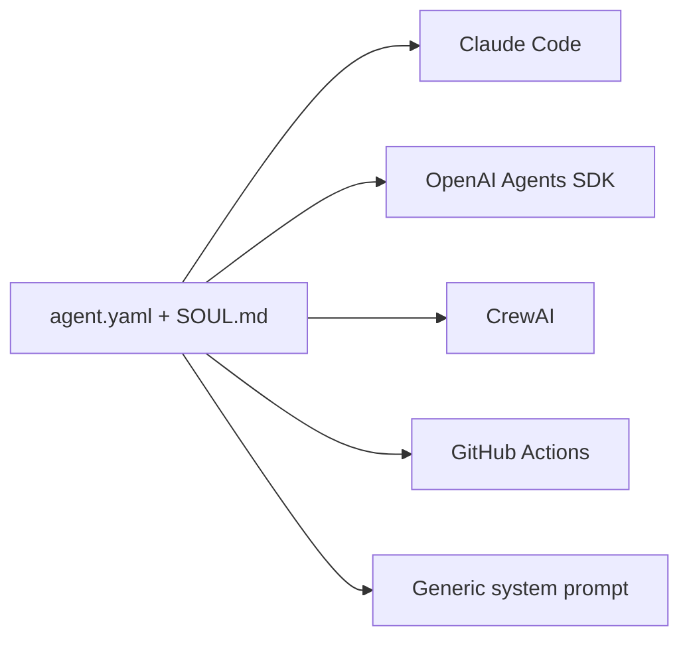

# Portable Agent Definitions: Full-Stack Identity as Code

> Package an entire agent -- identity, model, tools, compliance rules, and composition hierarchy -- as a version-controlled, framework-agnostic artifact that any runtime can consume.

## The Config Fragmentation Problem

Agent definitions are scattered across tool-specific formats:

| Tool | Config file | Scope |
|------|------------|-------|
| Claude Code | `CLAUDE.md`, `.claude/agents/*.md` | Identity, tools, permissions, skills |
| Cursor | `.cursor/rules/*.mdc` | Rules with frontmatter globs |
| GitHub Copilot | `.github/copilot-instructions.md` | Repo-wide instructions |
| AGENTS.md | `AGENTS.md` | Project-level guidance (any tool) |

None captures the full stack: model, tools, compliance, composition, and memory. Moving agents between tools means manual, lossy translation. ([Source: DeployHQ cross-tool comparison](https://www.deployhq.com/blog/ai-coding-config-files-guide))

[Agent Definition Formats](agent-definition-formats.md) catalogues per-tool formats. The layer above is a portable definition that sits on top of tool-specific runtimes.

## gitagent: One Concrete Implementation

[gitagent](https://github.com/open-gitagent/gitagent) (MIT, v0.2.0, ~2.7k GitHub stars as of April 2026) defines an agent as a git repository with two required files and several optional directories:

```
my-agent/
  agent.yaml       # Config manifest: model, tools, skills, compliance
  SOUL.md           # Identity and personality
  skills/           # Reusable task knowledge
  tools/            # Tool definitions
  compliance/       # Regulatory policies
  memory/           # Runtime state
```

### agent.yaml: The Manifest

`agent.yaml` declares what a runtime needs to instantiate the agent:

```yaml
name: compliance-reviewer
version: 0.1.0
model: claude-sonnet-4
tools:
  - name: read-file
  - name: search-codebase
skills:
  - finra-3110-review
compliance:
  segregation_of_duties: true
agents:
  - name: doc-checker
    ref: git@github.com:org/doc-checker-agent.git@v1.2.0
```

### SOUL.md: Agent Identity

`SOUL.md` defines personality, communication style, and boundaries -- the part of identity that transcends tool config. It is plain Markdown, loadable as a system prompt by any runtime.

## What Portability Actually Means

Export adapters translate one definition into tool-specific formats:



Translation is necessarily lossy -- each runtime has unique capabilities. Treat exported configs as starting points, not finished products.

## Composable Agent Hierarchy

Agents reference sub-agents as versioned git dependencies:

```yaml
# parent agent.yaml
agents:
  - name: code-reviewer
    ref: git@github.com:org/code-reviewer.git@v2.0.0
  - name: test-writer
    ref: git@github.com:org/test-writer.git@v1.3.0
```

Child agents inherit parent configuration and can override fields, enabling monorepo-scale reuse. This extends [Central Repo for Shared Agent Standards](../workflows/central-repo-shared-agent-standards.md) from instruction files to full agent definitions.

## Git-Native Governance

Because the agent is a repository, standard git workflows become agent governance: PR review diffs behavior changes, branch promotion deploys through environments, `git revert` rolls back any change, and git history provides the audit trail.

This extends [Prompt Governance via PR](../instructions/prompt-governance-via-pr.md) from instruction files to the full definition stack.

## Built-in Compliance

gitagent includes first-class compliance primitives: segregation of duties (role conflict matrices), supervision policies (human review checkpoints), and recordkeeping (FINRA 4511 / SEC logging specs). As of April 2026, open issues in the repository include a request for review by a FINRA/SEC practitioner ([Issue #7](https://github.com/open-gitagent/gitagent/issues/7)), indicating these features have not yet been validated by regulated-industry compliance teams.

## Limitations and Risks

The pattern is sound. The specific implementation has open questions:

- **Secrets management** -- relies on `.gitignore` alone, the same mechanism behind credential leaks. ([Source: HN thread](https://news.ycombinator.com/item?id=47376584))
- **Prompt injection surface** -- every repo file loads into agent context with no sandboxing defined
- **Spec churn** -- still pre-1.0 (v0.2.0 as of April 2026), so adapters must track breaking changes across all supported frameworks
- **Adoption** -- ~2.7k GitHub stars (April 2026), no public production data; compare [AGENTS.md](agents-md.md) at 60k+ repos under Linux Foundation

## The Pattern vs. The Tool

The underlying pattern is validated by convergent evolution:

| Implementation | Scope | Governance |
|---|---|---|
| gitagent | Full agent definition (portable) | Git-native |
| GitHub Enterprise AI Controls | Agent definitions (GitHub-only; MCP allowlists still in preview) | Org-level policies |
| AGENTS.md | Project-level instructions (any tool) | Git-native |
| Claude Code agents | Identity, tools, permissions (Claude-only) | Git-native |

GitHub's [Enterprise AI Controls](https://github.blog/changelog/2026-02-26-enterprise-ai-controls-agent-control-plane-now-generally-available/) (GA Feb 2026) solve the same problem at org level -- GitHub-specific, but validating that agent definitions need code-level governance.

The open question: can a single portable format survive framework evolution, or are tool-specific formats with conversion adapters the pragmatic equilibrium?

## Key Takeaways

- Agent config fragmentation is real: each tool defines agents differently, no conversion is lossless
- Portable definitions extend config-as-code to the full stack: model, tools, compliance, composition
- gitagent (MIT, v0.2.0) is useful as a reference architecture even if adoption remains limited
- Git-native governance applies unchanged to full agent definitions
- Export adapters are necessarily lossy -- treat outputs as starting points
- Convergent evolution (GitHub Enterprise AI Controls, AGENTS.md, Claude Code agents) validates the pattern

## Related

- [Agent Definition Formats: How Tools Define Agent Behavior](agent-definition-formats.md) -- per-tool format catalogue
- [AGENTS.md: A README for AI Coding Agents](agents-md.md) -- the dominant project-level instruction standard
- [Agent Cards: Capability Discovery Standard for AI Agents](agent-cards.md) -- capability advertisement for agent-to-agent discovery
- [Agent Skills: Cross-Tool Task Knowledge Standard](agent-skills-standard.md) -- portable skill definitions across runtimes
- [Tool Calling Schema Standards](tool-calling-schema-standards.md) -- schema standards governing agent tool calls
- [Persona-as-Code: Defining Agent Roles as Structured Docs](../agent-design/persona-as-code.md) -- encoding roles as Markdown files
- [Prompt Governance via PR](../instructions/prompt-governance-via-pr.md) -- PR-based review of agent instructions
- [Central Repo for Shared Agent Standards](../workflows/central-repo-shared-agent-standards.md) -- distributing standards across repos
- [Plugin and Extension Packaging](plugin-packaging.md) -- distributing agent capabilities as installable bundles
- [MCP: The Open Protocol Connecting Agents to External Tools](mcp-protocol.md) -- the standard protocol for agent-tool communication referenced in MCP allowlists
