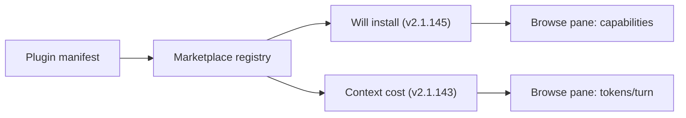

# Pre-Install Plugin Transparency: Capability Inventory and Cost Projection

> Pre-install plugin transparency is a two-column marketplace contract — a static capability inventory of every command, agent, skill, hook, and MCP or LSP server the plugin will install, beside its projected per-turn token cost — rendered before the operator commits.

Pre-install plugin transparency is a marketplace metadata pattern that surfaces two facts beside the install button: *what* the plugin adds (capability inventory) and *how much* context it costs (cost projection). Claude Code v2.1.145 (2026-05-19) shipped the inventory half — *"A **Will install** section listing the plugin's commands, agents, skills, hooks, and MCP and LSP servers, so you can review exactly what it adds before installing"* ([Discover and install plugins](https://code.claude.com/docs/en/discover-plugins)). The cost half landed in v2.1.143 (2026-05-15) and is treated in [pre-install context-cost projection](marketplace-cost-projection.md); the two columns are one contract.

## When the Contract Earns Its Place

The disclosure produces signal only under specific conditions; outside them it is theatre.

- **Operator comparison-shops in the browse pane.** `claude plugin install <name>@<marketplace>` and README-link installs bypass the disclosure ([Discover and install plugins](https://code.claude.com/docs/en/discover-plugins)).
- **Inventory or cost differs meaningfully between candidates.** Two security plugins each shipping one MCP server and two skills do not differentiate on the inventory column.
- **A downstream budget gate exists.** Without a per-session quota, runtime warning, or eval, awareness rarely changes behaviour. The Android permissions evidence is canonical: only **17%** of users paid attention to pre-install permission listings and only **3%** answered comprehension questions correctly ([Felt et al., *Android Permissions: User Attention, Comprehension, and Behavior*, SOUPS '12](https://cups.cs.cmu.edu/soups/2012/proceedings/a3_Felt.pdf)). Disclosure without enforcement is the default-ignored case.

## The Two Columns

The contract is two independent manifest reads rendered side by side.

| Column | What it answers | Reference implementation |
|--------|-----------------|--------------------------|
| Capability inventory | *Which commands, agents, skills, hooks, MCP servers, and LSP servers will this plugin add?* | `/plugin` Discover/Browse **Will install** section, v2.1.145 ([Discover and install plugins](https://code.claude.com/docs/en/discover-plugins)) |
| Cost projection | *How many tokens will it cost per turn?* | `/plugin` Browse Context cost estimate, v2.1.143 ([Claude Code changelog](https://code.claude.com/docs/en/changelog)) |

The inventory column answers a precision question — *exactly* which components arrive — and the cost column answers a budget question. Collapsing them to one number erases two independent decision axes; rendering them on one surface compounds the two-signal effect.

## How the Host Derives the Inventory

The harness owns the registry of every component a plugin contributes — skills live in `skills/`, agents in `agents/`, hooks in declared paths, MCP and LSP servers in manifest entries ([Plugins reference](https://code.claude.com/docs/en/plugins-reference)). Marketplace catalogues cache the manifest, so the same enumeration that resolves a skill at invocation time can list components before any plugin code runs. The browse pane displays the cached enumeration; no plugin sandbox is started.



LSP servers were added to `claude plugin details` in v2.1.141 and rolled into the same component model in v2.1.145; future component types (monitors are documented in the reference) inherit the listing convention without protocol changes.

## Why It Works

Registry ownership makes both columns precise. The harness reads each component from a typed manifest slot, so the inventory is what the plugin *will* contribute, not what the marketplace claims it will contribute ([Plugins reference](https://code.claude.com/docs/en/plugins-reference)). The same lookup that powers invocation powers disclosure. The OS package-manager precedent is identical: `apt show` reads the same database `dpkg` consults at install time, so the pre-install view matches the post-install reality. The contract moves the *what* and *how much* signals from the post-install accountability moment, when the only remediation is uninstall, to the choice moment, when remediation is picking a lighter alternative for free.

## When This Backfires

- **CLI bypass.** `claude plugin install <name>@<marketplace>` does not render either column; operators installing from peer recommendations or repo READMEs never see the disclosure ([Discover and install plugins](https://code.claude.com/docs/en/discover-plugins)).
- **Disclosure-fatigue baseline.** The Felt et al. result generalises: pre-install listings are read by a small minority. Without a budget primitive — a token cap, a hook that blocks install over a threshold, an eval that fails on regression — the inventory is decoration ([Felt et al., SOUPS '12](https://cups.cs.cmu.edu/soups/2012/proceedings/a3_Felt.pdf)).
- **MCP-server-heavy plugins.** An MCP server entry in the inventory hides dynamic tool surface area — servers return varying tool sets per session, and the static listing names the server, not the tools ([apideck.com — MCP context window cost](https://www.apideck.com/blog/mcp-server-eating-context-window-cli-alternative)). Operators reading the inventory undercount their exposure.
- **Cost-API fallback.** When the tokenizer API is unreachable, the cost column falls back to a character-based estimate that distorts cross-plugin rankings ([Plugins reference](https://code.claude.com/docs/en/plugins-reference)). The inventory column stays accurate; the cost column drifts.
- **Comparable ecosystems do not ship it.** The Visual Studio Marketplace has had an [open feature request for install-size disclosure since 2022](https://github.com/microsoft/vscode/issues/158670) without resolution. The absence demonstrates that operating without the contract is feasible — the disclosure is a deliberate design choice, not table stakes.
- **Single-plugin install, no comparison.** A user installing one specific plugin to complete one task does not benefit from a comparison surface — the contract pays off only when alternatives exist and are evaluated side by side.

## Example

The Claude Code `/plugin` Discover view renders both columns in the plugin detail pane ([Discover and install plugins](https://code.claude.com/docs/en/discover-plugins)):

```text
security-guidance 1.2.0
  Real-time security analysis for Claude Code sessions
  Source: security-guidance@claude-code-marketplace

Context cost
  Always-on:  ~180 tok added every turn

Will install
  Commands:    /security:scan
  Agents:      security-reviewer
  Skills:      scan-dependencies, review-changes
  Hooks:       PreToolUse on Edit
  MCP servers: cve-lookup
```

An operator comparing `security-guidance` against an alternative sees both that the alternative adds 800 tokens always-on and that it ships three additional skills plus two more hooks. The 620-token cost gap and the four extra components both inform the choice; neither could be observed post-install without paying both costs and running `claude plugin details` against both ([Plugins reference](https://code.claude.com/docs/en/plugins-reference)).

The reverse case sharpens the limit: two plugins each showing 150 tokens and a single skill differ by rounding noise on both columns. The contract does not break the tie — functionality fit, vendor trust, or MCP server target decides.

## Key Takeaways

- Pre-install plugin transparency is two manifest reads — capability inventory plus cost projection — rendered beside the install button before the operator commits ([Claude Code changelog](https://code.claude.com/docs/en/changelog) v2.1.143, v2.1.145).
- The inventory column lists commands, agents, skills, hooks, and MCP and LSP servers; the cost column projects per-turn tokens. Treat them as independent decision axes ([Discover and install plugins](https://code.claude.com/docs/en/discover-plugins)).
- The harness owns the component registry, so the same enumeration drives invocation and disclosure — pre-install view matches post-install reality without running plugin code ([Plugins reference](https://code.claude.com/docs/en/plugins-reference)).
- The contract pays off only when operators comparison-shop in the browse pane, candidates differ meaningfully, and a downstream budget primitive exists — Android permission disclosure shows pre-install listings without enforcement are read by ~17% of users ([Felt et al., SOUPS '12](https://cups.cs.cmu.edu/soups/2012/proceedings/a3_Felt.pdf)).
- CLI installs and MCP-server-heavy plugins are the dominant blind spots — the disclosure surface is bounded by the install path and by static-vs-dynamic surface area.

## Related

- [Pre-Install Context-Cost Projection in Plugin Marketplaces](marketplace-cost-projection.md) — the cost column treated in depth
- [Plugin and Extension Packaging: Distributing Agent Capabilities](plugin-packaging.md) — how the manifest the disclosure reads from is structured
- [Plugin Dependency Declaration and Disable-Chain Hints](plugin-dependency-declaration.md) — the plugin-to-plugin dependency contract, complementary to this plugin-to-host contract
- [Per-Plugin Token-Cost Attribution via `claude plugin details`](../observability/plugin-token-cost-attribution.md) — the post-install dual of the cost column
- [Cross-IDE Plugin Discovery: One Install Surface, Many Consuming Agents](cross-ide-plugin-discovery.md) — the install-surface this disclosure decorates
