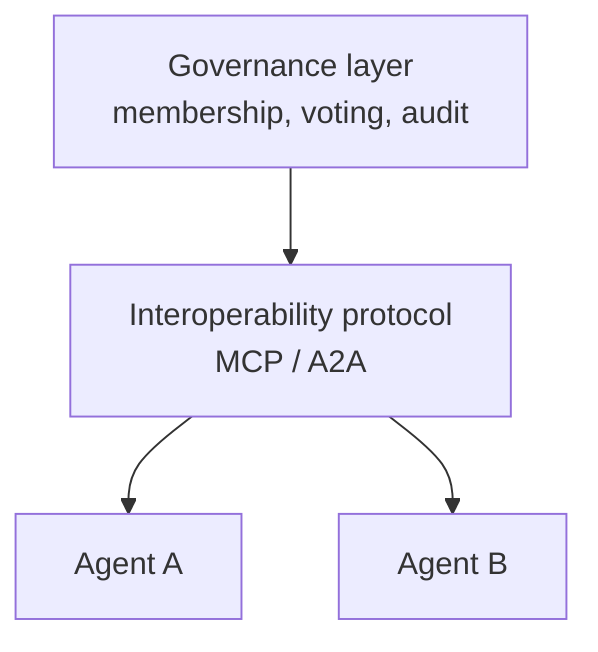

# Governance Layer for Agent Interoperability Protocols

> Interoperability protocols like MCP and A2A coordinate agent tasks but cannot express governance — voting, escalation, or audit — so build that separately.

Agent interoperability protocols standardize task-oriented coordination — identity, capability discovery, tool access, and message exchange — but they do not encode governance. If you are building a multi-agent fleet that must make collective decisions under governance constraints, you implement membership, voting, dissent preservation, human escalation, and audit out-of-band, on a layer above the protocol. A 2026 gap analysis scored five protocols (MCP, A2A, ACP, ANP, ERC-8004) against a six-dimension governance taxonomy and found every one scored at most 2 of 12 possible points ([Governance Gaps in Agent Interoperability Protocols](https://arxiv.org/abs/2606.31498)).

## The six governance dimensions

Use these as a requirements checklist when you assess whether your stack governs its agents or merely connects them ([arxiv 2606.31498](https://arxiv.org/abs/2606.31498)):

| Dimension | What it covers |
|-----------|----------------|
| Membership | Admission, invitation, removal, and role assignment for participants |
| Deliberation | Structured argument exchange with turn-taking and challenge or response |
| Voting | Preference aggregation with quorum and position resolution |
| Dissent preservation | Retaining minority positions in a decision's output |
| Human escalation | Routing a decision to human authority when conditions are met |
| Audit and replay | Tamper-evident event logs that let you reconstruct the process |

In the paper's scoring, voting, dissent preservation, and human escalation were absent from all five protocols, and deliberation was missing or only partial ([arxiv 2606.31498](https://arxiv.org/abs/2606.31498)). The protocols treat an agent as a task worker, not a community participant.

## Applying the pattern

Put governance in its own layer and let the protocol stay a thin transport. The protocol can carry governance messages — an admission grant, a vote, a recorded dissent, an escalation trigger — but it moves them as opaque payloads and cannot interpret, validate, or enforce their meaning ([arxiv 2606.31498](https://arxiv.org/abs/2606.31498)). Your governance layer holds the membership roster, tallies votes, preserves dissent, decides when to escalate to a human, and writes the tamper-evident log. Vendor-neutral practitioners reach the same split: MCP and A2A are stateless standards that "do not track what an agent did, what data it accessed, or how its outputs were used," so audit trails, policy enforcement, and lineage live above the protocol ([Atlan](https://atlan.com/know/agent-interoperability-protocols/)).

## Why it works

The protocols coordinate well because they standardized the primitives of a single request between two parties — discover a capability, delegate a task, track its lifecycle, collect a result ([A2A specification](https://a2a-protocol.org/latest/specification/); [Model Context Protocol](https://modelcontextprotocol.io)). Governance is a property of a group deciding over time, not of one exchange: a quorum, a preserved minority view, a replayable history. That is a different unit of analysis the protocols never modeled, which is why the paper calls governance "a missing architectural layer above current interoperability standards, not a missing feature within them" ([arxiv 2606.31498](https://arxiv.org/abs/2606.31498)). Separating the layers is the same move as putting routing above the link layer: a distinct concern over a distinct object.

## When this backfires

The pattern adds cost without value in several cases, so scope it to fleets that actually make governed collective decisions:

- Single-orchestrator fleets. When every agent runs in one runtime, the orchestrator already enforces membership, voting, and audit natively, so a cross-protocol governance layer duplicates what you have.
- Plain task-delegation pipelines. When agent A calls agent B for a result, there is no vote, dissent, or membership to preserve, and the six-dimension layer is over-engineering.
- Low-stakes or unregulated work. Without a compliance, audit, or human-escalation requirement, building the layer is effort spent on a control no one needs.
- Early prototypes. Standing up governance infrastructure before the product settles slows iteration for no gain.

There is also a framing caveat. The absence of governance primitives can be read as correct separation of concerns rather than a defect — governance is org-specific, and baking contested design choices into a wire protocol would ossify and fragment it. Either reading yields the same advice: implement governance out-of-band and do not expect the protocol to provide it.

## Example

The paper lists the governance messages current protocols cannot natively express — a concrete checklist for what your out-of-band layer owns ([arxiv 2606.31498](https://arxiv.org/abs/2606.31498)):

- `ADMIT` — admit an agent with endorsements and a role (membership)
- `CHALLENGE` — raise an evidence-backed claim against another claim (deliberation)
- `VOTE_BLIND` — cast a sealed preference on a continuous scale (voting)
- `DISSENT_RECORD` — preserve a minority position with its rationale (dissent preservation)
- `ESCALATE` — trigger human review at a confidence threshold (human escalation)
- `EVENT` — append a tamper-evident governance action to the log (audit and replay)

A protocol like A2A can transport each of these inside a task or message payload, but the receiving agent, not the protocol, must enforce the roster check, tally, quorum, and log — so that logic belongs in your governance layer.

## Key Takeaways

- Interoperability protocols standardize task coordination, not governance; every protocol measured scored at most 2 of 12 on a six-dimension governance taxonomy.
- Voting, dissent preservation, and human escalation are absent across MCP, A2A, ACP, ANP, and ERC-8004.
- Treat the six dimensions — membership, deliberation, voting, dissent preservation, human escalation, audit and replay — as a requirements checklist.
- Implement governance as a separate layer above the protocol; the protocol can carry governance messages but cannot enforce their meaning.
- Skip the layer for single-orchestrator fleets, plain delegation pipelines, and low-stakes work.

## Related

- [MCP: The Open Protocol Connecting Agents to External Tools](mcp-protocol.md)
- [Agent-to-Agent (A2A) Protocol for AI Agent Development](a2a-protocol.md)
- [OpenTelemetry for Agent Observability](opentelemetry-agent-observability.md)
- [SUDP: Secret-Use Delegation Protocol for Agentic Systems](sudp-secret-use-delegation-protocol.md)
- [Blast Radius Containment: Least Privilege for AI Agents](../security/blast-radius-containment.md)
