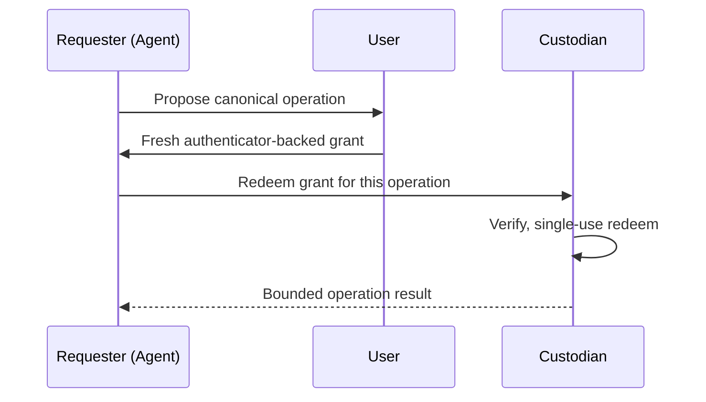

# SUDP: Secret-Use Delegation Protocol for Agentic Systems

> SUDP names the agentic-secrets problem and prescribes a three-role protocol — requester proposes, user authorizes, custodian redeems once — so a compromised agent never holds reusable authority.

## The Authorization-by-Exposure Problem

Bearer-secret interfaces — API keys, OAuth bearer tokens, refresh tokens — implement authorization by exposure: enabling action means placing a reusable secret, or a reusable artifact derived from it, inside the model-steerable boundary. A transient prompt-injection or tool-side compromise becomes durable account compromise because the exfiltrated artifact remains valid for arbitrary future operations ([Yu, Geng, Knottenbelt 2026](https://arxiv.org/abs/2604.24920)).

Existing controls cover adjacent pieces — secret storage (HashiCorp Vault, AWS Secrets Manager), scoped delegation (OAuth scopes), sender-constrained tokens ([DPoP / RFC 9449](https://datatracker.ietf.org/doc/html/rfc9449)), and runtime monitoring — but no single specification addresses the combined agentic obligation: an untrusted autonomous requester causing a user-authorized secret-backed operation without exposing reusable authority to the requester ([Yu, Geng, Knottenbelt 2026](https://arxiv.org/abs/2604.24920)).

## Agent Secret Use (ASU)

The paper formalizes the problem as Agent Secret Use and derives a property taxonomy that separates *structural* obligations (what any solution must do) from *realization-level* robustness conditions (what a concrete construction must establish). The structural properties:

| Property | What it means |
|----------|---------------|
| **Verifiable authorization** | The custodian can verify that the user authorized this specific operation |
| **Operation-bound** | A grant authorizes one canonical operation, not arbitrary use of the secret |
| **Single-use** | A grant redeems exactly once; replay yields nothing |
| **Storage confidentiality** | Secrets at rest are protected against custodian-storage compromise |
| **Wrapping-epoch key isolation** | Compromise of one epoch's wrapping key does not unwrap other epochs' secrets |

Plaintext-level forward secrecy of the underlying secret is *not* a structural property of the protocol — it requires the environment to rotate and revoke the secret independently ([SUDP abstract](https://arxiv.org/abs/2604.24920)).

## The Three Roles

- **Requester** — the agent. Proposes a canonical operation. **Does not retrieve secrets.**
- **User** — the principal. Authorizes the proposed operation by issuing a fresh authenticator-backed grant.
- **Custodian** — the secret holder. Redeems the grant **once** to perform the bounded operation.

Reusable authority never crosses the requester boundary. A compromise of the requester yields at most one operation, not durable account access ([Yu, Geng, Knottenbelt 2026](https://arxiv.org/abs/2604.24920)).

## How SUDP Differs from Adjacent Mechanisms

| Mechanism | What it solves | Gap SUDP addresses |
|-----------|----------------|--------------------|
| OAuth 2.0 scopes | Coarse-grained access control | Scopes are reusable across calls; SUDP grants are operation-bound and single-use |
| [DPoP](https://datatracker.ietf.org/doc/html/rfc9449) | Sender-binding tokens to a key | DPoP-bound tokens still authorize many operations; SUDP authorizes one |
| [Scoped credentials proxy](../security/scoped-credentials-proxy.md) | Holds the credential outside the sandbox | The proxy still presents reusable authority upstream; SUDP makes upstream authority single-use |
| Macaroons | Decentralized attenuation | Capability is still bearer-style and reusable until expiry |
| [Secrets management for agents](../security/secrets-management-for-agents.md) | Keeps secrets out of context | Process boundary, not protocol boundary; once a tool runs, it can call the secret repeatedly |

SUDP composes with these — it does not replace process isolation, scope minimization, or sender-binding. It adds a protocol-level guarantee that a stolen requester-side artifact authorizes at most one operation ([Yu, Geng, Knottenbelt 2026](https://arxiv.org/abs/2604.24920)).

## Status and Limits

SUDP is a single April 2026 preprint with no reference implementation, no RFC track, and no independent cryptographic review. Treat it as a **vocabulary and problem framing**, not a deployable protocol:

- ASU is useful for evaluating whether an existing secrets architecture leaks reusable authority into the agent boundary
- The three-role decomposition guides the design of custom custodian services around long-lived secrets that an agent must cause to be used
- End-to-end adoption requires a custodian implementation per upstream service — bearer-only upstreams need a custodian intermediary that itself becomes the high-value target

When SUDP-style guarantees matter but no custodian exists, compose available mechanisms: short-lived [scoped credentials behind a proxy](../security/scoped-credentials-proxy.md), DPoP-bound tokens where the upstream supports them, and per-operation grant issuance from a secrets manager.

## When the Cost Outweighs the Benefit

- **Low-blast-radius credentials, single user, single machine** — operational complexity exceeds the risk reduction over [environment variable injection](../security/secrets-management-for-agents.md) and a sandbox
- **Chatty interactive workflows** — single-use, operation-bound grants force a round-trip per call; latency dominates for REPL, streaming, or fine-grained tool loops
- **No custodian exists for the target service** — bearer-only upstreams force a wrapping intermediary that re-introduces a reusable artifact at a new boundary

## Example

A coding agent needs to post deployment results to a Slack channel. The current credential is a long-lived bot token with `chat:write` across every channel the bot belongs to.

**Without SUDP** — the bot token is injected as `SLACK_BOT_TOKEN`. A prompt injection in a fetched URL convinces the agent to call `chat.postMessage` to a different channel with attacker-controlled content. The token also remains valid for any future call until rotated.

**With a SUDP-style custodian** — the agent (requester) proposes `chat.postMessage(channel=#deploys, text=<hash>)`. The user (or a policy proxy acting for the user) issues a single-use grant bound to that exact operation. The Slack-side custodian verifies the grant, redeems it once, and posts the message. A stolen grant authorizes one already-approved post; the bot token never leaves the custodian.

No production Slack-side custodian exists yet — SUDP describes the target shape. The same shape is approximable today with a [scoped credentials proxy](../security/scoped-credentials-proxy.md) that validates each request's `channel` and `text` against a per-request allowlist before attaching the token, and that rotates a short-lived token per validated request.

## Key Takeaways

- SUDP names the **Agent Secret Use** problem: an untrusted agent must cause a secret-backed operation without holding reusable authority
- The protocol decomposes the responsibility into three roles — requester proposes, user authorizes with a fresh authenticator, custodian redeems exactly once
- The structural properties are verifiable authorization, operation-binding, single-use redemption, storage confidentiality, and wrapping-epoch key isolation; plaintext forward secrecy needs environmental rotation
- SUDP composes with — it does not replace — sender-constrained tokens, scope minimization, secrets-manager isolation, and sandboxing
- Treat SUDP as a problem framing and design vocabulary today; deployable end-to-end use waits on reference implementations and independent review

## Related

- [Secrets Management for Agent Workflows](../security/secrets-management-for-agents.md)
- [Scoped Credentials via Proxy Outside the Agent Sandbox](../security/scoped-credentials-proxy.md)
- [Credential Hygiene for Agent Skill Authorship](../security/credential-hygiene-agent-skills.md)
- [Lethal Trifecta Threat Model](../security/lethal-trifecta-threat-model.md)
- [Designing Agents to Resist Prompt Injection](../security/prompt-injection-resistant-agent-design.md)
- [Blast Radius Containment: Least Privilege for AI Agents](../security/blast-radius-containment.md)
- [OAuth Client ID Metadata Documents (CIMD) for MCP Servers](oauth-client-id-metadata-documents.md)
