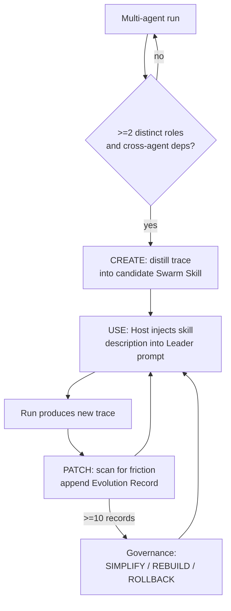

# Swarm Skills: Multi-Agent Extension of the Agent Skills Standard

> Swarm Skills is a [2026 proposal](https://arxiv.org/abs/2605.10052) extending [Agent Skills](agent-skills-standard.md) with multi-agent roles, a workflow layout, and a self-evolution lifecycle for portable coordination protocols.

## What the Spec Adds to Agent Skills

The base [Agent Skills standard](https://agentskills.io) packages single-agent task knowledge in a `SKILL.md`. Swarm Skills layers on multi-agent semantics without replacing that contract ([Swarm Skills paper](https://arxiv.org/html/2605.10052v1)):

| Field added | Purpose |
|---|---|
| `kind: swarm-skill` | Discriminator that lets a single-agent host gracefully ignore the skill via `additionalProperties: true` |
| `teammate_mode` | Interaction paradigm — e.g., `build_mode` for autonomous execution, `plan_mode` for approval workflows |
| `roles[]` | Participants; each entry carries an `id`, required skills and tools, and an optional target model |

A host that does not know the `swarm-skill` kind keeps loading the file as a regular skill and skips the unknown fields.

## File Layout

A Swarm Skill is a directory, not a single file ([Swarm Skills paper](https://arxiv.org/html/2605.10052v1)):

```
my-swarm-skill/
  SKILL.md          # frontmatter + natural-language body
  roles/            # one persona file per teammate id
    leader.md
    researcher.md
    reviewer.md
  workflow.md       # task dependency graph (sequential, parallel, fan-out/fan-in)
  bind.md           # operational boundaries: turns, token budgets, quality gates
  dependencies      # other Swarm Skills this one depends on
  evolutions.json   # runtime artifact — appended by the host, not hand-edited
```

The Host Agent loads only `SKILL.md` frontmatter to route a task. Role files, `workflow.md`, and `bind.md` are pulled on demand via the host's native `read_file` — no new DSL or runtime plugin. This extends Anthropic Skills' progressive-disclosure pattern to multi-agent metadata.

## The CREATE / USE / PATCH Lifecycle



- **CREATE** — trajectory distillation. A trace with ≥2 distinct sub-agent roles and cross-agent dependencies is synthesized by an LLM into a candidate Swarm Skill.
- **USE** — progressive disclosure. The Host reads `description` from frontmatter into the Leader prompt; full role and workflow content is loaded only after selection. Existing Evolution Records are appended to the relevant instructions.
- **PATCH** — friction-driven optimisation. Post-execution analysis scans traces for circular dependencies, redundant loops, and premature termination, then appends a new Evolution Record (Context, Change Directive, Scoring Metrics) to `evolutions.json`.

## Scoring Formula

Each Evolution Record carries a composite score that decides whether it stays, gets pruned, or triggers a rewrite ([Swarm Skills paper](https://arxiv.org/html/2605.10052v1)):

```
S_i = w_E * E + w_U * U + w_F * F
```

| Component | What it measures |
|---|---|
| **Effectiveness (E in [0,1])** | Qualitative impact of the patch, stabilised with Bayesian smoothing using a Beta(1,1) prior so early evaluations do not dominate |
| **Utilization (U in [0,1])** | Adoption rate — if the Leader consistently ignores an appended instruction, U decays |
| **Freshness (F in [0,1])** | Time-decay factor with an exponential half-life (e.g., 90 days) so stale optimisations gradually drop out |

At ≥10 records, three governance actions unlock: **SIMPLIFY** prunes via LLM categorisation (delete, merge, refine, retain); **REBUILD** rewrites the spec, archives the prior version, and clears `evolutions.json`; **ROLLBACK** reverts to any archived state.

## Reference Implementation

JiuwenSwarm is the reference Host Agent on [openJiuwen.com](https://www.openjiuwen.com/); community swarm skills are intended to live at [swarmskills.openjiuwen.com](https://swarmskills.openjiuwen.com/). The algorithm "strictly interacts with the schema defined by the Swarm Skills specification" — the authors claim this makes it portable to other multi-agent runtimes without framework-specific plugins ([Swarm Skills paper](https://arxiv.org/html/2605.10052v1)).

## What Is Not Yet Proven

The paper is a specification proposal with measurement support, not a benchmarked system. The authors call out the gaps explicitly ([Swarm Skills paper](https://arxiv.org/html/2605.10052v1)):

- **No quantitative benchmarks of the self-evolution algorithm.** The empirical work is a measurement study of 33 queries across 9 Anthropic Skills repositories crawled in April 2026 — it shows multi-role skills are being authored (e.g., `engineering-team` with 14 roles), but does not measure whether the scoring mechanism improves outcomes.
- **No conformance testing across diverse Host Agents.** Effectiveness on hosts lacking native recursive `read_file` or dynamic sub-agent spawning "remains to be empirically evaluated."
- **First-run lock-in.** A severely suboptimal initial workflow tends to accumulate patches rather than trigger REBUILD, entrenching bad decisions in an opaque chain of Evolution Records.
- **Adoption beyond the authors is unverified.** The community Swarm Skills hub is currently inaccessible to anonymous fetch.

For projects already invested in framework-native multi-agent code, the portability benefit is theoretical until a second Host Agent ships conformant support. A related critique that some "LLM swarm" framings overstate genuine swarm behaviour applies ([LLM-Powered Swarms: A New Frontier or a Conceptual Stretch?](https://arxiv.org/abs/2506.14496)).

## Key Takeaways

- Swarm Skills extends [Agent Skills](agent-skills-standard.md) with three frontmatter fields (`kind`, `teammate_mode`, `roles[]`) plus a `roles/` + `workflow.md` + `bind.md` + `evolutions.json` layout — no new DSL.
- A CREATE / USE / PATCH lifecycle distills multi-agent traces into reusable skills and appends Evolution Records on friction signals.
- Scoring is `S = w_E*E + w_U*U + w_F*F` with Bayesian-smoothed effectiveness, decaying utilisation, and exponential-half-life freshness; governance fires SIMPLIFY, REBUILD, or ROLLBACK above 10 records.
- The spec is a May 2026 proposal — no independent benchmarks of the self-evolution loop, no conformance tests on hosts other than JiuwenSwarm, and the authors flag "first-run lock-in" as an open failure mode.

## Related

- [Agent Skills: Cross-Tool Task Knowledge Standard](agent-skills-standard.md)
- [Symphony: Open Spec for Issue-Tracker-Driven Coding Agent Orchestration](symphony-orchestration-spec.md)
- [Declarative Multi-Agent Topology: Topology-as-Code](../multi-agent/declarative-multi-agent-topology.md)
- [Declarative Multi-Agent Composition](../multi-agent/declarative-multi-agent-composition.md)
- [Portable Agent Definitions: Full-Stack Identity as Code](portable-agent-definitions.md)
- [Skill Library Refinement Loops](../workflows/skill-library-refinement-loops.md)
