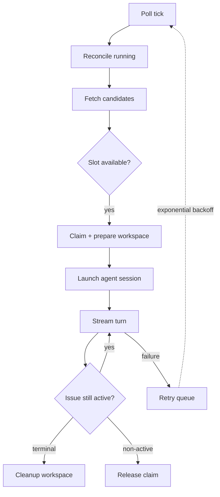

# Symphony: Open Spec for Issue-Tracker-Driven Coding Agent Orchestration

> Symphony is an open Apache 2.0 specification published by OpenAI in April 2026 for running coding agents continuously off an issue tracker — each open ticket gets a claimed workspace, an agent session, and a retry-aware lifecycle until the issue reaches a terminal state.

## What Symphony Covers

The [Symphony spec](https://github.com/openai/symphony/blob/main/SPEC.md) defines a long-running service that polls an issue tracker, claims eligible issues, prepares per-issue workspaces, runs an agent session in each, and reconciles state. The spec owns five concerns:

| Concern | What Symphony defines |
|---------|----------------------|
| Scheduling | Poll cadence, dispatch eligibility, global and per-state concurrency limits |
| Claim state | Single-authority `running` / `claimed` / `retrying` / `completed` maps |
| Workspace lifecycle | Sanitised per-issue paths under a configured root, with `after_create` / `before_run` / `after_run` / `before_remove` hooks |
| Agent session | Subprocess launch contract, multi-turn streaming, stall detection, retry with exponential backoff |
| Reconciliation | Re-fetching tracker state between turns, terminal-state cleanup, restart recovery without a database |

Out of scope: ticket comments, PR linking, tracker mutations, a workflow engine, or a mandated approval policy. Those live in the agent's tool layer or implementation policy.

## Configuration as a Single File

Symphony is configured by a repo-owned `WORKFLOW.md` with YAML front matter and a Markdown prompt body ([SPEC.md](https://github.com/openai/symphony/blob/main/SPEC.md)). The front matter declares tracker, polling, workspace, hooks, agent concurrency, and codex settings. The body is the prompt template, with `{{ issue.* }}` and `{{ attempt }}` variables.

Dynamic reload is mandatory: implementations must re-read `WORKFLOW.md` on change without restart. Invalid reloads keep the last good config and surface an operator error.

## Lifecycle and State Machine

Each run attempt advances through a fixed state machine ([SPEC.md](https://github.com/openai/symphony/blob/main/SPEC.md)):



Failure retries follow `delay = min(10000 * 2^(attempt - 1), max_retry_backoff_ms)` with a default five-minute cap. Continuation retries after a normal exit fire after one second to allow one final state check.

## Safety Invariants

The spec enforces three invariants ([SPEC.md](https://github.com/openai/symphony/blob/main/SPEC.md)):

- Agent launches with `cwd == workspace_path`, verified before subprocess spawn.
- Workspace path stays inside the configured `workspace.root`, enforced via prefix-containment on absolute paths.
- Workspace directory keys are sanitised to `[A-Za-z0-9._-]`; other characters become underscores.

Approval, sandbox, and user-input policies are deliberately implementation-defined, but each implementation must document its chosen posture.

## Where Symphony Sits Among Open Specs

Symphony covers a different layer from MCP, A2A, and AGENTS.md.

| Spec | Layer | Connects |
|------|-------|----------|
| [MCP](mcp-protocol.md) | Tool access | Agent ↔ external tool/server |
| [A2A](a2a-protocol.md) | Inter-agent | Agent ↔ remote agent over HTTP |
| [AGENTS.md](agents-md.md) | Project context | Repository ↔ any AI coding tool |
| Symphony | Orchestration | Issue tracker ↔ per-issue agent run |

A Symphony deployment can use MCP for the agent's tool layer and AGENTS.md for project context inside each workspace. Symphony sits above those specs, defining how runs are scheduled and bounded.

## Vendor Coupling Reality

The spec is open, but adoption today is narrow ([openai/symphony](https://github.com/openai/symphony) and [SPEC.md](https://github.com/openai/symphony/blob/main/SPEC.md)):

- **Tracker adapter v1**: Linear only. The spec's tracker interface is generalisable, but no other adapter ships in the reference implementation.
- **Agent runtime v1**: Codex App Server only. The launch contract hardcodes `codex app-server` and assumes the Codex protocol's session/turn events.
- **Reference implementation**: Elixir. OpenAI invites reimplementation in any language but does not commit to maintaining Symphony as a standalone product.
- **Status**: Described by OpenAI as a "low-key engineering preview for testing in trusted environments" — not production-ready.

Symphony is a published reference architecture for issue-tracker-driven orchestration, not a settled cross-vendor protocol. Non-OpenAI agents or non-Linear trackers require rebuilding both adapter layers before adoption.

## Example

A minimal `WORKFLOW.md` for a Linear project, drawn from the spec's documented schema ([SPEC.md](https://github.com/openai/symphony/blob/main/SPEC.md)):

```yaml
---
tracker:
  kind: linear
  api_key: $LINEAR_API_KEY
  project_slug: ABC
  active_states: [Todo, "In Progress"]
  terminal_states: [Closed, Cancelled, Done]

polling:
  interval_ms: 30000

workspace:
  root: ~/agent_workspaces

hooks:
  after_create: |
    git clone https://github.com/example/repo.git .
  before_run: |
    npm install

agent:
  max_concurrent_agents: 10
  max_turns: 20
  max_retry_backoff_ms: 300000

codex:
  command: "codex app-server"
  approval_policy: "auto"
---
You are fixing issue {{ issue.identifier }}: {{ issue.title }}

{{ issue.description }}

This is retry attempt {{ attempt }}.
```

Each Linear issue in `Todo` or `In Progress` is claimed, given a sanitised workspace, and handed to a Codex session with the rendered prompt. The claim releases when the issue reaches a terminal state.

## When This Backfires

Symphony's design assumptions break in three conditions:

- **Vague tickets** — the agent receives only the rendered issue title, description, labels, and blockers. There is no human-in-the-loop refinement step between ticket and code, so low-quality tickets produce low-quality PRs.
- **Validation capacity below generation throughput** — OpenAI reports a 500% internal increase in landed PRs ([openai/symphony](https://github.com/openai/symphony)), but PR throughput is not productivity. As [Addy Osmani observes](https://addyo.substack.com/p/the-80-problem-in-agentic-coding), generation scales while review, test, and governance do not. Without scaled review capacity, a Symphony deployment creates a queue of unreviewed PRs.
- **Cross-agent coordination** — Symphony is one-agent-per-issue with no inter-agent messaging. Tasks needing peer coordination (an [A2A](a2a-protocol.md) use case) must be split into separate tickets, which Symphony does not orchestrate as a graph.

## Key Takeaways

- Symphony is an open Apache 2.0 spec for issue-tracker-driven coding-agent orchestration, with a defined lifecycle, retry model, and safety invariants
- Scope is narrow: scheduling, claim state, workspace lifecycle, session launch, and reconciliation — not tracker mutation, not workflow graphs, not approval policy
- Configuration lives in a single `WORKFLOW.md` that supports dynamic reload without restart
- v1 adapters are Linear-only and Codex-only; Symphony is a reference architecture today, not a cross-vendor protocol
- Symphony complements MCP, A2A, and AGENTS.md rather than replacing them — it is the orchestration layer above tool, peer-agent, and project-context specs

## Related

- [Agent-to-Agent (A2A) Protocol](a2a-protocol.md)
- [MCP: The Plumbing Behind Agent Tool Access](mcp-protocol.md)
- [AGENTS.md: A README for AI Coding Agents](agents-md.md)
- [Orchestrator-Worker Pattern](../multi-agent/orchestrator-worker.md)
- [Plugin and Extension Packaging](plugin-packaging.md)
