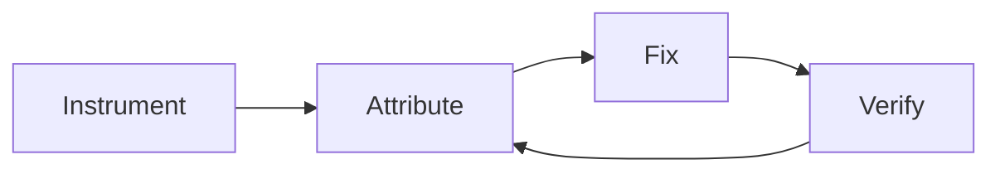

# Token-Cost Profiling and Reduction for Always-On Agentic Workflows

> An instrument-attribute-fix-verify loop that turns recurring agentic workflows into a measurable cost surface, with named levers and frequency-weighted preconditions.

## When the loop pays back

The instrument-attribute-fix-verify loop is worth the engineering hours under three preconditions. Outside them, "accept the API bill" is the rational default.

- High-frequency runs. GitHub's published case study shows a 62% reduction on Auto-Triage Issues (6.8 runs/day) dominated a 19% reduction on Daily Compiler Quality (once a day) by absolute dollars — frequency is the multiplier, not per-run cost ([GitHub Blog: Improving token efficiency in GitHub Agentic Workflows](https://github.blog/ai-and-ml/github-copilot/improving-token-efficiency-in-github-agentic-workflows/)).
- Stable prompts and tool sets. Profiling before the workflow stabilizes optimizes a moving target, and each prompt edit or MCP-server upgrade invalidates prior attribution. The same auditor's [public report for 2026-03-02](https://github.com/github/gh-aw/discussions/19197) recorded a 37% aggregate drop and a per-run rise from 430–715K to 1.39M tokens — workflows kept getting more complex, swamping the optimization.
- Downstream measurement of output behavior. Input-side optimizations that ignore output can backfire. In a pre-registered trial of prompt compression for task orchestration, aggressive compression at r=0.2 reduced input tokens 62% but raised total cost 1.8% because the model compensated with longer responses ([Prompt Compression in Production Task Orchestration, 2026](https://arxiv.org/html/2603.23525v1)).

If a workflow is sub-daily, the prompt is in active iteration, or there is no output-side metric, prefer the cheaper moves — switch to a cheaper model class for the obvious wins, enable prompt caching on the static prefix, and revisit when the workflow stabilizes.

## The three structural costs

Always-on workflows accumulate three costs that are not visible at the per-invocation level. Each fix in the loop targets one of these mechanisms.

| Cost mechanism | What it looks like | Lever that addresses it |
|---|---|---|
| Tool-definition payload re-sent every turn | 5 MCP servers × 30 tools ≈ 30–60K tokens of metadata per turn, 25–30% of a 200K-token context ([Junia AI: MCP Context Window Problem](https://www.junia.ai/blog/mcp-context-window-problem); upstream [claude-code #20421](https://github.com/anthropics/claude-code/issues/20421)) | Prune the manifest; load tools lazily |
| Deterministic data-gathering inside the LLM loop | `gh issue view`, label scans, diff retrieval — each requires an LLM round-trip to decide-call-receive | Move to a pre-agentic CLI step that writes a workspace artifact |
| Frequency-multiplied small inefficiencies | A 5% per-run waste on 100 runs/day is 5 runs/day of pure overhead | Cost-weight every metric by runs/day before prioritizing |

## The loop



### Layer 1: Instrument

Capture every API call in a normalized JSONL artifact regardless of agent framework. GitHub's implementation routes all provider traffic through an API proxy that writes a `token-usage.jsonl` per run containing input tokens, output tokens, cache-read tokens, cache-write tokens, model, provider, and timestamps ([GitHub Blog](https://github.blog/ai-and-ml/github-copilot/improving-token-efficiency-in-github-agentic-workflows/)). The proxy matters because each agent framework exposes usage in a different shape — a per-call schema lets one auditor read across them.

Where teams already run [OpenTelemetry for AI Agent Observability](../standards/opentelemetry-agent-observability.md), the same data lands on `gen_ai.usage.input_tokens`, `gen_ai.usage.output_tokens`, and `gen_ai.operation.name` with parent/child span trees attaching tool calls to the LLM call that triggered them ([OpenTelemetry GenAI semantic conventions](https://opentelemetry.io/docs/specs/semconv/gen-ai/)). OTel is the cross-vendor surface when Claude Code, Copilot, and Cursor run side by side.

### Layer 2: Attribute

Raw token counts mislead because output tokens cost roughly 4× input and models differ in price per token. GitHub's Effective Tokens (ET) metric collapses both:

```
ET = m × (1.0 × input + 0.1 × cache_read + 4.0 × output)
where m = 0.25 (Haiku), 1.0 (Sonnet), 5.0 (Opus)
```

The 4× output weight matches API pricing; the 0.1× cache-read weight matches the 90% discount on prompt-cache reads ([GitHub Blog](https://github.blog/ai-and-ml/github-copilot/improving-token-efficiency-in-github-agentic-workflows/)). The same auditor then aggregates by workflow, flags anomalous runs, and surfaces the most expensive jobs — the [2026-03-02 Daily Copilot Token Consumption Report](https://github.com/github/gh-aw/discussions/19197) tracks high-cost workflows, run frequency, process inefficiency, and operational overhead as four categories.

Prioritize by `ET/run × runs/day`, not `ET/run`. The published cuts on incremental indexing (70–80% projected) and CI Failure Doctor deduplication (40–60% projected) ranked highest precisely because both workflows ran many times a day ([gh-aw Discussion #19197](https://github.com/github/gh-aw/discussions/19197)).

### Layer 3: Fix

Five levers, ordered by yield in the GitHub case study:

- MCP tool pruning. Tool manifests add 10–15 KB per turn even when unused. GitHub's Smoke Claude dropped 59% from aggressive MCP tool pruning combined with a Haiku model-tier switch ([GitHub Blog](https://github.blog/ai-and-ml/github-copilot/improving-token-efficiency-in-github-agentic-workflows/)). Cross-reference the manifest against the actual call log — if a tool never appears in `token-usage.jsonl`, it should not be in the manifest.
- Pre-agentic CLI substitution. Move deterministic reads out of the LLM loop. Auto-Triage saved 62% by running `gh` commands before the agent started and writing the result to a workspace file the agent read directly — no decide-call-receive round-trip ([GitHub Blog](https://github.blog/ai-and-ml/github-copilot/improving-token-efficiency-in-github-agentic-workflows/)).
- Relevance gating. Skip the LLM entirely for inputs the workflow does not apply to. Security Guard dropped 43% by adding a cheap upstream check that bypasses the model for non-security PRs ([GitHub Blog](https://github.blog/ai-and-ml/github-copilot/improving-token-efficiency-in-github-agentic-workflows/)).
- Cheaper-model routing for narrow steps. Per [Cost-Aware Agent Design](cost-aware-agent-design.md), validation-cheap steps cascade from a fast model with deterministic-gate escalation. Combine with prompt caching: cache writes cost 1.25×, cache reads cost 0.1× — a 10K-token static prefix reused 10 times costs 22,500 vs 110,000 uncached, a 79% reduction (min prefix 1,024–4,096 tokens depending on model; 5-min TTL refreshed at no cost on each hit) ([Anthropic Prompt Caching docs](https://platform.claude.com/docs/en/build-with-claude/prompt-caching)).
- Configuration repair. One GitHub workflow hit a 64-turn fallback loop because bash patterns blocked the tool it needed ([GitHub Blog](https://github.blog/ai-and-ml/github-copilot/improving-token-efficiency-in-github-agentic-workflows/)). Misconfiguration shows up in the auditor as anomalously high per-run cost — investigate before optimizing the average.

### Layer 4: Verify

A fix that lowers input tokens but raises output tokens has not saved money. Re-run the workflow set after every change and confirm ET trends down both at the workflow level and the aggregate. The pre-registered orchestration trial showed light compression (r=0.8) raising costs 14.1% from output expansion alone — without an output-side metric the regression is invisible ([Prompt Compression in Production Task Orchestration](https://arxiv.org/html/2603.23525v1)).

GitHub closes the loop with two agentic workflows: a Daily Token Usage Auditor that aggregates and ranks; a Daily Token Optimizer that reads the source plus recent logs and opens a GitHub issue proposing a specific fix ([GitHub Blog](https://github.blog/ai-and-ml/github-copilot/improving-token-efficiency-in-github-agentic-workflows/)). The optimizer is itself an always-on workflow — apply the same preconditions before running it.

## Triggers and constraints

- Auditor: daily schedule, read-only access to `token-usage.jsonl` archives and source workflow files. Authority bound to opening GitHub issues only — no write access to production workflow configs.
- Optimizer: triggered by an auditor-flagged issue. May read logs and propose source changes as a PR. Authority bound to one PR per issue; merging is human-gated to catch regressions the optimizer cannot see (quality on the [routed-cheap path](cost-aware-agent-design.md), for example).
- Proxy / OTel exporter: always-on alongside the workflow itself. Failure must not block the workflow — the loop tolerates missing data points, not blocked runs.

## Why it works

The three structural costs are invisible inside one run and only emerge against aggregated history — the proxy, normalized log, and ET metric close that attribution gap. Each named lever maps one-to-one to a cost mechanism — the same just-in-time-loading and stable-prefix-reuse pattern the context-engineering literature names for long-running agents, applied at the workflow loop rather than the per-call boundary ([Anthropic: Effective Context Engineering](https://www.anthropic.com/engineering/effective-context-engineering-for-ai-agents); [Anthropic Prompt Caching](https://platform.claude.com/docs/en/build-with-claude/prompt-caching)). The loop converges because the optimizer closes the same data path the auditor opened — any regression surfaces on the next day's report.

## When this backfires

The three preconditions above name the dominant failure modes; four additional traps surface during execution.

- Cheaper-model routing without a quality gate. Smoke Claude saved 59% with a Haiku swap, but if the task starts failing, retries plus human triage exceed the saving. Pair every routing change with a deterministic check — see [Cost-Aware Agent Design](cost-aware-agent-design.md) for the cascade-and-validate pattern.
- Sparse data, noisy attribution. The auditor's anomaly detection needs enough runs per workflow to separate genuine waste from variance. On workflows with fewer than ~30 runs per week, anomaly flags are likely false positives — increase the aggregation window or skip the workflow.
- Tool-pruning past the floor. Removing tools the agent actually needs causes failures or wrong-tool selection from a similar-named remaining set ([Junia AI: MCP Context Window Problem](https://www.junia.ai/blog/mcp-context-window-problem)). Drive pruning from the actual call log, not intuition about what "should" be unused.
- Frontier-model price compression. Provider prices fall meaningfully year over year; this year's 19% saving may be smaller than next year's price drop. The loop pays back when the workflow set is large enough that even price-adjusted savings dominate engineering cost.

## Key Takeaways

- The loop pays back only on high-frequency, stable workflows with output-side measurement; below that bar, accept the API bill.
- Three structural costs drive always-on workflow spend: tool-definition payload, deterministic LLM round-trips, and frequency-multiplied small inefficiencies.
- Prioritize by `ET/run × runs/day`, not `ET/run` — frequency is the multiplier in every published case.
- Verify every fix against a metric that includes output tokens; input compression that ignores output regresses cost.

## Multi-tool coverage

The instrumentation surface differs by tool; the loop is tool-agnostic.

- Claude Code: capture usage via [OpenTelemetry GenAI conventions](../standards/opentelemetry-agent-observability.md); attribute with [Context-Usage Attribution](../observability/context-usage-attribution.md) and [Per-Plugin Token-Cost Attribution](../observability/plugin-token-cost-attribution.md); enable prompt caching on the static system prefix.
- GitHub Copilot agentic workflows (`gh-aw`): the canonical implementation — proxy plus `token-usage.jsonl` plus Daily Auditor and Optimizer are already wired in [github/gh-aw](https://github.com/github/gh-aw) and surface via [GitHub's daily token consumption discussions](https://github.com/github/gh-aw/discussions/19197).
- Cursor and other vendors: route through an OTel-compatible proxy that writes `gen_ai.usage.*` attributes; the same auditor logic ports across without per-vendor parsing.

## Related

- [Cost-Aware Agent Design: Route by Complexity, Not Habit](cost-aware-agent-design.md) — the per-request routing decision that complements workflow-level optimization
- [Context-Usage Attribution: Per-Source Breakdown of Agent Context](../observability/context-usage-attribution.md) — the orthogonal per-source cut (rules, skills, MCP returns) inside one session
- [OpenTelemetry for AI Agent Observability and Tracing](../standards/opentelemetry-agent-observability.md) — the cross-vendor instrumentation surface for `gen_ai.usage.*`
- [Auto-Triage Workflow](../workflows/auto-triage-workflow.md) — the canonical high-frequency always-on workflow and the GitHub case where pre-agentic CLI substitution delivered the headline 62%
- [Prototype Before Optimizing: Establish Quality Baselines Before Token Constraints](../workflows/prototype-before-optimizing.md) — why deferring optimization until the workflow stabilizes is the same logic at a different scope
- [Code Cleanliness as an Agent Cost Lever](code-cleanliness-agent-cost-lever.md) — a complementary token-cost lever under the same cheaper-than-the-savings precondition
- [Request Shaping to Cut Wasted Agent Turns](request-shaping-wasted-turns.md) — the per-request lever to reach for once profiling shows retrieval, not model choice, dominates the spend
