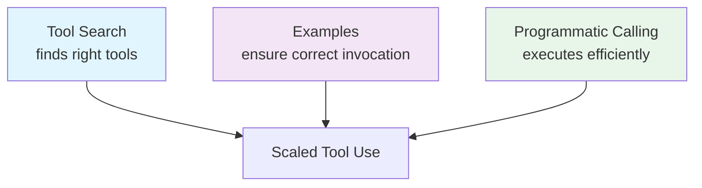

# Advanced Tool Use: Scaling Agent Tool Libraries

> Advanced tool use is a set of Anthropic API features — deferred tool loading with tool search, programmatic calling, and input examples — that trade extra orchestration for smaller context, faster inference, and higher selection accuracy once tool libraries grow past ~30 tools.

Well-designed tools ([Tool Engineering](tool-engineering.md)) and precise descriptions ([Tool Selection Guidance](tool-description-quality.md)) work at small scale. Past 30–50 tools, two problems compound: tool definitions consume the context budget before work begins, and selection accuracy degrades as the model evaluates more options. These are API-level features from [Anthropic's advanced tool use post](https://www.anthropic.com/engineering/advanced-tool-use) that address the scaling problem directly.

## The Scaling Wall

A typical multi-server MCP setup (GitHub, Slack, Sentry, Grafana, Splunk) can consume ~55K tokens in tool definitions alone — before any actual work. At scale, tool definitions become the dominant cost, not conversation content (see also [Token-Efficient Tool Design](token-efficient-tool-design.md) and [Filesystem-Based Tool Discovery](filesystem-tool-discovery.md) for design-level strategies) ([source](https://www.anthropic.com/engineering/advanced-tool-use)).

Selection accuracy also degrades — Anthropic's benchmarks show Opus 4 dropping to 49% and even Opus 4.5 reaching only 79.5% with large tool sets ([source](https://www.anthropic.com/engineering/advanced-tool-use)). The more tools available, the more likely the model picks the wrong one.

## Tool Search Tool: On-Demand Discovery

Instead of loading all tool definitions upfront, mark tools as deferred and let the model search for what it needs.

**How it works:**

1. Include a tool search tool in your tools list
2. Mark tools with `defer_loading: true` — they are not loaded into context initially
3. The model sees only the search tool plus any non-deferred tools
4. When it needs a capability, it searches by name/description
5. The API returns 3–5 relevant `tool_reference` blocks, expanded into full definitions
6. The model selects and invokes from the discovered tools

Two search variants exist:

| Variant | ID | Search Method |
|---------|-----|--------------|
| Regex | `tool_search_tool_regex_20251119` | Model constructs regex patterns |
| BM25 | `tool_search_tool_bm25_20251119` | Model uses natural language queries |

**Token impact:** ~55K → ~8.7K (85%+ reduction) ([source](https://www.anthropic.com/engineering/advanced-tool-use)). The model loads only 3–5 tools per request instead of 50+.

**Accuracy impact:** Opus 4 improved from 49% → 74%. Opus 4.5 improved from 79.5% → 88.1% ([source](https://www.anthropic.com/engineering/advanced-tool-use)).

**MCP toolset support** allows deferring entire servers while keeping high-use tools loaded:

```json
{
  "type": "mcp_toolset",
  "mcp_server_name": "google-drive",
  "default_config": { "defer_loading": true },
  "configs": {
    "search_files": { "defer_loading": false }
  }
}
```

This keeps `search_files` always available while deferring the rest of the Google Drive tools.

**Custom implementation:** You can build client-side tool search by returning `tool_reference` blocks from your own search logic, which is useful when you want custom ranking (e.g., embeddings-based retrieval) ([source](https://platform.claude.com/docs/en/agents-and-tools/tool-use/tool-search-tool#custom-tool-search-implementation)). For a client-side alternative that does not depend on API-level features, see [Filesystem-Based Tool Discovery](filesystem-tool-discovery.md).

Use when tool definitions exceed 10K tokens, you have 10+ infrequently-used tools, or you're experiencing wrong-tool selection. Skip for small tool libraries (<10 tools) or when all tools are used frequently in every session.

## Programmatic Tool Calling: Code-Based Orchestration

Instead of the model making individual tool calls through the API round-trip loop, it writes Python code that orchestrates multiple tool calls, processes intermediate results, and returns only the final output. This is the API-level implementation of the general [Filter and Aggregate in the Execution Environment](../context-engineering/filter-aggregate-execution-env.md) principle — the difference is that programmatic calling is a platform feature with built-in sandboxing.

**How it works:**

1. Mark tools with `allowed_callers: ["code_execution_20250825"]`
2. The model writes Python with `async`/`await` to call tools
3. Tool calls execute in a sandboxed Code Execution environment
4. Intermediate results are processed in the sandbox — they never enter the model's context
5. Only `stdout` from the code enters the conversation

```python
# Model writes code like this to orchestrate 20+ tool calls in one pass
team = await get_team_members("engineering")
levels = list(set(m["level"] for m in team))
budget_results = await asyncio.gather(*[
    get_budget_by_level(level) for level in levels
])
budgets = {level: budget for level, budget in zip(levels, budget_results)}
expenses = await asyncio.gather(*[
    get_expenses(m["id"], "Q3") for m in team
])

# Only the filtered result enters context
exceeded = [m for m, exp in zip(team, expenses)
            if sum(e["amount"] for e in exp) > budgets[m["level"]]["travel_limit"]]
print(json.dumps(exceeded))
```

**Token impact:** 37% reduction (43,588 → 27,297 tokens on complex multi-step research tasks) ([source](https://www.anthropic.com/engineering/advanced-tool-use)).

**Latency impact:** Eliminates 19+ inference passes by orchestrating 20+ tool calls in a single code block ([source](https://www.anthropic.com/engineering/advanced-tool-use)).

**Accuracy impact:** Knowledge retrieval improved 25.6% → 28.5% ([source](https://www.anthropic.com/engineering/advanced-tool-use)).

Use for multi-step workflows with 3+ dependent tool calls, large datasets needing aggregation, or parallel operations across many items. Skip for single-tool invocations, quick lookups, or tasks where the model should reason about intermediate results.

## Tool Use Examples: Usage Patterns Beyond Schemas

JSON schemas define what is structurally valid. Examples show what is semantically correct — format conventions, parameter correlations, and when to populate optional fields. This extends the general principle of including examples in tool definitions (see [Tool Engineering](tool-engineering.md#comprehensive-documentation)) with a structured API field that supports multiple examples showing progressive complexity.

**How it works:** Add `input_examples` to tool definitions:

```json
{
  "name": "create_ticket",
  "input_schema": { "..." },
  "input_examples": [
    {
      "title": "Login page returns 500 error",
      "priority": "critical",
      "labels": ["bug", "authentication", "production"],
      "escalation": { "level": 2, "notify_manager": true, "sla_hours": 4 }
    },
    {
      "title": "Add dark mode support",
      "labels": ["feature-request", "ui"]
    },
    {
      "title": "Update API documentation"
    }
  ]
}
```

These three examples teach the model:

- **Format conventions:** labels use kebab-case, not camelCase or spaces
- **Parameter correlations:** critical bugs get full escalation objects; feature requests don't
- **Progressive complexity:** minimal tickets exist — not everything needs every field

**Accuracy impact:** 72% → 90% on complex parameter handling in internal testing ([source](https://www.anthropic.com/engineering/advanced-tool-use)).

Use for complex nested structures, domain-specific conventions not captured in schemas, or similar tools that need examples to clarify distinction. Skip for simple single-parameter tools, standard formats (URLs, emails), or when validation concerns are better handled by JSON Schema constraints.

`input_examples` and the server-side tool search tool are mutually exclusive — the server-side tool search tool cannot surface tools that carry examples ([Anthropic tool search docs](https://platform.claude.com/docs/en/agents-and-tools/tool-use/tool-search-tool#error-handling)). Pick examples-with-standard-calling or tool-search-without-examples per catalog.

## Layering Strategy

These features address different bottlenecks. Identify yours before adding complexity:

| Bottleneck | Feature | Signal |
|-----------|---------|--------|
| Context bloat from tool definitions | Tool Search | Token counts dominated by tool schemas |
| Large intermediate results polluting context | Programmatic Calling | Multi-step workflows with data-heavy tool outputs |
| Parameter errors and malformed calls | Tool Use Examples | Recurring invocation failures on complex tools |

Start with one. Layer when the next bottleneck surfaces. The features largely compose freely, with one documented caveat: tool search is **not** compatible with tool use examples — if a tool catalog needs `input_examples` on any tool, that catalog must use standard tool calling without tool search ([Anthropic tool search docs — error handling](https://platform.claude.com/docs/en/agents-and-tools/tool-use/tool-search-tool#error-handling)). Pick one of those two per catalog; programmatic calling can layer on either.



**Practical guidance:**

- Keep 3–5 most-used tools always loaded (`defer_loading: false`); defer the rest
- Add system prompt context: *"You have access to tools for Slack, Google Drive, Jira, and GitHub. Use tool search to find specific capabilities."*
- Deferred tools are excluded from the initial prompt, keeping system prompt and core definitions cacheable

## When This Backfires

These features add complexity that is only justified by specific bottlenecks.

**Tool search backfires when:**
- Tool libraries are small or all tools are used frequently — the extra search round-trip adds latency with no benefit
- You also want tool use examples — the two features are mutually exclusive; pick whichever solves the bigger bottleneck ([source](https://platform.claude.com/docs/en/agents-and-tools/tool-use/tool-search-tool#error-handling))
- Tools have similar names or overlapping descriptions — the model may retrieve the wrong set of tools, and the failure is harder to debug than a selection miss in a flat list
- Real-world retrieval quality is below your accuracy floor — independent testing across 4,027 tools reported 56% retrieval accuracy for regex and 64% for BM25, well below Anthropic's published benchmarks ([source](https://www.arcade.dev/blog/anthropic-tool-search-4000-tools-test/))

**Programmatic calling backfires when:**
- Workflows require the model to reason about intermediate results — sandboxed execution returns only `stdout`, so intermediate reasoning is lost
- The task involves a small number of well-defined API calls in fixed order — the infrastructure overhead (sandboxing, container management) isn't justified
- Container cold starts are unacceptable — PTC containers idle out after 4.5 minutes of inactivity (30-day hard maximum), adding latency on the first call after idle ([source](https://platform.claude.com/docs/en/agents-and-tools/tool-use/programmatic-tool-calling#container-lifecycle))
- You need Zero Data Retention (ZDR) — programmatic calling runs on the code execution sandbox, which is not ZDR-eligible ([source](https://platform.claude.com/docs/en/agents-and-tools/tool-use/programmatic-tool-calling#data-retention))

**Tool use examples backfire when:**
- Examples are outdated and no longer reflect real tool behavior — the model will learn the wrong conventions
- Token overhead from verbose examples exceeds the accuracy gain for simple tools

## Key Takeaways

- Tool definitions become the dominant context cost past ~30 tools — tool search reduces this by 85%+
- Selection accuracy degrades with scale; deferred loading keeps the model choosing from a focused set of 3–5 tools
- Programmatic calling eliminates inference round-trips for multi-step workflows, cutting tokens by 37%
- Examples teach usage patterns that schemas cannot express — format conventions, parameter correlations, progressive complexity
- Layer features incrementally based on your actual bottleneck, not preemptively

## Related

- [Tool Engineering](tool-engineering.md) — designing individual tools well (prerequisite to scaling)
- [Tool Selection Guidance](tool-description-quality.md) — prompt-level guidance for tool selection
- [Filesystem-Based Tool Discovery](filesystem-tool-discovery.md) — client-side DIY alternative using file-based tool definitions
- [Token-Efficient Tool Design](token-efficient-tool-design.md) — reducing per-tool output tokens
- [Filter and Aggregate in the Execution Environment](../context-engineering/filter-aggregate-execution-env.md) — the general principle behind programmatic calling
- [Consolidate Agent Tools](consolidate-agent-tools.md) — reducing tool count as a complementary strategy
- [Tool Descriptions as Onboarding](tool-descriptions-as-onboarding.md) — using tool descriptions to teach agents capability and conventions
- [MCP Server Design](mcp-server-design.md) — designing MCP servers that work well with deferred loading and tool search
- [Tool Minimalism and High-Level Prompting](tool-minimalism.md) — reducing tool count to keep the model focused
- [Poka-Yoke for Agent Tools](poka-yoke-agent-tools.md) — mistake-proofing tool interfaces to reduce invocation errors
