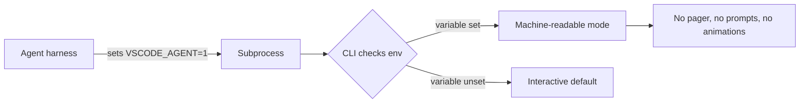

# Agent-Aware CLI Behaviour via Environment Variable

> A harness sets a well-known environment variable on every agent-initiated subprocess; CLIs that check for it switch to machine-readable output, suppress pagers and prompts, and disable progress animations. The contract works when you own both ends — harness and CLI — and degrades to a no-op against CLIs that have not adopted it.

## When This Pattern Applies

The env-var contract is not a drop-in replacement for system-prompt flag instructions. It pays off when:

- **You control the CLI**, or its maintainers honour a name your harness sets. CLIs that have never heard of `VSCODE_AGENT` ignore it.
- **The subprocess environment is preserved.** `sudo`, `docker run`, `ssh`, and CI runners strip env vars by default; inheritance breaks at any boundary that does not pass `-E` or `--env VSCODE_AGENT`.
- **Variable naming converges, or you check several.** Every harness picks its own name today; a CLI supporting "any agent" maintains an allow-list.

When those conditions hold, the agent sheds tool-specific flag knowledge. Otherwise, fall back to the [agent-side override](override-interactive-commands.md).

## The Contract

VS Code 1.121 (May 2026) ships the first widely-deployed implementation. The release notes state verbatim: "VS Code now sets a `VSCODE_AGENT` environment variable for agent-initiated terminal commands." CLIs can "switch to machine-readable output, suppress progress animations, or skip prompts that would otherwise block the session" ([VS Code v1.121 release notes](https://code.visualstudio.com/updates/v1_121)).

Claude Code implements the same shape: every spawned subprocess inherits `CLAUDECODE=1`, "Set to `1` in subprocesses Claude Code spawns (Bash and PowerShell tools, tmux sessions, hook commands, status line commands)" ([Claude Code environment variables](https://code.claude.com/docs/en/env-vars)). An undocumented `AI_AGENT=claude-code_<version>_agent` is also observable in subprocess `env`.



The CLI side is a single conditional:

```python
def is_agent() -> bool:
    return bool(os.environ.get("VSCODE_AGENT") or os.environ.get("CLAUDECODE"))

if is_agent():
    sys.stdout.reconfigure(line_buffering=True)
    disable_pager()
    disable_progress_bars()
    emit_machine_readable_errors()
```

The agent side is harness configuration, not per-call work:

```json
{
  "env": {
    "VSCODE_AGENT": "1",
    "AGENT_MODE": "1"
  }
}
```

## Two-Axis Model

The pattern is additive to `CI=true`, not a replacement. VS Code positions it explicitly: "If you maintain scripts or CLIs that already adjust behavior for CI or other agents, you can use the same pattern for commands launched from Copilot Chat" ([VS Code v1.121 release notes](https://code.visualstudio.com/updates/v1_121)).

| Variable | Signals | Set by |
|----------|---------|--------|
| `CI=true` | Non-interactive batch context | 50+ CI vendors ([watson/ci-info](https://github.com/watson/ci-info)) |
| `VSCODE_AGENT` / `CLAUDECODE` | Agent-initiated execution inside a developer session | Agent harness |
| `NO_COLOR` / `FORCE_COLOR` | Colour preference | User or harness |
| `GIT_TERMINAL_PROMPT=0` | Per-tool prompt suppression | User or harness |

CI runs are non-interactive with no user present. Agent runs are non-interactive with the user watching, and may want richer error detail than a CI mode would emit. Collapsing them to one axis loses that distinction.

## Why It Works

The contract inverts the direction of CLI-specific knowledge. Today, the agent's prompt says "always pass `--no-pager` to git, `CI=true` for npm/yarn, `-y` for apt" — N flags per CLI stored on the side that changes most often, aimed at a moving target. The env-var contract moves the locus of knowledge to the CLI's own source, where its maintainer already tracks which subcommands prompt and where pagers launch. The harness declares execution context once; the CLI decides the behaviour; the contract survives flag renames on either side ([VS Code v1.121 release notes](https://code.visualstudio.com/updates/v1_121)). This is the same mechanism that made `CI=true` succeed — `ci-info` catalogues 50+ vendors that set it and a comparable set of CLIs (`npm`, `yarn`, `gh`, `gcloud`, `pip`) that branch on it ([watson/ci-info](https://github.com/watson/ci-info)).

## Example

Claude Code sets two variables on every subprocess it spawns. Running `env | grep -E "(CLAUDE|AGENT)"` inside a Claude Code session returns:

```
AI_AGENT=claude-code_2-1-145_agent
CLAUDECODE=1
CLAUDE_CODE_SESSION_ID=<uuid>
```

A CLI written to honour the contract checks one of these variables and adapts:

```python
# Before — agent's system prompt has to remember flags
# "Always run git with --no-pager"
# "Always pass --no-progress to npm"
# "Always set CI=true before pip"

# After — CLI checks the harness signal once
if os.environ.get("VSCODE_AGENT") or os.environ.get("CLAUDECODE"):
    args = ["--no-pager"] + args  # for git wrapper
    suppress_progress = True
    auto_yes_safe_prompts = True
```

The same CLI binary serves both human and agent callers; the system prompt no longer encodes per-tool flag knowledge.

## When This Backfires

Reach for the [agent-side override](override-interactive-commands.md) or [headless mode](headless-first-services.md) when:

- **The CLI has not adopted any agent variable.** Setting `VSCODE_AGENT=1` against a tool that does not check it is a no-op; coverage today is sparse. For the long tail, you still need `--no-pager` in the system prompt.
- **Env vars do not propagate.** `sudo`, `docker run`, `ssh`, and CI runners that prune environments break the chain. The agent has to either avoid the boundary or pass `sudo -E`, `--env VSCODE_AGENT`, or `-o SendEnv=VSCODE_AGENT` — another piece of tool-specific knowledge in the prompt, the exact cost the contract was meant to eliminate.
- **`CI=true` already covers the surface.** Many CLIs (`npm`, `yarn`, `gh`, `apt-get`) already honour `CI=true`; adding a second variable is redundant for those tools.
- **The naming has not converged.** Until the ecosystem agrees on a vendor-neutral name, CLI authors face an N-variable check and users see inconsistent behaviour across harnesses.
- **The signal needs to be load-bearing for safety.** Env-var presence is not authenticated; any process can set `VSCODE_AGENT=1`. Treat the variable as a behavioural hint, not a permission gate.

## Key Takeaways

- The harness sets a well-known env var on every agent-initiated subprocess; CLIs that honour it switch to machine-readable mode without per-call flag knowledge in the prompt
- VS Code 1.121 ships `VSCODE_AGENT`; Claude Code sets `CLAUDECODE=1` and `AI_AGENT`; the shape is the same, the names diverge
- The contract is additive to `CI=true`, not a replacement — agent runs are non-interactive but the user is watching
- The pattern earns its keep when you control both the harness and the CLI; against third-party CLIs that have not adopted any variable, you still need the agent-side flag override
- Treat the variable as a behavioural hint, not an authorisation signal — any process can set it

## Related

- [Override Interactive Commands](override-interactive-commands.md)
- [Terminal Output Compression](terminal-output-compression.md)
- [Unix CLI as Native Tool Interface](unix-cli-native-tool-interface.md)
- [Reactive Environment Hooks](reactive-environment-hooks.md)
- [CLI Scripts as Agent Tools](cli-scripts-as-agent-tools.md)
