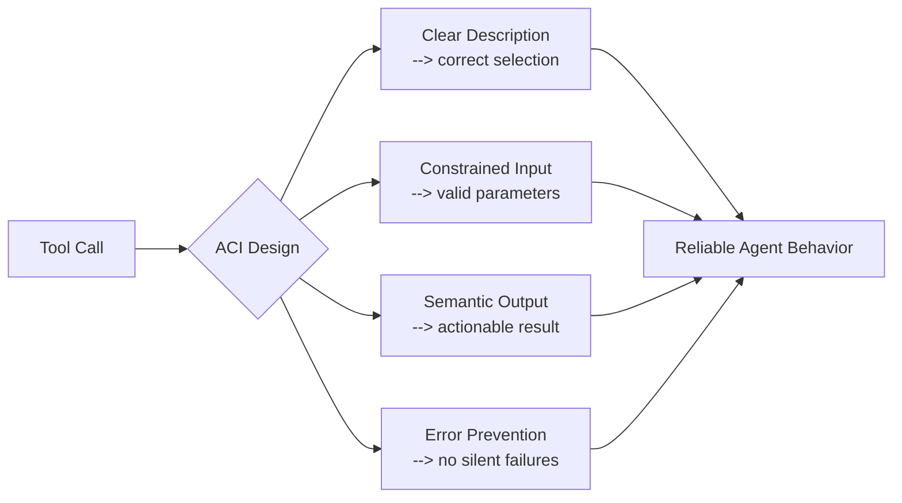

# Agent-Computer Interface (ACI): Tool Design as UX Discipline

> Tools are the agent's UI. The same principles that make human interfaces usable -- affordances, constraints, feedback, error prevention -- make agent tools effective.

## From HCI to ACI

Human-Computer Interaction (HCI) is a mature discipline: clear labels, constrained inputs, informative feedback, error prevention by design. Agent-Computer Interface (ACI) applies the same principles to the tools an LM agent uses. The term was formalized in the [SWE-agent paper](https://arxiv.org/abs/2405.15793) (Yang et al., NeurIPS 2024), which demonstrated that custom-designed tool interfaces significantly improved agent performance -- 12.5% pass@1 on SWE-bench -- without modifying model weights.

Anthropic adopted the framing directly: "Think about how much effort goes into human-computer interfaces (HCI), and plan to invest just as much effort in creating good agent-computer interfaces (ACI)." ([Building Effective Agents](https://www.anthropic.com/engineering/building-effective-agents))

## The HCI-to-ACI Mapping

Each HCI principle has a direct ACI equivalent:

| HCI Principle | ACI Equivalent | Example |
|---|---|---|
| **Affordances** | Tool descriptions and parameter docs | A tool named 'search_code' with a description stating "returns matching filenames only" tells the agent exactly what to expect |
| **Constraints** | Parameter validation, typing, enums | Requiring an absolute filepath eliminates an entire error class |
| **Feedback** | Semantic output, explicit empty-state messages | "no matches found in src/" instead of an empty array tells the agent the search worked but found nothing |
| **Error prevention** (poka-yoke) | Input validation, guardrails, middleware | A syntax-validating linter before file edits prevents malformed changes from being applied |

## Poka-Yoke: Error-Proofing for Agents

Poka-yoke (mistake-proofing) is the highest-leverage ACI technique. One constraint change can eliminate an entire failure class.

The SWE-agent team documented specific design choices: a constrained 100-line file viewer stopped context loss from full dumps; search returning filenames only improved downstream tool selection; a syntax-validating linter before edits prevented cascading failures; explicit empty-output messages replaced silent empty returns.

Anthropic's SWE-bench implementation required absolute filepaths after observing repeated directory-change errors. A single parameter constraint -- not a prompt change, not a model change -- eliminated the failure pattern. ([Building Effective Agents](https://www.anthropic.com/engineering/building-effective-agents))

Other patterns: [Loop detection](../observability/loop-detection.md) prevents repeated failed edits from consuming the context budget; middleware can inject environment knowledge automatically to reduce misunderstanding. See [Poka-Yoke Agent Tools](poka-yoke-agent-tools.md) for implementation patterns.

## Tool Description Quality Has Measurable Impact

Claude 3.5 Sonnet achieved state-of-the-art on SWE-bench after "precise refinements to tool descriptions" -- wording changes, not architecture changes. ([Writing Tools for Agents](https://www.anthropic.com/engineering/writing-tools-for-agents))

Composio reported a **10x reduction in tool failures** after applying ACI-style principles: snake_case consistency, one-atomic-action tools, explicit constraint documentation, strong typing with enums. ([Composio field guide](https://composio.dev/blog/how-to-build-tools-for-ai-agents-a-field-guide))

These gains are not incidental. Models are trained on next-token prediction against human-readable text, so tool names, descriptions, and outputs that match that distribution reduce the inferential distance between observation and next action. Conversely, opaque identifiers, silent empty returns, and unconstrained inputs all increase cognitive overhead — the agent must spend tokens reasoning about what happened and which paths remain valid. ([Writing Tools for Agents](https://www.anthropic.com/engineering/writing-tools-for-agents))

Tool descriptions are the agent's only way to understand what a tool does and what to expect back. Write them like onboarding docs for a developer who will never ask a clarifying question.

## Semantic Output Design

Return values that the agent can reason about directly:

- Return 'name' and 'file_type' instead of 'uuid' and 'mime_type' -- human-readable identifiers map directly to tokens the agent already understands, reducing the reasoning step needed to act on the result
- Structure output for the agent's next decision, not for API completeness



## Validating Your ACI

LlamaIndex recommends: **ask the agent "what arguments does this tool take?"** Discrepancies reveal gaps. ([LlamaIndex tool design](https://www.llamaindex.ai/blog/building-better-tools-for-llm-agents-f8c5a6714f11))

From Anthropic's [Advanced Tool Use](https://www.anthropic.com/engineering/advanced-tool-use) guidance: keep 3-5 most-used tools always loaded; defer the rest behind tool search; evaluate each tool definition as a context-budget item.

## Why It Works

LLMs are trained on next-token prediction against text that is predominantly human-readable — documentation, code comments, variable names derived from natural language. ([Writing Tools for Agents](https://www.anthropic.com/engineering/writing-tools-for-agents)) When tool output matches this distribution — semantic identifiers over opaque UUIDs, natural language over raw data structures — the model needs fewer inferential steps to interpret the result and select a follow-on action.

Constraints work by the same principle in reverse: they eliminate branches the agent might otherwise explore. An absolute-path requirement means the model never generates a relative-path token that would require a correction step. A 100-line window prevents the model from attempting to reason about a full file dump that would overflow the attention window. Each constraint removes one error class from the action space entirely, which is why the SWE-agent authors found interface changes more reliably effective than prompt changes — prompts guide behavior, constraints remove paths.

## When This Backfires

ACI design has real failure modes:

- **Over-specialization**: A tool tuned to one model's quirks becomes brittle when the model changes. Highly customized output formats and constrained inputs may need rework with each new model generation.
- **Hidden failures**: Middleware and validation layers intercept errors before the agent sees them. If the agent never observes raw failure signals, it cannot adapt its strategy — the tool absorbs errors the agent should be learning from.
- **Abstraction overhead**: Wrapping generic tools in ACI-friendly layers adds maintenance surface. Teams that move fast with simple tools and better prompts sometimes outperform teams maintaining complex ACI tooling.
- **Constraint mismatch**: Tight input constraints (e.g., absolute paths only) fail when the agent operates in environments where those constraints don't hold (containerized builds, cross-platform paths, dynamically mounted filesystems).

These failure modes are most pronounced when the ACI design is done once and not iterated against real agent transcripts.

## Example

A file-read tool before and after ACI redesign:

```python
# Before: generic, no constraints
def read_file(path: str) -> str:
    """Read a file."""
    return open(path).read()

# After: ACI-designed
def read_file(
    path: str,  # Must be absolute path (e.g. /home/user/project/main.py)
    start_line: int = 1,
    end_line: int = 100,
) -> str:
    """
    Read lines from a file. Returns at most 100 lines to avoid context overload.
    If the file does not exist, returns: 'ERROR: file not found at <path>'
    If start_line > file length, returns: 'ERROR: file has only N lines'
    """
    ...
```

The redesign adds: absolute-path constraint (eliminates relative-path errors), windowed output (prevents context overload), and explicit error strings instead of exceptions (semantic feedback the agent can reason about).

## Related

- [Token-Efficient Tool Design](token-efficient-tool-design.md)
- [Tool Minimalism and High-Level Prompting](tool-minimalism.md)
- [Consolidate Agent Tools](consolidate-agent-tools.md)
- [Tool Description Quality](tool-description-quality.md)
- [Write Tool Descriptions Like Onboarding Docs](tool-descriptions-as-onboarding.md)
- [Semantic Tool Output](semantic-tool-output.md)
- [Poka-Yoke Agent Tools](poka-yoke-agent-tools.md)
- [Unix CLI as Native Tool Interface](unix-cli-native-tool-interface.md)
- [Pre-Completion Checklists](../verification/pre-completion-checklists.md)
- [Advanced Tool Use](advanced-tool-use.md)
- [Tool Engineering Principles](tool-engineering.md)
- [MCP Server Design](mcp-server-design.md)
- [Typed Schemas at Agent Boundaries](typed-schemas-at-agent-boundaries.md)
- [Machine-Readable Error Responses (RFC 9457)](rfc9457-machine-readable-errors.md)
- [CLI Scripts as Agent Tools](cli-scripts-as-agent-tools.md)
- [Self-Healing Tool Routing](self-healing-tool-routing.md)
