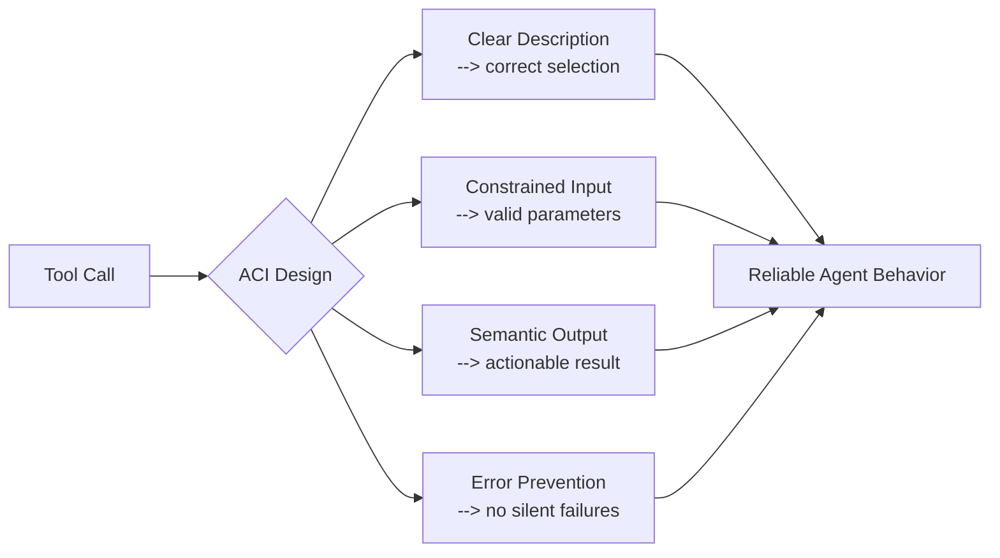

# Agent-Computer Interface (ACI): Tool Design as UX Discipline

> Tools are the agent's UI. The same principles that make human interfaces usable -- affordances, constraints, feedback, error prevention -- make agent tools effective.

## From HCI to ACI

Agent-Computer Interface (ACI) applies the discipline of Human-Computer Interaction — clear labels, constrained inputs, informative feedback, error prevention by design — to the tools an LM agent uses. The [SWE-agent paper](https://arxiv.org/abs/2405.15793) (Yang et al., NeurIPS 2024) formalized the term and showed custom tool interfaces lifted SWE-bench pass@1 by 12.5% with no change to model weights.

Anthropic adopted the framing directly: "plan to invest just as much effort in creating good agent-computer interfaces (ACI)" as in HCI. ([Building Effective Agents](https://www.anthropic.com/engineering/building-effective-agents))

## The HCI-to-ACI Mapping

Each HCI principle maps directly:

| HCI Principle | ACI Equivalent | Example |
|---|---|---|
| **Affordances** | Tool descriptions and parameter docs | A tool named 'search_code' with a description stating "returns matching filenames only" tells the agent exactly what to expect |
| **Constraints** | Parameter validation, typing, enums | Requiring an absolute filepath eliminates an entire error class |
| **Feedback** | Semantic output, explicit empty-state messages | "no matches found in src/" instead of an empty array tells the agent the search worked but found nothing |
| **Error prevention** (poka-yoke) | Input validation, guardrails, middleware | A syntax-validating linter before file edits prevents malformed changes from being applied |

## Poka-Yoke: Error-Proofing for Agents

Poka-yoke (mistake-proofing) is the highest-leverage ACI technique: one constraint change can eliminate an entire failure class.

The SWE-agent team documented several: a 100-line file viewer stopped context loss from full dumps; search returning filenames only improved downstream tool selection; a syntax-validating linter blocked cascading failures; explicit empty-output messages replaced silent returns.

Anthropic's SWE-bench implementation required absolute filepaths after repeated directory-change errors — one parameter constraint, not a prompt or model change, eliminated the failure pattern. ([Building Effective Agents](https://www.anthropic.com/engineering/building-effective-agents))

See [Loop detection](../observability/loop-detection.md) and [Poka-Yoke Agent Tools](poka-yoke-agent-tools.md) for related patterns.

## Tool Description Quality Has Measurable Impact

Claude 3.5 Sonnet achieved state-of-the-art on SWE-bench after "precise refinements to tool descriptions" -- wording changes, not architecture changes. ([Writing Tools for Agents](https://www.anthropic.com/engineering/writing-tools-for-agents))

Composio reported a **10x reduction in tool failures** after applying ACI-style principles: snake_case consistency, one-atomic-action tools, explicit constraint documentation, strong typing with enums. ([Composio field guide](https://composio.dev/blog/how-to-build-tools-for-ai-agents-a-field-guide))

Tool descriptions are the agent's only way to understand what a tool does and what to expect back. Write them like onboarding docs for a developer who will never ask a clarifying question.

## Semantic Output Design

Return values the agent can reason about directly:

- Prefer 'name' and 'file_type' over 'uuid' and 'mime_type' — human-readable identifiers map to tokens the agent already understands.
- Shape output for the agent's next decision, not for API completeness.



## Validating Your ACI

LlamaIndex recommends: **ask the agent "what arguments does this tool take?"** Discrepancies reveal gaps. ([LlamaIndex tool design](https://www.llamaindex.ai/blog/building-better-tools-for-llm-agents-f8c5a6714f11))

From Anthropic's [Advanced Tool Use](https://www.anthropic.com/engineering/advanced-tool-use) guidance: keep 3-5 most-used tools always loaded; defer the rest behind tool search; evaluate each tool definition as a context-budget item.

## Why It Works

LLMs are trained on next-token prediction against predominantly human-readable text — documentation, code comments, variable names derived from natural language. ([Writing Tools for Agents](https://www.anthropic.com/engineering/writing-tools-for-agents)) Semantic identifiers and natural-language output match that distribution, so fewer inferential steps separate the result from the next action.

Constraints work by the same principle in reverse: they eliminate branches the agent might otherwise explore. An absolute-path requirement stops the model from emitting a relative-path token that would need correcting; a 100-line window stops it from reasoning about a full-file dump. Each constraint removes one error class from the action space — which is why the SWE-agent authors found interface changes more reliably effective than prompt changes. Prompts guide behavior; constraints remove paths.

## When This Backfires

- **Over-specialization**: Tools tuned to one model's quirks break when the model changes; customized formats and constraints often need rework each generation.
- **Hidden failures**: Middleware that intercepts errors before the agent sees them prevents the agent from adapting — the tool absorbs signal it should be learning from.
- **Abstraction overhead**: Wrapping generic tools in ACI layers adds maintenance surface; teams with simple tools and stronger prompts sometimes outperform teams maintaining complex tooling.
- **Constraint mismatch**: Tight input rules (e.g., absolute paths only) fail in environments where those assumptions don't hold — containerized builds, cross-platform paths, dynamically mounted filesystems.

These failure modes surface most when ACI is designed once and not iterated against real agent transcripts.

## Example

A file-read tool before and after ACI redesign:

```python
# Before: generic, no constraints
def read_file(path: str) -> str:
    """Read a file."""
    return open(path).read()

# After: ACI-designed
def read_file(
    path: str,  # Must be absolute path (e.g. /home/user/project/main.py)
    start_line: int = 1,
    end_line: int = 100,
) -> str:
    """
    Read lines from a file. Returns at most 100 lines to avoid context overload.
    If the file does not exist, returns: 'ERROR: file not found at <path>'
    If start_line > file length, returns: 'ERROR: file has only N lines'
    """
    ...
```

The redesign adds: absolute-path constraint (eliminates relative-path errors), windowed output (prevents context overload), and explicit error strings instead of exceptions (semantic feedback the agent can reason about).

## Related

- [Token-Efficient Tool Design](token-efficient-tool-design.md)
- [Tool Minimalism and High-Level Prompting](tool-minimalism.md)
- [Consolidate Agent Tools](consolidate-agent-tools.md)
- [Tool Description Quality](tool-description-quality.md)
- [Write Tool Descriptions Like Onboarding Docs](tool-descriptions-as-onboarding.md)
- [Semantic Tool Output](semantic-tool-output.md)
- [Poka-Yoke Agent Tools](poka-yoke-agent-tools.md)
- [Unix CLI as Native Tool Interface](unix-cli-native-tool-interface.md)
- [Pre-Completion Checklists](../verification/pre-completion-checklists.md)
- [Advanced Tool Use](advanced-tool-use.md)
- [Tool Engineering Principles](tool-engineering.md)
- [MCP Server Design](mcp-server-design.md)
- [Typed Schemas at Agent Boundaries](typed-schemas-at-agent-boundaries.md)
- [Machine-Readable Error Responses (RFC 9457)](rfc9457-machine-readable-errors.md)
- [CLI Scripts as Agent Tools](cli-scripts-as-agent-tools.md)
- [Self-Healing Tool Routing](self-healing-tool-routing.md)
