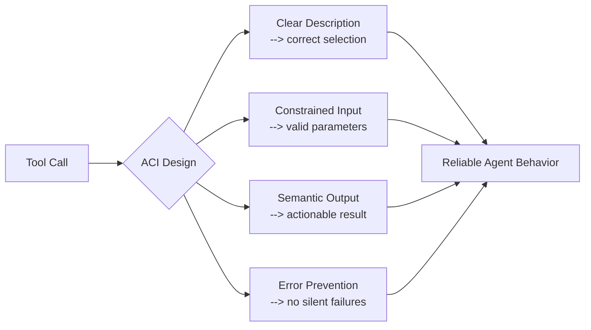

# Agent-Computer Interface (ACI): Tool Design as UX Discipline

> Tool design is an interface discipline: the same affordances, constraints, feedback, and error prevention that make human UIs usable make agent tools effective.

Related lesson: [What Makes a Tool Agent-Friendly](https://learn.agentpatterns.ai/tool-engineering/agent-friendly-tools/) — this concept features in a hands-on lesson with quizzes.

## From HCI to ACI

Agent-Computer Interface (ACI) applies Human-Computer Interaction to the tools an LM agent uses: clear labels, constrained inputs, informative feedback, and error prevention by design. The [SWE-agent paper](https://arxiv.org/abs/2405.15793) (Yang et al., NeurIPS 2024) named the term. It showed that custom tool interfaces lifted SWE-bench pass@1 by 12.5% with no change to model weights.

Anthropic adopted the framing directly: "plan to invest just as much effort in creating good agent-computer interfaces (ACI)" as in HCI. ([Building Effective Agents](https://www.anthropic.com/engineering/building-effective-agents))

## The HCI-to-ACI mapping

Each HCI principle maps directly:

| HCI Principle | ACI Equivalent | Example |
|---|---|---|
| Affordances | Tool descriptions and parameter docs | A tool named 'search_code' with a description stating "returns matching filenames only" tells the agent exactly what to expect |
| Constraints | Parameter validation, typing, enums | Requiring an absolute filepath eliminates an entire error class |
| Feedback | Semantic output, explicit empty-state messages | "no matches found in src/" instead of an empty array tells the agent the search worked but found nothing |
| Error prevention (poka-yoke) | Input validation, guardrails, middleware | A syntax-validating linter before file edits prevents malformed changes from being applied |

## Poka-yoke: error-proofing for agents

Poka-yoke (mistake-proofing) is the most effective ACI technique. One constraint change can eliminate an entire failure class.

The SWE-agent team documented several. A 100-line file viewer stopped context loss from full dumps. Search that returned filenames only improved downstream tool selection. A syntax-validating linter blocked cascading failures. Explicit empty-output messages replaced silent returns.

Anthropic's SWE-bench implementation required absolute filepaths after repeated directory-change errors. One parameter constraint, not a prompt or model change, eliminated the failure pattern. ([Building Effective Agents](https://www.anthropic.com/engineering/building-effective-agents))

See [Loop detection](../observability/loop-detection.md) and [Poka-Yoke Agent Tools](poka-yoke-agent-tools.md) for related patterns.

## Tool description quality has a measurable effect

Claude 3.5 Sonnet reached state-of-the-art on SWE-bench after "precise refinements to tool descriptions" — wording changes, not architecture changes. ([Writing Tools for Agents](https://www.anthropic.com/engineering/writing-tools-for-agents))

Composio reported a 10x reduction in tool failures after applying ACI-style principles: snake_case consistency, one-atomic-action tools, explicit constraint documentation, and strong typing with enums. ([Composio field guide](https://composio.dev/blog/how-to-build-tools-for-ai-agents-a-field-guide))

Tool descriptions are the agent's only way to understand what a tool does and what to expect back. Write them like onboarding docs for a developer who will never ask a clarifying question.

## Semantic output design

Return values the agent can reason about directly:

- Prefer 'name' and 'file_type' over 'uuid' and 'mime_type' — human-readable identifiers map to tokens the agent already understands.
- Shape output for the agent's next decision, not for API completeness.


```mermaid
flowchart LR
    A[Tool Call] --> B{ACI Design}
    B --> C[Clear Description<br/>--> correct selection]
    B --> D[Constrained Input<br/>--> valid parameters]
    B --> E[Semantic Output<br/>--> actionable result]
    B --> F[Error Prevention<br/>--> no silent failures]
    C & D & E & F --> G[Reliable Agent Behavior]
```

## Validating your ACI

LlamaIndex recommends one check: ask the agent "what arguments does this tool take?" Any discrepancy reveals a gap. ([LlamaIndex tool design](https://www.llamaindex.ai/blog/building-better-tools-for-llm-agents-f8c5a6714f11))

Anthropic's [Advanced Tool Use](https://www.anthropic.com/engineering/advanced-tool-use) guidance gives three rules: keep the 3 to 5 most-used tools always loaded, defer the rest behind tool search, and treat each tool definition as a context-budget item.

## Why it works

LLMs are trained on next-token prediction against mostly human-readable text: documentation, code comments, and variable names drawn from natural language. ([Writing Tools for Agents](https://www.anthropic.com/engineering/writing-tools-for-agents)) Semantic identifiers and natural-language output match that distribution, so fewer inferential steps separate the result from the next action.

Constraints work by the same principle in reverse: they eliminate branches the agent might otherwise explore. An absolute-path requirement stops the model from emitting a relative-path token that would need correcting; a 100-line window stops it from reasoning about a full-file dump. Each constraint removes one error class from the action space — which is why the SWE-agent authors found interface changes more reliably effective than prompt changes. Prompts guide behavior; constraints remove paths.

## When this backfires

- Over-specialization: tools tuned to one model's quirks break when the model changes, so customized formats and constraints often need rework each generation.
- Hidden failures: middleware that intercepts errors before the agent sees them stops the agent from adapting, because the tool absorbs signal it should be learning from.
- Abstraction overhead: wrapping generic tools in ACI layers adds maintenance surface, and teams with simple tools and stronger prompts sometimes outperform teams maintaining complex tooling.
- Constraint mismatch: tight input rules (for example, absolute paths only — the [poka-yoke](poka-yoke-agent-tools.md) constraint) fail where those assumptions do not hold, such as containerized builds, cross-platform paths, and dynamically mounted filesystems.

These failure modes surface most when ACI is designed once and not iterated against real agent transcripts through an [observability feedback loop](../observability/observability-feedback-loop.md).

## Example

A file-read tool before and after ACI redesign:

```python
# Before: generic, no constraints
def read_file(path: str) -> str:
    """Read a file."""
    return open(path).read()

# After: ACI-designed
def read_file(
    path: str,  # Must be absolute path (e.g. /home/user/project/main.py)
    start_line: int = 1,
    end_line: int = 100,
) -> str:
    """
    Read lines from a file. Returns at most 100 lines to avoid context overload.
    If the file does not exist, returns: 'ERROR: file not found at <path>'
    If start_line > file length, returns: 'ERROR: file has only N lines'
    """
    ...
```

The redesign adds: absolute-path constraint (eliminates relative-path errors), windowed output (prevents context overload), and explicit error strings instead of exceptions (semantic feedback the agent can reason about).

## Key Takeaways

- ACI applies HCI discipline — affordances, constraints, feedback, error prevention — to the tools an agent uses.
- Interface changes (tool descriptions, parameter constraints, output shape) have outperformed prompt and model changes on agent benchmarks.
- [Poka-yoke](poka-yoke-agent-tools.md) is the highest-leverage technique: one input constraint can eliminate an entire failure class.
- Semantic outputs and natural-language identifiers match the next-token distribution LLMs are trained on, so each result needs fewer inferential steps before action.
- ACI must be iterated against real agent transcripts — over-specialization, hidden failures, and brittle assumptions are the dominant regression modes.

## Related

- [Poka-Yoke Agent Tools](poka-yoke-agent-tools.md)
- [Tool Description Quality](tool-description-quality.md)
- [Write Tool Descriptions Like Onboarding Docs](tool-descriptions-as-onboarding.md)
- [Semantic Tool Output](semantic-tool-output.md)
- [Typed Schemas at Agent Boundaries](../multi-agent/typed-schemas-at-agent-boundaries.md)
- [Token-Efficient Tool Design](../token-engineering/token-efficient-tool-design.md)
- [Tool Engineering Principles](tool-engineering.md)
- [Tool Minimalism and High-Level Prompting](tool-minimalism.md)
- [Edit Format Selection: Diff vs. Search-Replace vs. Full Rewrite](llm-edit-format-selection.md) — an ACI decision for code edits: which output format the model should emit for reliable, token-efficient patches
