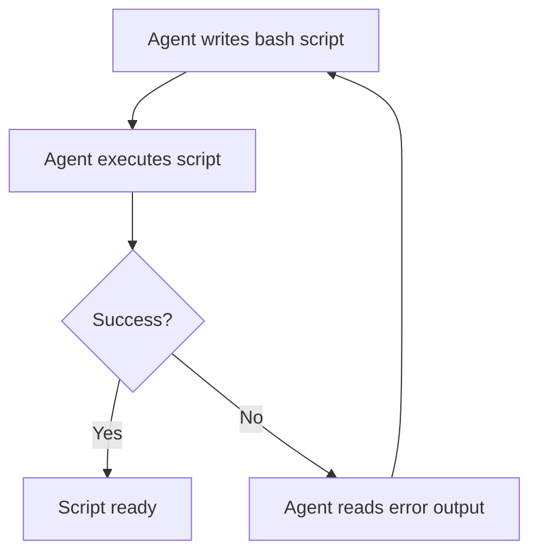

# CLI Scripts as Agent Tools: Return Only What Matters

> Write thin wrapper scripts that pre-filter system output so agents receive a decision-ready summary rather than raw command output to parse. Agents can also write and iterate on these scripts themselves through a tight write-execute-debug cycle.

## Raw Commands Waste Context

When an agent runs `kubectl get pods`, it receives hundreds of lines for a production cluster but may need only pod names and states. [Context engineering](../context-engineering/context-engineering.md) ([Anthropic](https://www.anthropic.com/engineering/effective-context-engineering-for-ai-agents)) identifies tool output as a direct context expenditure — the agent processes everything returned, useful or not. Anthropic reports a related pattern where [executing code that filters MCP tool output](https://www.anthropic.com/engineering/code-execution-with-mcp) before returning it to the model cut a representative workload from 150,000 to 2,000 tokens. Scripts that pre-filter at the source reduce that expenditure.

## The Pattern

Write a wrapper script that runs the underlying command and returns only what the agent needs for the next decision:

```bash
# Raw command — returns hundreds of lines
kubectl get pods -n production

# Wrapper script — returns what matters
#!/usr/bin/env bash
kubectl get pods -n production --no-headers \
  | awk '{print $1, $2, $3}' \
  | grep -v "Running" \
  | head -20 \
  || echo "All pods running"
```

The agent receives `"payments-worker CrashLoopBackOff 4"` instead of the full pod table. One line rather than a page.

Return structured output (JSON or concise text) when possible. Structured output is easier to parse and less likely to be misinterpreted.

## High-Value Applications

Scripts as agent tools are most effective when:

- **Log queries.** `grep` and `awk` pipelines that extract error counts or time-windowed summaries rather than streaming raw logs.
- **Database lookups.** Queries that return specific records or aggregates, not table dumps — `"ORDER-4821: shipped 2026-03-07"` rather than all joined columns.
- **API status checks.** Scripts that return a single status field or formatted summary, not the full JSON response.
- **Cloud resource inspection.** Scripts that return resource names, states, and anomalies — not raw API output with timestamps and metadata.

## Abstraction and Access Control

Scripts decouple the agent's interface from the underlying system. If a Kubernetes cluster migrates to a different orchestrator, the script changes — the tool interface does not.

Scripts also enforce read-only access as a side effect: a status script exposes no write operations, so the agent cannot mutate the system through it.

## Design Checklist

When writing a CLI script for agent consumption:

- **Filter at the source.** Remove irrelevant columns, rows, and metadata before returning.
- **Aggregate where possible.** A count is better than a list when the count is sufficient.
- **Format for parsing.** JSON or `key: value` pairs are easier to process than columnar text.
- **Bound the output.** Use `head` or query limits to prevent runaway responses from large data sets.
- **Return a clear empty state.** `"No errors found"` is more useful than empty output that the agent may misinterpret.

## Tight Feedback Loops: Agents Writing and Iterating on Scripts

A complementary pattern is agents authoring bash scripts and iterating through a write-execute-debug cycle. Bash has zero startup time, no compilation step, and surfaces errors in the same terminal context the agent already occupies.

### The Write-Execute-Debug Cycle



Each iteration costs seconds rather than the build-step overhead of compiled languages.

### Making the Cycle Effective

**Specify input/output signatures.** Give the agent explicit contracts:

```text
Write a bash script that:
- Input: a directory path as $1
- Output: JSON array of files larger than 10MB with name and size
- Exit 1 with a message if the directory does not exist
```

Clear signatures reduce iteration rounds because the first attempt is closer to correct.

**Keep scripts modular.** Monolithic scripts are harder to debug when one part fails. Design the architecture yourself and delegate components to the agent.

**Document edge cases after iteration.** Once the script works, have the agent add comments on platform assumptions (GNU vs BSD tools) for future modifications.

### When This Pattern Applies

Best for data processing pipelines, build and deployment automation, and exploratory prototyping. Less effective when the task requires complex data structures, type safety, or cross-platform compatibility.

## When This Backfires

**Script maintenance burden.** Wrappers hard-code assumptions about command output. When the underlying CLI changes its schema — a new column, a renamed field, a different exit code — the script silently breaks or produces wrong output. Every wrapper is a synchronization point.

**Over-filtering hides signals.** A script that filters to "only errors" will miss warnings that precede errors or status transitions the agent needs. Pre-filtering bets that the script author knew exactly what the agent would need — a bet that becomes wrong when incident types change.

**Hard to debug through the abstraction.** When an agent produces a wrong action, tracing the cause through a wrapper adds a layer to the investigation. Reconstructing what the raw command returned requires running it manually.

These conditions most often arise in novel incident types, rapidly evolving CLIs, and exploratory tasks where broad context beats a narrow summary.

## Example

An agent investigating a failing deployment needs to check which pods are unhealthy and retrieve recent error logs. Without wrapper scripts, it issues two raw commands and parses hundreds of lines. With wrapper scripts registered as tools, the agent gets decision-ready output.

**`check-pods.sh`** — registered as the `check_pods` tool:

```bash
#!/usr/bin/env bash
# Returns non-running pods in a namespace as JSON
NAMESPACE="${1:-production}"
kubectl get pods -n "$NAMESPACE" --no-headers \
  | awk '$3 != "Running" {printf "{\"pod\":\"%s\",\"status\":\"%s\",\"restarts\":%s}\n", $1, $3, $4}' \
  | jq -s '.' \
  || echo '[]'
```

**`pod-errors.sh`** — registered as the `pod_errors` tool:

```bash
#!/usr/bin/env bash
# Returns last 5 error-level log lines for a given pod
POD="$1"
NAMESPACE="${2:-production}"
kubectl logs "$POD" -n "$NAMESPACE" --tail=200 \
  | grep -i "error\|fatal\|panic" \
  | tail -5 \
  || echo "No errors found"
```

The agent calls `check_pods` and receives:

```json
[{"pod":"payments-worker-7f8b9","status":"CrashLoopBackOff","restarts":4}]
```

It then calls `pod_errors("payments-worker-7f8b9")` and receives:

```text
2026-03-07T14:22:01Z FATAL: connection refused: payments-db:5432
```

Two tool calls, two concise responses. The agent identifies the root cause (database connection failure) without parsing full pod tables or scrolling through log streams.

## Key Takeaways

- Raw CLI output is a direct context expenditure — wrapper scripts that pre-filter at the source reduce that cost.
- Return structured, decision-ready output (JSON or concise text); bound the output and include a clear empty state.
- Scripts double as an abstraction layer and enforce read-only access as a side effect.
- Bash enables a tight write-execute-debug cycle: specify input/output signatures, keep scripts modular, document edge cases after iteration.
- Wrappers backfire when the underlying CLI schema changes, when over-filtering hides signals, or during exploratory tasks that need broad context.

## Related

- [Token-Efficient Tool Design](token-efficient-tool-design.md)
- [Semantic Tool Output](semantic-tool-output.md)
- [Unix CLI as the Native Tool Interface for AI Agents](unix-cli-native-tool-interface.md)
- [Consolidate Agent Tools](consolidate-agent-tools.md)
- [Batch File Operations via Bash Scripts](batch-file-operations.md)
- [PostToolUse Hook for BSD/GNU Tool Miss Detection](posttooluse-bsd-gnu-detection.md)
- [Tool Selection Guidance](tool-description-quality.md)
- [Context Priming](../context-engineering/context-priming.md)
