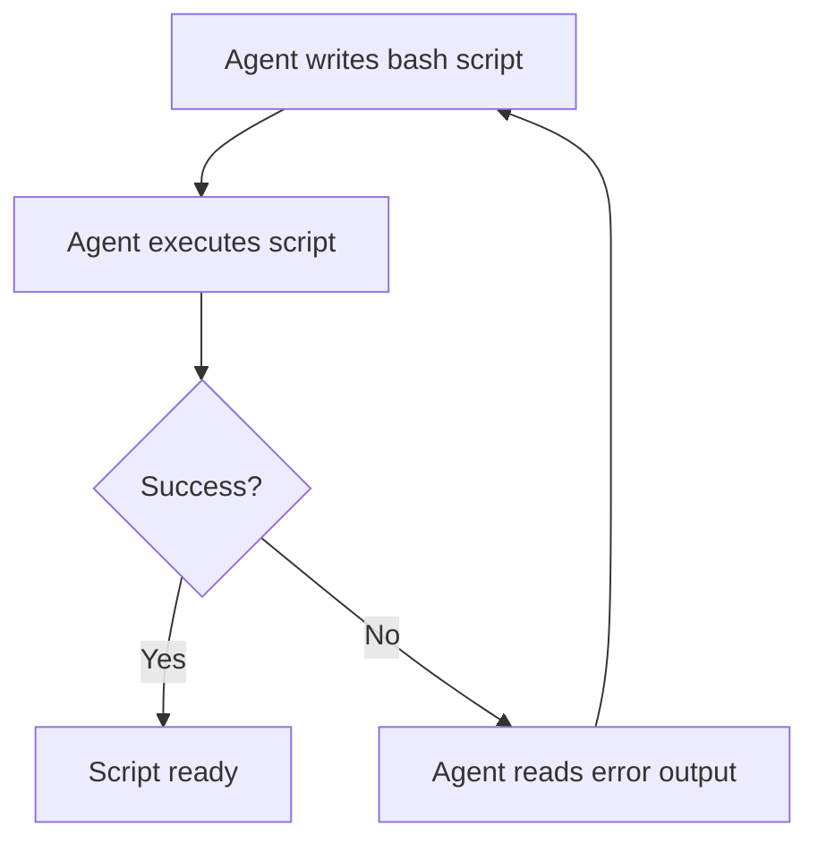

# CLI Scripts as Agent Tools: Return Only What Matters

> Write thin wrapper scripts that pre-filter system output so agents receive a decision-ready summary rather than raw command output to parse.

## Raw Commands Waste Context

When an agent runs `kubectl get pods`, it receives hundreds of lines for a production cluster but may need only pod names and states. [Anthropic's context engineering guidance](https://www.anthropic.com/engineering/effective-context-engineering-for-ai-agents) identifies tool output as a direct context expenditure — the agent processes everything returned, useful or not. Scripts that pre-filter at the source reduce that expenditure.

## The Pattern

Write a wrapper script that runs the underlying command and returns only what the agent needs for the next decision:

```bash
# Raw command — returns hundreds of lines
kubectl get pods -n production

# Wrapper script — returns what matters
#!/usr/bin/env bash
kubectl get pods -n production --no-headers \
  | awk '{print $1, $2, $3}' \
  | grep -v "Running" \
  | head -20 \
  || echo "All pods running"
```

The agent receives `"payments-worker CrashLoopBackOff 4"` instead of the full pod table. One line rather than a page.

Return structured output (JSON or concise text) when possible. Structured output is easier to parse and less likely to be misinterpreted.

## High-Value Applications

Scripts as agent tools are most effective when:

**Log queries.** `grep` and `awk` pipelines that extract error counts, specific log lines, or time-windowed summaries from log files — rather than streaming raw logs.

**Database lookups.** Queries that return specific records or aggregates, not table dumps. An agent checking order status should get `"ORDER-4821: shipped 2026-03-07"`, not all columns from all joined tables.

**API status checks.** Scripts that call an API and return a single status field or a formatted summary, not the full JSON response.

**Cloud resource inspection.** Scripts that query a cloud provider and return resource names, states, and anomalies — not raw API output with timestamps and metadata.

## Abstraction and Access Control

Scripts decouple the agent's interface from the underlying system. If a Kubernetes cluster migrates to a different orchestrator, the script changes — the agent's tool interface does not. Particularly valuable in workflows that run repeatedly.

Scripts also enforce read-only access as a side effect: an agent using a status script cannot mutate the system because the script exposes no write operations.

## Design Checklist

When writing a CLI script for agent consumption:

- **Filter at the source.** Remove irrelevant columns, rows, and metadata before returning.
- **Aggregate where possible.** A count is better than a list when the count is sufficient.
- **Format for parsing.** JSON or `key: value` pairs are easier to process than columnar text.
- **Bound the output.** Use `head` or query limits to prevent runaway responses from large data sets.
- **Return a clear empty state.** `"No errors found"` is more useful than empty output that the agent may misinterpret.

## Tight Feedback Loops: Agents Writing and Iterating on Scripts

A complementary pattern is agents creating bash scripts as the development artifact and iterating through a write-execute-debug cycle ([Source: ClaudeLog](https://claudelog.com/mechanics/tight-feedback-loops)). Bash provides the tightest agentic feedback loop available [unverified]: zero startup time, no compilation step, and error output in the same terminal context the agent already occupies.

### The Write-Execute-Debug Cycle



Each iteration costs seconds, not minutes — compiled languages add a build step and more context consumption per cycle.

### Making the Cycle Effective

**Specify input/output signatures.** Give the agent explicit contracts for what the script receives and what it should produce:

```text
Write a bash script that:
- Input: a directory path as $1
- Output: JSON array of files larger than 10MB with name and size
- Exit 1 with a message if the directory does not exist
```

Clear signatures reduce iteration rounds because the agent's first attempt is closer to correct.

**Keep scripts modular.** A monolithic script is harder to debug when one part fails. Design the architecture yourself and delegate individual components to the agent. Each script should fit within the agent's context window.

**Document edge cases during iteration.** After the script works, have the agent add comments on edge cases and platform assumptions (GNU vs BSD tools) as context for future modifications.

### When This Pattern Applies

The write-execute-debug cycle with bash is most effective for:

- **Data processing pipelines** — transforming, filtering, and aggregating files or API responses
- **Build and deployment automation** — scripts that orchestrate existing tools
- **Exploratory prototyping** — testing an approach before committing to a compiled language

Less effective when the task requires complex data structures, type safety, or cross-platform compatibility.

## Example

An agent investigating a failing deployment needs to check which pods are unhealthy and retrieve recent error logs. Without wrapper scripts, it issues two raw commands and parses hundreds of lines. With wrapper scripts registered as tools, the agent gets decision-ready output.

**`check-pods.sh`** — registered as the `check_pods` tool:

```bash
#!/usr/bin/env bash
# Returns non-running pods in a namespace as JSON
NAMESPACE="${1:-production}"
kubectl get pods -n "$NAMESPACE" --no-headers \
  | awk '$3 != "Running" {printf "{\"pod\":\"%s\",\"status\":\"%s\",\"restarts\":%s}\n", $1, $3, $4}' \
  | jq -s '.' \
  || echo '[]'
```

**`pod-errors.sh`** — registered as the `pod_errors` tool:

```bash
#!/usr/bin/env bash
# Returns last 5 error-level log lines for a given pod
POD="$1"
NAMESPACE="${2:-production}"
kubectl logs "$POD" -n "$NAMESPACE" --tail=200 \
  | grep -i "error\|fatal\|panic" \
  | tail -5 \
  || echo "No errors found"
```

The agent calls `check_pods` and receives:

```json
[{"pod":"payments-worker-7f8b9","status":"CrashLoopBackOff","restarts":4}]
```

It then calls `pod_errors("payments-worker-7f8b9")` and receives:

```text
2026-03-07T14:22:01Z FATAL: connection refused: payments-db:5432
```

Two tool calls, two concise responses. The agent identifies the root cause (database connection failure) without parsing full pod tables or scrolling through log streams.

## Unverified Claims

- Bash provides the tightest agentic feedback loop available [unverified]

## Related

- [PostToolUse Hook for BSD/GNU Tool Miss Detection](posttooluse-bsd-gnu-detection.md)
- [Token-Efficient Tool Design](token-efficient-tool-design.md)
- [Tool Selection Guidance](tool-description-quality.md)
- [Semantic Tool Output](semantic-tool-output.md)
- [Unix CLI as the Native Tool Interface for AI Agents](unix-cli-native-tool-interface.md)
- [Consolidate Agent Tools](consolidate-agent-tools.md)
- [Batch File Operations via Bash Scripts](batch-file-operations.md)
- [Context Priming](../context-engineering/context-priming.md)
- [Test-Driven Agent Development](../verification/tdd-agent-development.md)
- [Loop Detection](../observability/loop-detection.md)
- [PostToolUse Hooks: Automatic Formatting and Linting After Every File Edit](../workflows/posttooluse-auto-formatting.md)
