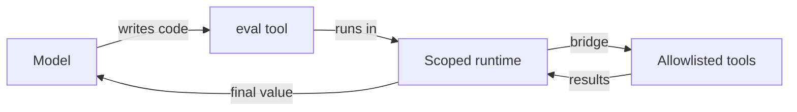

# Code Interpreter as a Primary Agent Tool

> Expose a sandboxed code interpreter as a first-class tool for tasks that are shape-of-data rather than shape-of-prose — and bound it through capability bridges, output caps, and explicit threat modeling.

A code interpreter is a small embedded runtime — typically Python or JavaScript — that the agent writes against to compose tool calls, transform structured data, and hold intermediate state outside the model context ([LangChain, 2026-05-20](https://blog.langchain.com/give-your-agents-an-interpreter/)). The pattern applies when the agent composes multiple tool calls, filters or aggregates intermediate results, or iterates over structured collections. It is not a substitute for an OS-level sandbox and it disqualifies several workload classes outright (see [When This Backfires](#when-this-backfires)).

## When to Add an Interpreter

Reach for an interpreter when at least two hold:

- The task issues three or more tool calls whose intermediate results feed the next call.
- Returns are structured (JSON, lists, tables) and need filtering or aggregation before they are useful to the model.
- Loading every intermediate result into context would exceed the attention budget or trigger [context rot](https://www.trychroma.com/research/context-rot).
- The same operation runs across many items (e.g., budget checks across 20 employees, scoring 10,000 documents).

Stay with direct tool calls for single invocations, when intermediate values are needed for the model's reasoning, or when the toolset is dominated by [MCP-connector tools that cannot be called programmatically](https://platform.claude.com/docs/en/agents-and-tools/tool-use/programmatic-tool-calling).

## How the Interpreter Sits in the Loop

The interpreter is middleware between the agent loop and a scoped runtime ([LangChain, 2026-05-20](https://blog.langchain.com/give-your-agents-an-interpreter/)). The model writes code that calls an `eval`-shaped tool; allowlisted tools cross from the runtime back to the host through explicit bridges; the final expression returns to model context.



The same shape appears in Anthropic's [Programmatic Tool Calling (PTC)](https://platform.claude.com/docs/en/agents-and-tools/tool-use/programmatic-tool-calling), [Cloudflare Code Mode](https://blog.cloudflare.com/code-mode/), and [LangChain Deep Agents interpreters](https://blog.langchain.com/give-your-agents-an-interpreter/): a narrow language runtime, capabilities added back through explicit bridges, intermediate state kept off the model context.

## Choosing the Sandbox Boundary

The interpreter's boundary determines blast radius, state preservation, and cost:

| Boundary | State across calls | Blast radius | Use when |
|----------|-------------------|--------------|----------|
| Ephemeral per-call | None | Smallest | Untrusted input, single computation per call |
| Session-scoped REPL | Variables persist between `eval` calls | Bounded to session | Multi-step composition over the same dataset |
| Shared workspace + filesystem | Files persist; processes may | Largest | Long-running agentic CI with durable artifacts |

Anthropic's managed PTC sits in the middle: containers persist for 4.5 minutes of idle, 30-day hard maximum ([Claude API docs](https://platform.claude.com/docs/en/agents-and-tools/tool-use/programmatic-tool-calling)). LangChain's QuickJS interpreter keeps a live context across `eval` calls within a turn and supports snapshotting between turns ([LangChain, 2026-05-20](https://blog.langchain.com/give-your-agents-an-interpreter/)).

## Bounding Side Effects

The interpreter starts narrow: language features only — no filesystem, no network, no shell, no package installation, no wall-time access ([LangChain, 2026-05-20](https://blog.langchain.com/give-your-agents-an-interpreter/)). Capabilities are added back through explicit bridges. At minimum, configure:

- **Capability allowlist** — only the tools the task needs cross the bridge; in PTC this is `allowed_callers: ["code_execution_20260120"]` per tool ([Claude API docs](https://platform.claude.com/docs/en/agents-and-tools/tool-use/programmatic-tool-calling)).
- **Memory limit and per-eval timeout** — caps on the runtime, not the model.
- **Maximum programmatic tool calls per eval** — prevents runaway loops.
- **Maximum result size** — caps the return value that crosses back into model context.
- **Network policy** — default-deny outbound; allowlist registries or specific APIs only.
- **Filesystem policy** — if mounted, restrict writes to a working directory under [Dual-Boundary Sandboxing](../security/dual-boundary-sandboxing.md) rules.

For tenant isolation or untrusted-input workloads, the interpreter must sit *inside* an OS-level sandbox, not replace one. LangChain is explicit: "this does not replace sandboxing when your threat model requires process or VM isolation" ([LangChain, 2026-05-20](https://blog.langchain.com/give-your-agents-an-interpreter/)). For shared tenancy, [container isolation is weaker than Firecracker microVMs](https://northflank.com/blog/best-code-execution-sandbox-for-ai-agents) — pair the interpreter with the appropriate runtime layer.

## Returning Results to Model Context

Keep the return value proportional to its information content:

- **Structured JSON** for compact, model-parseable summaries (top-k list, aggregate, verdict).
- **Truncated stdout** when the model needs a sample but not the whole result; cap the truncation explicitly.
- **Referenced artifact** (filesystem path, container id, object key) when the value is large and downstream tools will reload it on demand.

## Why It Works

The interpreter relocates intermediate state and control flow off the model's attention budget. When the agent calls 20 tools serially, each result enters context, the model re-reads everything to choose the next call, and 20 inference passes happen ([Anthropic, advanced tool use](https://www.anthropic.com/engineering/advanced-tool-use)). When the agent writes code that calls those same 20 tools, intermediate results stay in the runtime and only the filtered value crosses back. Anthropic measures 37% token reduction (43,588 → 27,297) on multi-step research benchmarks ([Anthropic, advanced tool use](https://www.anthropic.com/engineering/advanced-tool-use)); Cloudflare measures 99.9% input-token reduction on a large API and 81% on complex multi-event tasks ([WorkOS analysis](https://workos.com/blog/cloudflare-code-mode-cuts-token-usage-by-81)); LangChain's PTC-as-middleware tests show ~35% reduction on OOLONG `trec-coarse` ([LangChain, 2026-05-20](https://blog.langchain.com/give-your-agents-an-interpreter/)). Code is a denser, more accurate representation of control flow than a serialized chain of model-mediated tool calls.

## When This Backfires

- **Untrusted input domains**. The [CIBER benchmark](https://arxiv.org/abs/2602.19547) finds execution-first interpreters fail catastrophically against natural-language-disguised attacks — NL input is +14.1% attack success rate over explicit code attacks, and *higher* model capability increases susceptibility because stronger instruction adherence is exploitable. Three coding agents leaked secrets via a single prompt injection in 2026, with Anthropic's own Opus 4.7 system card noting Claude Code Security Review "is not hardened against prompt injection" ([VentureBeat, 2026](https://venturebeat.com/security/ai-agent-runtime-security-system-card-audit-comment-and-control-2026)). For agents that ingest web pages, emails, or user files, the interpreter must sit behind a separate OS-level boundary.
- **Single-step tasks**. For one tool call with a simple response, code-gen latency and runtime overhead exceed the saved round trip.
- **Regulated workloads requiring ZDR**. Anthropic's managed PTC explicitly excludes Zero Data Retention ([Claude API docs](https://platform.claude.com/docs/en/agents-and-tools/tool-use/programmatic-tool-calling)). Healthcare, financial, and government workloads under data residency rules must self-host or skip PTC.
- **MCP-connector-dominated toolsets**. PTC cannot call tools sourced from MCP-connector servers ([Claude API docs](https://platform.claude.com/docs/en/agents-and-tools/tool-use/programmatic-tool-calling)). If 80% of the agent's toolset comes from MCP connectors, the interpreter sits idle.
- **Strict-schema flows**. PTC does not support `strict: true`, `tool_choice`-forced calls, or `disable_parallel_tool_use` ([Claude API docs](https://platform.claude.com/docs/en/agents-and-tools/tool-use/programmatic-tool-calling)). Workflows that depend on these properties cannot be wrapped.
- **Interpreter as a `bash` proxy**. Without runtime controls, the agent treats the interpreter as a general shell and routes everything through it, bypassing per-tool permission gates. Memory limits, per-eval timeouts, max programmatic tool calls, max result size, and snapshot policy are not optional ([LangChain, 2026-05-20](https://blog.langchain.com/give-your-agents-an-interpreter/)).
- **Over-reliance and skipped reasoning**. Agents can default to writing code when a direct answer or single tool call would be cheaper. Measure the round-trip count before assuming the interpreter helps.

## Example

A common shape: filter a dataset across many items and return only the exceptions. Anthropic's PTC example checks budget compliance across 20 employees ([Claude API docs](https://platform.claude.com/docs/en/agents-and-tools/tool-use/programmatic-tool-calling)). Tools are marked with `allowed_callers: ["code_execution_20260120"]`; the model writes code that orchestrates 40+ tool calls in one block and returns only the exceptions:

```python
team = await get_team_members("engineering")
levels = list(set(m["level"] for m in team))
budgets = dict(zip(levels, await asyncio.gather(*[
    get_budget_by_level(level) for level in levels
])))
expenses = await asyncio.gather(*[get_expenses(m["id"], "Q3") for m in team])

# Only the filtered result enters context
exceeded = [m for m, exp in zip(team, expenses)
            if sum(e["amount"] for e in exp) > budgets[m["level"]]["travel_limit"]]
print(json.dumps(exceeded))
```

The traditional approach issues 20 separate model round-trips and pulls thousands of expense line items through the context window. The programmatic approach runs all lookups in one container, filters in-runtime, and returns only the employees who exceeded their limits ([Claude API docs](https://platform.claude.com/docs/en/agents-and-tools/tool-use/programmatic-tool-calling)).

## Key Takeaways

- Treat the interpreter as a third context surface alongside message history and the filesystem — for live working values that should not yet be model input ([LangChain, 2026-05-20](https://blog.langchain.com/give-your-agents-an-interpreter/)).
- Reach for it when the task is multi-step structured-data work; stay direct for single tool calls.
- Choose the boundary (ephemeral, session-scoped, workspace) by blast-radius needs, not convenience.
- Always set memory limit, per-eval timeout, max programmatic calls, max result size, and default-deny network.
- The interpreter does not replace OS-level isolation — pair it with [dual-boundary sandboxing](../security/dual-boundary-sandboxing.md) for untrusted input or shared tenancy.
- ZDR, MCP-connector-heavy flows, and strict-schema requirements disqualify Anthropic's managed PTC.

## Related

- [Advanced Tool Use: Scaling Agent Tool Libraries](advanced-tool-use.md) — the broader API-level features that programmatic tool calling sits inside
- [Filter and Aggregate in the Execution Environment](../context-engineering/filter-aggregate-execution-env.md) — the general principle the interpreter implements at the platform level
- [Dual-Boundary Sandboxing](../security/dual-boundary-sandboxing.md) — the OS-level enclosure for untrusted-input workloads
- [Selective Network Sandbox Mode](../security/selective-network-sandbox-mode.md) — fine-grained network policy that pairs with interpreter-level bridges
- [OpenAI Agents SDK Sandboxes Harness and Memory](../tools/openai/sandboxes-harness-memory.md) — vendor-specific framing of the same harness/compute split
