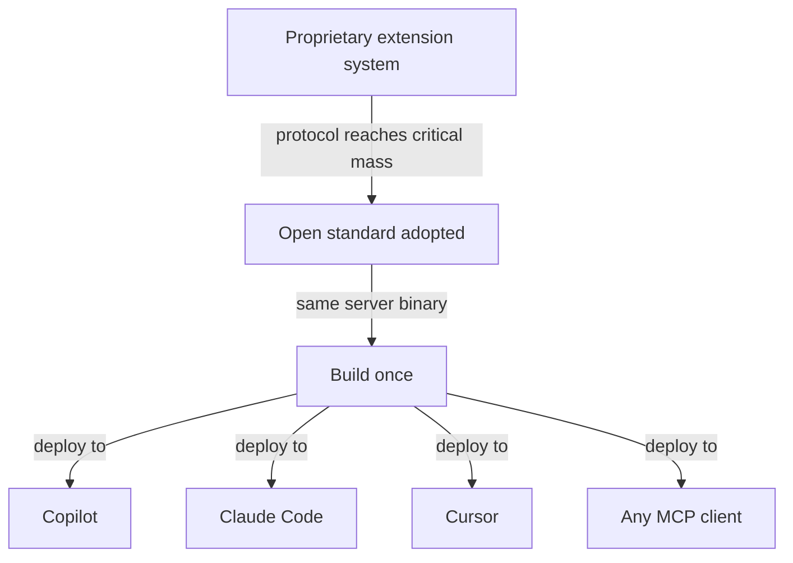

# Proprietary-to-Open-Standard Migration

> When a proprietary extension system gets replaced by an open protocol, the right response is to rebuild on the standard — not port the old architecture. The Copilot Extensions deprecation exemplifies this pattern.

GitHub [deprecated Copilot Extensions (GitHub Apps) on September 24, 2025](https://github.blog/changelog/2025-09-24-deprecate-github-copilot-extensions-github-apps/). New extension creation was blocked immediately; all functionality was disabled on November 10, 2025. GitHub replaced the system with [MCP servers](../standards/mcp-protocol.md).

## What Changed Architecturally

| Dimension | Copilot Extensions (deprecated) | MCP Servers |
|-----------|----------------------------------|-------------|
| Standard | Proprietary (GitHub Apps) | Open (MCP / JSON-RPC 2.0) |
| Invocation | `@mention` in Copilot Chat | Tool-calling by agent mode, autonomous use by coding agent |
| Hosting | Remote server required | Local (stdio) or remote (Streamable HTTP) |
| Tool reach | Copilot only | Copilot, Claude Code, Cursor, VS Code, ChatGPT, any MCP client |
| Distribution | GitHub Marketplace or private org | Any registry, or none — direct config |
| AI abstraction | Skillsets: Copilot handles all LLM logic | None — server exposes tools, client decides when to call them |
| Enterprise governance | GitHub App permissions | [Registry allow lists and access policies](https://docs.github.com/en/copilot/how-tos/administer-copilot/manage-mcp-usage/configure-mcp-server-access), project `.mcp.json` |

## What You Gain

**Cross-tool portability.** Build once; the same [MCP server](../standards/mcp-protocol.md) works with every MCP-compatible agent — Copilot, Claude Code, Cursor, and beyond.

**No mandatory hosting for local tools.** Unlike Copilot Extensions (always remote), stdio transport runs the server as a local process with zero infrastructure. Remote tools still need hosting.

**Autonomous invocation.** Copilot's agent mode and coding agent can call MCP tools without user `@mention`. The agent discovers available tools at startup via `tools/list` [unverified] and calls them as needed during task execution.

**Open ecosystem.** The [GitHub MCP Registry](https://github.blog/ai-and-ml/generative-ai/how-to-find-install-and-manage-mcp-servers-with-the-github-mcp-registry/) (github.com/mcp) offers [1-click VS Code installation](https://code.visualstudio.com/docs/copilot/customization/mcp-servers), namespace conventions, and enterprise allow lists. The same registry serves all MCP clients.

## What You Lose

**Skillset abstraction.** [Skillsets](../tools/copilot/copilot-extensions.md) abstracted all AI logic — routing, prompt crafting, response generation — with no LLM code required. MCP servers expose raw tools; orchestration is the host agent's responsibility.

**Marketplace distribution.** No single marketplace equivalent exists yet — MCP servers require self-hosted distribution or a registry listing.

## The Broader Pattern

The Copilot Extensions deprecation is one instance of a recurring pattern: **proprietary extension ecosystems converge on open protocols once the protocol reaches critical adoption mass**.

The sequence is predictable:

1. Vendor ships proprietary plugin/extension system to capture early ecosystem value
2. Competing vendors ship incompatible systems — you must maintain N integrations
3. An open protocol emerges with broad vendor support
4. Early-mover vendors deprecate their proprietary system and adopt the standard
5. If you built on the open protocol, you get cross-tool reach for free



MCP follows the same trajectory as USB-C (connector standards), LSP (language server protocol for editor integrations), and OAuth (auth delegation). Once a critical mass of agents support MCP, the economics of proprietary extension systems invert — maintaining Copilot-only tooling costs more than maintaining an MCP server.

## Migration Approach

**For existing Copilot Extensions:**

1. Identify each tool/skill endpoint in the extension
2. Implement each as an MCP `tool` with the same input/output schema
3. Choose transport: stdio for local tools, Streamable HTTP for remote
4. Configure per client: `claude mcp add` for Claude Code, `.vscode/mcp.json` for Copilot, native MCP settings for Cursor
5. Remove `@mention` documentation — agents call MCP tools autonomously

**For new integrations:**

Build MCP servers from the start. Do not build Copilot Extensions — the system is deprecated and non-functional.

## Example

A Copilot Extension that queries a deployment status API migrates to an MCP server exposing the same capability as a tool.

**Before — Copilot Extension (skillset definition in GitHub App manifest):**

```yaml
# github-app/skillset.yml (no longer functional)
skills:
  - name: get-deploy-status
    description: Returns the current deployment status for a service
    parameters:
      service_name:
        type: string
        required: true
```

The extension ran on a remote server, handled Copilot's callback protocol, and was invoked via `@deploy-bot get-deploy-status payments`.

**After — MCP server (Python, stdio transport):**

```python
# deploy_status_server.py
from mcp.server.fastmcp import FastMCP

mcp = FastMCP("deploy-status")

@mcp.tool()
def get_deploy_status(service_name: str) -> str:
    """Returns the current deployment status for a service."""
    # Same logic as the old extension endpoint
    status = query_deploy_api(service_name)
    return f"{service_name}: {status.state} (deployed {status.timestamp})"

if __name__ == "__main__":
    mcp.run(transport="stdio")
```

**Client configuration:**

```json
// .vscode/mcp.json (Copilot)
{
  "servers": {
    "deploy-status": {
      "command": "python",
      "args": ["deploy_status_server.py"]
    }
  }
}
```

```bash
# Claude Code
claude mcp add deploy-status -- python deploy_status_server.py
```

The same server binary works across Copilot, Claude Code, and Cursor with no code changes — only client config differs.

## Key Takeaways

- Copilot Extensions are fully deprecated as of November 10, 2025 — build MCP servers instead
- MCP's core value is cross-tool portability: one server, every MCP-compatible agent
- Skillsets had no equivalent in MCP — tool orchestration is the host agent's responsibility
- When an open standard reaches critical adoption mass, proprietary extension systems deprecate; build on the standard early

## Unverified Claims

- Agent discovers available tools at startup via `tools/list` [unverified]

## Related

- [MCP Protocol](../standards/mcp-protocol.md)
- [Copilot MCP Integration](../tools/copilot/mcp-integration.md)
- [Copilot Extensions (deprecated)](../tools/copilot/copilot-extensions.md)
- [MCP Client Design](mcp-client-design.md)
- [MCP Client/Server Architecture](mcp-client-server-architecture.md)
- [MCP Server Design](mcp-server-design.md)
- [Skill Library Evolution](skill-library-evolution.md)
- [Plugin and Extension Packaging](../standards/plugin-packaging.md)
