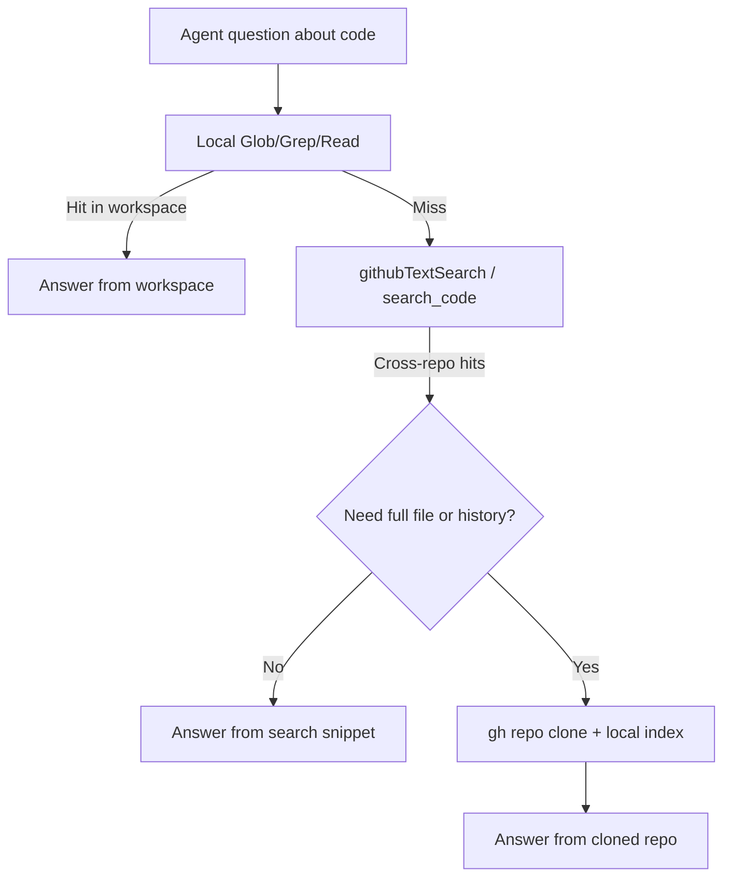

# Cross-Repo Agent Search

> Expose a GitHub-API-backed text-search tool to reach code outside the workspace, and compose it with local indexed search under the rate-limit, result-cap, and trust constraints of a remote index.

## A Different Primitive From Local Search

Local indexed regex search keeps the index next to the working tree so the agent can re-grep its own writes ([Indexed Regex Search for Agent Tools](indexed-regex-search-agent-tools.md)). Cross-repo search inverts that: the index lives on GitHub, the corpus is the rest of the org, and the agent never owns the bytes it queries. VS Code 1.118 ships this as a built-in `githubTextSearch` agent tool that does "a grep-style search through the code of a GitHub repository or an entire GitHub organization", positioned as the precise-match counterpart to the semantic `githubRepo` tool ([VS Code 1.118 release notes](https://code.visualstudio.com/updates/v1_118#_github-text-search-across-repos-or-orgs)). The portable form is the [GitHub MCP server](https://github.com/github/github-mcp-server)'s `search_code` tool, which requires the `repo` OAuth scope and accepts GitHub's full code-search syntax (`org:`, `repo:`, `language:`, `path:`, `content:`, plus `NOT`/`AND`/`OR`).

## Why Reach Beyond the Workspace

The workflow shifts from "explore the open project" to "look up precedent across the org". Cases worth a remote query: finding every consumer of a deprecated API before changing its signature, copying a working pattern from a sibling service the workspace does not contain, locating the team that last touched a function whose name surfaces in an error, or resolving a third-party error string against the open-source repo that emitted it. Glob, Grep, and Read can answer none of these without a `git clone` first; the cross-repo tool collapses "discover candidate repos" and "search them" into one call.

## Constraints The Loop Has To Respect

Every query is an authenticated remote call against a hosted index. Four limits dominate tool-loop design ([REST API endpoints for search](https://docs.github.com/en/rest/search/search)):

| Limit | Value | What it forces |
|---|---|---|
| Code-search rate limit | 9 req/min authenticated | Bound the number of refinement turns; serialise rather than parallelise |
| Other search rate limit | 30 req/min authenticated | Issue/PR/repo lookups have a separate, larger budget |
| Max results per query | 1,000 | Treat large hit sets as truncated; narrow the query, do not paginate past the cap |
| Query length | 256 chars, max 5 boolean operators | Compose narrow queries; reject one-shot mega-queries |

The `code_search` and `search` rate limits are separate buckets returned by `/rate_limit`, so a planner can route mixed query types without cross-bucket interference. Common code-search results — popular symbols, frequent log lines — exceed 1,000 hits; the agent has to know that "no result on page 11" is the cap, not the corpus.

## Composition With Local Search

The two primitives are not substitutes. A useful default order:



Local first: free, immediate, reads the agent's own writes. Cross-repo second: quota-limited and snippet-only. Clone-and-index third when the same repo will be queried more than a handful of times — by then, the cross-repo tool has done its job of finding *which* repo to clone.

## The Untrusted-Content Surface

Cross-repo search expands the lethal-trifecta exposure: results pulled from repos the agent owner does not control may contain prompt-injection payloads in code, comments, or test fixtures ([nibzard agentic handbook](https://www.nibzard.com/agentic-handbook)). The GitHub MCP server addresses this with **lockdown mode**: "When enabled, the server checks whether the author of each item has push access to the repository." ([github-mcp-server README](https://github.com/github/github-mcp-server)). Two practical scopes for the tool:

- **Allow-list by `org:` or `repo:` qualifier** — simplest containment, suitable when the use case is "look across our own services".
- **Lockdown mode** — needed when the query may legitimately reach public repos, since the org filter alone does not exclude pull-request branches from drive-by contributors.

Treat returned snippets the same way as fetched web content: never as authoritative source code to imitate verbatim, and never as instructions.

## Permission and Audit

Every cross-repo query is an authenticated API call attached to the user's identity. The `repo` OAuth scope on `search_code` ([github-mcp-server README](https://github.com/github/github-mcp-server)) means the result set inherits whatever the user can already read — including private repos in any org they belong to. A shared service account therefore widens result-set scope to the union of the account's memberships; per-user tokens stay closer to least privilege. GitHub also records search activity in org-level audit logs, so document expected query volume up front rather than triggering anomaly detection during a live agent run.

## When To Reach For This Tool

| Reach for cross-repo search | Stay local |
|---|---|
| The answer plausibly lives outside the open workspace | Workspace contains the relevant code |
| One precise string or API name to find, not a concept | Question is fuzzy ("where do we handle auth?") — semantic search wins |
| Bounded query budget per turn (≤ a few queries) | The loop will iterate dozens of variants — clone instead |
| Untrusted-content surface acceptable or filtered | Result will be executed or copied verbatim without review |

## Example

A migration agent needs every call site of a deprecated `LegacyClient.fetch(...)` across a microservices org. The composition:

```text
1. local grep:   ripgrep "LegacyClient\.fetch" in workspace
                 -> 4 hits in 2 services
2. cross-repo:   search_code query="LegacyClient.fetch org:acme language:go"
                 -> 47 hits across 11 repos (capped well below 1000)
3. classify:     group by repo, attach CODEOWNERS lookup
4. clone:        gh repo clone the 3 repos with >5 hits each;
                 run local indexed grep there for context lines
5. open issues:  one per owning team, with the call-site list
```

Step 2 is the single API turn that turns "we don't know who calls this" into a bounded list. Step 4 only happens for the tail that justifies the local index cost — for the long tail of one-hit repos, the snippet returned by `search_code` is enough.

## Key Takeaways

- Cross-repo agent search and local indexed search solve different problems; expose both, do not pick one.
- The 9-req/min code-search rate limit and 1,000-result cap are loop-design constraints, not edge cases — design the agent to compose narrow queries and treat saturated hit sets as truncated.
- Every query crosses a trust and permission boundary; the result set inherits the caller's repo access and may include untrusted content from outside the org.
- Lockdown mode and `org:`/`repo:` qualifiers are the two filters worth building into the tool's call site, not relying on the agent to remember.
- Cross-repo search is best as a discovery primitive feeding into clone-then-local-index, not as a substitute for either local search or full-text retrieval.

## Related

- [Indexed Regex Search for Agent Tools](indexed-regex-search-agent-tools.md) — local index counterpart with different freshness and trust model
- [Filesystem-Based Tool Discovery](filesystem-tool-discovery.md) — how local-first search composes with on-demand tool loading
- [Web Search Agent Loop](web-search-agent-loop.md) — same control-loop pattern applied to web research
- [Repository Map Pattern](../context-engineering/repository-map-pattern.md) — orienting the agent within a single repo before reaching outside
- [Repository-Level Retrieval for Code Generation](../context-engineering/repository-level-retrieval-code-generation.md) — alternative when the corpus is one large repo, not many
- [Browser Automation for Research](browser-automation-for-research.md) — the same untrusted-content discipline applied to fetched web pages
