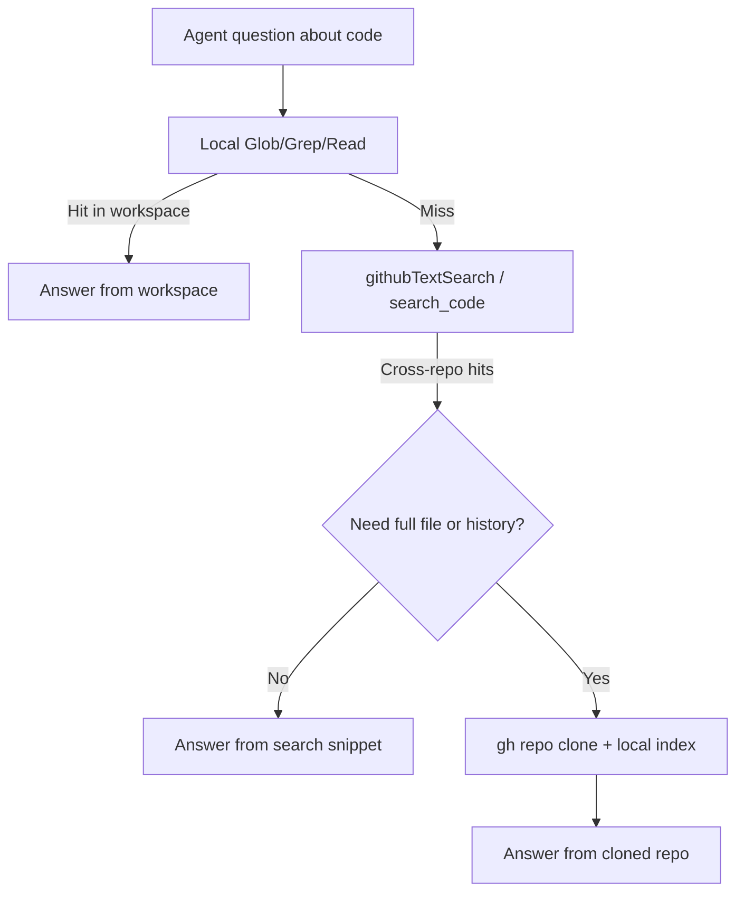

# Cross-Repo Agent Search

> Cross-repo search exposes a GitHub-API-backed tool to reach code outside the workspace, composed with local search under a remote index's rate-limit, result-cap, and trust constraints.

## A different primitive from local search

Local indexed regex search keeps the index next to the working tree, so the agent can re-grep its own writes ([Indexed Regex Search for Agent Tools](indexed-regex-search-agent-tools.md)). Cross-repo search inverts that. The index lives on GitHub, the corpus is the rest of the org, and the agent never owns the bytes it queries. VS Code 1.118 ships this as a built-in `githubTextSearch` agent tool — "a grep-style search through the code of a GitHub repository or an entire GitHub organization" — as the precise-match counterpart to the semantic `githubRepo` tool ([VS Code 1.118 release notes](https://code.visualstudio.com/updates/v1_118#_github-text-search-across-repos-or-orgs)). The portable form is the [GitHub MCP server](https://github.com/github/github-mcp-server)'s `search_code` tool, which requires the `repo` OAuth scope and accepts GitHub's code-search syntax (`org:`, `repo:`, `language:`, `path:`, `content:`, plus `NOT`/`AND`/`OR`).

## Why reach beyond the workspace

The job shifts from "explore the open project" to "look up precedent across the org": every consumer of a deprecated API before a signature change, a pattern in a sibling service the workspace lacks, or a third-party error string traced back to its emitting repo. Glob, Grep, and Read need a `git clone` first. The cross-repo tool collapses "discover candidate repos" and "search them" into one call.

## Constraints the loop has to respect

Every query is an authenticated remote call against a hosted index. Four limits dominate tool-loop design ([REST API endpoints for search](https://docs.github.com/en/rest/search/search)):

| Limit | Value | What it forces |
|---|---|---|
| Code-search rate limit | 10 req/min authenticated | Bound refinement turns; serialize rather than parallelize |
| Other search rate limit | 30 req/min authenticated | Issue/PR/repo lookups have a separate, larger budget |
| Max results per query | 1,000 | Treat large hit sets as truncated; narrow, do not paginate past the cap |
| Query length | 256 chars, max 5 boolean operators | Compose narrow queries; reject one-shot mega-queries |

The `code_search` and `search` buckets are reported separately by `/rate_limit`, so a planner can route mixed query types without cross-bucket interference. Popular symbols and frequent log lines routinely exceed 1,000 hits; "no result on page 11" is the cap, not the corpus.

## Composition with local search

The two primitives — [local indexed search](indexed-regex-search-agent-tools.md) and cross-repo search — are not substitutes. A useful default order:


```mermaid
flowchart TD
    Q[Agent question about code] --> L[Local Glob/Grep/Read]
    L -->|Hit in workspace| A1[Answer from workspace]
    L -->|Miss| C[githubTextSearch / search_code]
    C -->|Cross-repo hits| D{Need full file or history?}
    D -->|No| A2[Answer from search snippet]
    D -->|Yes| K[gh repo clone + local index]
    K --> A3[Answer from cloned repo]
```

Local first: free, immediate, reads the agent's own writes. Cross-repo second: quota-limited and snippet-only. Clone-and-index third, when the same repo will be queried more than a handful of times — by then, cross-repo search has identified which repo to clone.

## The untrusted-content surface

Cross-repo search widens lethal-trifecta exposure. Results from repos the agent owner does not control may carry prompt-injection payloads in code, comments, or test fixtures ([nibzard agentic handbook](https://www.nibzard.com/agentic-handbook)). The GitHub MCP server answers this with lockdown mode: "When enabled, the server checks whether the author of each item has push access to the repository." ([github-mcp-server README](https://github.com/github/github-mcp-server)). Two practical scopes:

- Allow-list by `org:` or `repo:` qualifier — the simplest containment, for "look across our own services".
- Lockdown mode — needed when queries may reach public repos, since `org:` alone does not exclude pull-request branches from drive-by contributors.

Treat returned snippets like fetched web content: never as authoritative source to imitate verbatim, and never as instructions.

## Permission and audit

Every query is an authenticated API call attached to the user's identity. The `repo` OAuth scope on `search_code` ([github-mcp-server README](https://github.com/github/github-mcp-server)) means the result set inherits whatever the user can already read — including private repos in any org they belong to. A shared service account widens scope to the union of its memberships; per-user tokens stay closer to least privilege. GitHub also records search activity in org-level audit logs — document expected query volume up front, rather than triggering anomaly detection mid-run.

## When to reach for this tool

| Reach for cross-repo search | Stay local |
|---|---|
| The answer plausibly lives outside the open workspace | Workspace contains the relevant code |
| One precise string or API name, not a concept | Question is fuzzy ("where do we handle auth?") — semantic search wins |
| Bounded query budget per turn (≤ a few queries) | The loop will iterate dozens of variants — clone instead |
| Untrusted-content surface acceptable or filtered | Result will be executed or copied verbatim without review |

## When this backfires

Cross-repo search is the wrong primitive in four common cases:

- High-iteration debugging loops. Once the agent is querying the same repo more than a handful of times, the 10 req/min ceiling becomes a wall and snippet-only context starves the loop of surrounding code. Clone once, index locally, iterate freely.
- Saturated result sets. Any query whose true hit count exceeds 1,000 returns silently truncated evidence. A migration agent that bases "we found everyone" on a capped result set will miss call sites — narrow the query with `path:`/`language:` until the count is well under the cap, or accept that the tool cannot answer the question.
- Repos that fit on disk. For a monorepo or a small set of known suspect repos, `gh repo clone` plus local grep gives full context with no per-query budget, no result cap, and no audit-log noise. Cross-repo search adds latency and quota burn against the 10-req/min code-search ceiling for no extra signal.
- Audit-sensitive environments. Every query lands in org-level audit logs against a real identity. In regulated orgs, an agent that issues dozens of speculative queries per task can trip security review or breach data-handling policies that ad-hoc CLI use would not. Budget queries deliberately, or route through a service account with explicit approval.

Recent multi-repo benchmarks reinforce the discovery-only framing: on organization-scale tasks, agents without cross-repo retrieval find almost none of the relevant files (Precision@5 ≈ 0.007), and even with a retrieval tool they recover under half (Precision@5 ≈ 0.47) — and the benchmark notes that better retrieval precision still does not translate into a proportional jump in task reward ([CodeScaleBench, Sourcegraph 2026](https://sourcegraph.com/blog/codescalebench-testing-coding-agents-on-large-codebases-and-multi-repo-software-engineering-tasks)). Treat cross-repo search as a pointer to the next clone, not as a substitute for working inside the target repo.

## Example

A migration agent needs every call site of a deprecated `LegacyClient.fetch(...)` across a microservices org. The composition:

```text
1. local grep:   ripgrep "LegacyClient\.fetch" in workspace
                 -> 4 hits in 2 services
2. cross-repo:   search_code query="LegacyClient.fetch org:acme language:go"
                 -> 47 hits across 11 repos (capped well below 1000)
3. classify:     group by repo, attach CODEOWNERS lookup
4. clone:        gh repo clone the 3 repos with >5 hits each;
                 run local indexed grep there for context lines
5. open issues:  one per owning team, with the call-site list
```

Step 2 is the single API turn that turns "we don't know who calls this" into a bounded list. Step 4 only happens for the tail that justifies the local index cost — for one-hit repos, the snippet returned by `search_code` is enough.

## Key Takeaways

- Cross-repo agent search and local indexed search solve different problems; expose both, do not pick one.
- The 10-req/min code-search rate limit and 1,000-result cap are loop-design constraints, not edge cases — compose narrow queries and treat saturated hit sets as truncated.
- Every query crosses a trust and permission boundary; the result set inherits the caller's repo access and may include untrusted content from outside the org.
- Lockdown mode and `org:`/`repo:` qualifiers are the two filters worth building into the tool's call site, not relying on the agent to remember.
- Cross-repo search is best as a discovery primitive feeding into clone-then-local-index — not a substitute for either local search or full-text retrieval, and the wrong tool for high-iteration loops or saturated result sets.

## Related

- [Indexed Regex Search for Agent Tools](indexed-regex-search-agent-tools.md) — local index counterpart with different freshness and trust model
- [Filesystem-Based Tool Discovery](filesystem-tool-discovery.md) — how local-first search composes with on-demand tool loading
- [Web Search Agent Loop](web-search-agent-loop.md) — same control-loop pattern applied to web research
- [Repository Map Pattern](../context-engineering/repository-map-pattern.md) — orienting the agent within a single repo before reaching outside
- [Repository-Level Retrieval for Code Generation](../context-engineering/repository-level-retrieval-code-generation.md) — alternative when the corpus is one large repo, not many
- [Browser Automation for Research](browser-automation-for-research.md) — the same untrusted-content discipline applied to fetched web pages
