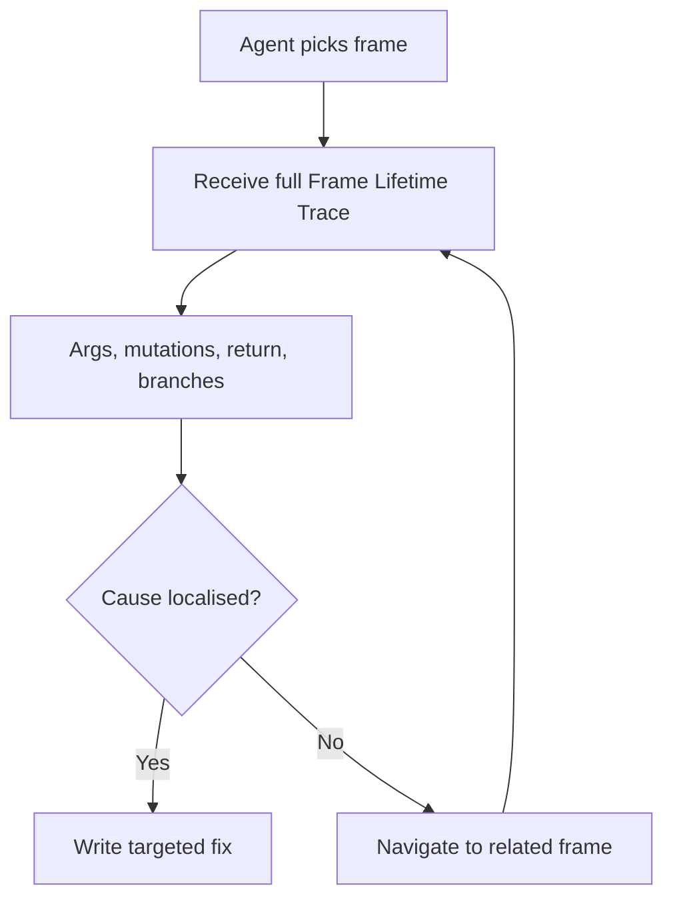

# Function-Level Debugger Interfaces for Coding Agents

> Line-by-line debuggers were built for humans single-stepping at the keyboard. Wrapping `pdb` for an LLM agent loses the budget to step-overhead before the bug is found. A function-level interface — one frame per turn, the full lifetime trace inside it — matches debugger granularity to the agent consumer.

## The Mismatch

A traditional interactive debugger exposes `step`, `next`, `print var`, `continue` — primitives sized for a human watching state evolve one statement at a time. An LLM agent driving the same interface pays a fixed per-turn cost (latency, context manipulation, output tokens) for every step. Stepping through a 200-line function is 200 turns of high-overhead, low-information interaction. Budgets exhaust before the fault localises, and agents fall into stepping loops that produce no patch.

[Xiang et al. (FSE 2026)](https://arxiv.org/abs/2604.24212) document the failure mode directly: traditional interactive debuggers' "low-level, line-by-line interaction paradigm turns out to be cost-inefficient for LLM-based agents, leading to exhausted budgets and unproductive loops." Their Agent-centric Debugging Interface (ADI) replaces the unit of interaction with the function frame and the unit of state with a single trace covering the frame's entire lifetime.

## Granularity Matched to the Consumer

The lever is the same one the [Agent-Computer Interface (ACI)](agent-computer-interface.md) work identified for editors and search: interface granularity moves benchmark numbers without changing the model. [Yang et al. (NeurIPS 2024)](https://arxiv.org/abs/2405.15793) showed a custom ACI lifted SWE-bench pass@1 by 12.5% with no weight changes. ADI applies the same principle to debuggers.

Two design moves do the work:

1. **One frame per turn.** The agent picks a function, gets back its complete stateful trace — entry arguments, intermediate mutations, branches taken, return value — in one response. No round-trips to advance one line.
2. **High-level navigation, not stepping.** Commands operate at the call-graph level (jump into the callee that mutated this variable, skip to the next frame that touched this object) rather than at the source-line level.



## Evidence

On SWE-bench Verified, a basic agent equipped with ADI resolved **63.8%** of tasks at an average cost of **USD 1.28 per task** with Claude-Sonnet-3.7, slightly outperforming the heavily optimised Claude-Tools agent. Plugged into existing SOTA agents as a drop-in component, ADI delivered **+6.2% to +18.5%** on resolved tasks ([Xiang et al., 2026](https://arxiv.org/abs/2604.24212)).

The mechanism replicates outside program-repair agents. [Hutter and Pradel (2026)](https://arxiv.org/abs/2602.06593) introduce AgentStepper for debugging the development agents themselves and frame the same conclusion: "debugging software development agents requires a higher level of abstraction that raises the level from low-level implementation details to high-level agent actions." A user study took bug-identification success from 17% to 60% under the higher-abstraction interface — different artefact, same granularity-matching mechanism.

## Why Function-Level Beats Line-Level for Agents

Per-turn cost is the agent's binding constraint. Line-level debugging amortises one increment of state over a full turn — low information-per-token ratio. Frame-level debugging batches one function call's full state evolution into one turn, raising the ratio. The same lesson [token-efficient tool design](token-efficient-tool-design.md) teaches: shape tool output around the consumer's decision unit, not the upstream primitive.

The principle generalises beyond debuggers. Whenever an agent drives a tool whose primitives were designed for human keyboard speed — REPLs, interactive shells, step-debuggers, GUI clickers — the granularity tax surfaces as exhausted budgets and looping. Re-expose at the agent's decision unit (function, file, deployment), not the human's (line, keystroke, click).

## When This Backfires

- **Bug below frame granularity in a long function.** A single mutated variable inside a 500-line frame can hide inside the lifetime trace. The agent then needs sub-frame drilldown, defeating the cost saving. ADI's command set retains lower-level navigation as a fallback for exactly this case ([Xiang et al., 2026](https://arxiv.org/abs/2604.24212)).
- **Concurrency and timing bugs.** Frame Lifetime Trace captures stateful execution per frame; cross-frame timing — race conditions, lock acquisition order, scheduler interleaving — is not naturally a function-level concept. The interface inherits the same blind spot a traditional debugger has on these bugs.
- **Languages and runtimes without tracing infrastructure.** ADI's reference implementation targets the Python stack SWE-bench runs on. Building Frame Lifetime Trace for JIT-compiled, dynamic, or proprietary runtimes (browser JS, mobile, embedded) is non-trivial; teams without that engineering investment fall back to whatever the runtime exposes.
- **One-shot fixable bugs.** Typos, missing null checks, and obvious type errors do not need a debugger at all. Spinning up a frame trace adds turns and cost without value when the model can patch from source on its first read.

## Example

Consider an LLM agent fixing a SWE-bench-style bug where `process_payment()` returns the wrong amount because a fee calculation in `apply_discount()` mutates the cart state.

**Before** — agent driving `pdb` at line granularity:

```
(Pdb) break process_payment
(Pdb) continue
(Pdb) step
(Pdb) step
(Pdb) print cart
(Pdb) step
... (40 more turns walking into apply_discount line by line)
(Pdb) print cart.items[0].price
```

Forty turns to reach the mutation. The agent's context fills with stepping output before it can synthesise a hypothesis.

**After** — agent driving a function-level interface:

```
> trace process_payment(order_42)
Frame Lifetime Trace:
  args:    cart=Cart(items=[Item(price=10.00, qty=2)], total=20.00)
  callees: validate_cart -> ok
           apply_discount -> mutated cart.items[0].price 10.00 -> 8.50
           charge -> charged 17.00 (expected 20.00)
  return:  17.00

> trace apply_discount(cart)
Frame Lifetime Trace:
  args:    cart=Cart(items=[Item(price=10.00, qty=2)])
  mutations: cart.items[0].price <- 8.50  (line 47, "items[0].price = base * 0.85")
  return:  None  (expected: discount object)
```

Two turns localise the fault: `apply_discount` mutates the cart in place and returns `None` instead of returning an immutable discount the caller can apply. The patch follows from the trace.

This mirrors the surgical-edit profile from the [precise debugging benchmark](../verification/precise-debugging-benchmark.md): when the interface lets the agent localise cause cheaply, it produces targeted fixes rather than regenerative rewrites.

## Key Takeaways

- Line-by-line debuggers were sized for humans; LLM agents pay a fixed per-turn cost that makes line stepping economically infeasible at SWE-bench scale.
- A function-level interface — one frame per turn, full lifetime trace per frame, call-graph-level navigation — raises the information-per-token ratio enough to flip the cost-effectiveness verdict.
- ADI on SWE-bench Verified: 63.8% resolved at $1.28/task, beating the highly tuned Claude-Tools agent and lifting SOTA agents by 6.2-18.5% as a drop-in plug-in ([Xiang et al., 2026](https://arxiv.org/abs/2604.24212)).
- The granularity-matching mechanism is the same one [ACI](agent-computer-interface.md) demonstrated for editors and search: re-expose the tool at the consumer's decision unit, not the upstream system's primitive.
- Failure conditions: bugs hidden inside long frames, concurrency timing, runtimes without trace infrastructure, and bugs the model can fix from source alone without any debugger turn.

## Related

- [Agent-Computer Interface (ACI): Tool Design as UX Discipline](agent-computer-interface.md) — The general HCI-to-ACI mapping; this page is its specialisation to debuggers.
- [Token-Efficient Tool Design](token-efficient-tool-design.md) — Same information-per-token mechanism applied to tool output sizing.
- [Tool Minimalism and High-Level Prompting](tool-minimalism.md) — The toolset-level analogue of frame-level granularity: fewer, higher-level primitives.
- [Precise Debugging: Measure Edit Precision, Not Just Test Pass Rate](../verification/precise-debugging-benchmark.md) — How to measure whether the cheaper localisation produces targeted fixes rather than regeneration.
- [Hypothesis-Driven Debugging: Instrument Before You Patch](../agent-design/hypothesis-driven-debugging.md) — Workflow-level companion: what the agent does once a function-level trace narrows the suspect frames.
- [Agent Debugging: Diagnosing Bad Agent Output](../observability/agent-debugging.md) — AgentStepper-style abstraction-raising applied to debugging the agent itself.
