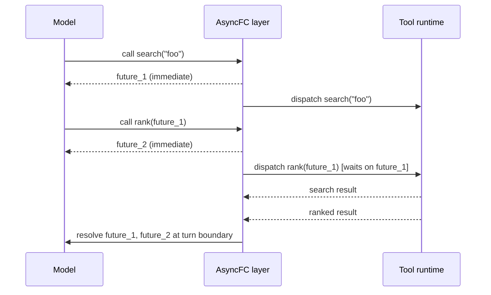

# Future-Based Asynchronous Function Calling

> Return each function call as a symbolic future so a stock LLM keeps decoding while tools run in the background. Same synchronous schema, no retraining.

## The Latency Decomposition

End-to-end latency on a function-calling turn decomposes into `decode_time + tool_time`. On tool-heavy workloads `tool_time` dominates. The synchronous protocol stops decoding when a tool call is emitted and resumes only after the call returns, so the two costs stack linearly.

Native parallel function calling helps when the model names N independent calls in one turn ([OpenAI](https://platform.openai.com/docs/guides/function-calling), [Anthropic](https://docs.claude.com/en/docs/agents-and-tools/tool-use/overview)), but decoding still blocks on the slowest call in the batch. [LLMCompiler](https://arxiv.org/abs/2312.04511) instead has a planner generate a DAG upfront and an executor run independent edges in parallel — up to 3.7x speedup, but the planner is a separate model call and the DAG is fixed once dispatched.

## The Futures Protocol

[AsyncFC](https://arxiv.org/abs/2605.15077) (Feng, Mao, Dutta, Gonzalez, 2026) keeps the standard synchronous schema. The execution layer transforms it so every function returns a symbolic future placeholder the moment it is called, executes the function in the background, and resolves the placeholder at a later turn boundary. The model "continues decoding as if the function call had already returned" ([arXiv:2605.15077v1](https://arxiv.org/html/2605.15077v1)). An `await_future` function is exposed for the cases where a concrete value is required mid-turn.



Two facts make this work without model changes:

- **The schema does not change.** From the model's perspective it called a function and got a return value — the return happens to be an opaque identifier.
- **Models reason over futures zero-shot.** Pretraining on `asyncio`, Promises, and Futures gives models enough prior to treat a future ID as a value-shaped placeholder and pass it forward. The authors verify this on GPT-4o, Gemini 3.1 Pro, and GPT-5.2 with no fine-tuning ([arXiv:2605.15077v1](https://arxiv.org/html/2605.15077v1)).

The dependency graph is implicit. When the model passes `future_1` into a later call, the runtime serializes that call behind `future_1`; independent calls overlap automatically. No planner, no DAG export.

## Measured Speedup

AsyncFC reports the following on stock models, no retraining ([arXiv:2605.15077v1](https://arxiv.org/html/2605.15077v1)):

| Benchmark | Speedup |
|-----------|---------|
| BFCL v3 Sequential FC | 1.26x |
| BFCL v4 Web Search (real backend latency) | 1.26x |
| SWE-bench Lite | 1.44x |
| HotpotQA | 1.24x |
| Cross-model (Gemini 3.1 Pro) | 1.17x |

Gains come from two effects: decode-execution overlap and inter-function parallelism. SWE-bench Lite shows the largest speedup because file reads, test runs, and search calls take seconds — well above per-token decode latency.

## When the Pattern Pays Off

The conditions are mechanical:

- **Function execution dominates decode.** If tools return in tens of milliseconds and decode takes hundreds, there is nothing to overlap.
- **The workload exposes parallelism or pipelining.** A chain where every call needs the resolved value of the previous one collapses to synchronous execution — the paper notes "strictly sequential tasks show minimal gains" ([arXiv:2605.15077v1](https://arxiv.org/html/2605.15077v1)).
- **Return-value-driven branching is bounded.** If the model would change strategy based on a return's contents — not just its shape — speculating on a placeholder commits work that may be discarded.

## When to Stay Synchronous

Side-effecting functions are the sharp edge. If the model dispatches `delete_record(id)` then `notify_user(future_1)`, a failure in the delete still triggers the notify — the runtime can only cancel calls not yet started. For destructive or money-moving operations the synchronous default keeps failure containment local. Audit paths push the same way: log concrete values, not future identifiers.

Anthropic's [multi-agent research system](https://www.anthropic.com/engineering/multi-agent-research-system) chose synchronous execution at the subagent layer because "asynchronicity adds challenges in result coordination, state consistency, and error propagation." The trade-off is identical at the function-call layer — the framework you wrap around the model has to absorb that complexity.

The zero-shot result is also model-dependent. [AsyncTool](https://arxiv.org/abs/2605.27995) (Shi et al., 2026) evaluates delayed tool feedback in multi-task settings and finds it "leads to clear performance degradation" — weaker models fail to coordinate task switching, dependency tracking, and state maintenance, proceeding before a dependent result resolves. AsyncFC's gains were measured on frontier models; validate yours before assuming the headline speedup.

## Relationship to Other Async Patterns

- [Asynchronous Agent I/O and Speculative Tool Calling](../agent-design/asynchronous-agent-io-and-speculative-tools.md) — the agent-loop FSM for real-time and voice agents; AsyncFC operates one layer down at the function-call boundary.
- [Async Non-Blocking Subagent Dispatch](../multi-agent/async-non-blocking-subagent-dispatch.md) — orchestrator-subagent coordination; AsyncFC handles model-tool coordination within a single agent.
- [Bounded Batch Dispatch](../multi-agent/bounded-batch-dispatch.md) — concurrency limits when fanning out to many workers; AsyncFC instead overlaps with the model's own decoding.

## Example

Minimal Python sketch of the AsyncFC execution layer sitting between the model and real tool functions:

```python
import asyncio, uuid
from typing import Any

_futures: dict[str, asyncio.Future] = {}

def make_future() -> str:
    fid = f"future_{uuid.uuid4().hex[:8]}"
    _futures[fid] = asyncio.get_event_loop().create_future()
    return fid

def resolve(fid: str, value: Any) -> None:
    _futures[fid].set_result(value)

async def async_call(fn, *args) -> str:
    """Return a future ID immediately; run fn in background."""
    fid = make_future()
    async def _run():
        # Resolve any future arguments before executing
        resolved = [
            (await _futures[a] if isinstance(a, str) and a in _futures else a)
            for a in args
        ]
        result = await asyncio.to_thread(fn, *resolved)
        resolve(fid, result)
    asyncio.create_task(_run())
    return fid  # model receives this opaque ID immediately

async def await_future(fid: str) -> Any:
    """Block until a specific future resolves."""
    return await _futures[fid]
```

Usage mirrors what the model sees — the model calls `search("foo")`, gets `future_a` back immediately, then calls `rank(future_a)` to get `future_b`. The layer dispatches the rank call only after `future_a` resolves, while the model keeps decoding.

## Key Takeaways

- AsyncFC pipelines LLM decoding with function execution by returning symbolic future placeholders immediately and resolving them at turn boundaries — the synchronous call schema is preserved.
- Stock models reason over futures zero-shot because pretraining data is full of `asyncio`, Promises, and Futures patterns.
- Reported speedup is 1.17x–1.44x on benchmarks where function latency dominates decode latency; strictly sequential workloads show minimal gains.
- For side-effecting, destructive, or audit-bound function calls the synchronous default is still correct — failure containment beats latency.

## Related

- [Asynchronous Agent I/O and Speculative Tool Calling](../agent-design/asynchronous-agent-io-and-speculative-tools.md)
- [Async Non-Blocking Subagent Dispatch](../multi-agent/async-non-blocking-subagent-dispatch.md)
- [Advanced Tool Use: Scaling Agent Tool Libraries](advanced-tool-use.md)
- [Token-Efficient Tool Design](token-efficient-tool-design.md)
