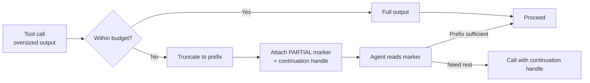

# Graceful Tool-Output Truncation: The PARTIAL Signal

> When tool output exceeds the token budget, return a useful prefix, a structurally distinct truncation signal, and a continuation handle, not a hard error.

Graceful tool-output truncation is a contract: a tool that can produce variable-sized output returns *the most useful state it can fit*, plus an explicit signal the result is incomplete and a continuation handle. Claude Code v2.1.145 (2026-05-19) shipped this for the Read tool — a whole-file read past the token limit now returns a truncated first page with a `PARTIAL view` notice instead of a hard error ([Claude Code changelog](https://code.claude.com/docs/en/changelog)). The same shape generalises to log readers, search results, directory listings, and MCP responses.

## The Contract

Three load-bearing parts. Drop any one and the pattern degrades into the failure it tried to fix.

| Part | Why it matters |
|------|----------------|
| **Useful prefix** | The agent gets work done on the first turn instead of consuming a retry round-trip. |
| **Structurally distinct marker** | The agent recognises the result is incomplete instead of treating the prefix as the whole answer. |
| **Continuation handle** | The agent has a defined next call (offset, cursor, file handle) rather than guessing at retry parameters. |

The marker is load-bearing. A trailing `[PARTIAL]` line is the easiest implementation and the most ignored — the model reads the prefix as the document and the trailing line as commentary. Anthropic's own Read tool surfaced this as a bug: the agent treated the preview as the complete file, rules in the un-read portion were silently absent from context, and no signal reached the operator ([anthropics/claude-code#28783](https://github.com/anthropics/claude-code/issues/28783)). The marker belongs in a structurally distinct slot — a leading banner, a separate JSON field, or schema-typed metadata.

## Why It Works

Turn-cost argument: every tool call costs a model latency turn, so error-then-retry doubles the cost of any large-output call. A tool that returns useful state plus a signal saves the retry whenever the prefix is enough and only spends it when continuation is required. The same logic underlies [RFC 9457](rfc9457-machine-readable-errors.md) error responses and [observation contracts](../agent-design/observation-contract-preservation.md): encoding recovery into the response shape lets the agent branch on structure instead of parsing prose. MCP has an open proposal for client-negotiated response size caps but no normalised `_meta.truncated` field today ([modelcontextprotocol#2211](https://github.com/modelcontextprotocol/modelcontextprotocol/discussions/2211)). Anthropic recommends the same shape: "pagination, range selection, filtering, and/or truncation with sensible defaults" ([Writing tools for agents](https://www.anthropic.com/engineering/writing-tools-for-agents)).

## Where the Lever Lives

This is a *tool author* layer that composes with three adjacent layers: harness compression ([Terminal Tool Output Compression](terminal-output-compression.md)), harness rewriting ([PostToolUse Output Replacement](posttooluse-output-replacement.md)), and server-side durability ([MCP Result Persistence Annotation](mcp-result-persistence-annotation.md)). The four stack: a tool can ship a PARTIAL contract while a harness compresses the prefix and an MCP server marks the result durable.

## Diagram



## When This Backfires

- **Trailing-prose marker.** A bottom-of-output `[PARTIAL]` is the most ignored signal — the model reads the prefix as a complete document and the suffix as commentary ([anthropics/claude-code#28783](https://github.com/anthropics/claude-code/issues/28783)). Put the marker in a structurally distinct slot.
- **Security-critical reads.** Guardrail files (CLAUDE.md, .cursorrules, policy configs) under PARTIAL semantics drop un-read rules silently. Fail-closed beats return-prefix here.
- **No continuation handle.** PARTIAL without a cursor or offset is a polite hard error — recovery collapses back to retry-with-smaller-range ([modelcontextprotocol#2211](https://github.com/modelcontextprotocol/modelcontextprotocol/discussions/2211)).
- **Downstream summarisation.** A `PostToolUse` hook that summarises a PARTIAL prefix loses both the missing content and the marker — see [PostToolUse Output Replacement §When This Backfires](posttooluse-output-replacement.md#when-this-backfires).
- **Agents without a reaction policy.** A graceful tool paired with an agent that ignores the marker is *worse* than a hard error. The system prompt must say what to do (paginate, summarise, ask user, proceed).

## Example

The Read tool's pre- and post-v2.1.145 contracts on a file that exceeds the token budget:

**Before — fail-hard:**

```text
Error: File too large to read (exceeds token limit). Use offset/limit to read a range.
```

The agent has consumed a turn, gained no content, and has to guess at offset values it cannot inform without a size.

**After — graceful with marker (v2.1.145):**

```text
[PARTIAL view — file exceeded token budget. First N tokens shown. Use offset to continue.]

<first N tokens of the file>
```

The marker is a leading banner — read before the prefix — and names the continuation parameter. The agent can act on the prefix immediately, decide whether the remaining bytes matter, and only then issue a second call ([Claude Code changelog](https://code.claude.com/docs/en/changelog)).

## Authoring Checklist

For any tool whose output can grow past a fixed limit:

- Return the prefix, not an error, when the full result overflows
- Place the marker *before* the payload, in a structurally distinct slot — not as trailing prose
- Name the continuation parameter (`offset`, `cursor`, `page_token`, file handle)
- Specify which bytes were dropped (head, tail, middle) so the agent can judge whether the prefix is enough
- Document the contract in the tool description so the model plans for the marker
- Test both truncated and full paths — regressions on the truncated path are silent until production

## Key Takeaways

- Graceful truncation is a tool contract, not a harness workaround — the tool author owns the prefix-marker-continuation shape.
- The marker is load-bearing. Trailing prose is ignored; structurally distinct slots (leading banner, separate field) survive the model's reading order.
- Pair the marker with a continuation handle. Without it, the contract collapses back to fail-hard with extra steps.
- The pattern composes with harness-side compression, post-hoc rewriting, and MCP persistence annotations — it does not replace them.
- For security-critical reads (policy files, guardrails), fail-closed beats partial: a silently truncated rules file is the same as a missing rules file.

## Related

- [PostToolUse Output Replacement: Hooks That Rewrite Tool Results](posttooluse-output-replacement.md)
- [Terminal Tool Output Compression](terminal-output-compression.md)
- [MCP Tool Result Persistence via _meta Annotation](mcp-result-persistence-annotation.md)
- [Observation Contract Preservation in Tool-Augmented Agents](../agent-design/observation-contract-preservation.md)
- [Machine-Readable Error Responses (RFC 9457)](rfc9457-machine-readable-errors.md)
- [Semantic Tool Output](semantic-tool-output.md)
