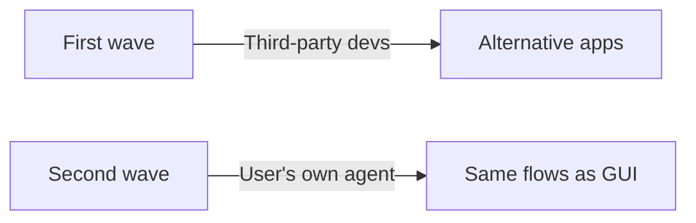

# Headless-First Services: APIs for Agent Consumers

> Expose the full product surface through APIs, MCP, and CLI so an agent acting on behalf of a user can complete any flow the GUI supports — without a browser in the loop.

## The Shift

The first wave of public APIs — circa 2010 — targeted third-party developers and mostly retreated behind walls. The second wave lets **agents act on behalf of the authenticated user**, with the same permissions and data visibility as that user inside the first-party app ([Brandur Leach, 2026](https://brandur.org/second-wave-api-first)).

Matt Webb: "headless services are quicker and more dependable for the personal AIs than having them click round a GUI with a bot-controlled mouse" ([Webb, April 2026](https://interconnected.org/home/2026/04/18/headless)). Salesforce's Headless 360 exposes "everything on Salesforce" as API, MCP, or CLI ([Salesforce, April 2026](https://www.salesforce.com/news/stories/salesforce-headless-360-announcement/)).

## Three Surfaces

Second-wave services converge on three surfaces, each with a distinct fit.

| Surface | Consumer | Fits best when |
|---------|----------|----------------|
| **HTTP API** | Any client on any host | Cross-platform programmatic access; audit logs; fine-grained rate limits |
| **MCP server** | MCP-aware agents (Claude, Cursor, Codex, etc.) | Tool-call-native invocation with typed schemas; negotiated capabilities |
| **CLI** | Agents running on the user's machine; shell power users | Composability with other local tools; on-device execution |

Basecamp shipped all three in one release: revamped API, new CLI, and a bundled skill ([DHH, March 2026](https://world.hey.com/dhh/basecamp-becomes-agent-accessible-3ae6b949)). Salesforce exposes Data 360 through all three — same capability, three front doors ([Salesforce, 2026](https://www.salesforce.com/news/stories/salesforce-headless-360-announcement/)).

CLI is not developer-only. Agents run best on the user's computer, where they see the user's files and compose across local tools. CLIs collapse the motor layer into a typed call — see [Unix CLI as native tool interface](unix-cli-native-tool-interface.md).

## The Coverage Parity Test

A service is not headless because it has an API. It is headless when an agent can complete every flow a human can in the GUI. DHH sets the bar: "Anything you can do in Basecamp, agents can now do too" ([DHH, 2026](https://world.hey.com/dhh/basecamp-becomes-agent-accessible-3ae6b949)).

Gaps fracture agent workflows. When a flow requires a browser session — a widget-only upload, a dialog approval, a confirmation email click — the user is yanked back mid-task. Partial coverage creates false confidence that an agent can drive end-to-end.

Audit before shipping: list every GUI screen, mark each `API | MCP | CLI | gui-only`. Every `gui-only` row is a future interruption.

## Designing for Second-Wave Access

Second-wave APIs differ in three ways ([Brandur Leach, 2026](https://brandur.org/second-wave-api-first)):

- **Scope matches the first-party app** — the agent sees what the user sees, no more. Parity with the product, not a third-party extension.
- **Security model is the product's** — same auth, sharing rules, and compliance controls. Salesforce: "the guardrails your organization relies on are the same guardrails your agents operate within" ([Salesforce, 2026](https://www.salesforce.com/news/stories/salesforce-headless-360-announcement/)).
- **Rate limits sized for one user's agent** — Slack's MCP server caps at 50 channel reads and 100 profile reads per minute: insufficient for a scraper, plenty for one assistant ([Slack MCP docs](https://docs.slack.dev/ai/slack-mcp-server/#rate-limits)).

For MCP, follow the [MCP server design](mcp-server-design.md) checklist. For CLI, apply [token-efficient tool design](token-efficient-tool-design.md) and ship `--json`, distinct exit codes, and non-interactive defaults.

## When Headless Does Not Apply

Four conditions push against headless ([Brandur Leach, 2026](https://brandur.org/second-wave-api-first)):

- **Ad-supported platforms** — Instagram, TikTok, and similar capture revenue on the surface agents would bypass.
- **Regulated monopolies with no competitive pressure** — Brandur's example is Xfinity: no agent-friendly path when the incumbent need not compete on this axis.
- **Products where the UI is the value** — design and creative tools where the interface is what users pay for.
- **Partial-coverage teams** — fragmentation may hurt users more than GUI-only.

Pricing is unresolved. Simon Willison notes per-seat SaaS pricing "is going to play havoc" with agent-driven usage ([Willison, 2026](https://simonwillison.net/2026/Apr/19/headless-everything/)). Primary sources propose no replacement, so treat pricing redesign as part of a headless rollout.

## Example

Basecamp's March 2026 release ships three artifacts together:

- [`bc3-api`](https://github.com/basecamp/bc3-api) — revamped HTTP API
- [`basecamp-cli`](https://github.com/basecamp/basecamp-cli) — CLI wrapping the API for local-agent composition
- [`basecamp/SKILL.md`](https://github.com/basecamp/basecamp-cli/blob/main/skills/basecamp/SKILL.md) — bundled skill teaching agents when and how to invoke the CLI

The skill is the piece most product teams miss. Without it, the agent sees a CLI binary but has no model of which verbs solve which user goals. See [skill as knowledge](skill-as-knowledge.md) for the design rules.

## Key Takeaways

- Headless access is the second wave of APIs — designed for user-authorized agents, not third-party platform extensions
- Ship API, MCP, and CLI as complementary surfaces; each fits a different runtime
- Use coverage parity — agents can do everything a human can in the GUI — as the ship criterion, not endpoint count
- Keep security and scope identical to the first-party app; tune rate limits for single-user agent load
- Headless does not fit ad-monetized, monopoly, or UI-is-value products — and pricing redesign is part of the rollout

## Related

- [Unix CLI as the Native Tool Interface for AI Agents](unix-cli-native-tool-interface.md)
- [CLI-First Skill Design](cli-first-skill-design.md)
- [MCP Server Design](mcp-server-design.md)
- [MCP Client/Server Architecture](mcp-client-server-architecture.md)
- [Token-Efficient Tool Design](token-efficient-tool-design.md)
- [Override Interactive Commands](override-interactive-commands.md)
- [Skill as Knowledge Pattern](skill-as-knowledge.md)
- [Skill Authoring Patterns](skill-authoring-patterns.md)
