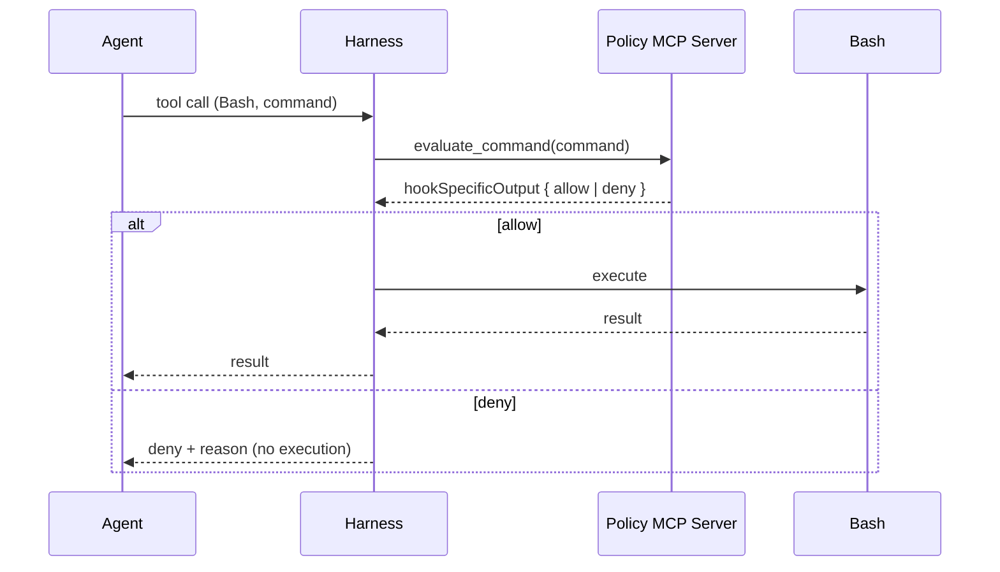

# Hooks Invoking MCP Tools: Closing the Loop Between Policy and Tool Execution

> A Claude Code hook can return `type: "mcp_tool"` to call a tool on an already-connected MCP server directly, collapsing the hook-decides-then-harness-invokes step into a single declarative action — useful for in-harness policy consult and audit, with fail-open semantics that constrain where it fits.

## What the Primitive Is

Claude Code v2.1.118 (2026-04-23) added `mcp_tool` as a hook handler kind alongside the existing `command` handler. A hook record names a connected MCP server, a tool on it, and a substituted `input` map ([Claude Code changelog](https://code.claude.com/docs/en/changelog)).

| Field | Required | Description |
|-------|----------|-------------|
| `server` | yes | Name of a configured MCP server. Must already be connected; the hook never triggers an OAuth or transport flow |
| `tool` | yes | Name of the tool to call on that server |
| `input` | no | Arguments passed to the tool. String values support `${path}` substitution from the hook's JSON input, e.g. `"${tool_input.file_path}"` |

The MCP tool's text output is processed exactly like a command hook's stdout — if it parses as a `hookSpecificOutput` decision document, the harness applies the decision; otherwise it surfaces as plain text ([hooks reference](https://code.claude.com/docs/en/hooks)).

## Why It Exists

Before this primitive, a hook that wanted to consult an MCP server had to spawn a subprocess and run an MCP client of its own. `mcp_tool` removes the second client: the harness already owns the MCP transport for the agent's own tool calls and reuses it for the hook. This is the wire-level mechanism for the [MCP Runtime Control Plane](../security/mcp-runtime-control-plane.md) pattern, run *inside* the harness rather than in front of it as a gateway.

## Two Canonical Uses

### `PreToolUse` policy consult

A `PreToolUse` hook on `Bash` calls a policy MCP server, which inspects the command and returns an allow/deny `hookSpecificOutput`:

```json
{
  "hooks": {
    "PreToolUse": [
      {
        "matcher": "Bash",
        "hooks": [
          {
            "type": "mcp_tool",
            "server": "policy",
            "tool": "evaluate_command",
            "input": {
              "command": "${tool_input.command}"
            }
          }
        ]
      }
    ]
  }
}
```

The policy server's response is a JSON document with `permissionDecision: "deny"` and a `permissionDecisionReason` — exactly the shape a command hook would have produced ([hooks reference](https://code.claude.com/docs/en/hooks)). One server, one connection, one schema.

### `PostToolUse` audit

A `PostToolUse` hook calls an audit MCP server, recording the edited file path without spawning a shell:

```json
{
  "hooks": {
    "PostToolUse": [
      {
        "matcher": "Write|Edit",
        "hooks": [
          {
            "type": "mcp_tool",
            "server": "audit",
            "tool": "record_event",
            "input": {
              "file_path": "${tool_input.file_path}"
            }
          }
        ]
      }
    ]
  }
}
```

This matches Claude Code's own security-scan example ([hooks reference](https://code.claude.com/docs/en/hooks)). `PostToolUse` input also exposes `duration_ms` (added in v2.1.119), giving the audit server the underlying tool's latency ([Claude Code changelog](https://code.claude.com/docs/en/changelog)).

## Decision Loop



## Failure Mode: Fail-Open

**This primitive fails open.** If the MCP server is not connected or the tool returns `isError: true`, the hook produces a non-blocking error and execution continues ([hooks reference](https://code.claude.com/docs/en/hooks)). A `PreToolUse` policy hook routed to a downed server therefore *allows* the original call by default — load-bearing for security use cases.

For fail-closed denial when policy is unreachable, use an out-of-process gateway in front of the harness, not the hook layer ([MCP Runtime Control Plane](../security/mcp-runtime-control-plane.md)).

## When This Backfires

- **Critical-deny use cases.** `PreToolUse` `mcp_tool` hooks fail open on connection loss or tool error. Anything that must be denied on policy-server outage needs a fail-closed control somewhere else.
- **Latency on every matched call.** Each call now waits on a synchronous MCP round-trip plus the server's own work. A slow `PreToolUse` `mcp_tool` hook delays every matched invocation, the same way a slow shell hook would ([hooks-lifecycle-events.md](hooks-lifecycle-events.md)).
- **Setup events.** `SessionStart` and `Setup` fire before MCP servers finish connecting; `mcp_tool` hooks at those points error and pass through ([hooks reference](https://code.claude.com/docs/en/hooks)).
- **Coverage gaps.** Hooks already do not always carry into sub-agents, MCP server calls, or pipe mode; `mcp_tool` actions inherit those gaps. Use OS-level controls when the boundary must hold everywhere ([Boucle, *What Claude Code Hooks Can and Cannot Enforce*, 2026](https://dev.to/boucle2026/what-claude-code-hooks-can-and-cannot-enforce-148o)).
- **Output schema mismatch.** If the MCP tool's text output looks like JSON but does not match `hookSpecificOutput`, the harness surfaces it as plain text — silently dropping any decision the server intended.

## Key Takeaways

- `type: "mcp_tool"` lets a hook call a connected MCP server directly with `server`, `tool`, and `${path}`-substituted `input`.
- The MCP tool's text content is treated as command-hook stdout — return `hookSpecificOutput` to drive a permission decision.
- Use it for `PostToolUse` audit unconditionally; use it for `PreToolUse` policy only if fail-open on outage is acceptable.
- The MCP server must already be connected — `SessionStart` and `Setup` events fire too early.
- `duration_ms` on `PostToolUse` makes the audit-server contract richer.
- This is the in-harness implementation of the runtime control plane pattern; combine with an out-of-process gateway when fail-closed denial is required.

## Related

- [Hooks and Lifecycle Events: Intercepting Agent Behavior](hooks-lifecycle-events.md)
- [Hook Catalog: Guardrails, Sandboxing, and CLI Enforcement](hook-catalog.md)
- [Conditional Hook Execution](conditional-hook-execution.md)
- [MCP Client Design: Building Robust Host-Side Logic](mcp-client-design.md)
- [MCP Client/Server Architecture](mcp-client-server-architecture.md)
- [MCP Runtime Control Plane: Policy Evaluation Between Agent and Tool](../security/mcp-runtime-control-plane.md)
- [Hooks for Enforcement vs Prompts for Guidance](../verification/hooks-vs-prompts.md)
