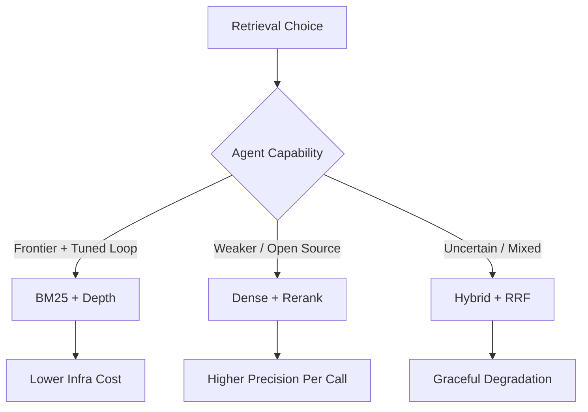

# Lexical-First Retrieval for Agentic Search

> A tuned BM25 index plus a frontier agent loop with deep retrieval can match dense retrieval on deep-research benchmarks — when the loop filters noise.

## The Default Worth Questioning

The reflex choice for retrieval-augmented agents is a dense vector index plus optional reranker. The reasoning was sound when LLMs were weaker: ranking precision had to come from the retriever because the generator could not discard irrelevant context. Frontier agents in a search loop change that contract — they reformulate queries, read documents in-context, and discard non-evidence themselves ([Hsu, Yang, Lin, 2026](https://arxiv.org/abs/2605.10848)).

Pi-Serini tests this directly. The system pairs Pyserini's BM25 with gpt-5.5 in a three-tool agent (retrieve, browse, read) and evaluates on BrowseComp-Plus, a controlled 100k-document corpus of 830 deep-research queries. The configuration reaches **83.1% answer accuracy and 94.7% surfaced evidence recall**, outperforming released search agents built on dense retrievers ([Hsu, Yang, Lin, 2026](https://arxiv.org/abs/2605.10848)).

Two levers do the work:

- **BM25 tuning** — adjusting `b` and `k1` parameters lifts answer accuracy by **18.0%** and evidence recall by **11.1%** over an untuned baseline.
- **Retrieval depth** — fetching more candidates per query lifts evidence recall by **25.3%** over a shallow-retrieval setting.

Both levers are cheap to apply and require no embedding infrastructure.

## When the Default Inverts

The same benchmark that hosts Pi-Serini's victory shows the conditions under which it fails. On BrowseComp-Plus, Search-R1 paired with BM25 reaches **3.86% accuracy** — the same retriever, a weaker agent. GPT-5 paired with BM25 reaches 55.9%. GPT-5 paired with Qwen3-Embedding-8B reaches **70.1% with fewer search calls** ([Chen et al., 2025](https://arxiv.org/abs/2508.06600)).

The pattern: lexical retrieval works when the agent loop can pay the precision cost the retriever no longer pays.



## Conditions for Lexical-First

Pi-Serini's result is real but conditional. Choose lexical-first only when all four hold:

- **Frontier-class agent** — gpt-5.5, Claude Opus 4.6, or equivalent. Sub-frontier models lose more on ranking noise than they recover through agent loop work.
- **Tuned BM25** — `b` and `k1` calibrated against representative queries, not stock defaults. The 18.0% accuracy delta is the cost of skipping this step.
- **Deep retrieval allowed** — the agent can pull dozens of candidates per query rather than top-k=10. Without depth, BM25's recall ceiling becomes the agent's recall ceiling.
- **Search-call cost is acceptable** — dense retrieval reaches similar recall with fewer calls. If you bill per search-API invocation, the depth strategy is more expensive even when the index is cheaper.

When any condition fails, the safer default is hybrid retrieval — BM25 plus dense embeddings fused with reciprocal rank fusion, orchestrated by the agent ([Terrenzi et al., 2026](https://arxiv.org/abs/2604.16394)). Hybrid degrades gracefully when the model weakens; pure lexical does not.

## The Mechanism

BM25 fails by surfacing literal-but-irrelevant matches — documents that share query terms but not query meaning. Dense retrieval reduces this by encoding semantic similarity. Frontier agents close the gap from the other direction: they read more documents and classify each one against the query in-context. The selection burden shifts from the index to the agent loop ([Hsu, Yang, Lin, 2026](https://arxiv.org/abs/2605.10848)).

This is the same mechanism behind Direct Corpus Interaction, which removes the retriever entirely — agents grep and read the raw corpus with shell tools, no vector index, no embedding model ([Li et al., 2026](https://arxiv.org/abs/2605.05242)). And behind SIRA's collapse to a single weighted BM25 call with agent-validated query expansion ([Yang et al., 2026](https://arxiv.org/abs/2605.06647)). The direction is consistent: precision moves out of the retriever and into the loop.

## Example

A deep-research agent over a fixed technical corpus (RFCs, internal architecture docs, postmortems). The team currently runs a managed dense embedding service plus a reranker.

**Before** — dense + reranker pipeline:

```yaml
retrieval:
  primary: dense
  model: text-embedding-3-large
  reranker: bge-reranker-v2-m3
  top_k: 10
  agent_model: claude-opus-4-6
infra:
  - vector_db: pinecone
  - embedding_api: openai
  - reranker_endpoint: hosted
```

**After** — lexical-first under the conditions above:

```yaml
retrieval:
  primary: bm25
  index: pyserini
  bm25_params:
    k1: 1.6   # tuned on held-out queries
    b: 0.7
  top_k: 50   # depth, not breadth
  agent_model: claude-opus-4-6
infra:
  - inverted_index: pyserini
```

The dense pipeline carries three managed dependencies and per-call API costs on every query. The lexical pipeline runs the index on commodity hardware, but spends more agent tokens reading 50 candidates per query instead of 10. Profile both before committing.

## Key Takeaways

- BM25 with tuning and depth matches dense retrieval on deep-research benchmarks **when paired with a frontier agent** — 83.1% accuracy / 94.7% recall on BrowseComp-Plus.
- The same benchmark shows BM25 collapses to 3.86% with a weaker agent — the condition is not optional.
- Two levers carry most of the gain: BM25 parameter tuning (+18.0%) and retrieval depth (+25.3% recall).
- Choose hybrid retrieval as the safe default — it degrades gracefully when the model weakens.
- The mechanism is selection-burden shift: agents now do the precision work that rerankers used to.

## Related

- [Web Search Agent Loop](web-search-agent-loop.md)
- [Dual-Budget Control for Search Agents](../agent-design/dual-budget-control-search-agents.md)
- [Cross-Repo Agent Search](cross-repo-agent-search.md)
- [Indexed Regex Search for Agent Tools](indexed-regex-search-agent-tools.md)
