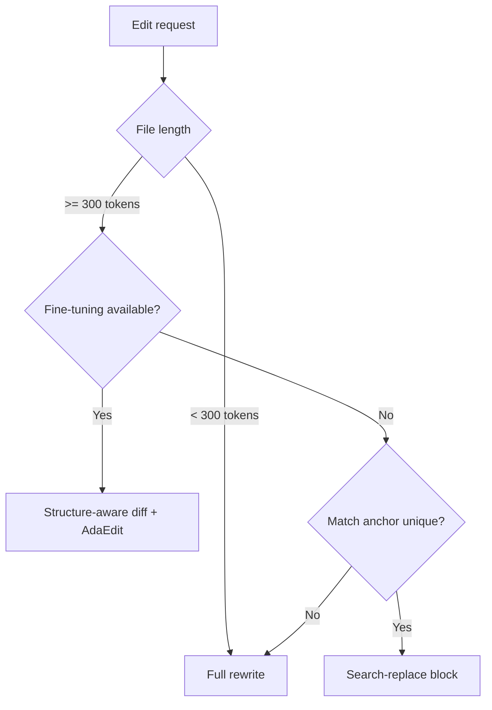

# Edit Format Selection: Diff vs. Search-Replace vs. Full Rewrite

> How to pick an output format for LLM code edits — line-based diffs, search-replace blocks, structure-aware diffs, or full rewrites — and when each one wins.

## Why Format Choice Matters

Edit format is a leverage point on accuracy and token cost. Switching a strict unified diff to a search-replace block raised GPT-4's score on Aider's editing benchmark from 26% to 59% with no model or prompt change ([Aider, "Unified diffs make GPT-4 Turbo 3X less lazy"](https://aider.chat/docs/unified-diffs.html)). The "To Diff or Not to Diff?" paper formalises why: *fragile offsets and fragmented hunks make generation highly unnatural for LLMs* ([Cao et al., 2025, arxiv:2604.27296](https://arxiv.org/abs/2604.27296)). The Diff-XYZ benchmark — which isolates diff representation from retrieval — finds search-replace beats unified diffs for larger models, while smaller open models gain almost nothing from any format change ([Glukhov et al., 2025, arxiv:2510.12487](https://arxiv.org/abs/2510.12487)). The lever is real but not universal.

## The Format Spectrum

| Format | Anchor | Best for |
|--------|--------|----------|
| Full rewrite | Whole file | Short files; small edits where anchor overhead exceeds the file |
| Search-replace block | Exact `old_str` / `new_str` | Frontier-model API users; mixed-language repos |
| Structure-aware diff (BlockDiff / FuncDiff) | AST block (control structure or function) | Long files; fine-tuned models; AST-supported languages |
| Line-numbered unified diff | `@@ -old,+new @@` headers | Patch tools and humans, not LLMs |

### Full Rewrite

The model emits the entire updated file. Always applies, but cost scales linearly with file length. On function-level benchmarks, full rewrite is the cheapest option for ~50–60% of samples — short bodies make anchor overhead larger than the new content ([arxiv:2604.27296 §5](https://arxiv.org/html/2604.27296)).

### Search-Replace Block

The model emits exact `old_str` and `new_str`; the harness substitutes one for the other. Aider and Anthropic's `str_replace_based_edit_tool` both use this shape. Anthropic requires the match to be unique — multiple matches return an error and force the model to expand context ([Claude text editor docs](https://platform.claude.com/docs/en/agents-and-tools/tool-use/text-editor-tool)). Aider treats each unified-diff hunk as a search-replace operation, ignoring line-number headers ([Aider unified-diffs](https://aider.chat/docs/unified-diffs.html)).

### Structure-Aware Diff

BlockDiff and FuncDiff use tree-sitter to align hunks to AST nodes — control structures for BlockDiff, functions and classes for FuncDiff. Anchors expand outward until contextually unique. On long-code edits (>300 tokens), AdaEdit cuts latency and cost by over 30% versus full rewrite while matching its accuracy ([arxiv:2604.27296 §5](https://arxiv.org/html/2604.27296)).

### Line-Numbered Unified Diff

LLMs drop blank lines, forget the leading `+`, and miscount offsets in `@@` headers. Aider's documentation captures the practitioner consensus: *GPT is terrible at working with source code line numbers* ([Aider unified-diffs](https://aider.chat/docs/unified-diffs.html)).

## The Mechanism: Distribution Alignment

LLMs are trained on coherent code spans, not patch fragments. A line-numbered diff forces a non-local positional commitment (the `@@` header) while emitting code; any drift produces an unappliable patch. Aligning the diff unit to a syntactic block moves generation back inside the training distribution: the model emits a complete unit as it would during code completion ([arxiv:2604.27296 §3](https://arxiv.org/html/2604.27296)).

Search-replace captures most of this gain without AST awareness — it swaps positional commitments for content anchors, and any unique span of code is an in-distribution generation target.

## Adaptive Selection (AdaEdit)

For each source–target pair, AdaEdit picks whichever is shorter — diff representation or full rewrite — as the training label. The fine-tuned model learns to choose the cheaper format per sample, hitting >90% selection accuracy (>95% within a 20% token-deviation tolerance) without explicit branching logic ([arxiv:2604.27296 §4](https://arxiv.org/html/2604.27296)).

Without fine-tuning, a harness can approximate this rule: full rewrite below ~300 tokens of file content, search-replace above. The crossover holds in the paper's measurements.

## Selection Heuristic

For frontier API models, the decision reduces to full rewrite versus search-replace. Structure-aware diffs pay off when you control fine-tuning data and the language has reliable AST tooling.

## When This Backfires

- **Small or open-weights models.** Diff-XYZ shows smaller models gain little from format engineering — they fail at all formats roughly equally ([arxiv:2510.12487](https://arxiv.org/abs/2510.12487)).
- **Short edits to short files.** Anchor plus surrounding context exceeds the file; full rewrite is strictly cheaper.
- **Languages without solid AST tooling.** BlockDiff/FuncDiff rely on tree-sitter grammars; templated or DSL-mixed source loses the structural guarantee.
- **Non-unique repeated code.** Search-replace fails when the anchor matches multiple sites; Anthropic's tool errors and forces a retry with expanded context ([Claude text editor docs](https://platform.claude.com/docs/en/agents-and-tools/tool-use/text-editor-tool)).
- **No fine-tuning access.** AdaEdit is a training-time strategy — API users can apply the *formats* but cannot replicate adaptive selection without harness-side heuristics.

## Example

A 1,200-token Python file needs a five-line change inside one function. Three formats, three cost profiles:

- **Full rewrite** — regenerate the entire file, ~1,200 output tokens. Always applies. Linear in file size.
- **Search-replace block** — unique surrounding context as `old_str`, modified function as `new_str`, ~150–250 output tokens. Applies if the anchor is unique; otherwise the harness errors and the model retries with more context.
- **FuncDiff** — modified function with an AST-derived anchor, ~120–200 output tokens. Requires tree-sitter at apply time and a model trained on the format to perform reliably ([arxiv:2604.27296 §3](https://arxiv.org/html/2604.27296)).

Search-replace is the practical choice for a frontier API model on this file. Below ~300 tokens of file content, full rewrite would have been cheaper.

## Key Takeaways

- Edit format is a real lever on accuracy and cost — measured in 30%+ token reductions and 2–3× accuracy gains in published benchmarks.
- The mechanism is distribution alignment: replace positional anchors (line numbers) with content anchors (unique strings or AST blocks) so the model emits coherent code instead of fragmented patches.
- Format engineering helps frontier models more than smaller ones; verify the lever exists for your model class before investing.
- For API consumers, the practical decision is full rewrite for short files, search-replace above ~300 tokens; structure-aware diffs add value mainly when you control fine-tuning.

## Related

- [Token-Efficient Tool Design](token-efficient-tool-design.md)
- [Agent-Computer Interface (ACI)](agent-computer-interface.md)
- [Next Edit Suggestions](next-edit-suggestions.md)
- [Batch File Operations via Bash Scripts](batch-file-operations.md)
- [Poka-Yoke for Agent Tools](poka-yoke-agent-tools.md)
- [Repository Map Pattern](../context-engineering/repository-map-pattern.md)
